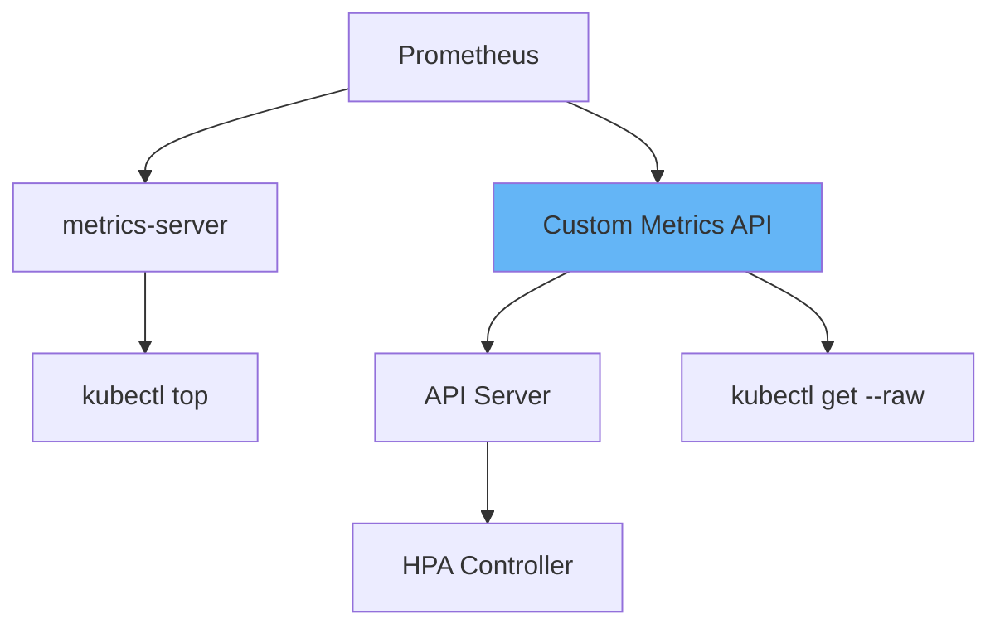

# Prometheus Adapter实现：K8s自定义指标与HPA扩缩容实践指南

## 情境与背景

Prometheus Adapter是Kubernetes自定义指标API的核心组件，使得HPA可以根据业务自定义指标进行扩缩容。本指南详细讲解Prometheus Adapter的工作原理、配置方法、以及在生产环境中的最佳实践。

## 一、Prometheus Adapter概述

### 1.1 什么是Custom Metrics API

**API机制**：

```markdown
## Prometheus Adapter概述

### Custom Metrics API

**K8s指标API层级**：

```yaml
kubernetes_metrics_apis:
  metrics:
    name: "Resource Metrics API"
    description: "CPU、内存等资源指标"
    implementation: "metrics-server"
    
  custom:
    name: "Custom Metrics API"
    description: "业务自定义指标"
    implementation: "Prometheus Adapter / KEDA"
    
  external:
    name: "External Metrics API"
    description: "外部系统指标"
    implementation: "Prometheus Adapter"
```

**HPA演进**：

```yaml
hpa_evolution:
  v1:
    metrics: "CPU、内存"
    source: "metrics-server"
    
  v2:
    metrics: "CPU、内存 + 自定义指标"
    source: "metrics-server + Prometheus Adapter"
    
  v2beta1:
    metrics: "自定义指标 + 外部指标"
    source: "Prometheus Adapter"
```
```

### 1.2 Adapter工作原理

**工作流程**：



**核心功能**：

```yaml
adapter_core_functions:
  discovery:
    - "从Prometheus发现指标"
    - "定时轮询更新"
    
  transformation:
    - "指标名称转换"
    - "标签提取和映射"
    - "指标类型转换"
    
  api_server:
    - "实现Custom Metrics API"
    - "提供标准化接口"
```

## 二、安装与配置

### 2.1 安装方式

**Helm安装**：

```bash
# 添加Prometheus社区仓库
helm repo add prometheus-community https://prometheus-community.github.io/helm-charts

# 更新仓库
helm repo update

# 安装Prometheus Adapter
helm install prometheus-adapter prometheus-community/prometheus-adapter \
    --namespace monitoring \
    --create-namespace \
    --set prometheus.url=http://prometheus-server.monitoring.svc \
    --set prometheus.port=9090 \
    --set nameOverride=prometheus-adapter \
    --set fullnameOverride=prometheus-adapter
```

**YAML安装**：

```yaml
apiVersion: v1
kind: ConfigMap
metadata:
  name: prometheus-adapter-config
  namespace: monitoring
data:
  config.yaml: |
    rules:
    - seriesQuery: 'nginx_connections_active'
      resources:
        overrides:
          kubernetes_pod_name:
            resource: pod
          kubernetes_namespace:
            resource: namespace
      name:
        matches: "^(.*)"
        as: "nginx_connections_per_pod"
      metricsQuery: 'nginx_connections_active'
```

**部署配置**：

```yaml
apiVersion: apps/v1
kind: Deployment
metadata:
  name: prometheus-adapter
  namespace: monitoring
spec:
  replicas: 1
  selector:
    matchLabels:
      name: prometheus-adapter
  template:
    metadata:
      labels:
        name: prometheus-adapter
    spec:
      containers:
      - name: prometheus-adapter
        image: k8s.gcr.io/prometheus-adapter/prometheus-adapter:latest
        args:
        - --config.file=/etc/adapter/config.yaml
        - --metrics-rest-interval=30s
        - --prometheus.url=http://prometheus-server.monitoring.svc
        - --prometheus.port=9090
        ports:
        - containerPort: 6443
        volumeMounts:
        - name: config
          mountPath: /etc/adapter
      volumes:
      - name: config
        configMap:
          name: prometheus-adapter-config
```

### 2.2 配置详解

**配置结构**：

```yaml
# config.yaml完整配置
rules:
  # 方式一：seriesQuery（自动发现）
  - seriesQuery: '{__name__=~"^nginx_.*",kubernetes_namespace!=""}'
    seriesFilters:
    - isNot: '^nginx_connections_total$'  # 过滤特定指标
    resources:
      overrides:
        kubernetes_namespace: {resource: "namespace"}
        kubernetes_pod_name: {resource: "pod"}
    name:
      matches: "^nginx_(.*)_total$"
      as: "nginx_${1}_per_second"
    metricsQuery: "sum(rate(nginx_<<.Name>>_total[5m])) by (<<.GroupBy>>)"
    
  # 方式二：metricsQuery（显式查询）
  - seriesQuery: 'nginx_connections_active'
    metricsQuery: 'nginx_connections_active'
    name:
      matches: "^nginx_connections$"
      as: "nginx_active_connections"
```

## 三、实战配置案例

### 3.1 Nginx连接数指标

**业务场景**：

```markdown
## 实战配置案例

### Nginx连接数指标

**Nginx Exporter指标**：

```yaml
nginx_metrics:
  nginx_connections_active: "当前活跃连接数"
  nginx_connections_reading: "当前读取中连接"
  nginx_connections_waiting: "当前等待中连接"
  nginx_connections_writing: "当前写入中连接"
```

**Adapter配置**：

```yaml
# nginx-connections-adapter.yaml
apiVersion: v1
kind: ConfigMap
metadata:
  name: nginx-metrics-adapter
  namespace: monitoring
data:
  config.yaml: |
    rules:
    # 为每个Pod创建独立的连接数指标
    - seriesQuery: 'nginx_connections_active{kubernetes_namespace!="",kubernetes_pod_name!=""}'
      resources:
        overrides:
          kubernetes_namespace: {resource: "namespace"}
          kubernetes_pod_name: {resource: "pod"}
      name:
        matches: "^(.*)"
        as: "${1}_per_pod"
      metricsQuery: nginx_connections_active
```

**验证配置**：

```bash
# 验证Custom Metrics API
kubectl get --raw "/apis/custom.metrics.k8s.io/v1beta1/namespaces/default/pods/*/nginx_connections_active_per_pod" | jq

# 预期输出
{
  "kind": "MetricValueList",
  "apiVersion": "custom.metrics.k8s.io/v1beta1",
  "metadata": {
    "selfLink": "/apis/custom.metrics.k8s.io/v1beta1/namespaces/default/pods/*/nginx_connections_active_per_pod"
  },
  "items": [
    {
      "describedObject": {
        "kind": "Pod",
        "namespace": "default",
        "name": "nginx-abc123",
        "apiVersion": "v1"
      },
      "metricName": "nginx_connections_active_per_pod",
      "value": "42"
    }
  ]
}
```
```

### 3.2 业务QPS指标

**业务场景**：

```yaml
business_qps_scenario:
  metrics_source: "应用自定义指标"
  metric_name: "http_requests_per_second"
  labels:
    - "service"
    - "endpoint"
    - "status"
```

**Adapter配置**：

```yaml
# business-metrics-adapter.yaml
apiVersion: v1
kind: ConfigMap
metadata:
  name: business-metrics-adapter
  namespace: monitoring
data:
  config.yaml: |
    rules:
    # QPS指标（按service和endpoint展示）
    - seriesQuery: 'http_requests_total{service!="",endpoint!=""}'
      resources:
        overrides:
          service: {resource: "namespace"}  # 注意：这里做了映射
      name:
        matches: "^(.*)_total"
        as: "${1}_qps"
      metricsQuery: |
        sum(rate(<<.Series>>{<<.LabelMatchers>>}[2m])) by (<<.GroupBy>>)
    
    # 延迟指标
    - seriesQuery: 'http_request_duration_seconds_bucket{service!="",endpoint!=""}'
      resources:
        overrides:
          service: {resource: "namespace"}
      name:
        matches: "^(.*)_seconds_bucket"
        as: "${1}_latency_p95"
      metricsQuery: |
        histogram_quantile(0.95,
          sum(rate(<<.Series>>{<<.LabelMatchers>>}[5m])) by (le, <<.GroupBy>>)
        )
```

### 3.3 队列长度指标

**业务场景**：

```yaml
queue_length_scenario:
  metrics_source: "消息队列消费者"
  metric_name: "queue_messages_pending"
  purpose: "基于队列积压量扩缩容"
```

**Adapter配置**：

```yaml
# queue-metrics-adapter.yaml
apiVersion: v1
kind: ConfigMap
metadata:
  name: queue-metrics-adapter
  namespace: monitoring
data:
  config.yaml: |
    rules:
    # Kafka消费者滞后
    - seriesQuery: 'kafka_consumer_records_lag_max{topic!="",consumer_group!=""}'
      resources:
        overrides:
          topic: {resource: "namespace"}  # 映射到namespace以便HPA引用
      name:
        matches: "^(.*)"
        as: "consumer_lag"
      metricsQuery: kafka_consumer_records_lag_max
    
    # 队列消息数
    - seriesQuery: 'rabbitmq_queue_messages{queue!="",vhost!=""}'
      resources:
        overrides:
          vhost: {resource: "namespace"}
          queue: {resource: "pod"}  # 或映射到其他资源
      name:
        matches: "^(.*)"
        as: "queue_messages"
      metricsQuery: rabbitmq_queue_messages
```

## 四、HPA基于自定义指标扩缩容

### 4.1 HPA配置

**HPA示例**：

```yaml
# hpa-custom-metrics.yaml
apiVersion: autoscaling/v2beta2
kind: HorizontalPodAutoscaler
metadata:
  name: nginx-hpa
  namespace: default
spec:
  scaleTargetRef:
    apiVersion: apps/v1
    kind: Deployment
    name: nginx
  minReplicas: 2
  maxReplicas: 10
  metrics:
  # 基于自定义指标
  - type: Pods
    pods:
      metric:
        name: nginx_connections_active_per_pod
      target:
        type: AverageValue
        averageValue: "100"
  # 基于CPU指标（资源指标）
  - type: Resource
    resource:
      name: cpu
      target:
        type: Utilization
        averageUtilization: 70
  behavior:
    scaleUp:
      stabilizationWindowSeconds: 30
      policies:
      - type: Percent
        value: 100
        periodSeconds: 15
    scaleDown:
      stabilizationWindowSeconds: 300
      policies:
      - type: Percent
        value: 50
        periodSeconds: 60
```

### 4.2 多指标HPA

**多指标配置**：

```yaml
# hpa-multi-metrics.yaml
apiVersion: autoscaling/v2beta2
kind: HorizontalPodAutoscaler
metadata:
  name: app-hpa
spec:
  scaleTargetRef:
    apiVersion: apps/v1
    kind: Deployment
    name: myapp
  minReplicas: 3
  maxReplicas: 20
  metrics:
  # 指标1：自定义QPS
  - type: Pods
    pods:
      metric:
        name: http_requests_qps
      target:
        type: AverageValue
        averageValue: "1k"  # 1k = 1000
  # 指标2：P99延迟
  - type: Pods
    pods:
      metric:
        name: http_latency_p99_seconds
      target:
        type: AverageValue
        averageValue: "100m"  # 100m = 0.1秒
  # 指标3：CPU
  - type: Resource
    resource:
      name: cpu
      target:
        type: Utilization
        averageUtilization: 80
  # 指标4：内存
  - type: Resource
    resource:
      name: memory
      target:
        type: Utilization
        averageUtilization: 85
```

### 4.3 扩缩容策略

**行为配置**：

```yaml
hpa_behavior_config:
  scaleUp:
    stabilizationWindowSeconds: 0  # 立即扩容
    policies:
    - type: Percent
      value: 100  # 最多翻倍
      periodSeconds: 15
    - type: Pods
      value: 4  # 或最多加4个Pod
      periodSeconds: 15
      
  scaleDown:
    stabilizationWindowSeconds: 300  # 冷却5分钟
    policies:
    - type: Percent
      value: 50  # 最多减半
      periodSeconds: 60
    - type: Pods
      value: 2  # 或最多减2个Pod
      periodSeconds: 60
    selectPolicy: Min  # 选择影响最小的策略
```

## 五、生产环境最佳实践

### 5.1 配置优化

**性能优化**：

```yaml
adapter_optimization:
  prometheus:
    # Prometheus查询间隔
    url: "http://prometheus.monitoring:9090"
    port: 9090
    
  # 指标缓存时间
  metricsRestInterval: "30s"
  
  # 并发查询数
  queryConcurrency: 6
  
  # 指标TTL
  metricTTL: "2m"
```

**高可用配置**：

```yaml
# 多副本部署
apiVersion: apps/v1
kind: Deployment
metadata:
  name: prometheus-adapter
spec:
  replicas: 2
  strategy:
    type: RollingUpdate
  selector:
    matchLabels:
      name: prometheus-adapter
  template:
    spec:
      affinity:
        podAntiAffinity:
          preferredDuringSchedulingIgnoredDuringExecution:
          - weight: 100
            podAffinityTerm:
              labelSelector:
                matchLabels:
                  name: prometheus-adapter
              topologyKey: kubernetes.io/hostname
```

### 5.2 监控与排查

**验证Adapter状态**：

```bash
# 检查Adapter Pod状态
kubectl get pods -n monitoring -l name=prometheus-adapter

# 查看Adapter日志
kubectl logs -n monitoring -l name=prometheus-adapter -f

# 检查Custom Metrics API可用性
kubectl get --raw "/apis/custom.metrics.k8s.io/v1beta1" | jq

# 列出所有自定义指标
kubectl get --raw "/apis/custom.metrics.k8s.io/v1beta1/namespaces/*/metrics" | jq '.resources[].name'
```

**排查常见问题**：

```yaml
troubleshooting:
  no_metrics:
    cause: "Prometheus查询失败"
    solution: "检查prometheus.url配置和网络连通性"
    
  wrong_labels:
    cause: "标签映射错误"
    solution: "检查seriesQuery和resources.overrides配置"
    
  hpa_not_working:
    cause: "指标值格式错误"
    solution: "检查target.averageValue格式，k8s需要整数字符串"
```

### 5.3 安全配置

**RBAC配置**：

```yaml
# ServiceAccount和RBAC
apiVersion: v1
kind: ServiceAccount
metadata:
  name: prometheus-adapter
  namespace: monitoring
---
apiVersion: rbac.authorization.k8s.io/v1
kind: ClusterRole
metadata:
  name: prometheus-adapter
rules:
- apiGroups:
  - ""
  resources:
  - namespaces
  - pods
  - services
  verbs:
  - get
  - list
  - watch
- apiGroups:
  - custom.metrics.k8s.io
  resources:
  - "*"
  verbs:
  - "*"
```

## 六、面试1分钟精简版（直接背）

**完整版**：

Prometheus Adapter实现Custom Metrics API：1. 工作原理：Adapter从Prometheus查询指标，通过rules配置转换为k8s_custom_metrics格式，注册到API Server；2. 配置方式：编写config.yaml，定义seriesQuery查询原始指标、resources标签映射、name指标重命名、metricsQuery查询模板；3. 指标类型：rules用于发现指标、metricsQuery用于自定义查询；4. HPA使用：通过type: Pods指定自定义指标，target.averageValue设置阈值；5. 部署方式：Helm或YAML部署，配置prometheus.url指向Prometheus。

**30秒超短版**：

Prometheus Adapter：配置config.yaml定义rules，seriesQuery查原始指标，resources映射标签，metricsQuery自定义查询，HPA用type: Pods引用。

## 七、总结

### 7.1 配置要点总结

```yaml
configuration_summary:
  seriesQuery: "从Prometheus发现原始指标"
  seriesFilters: "过滤不需要的指标"
  resources: "标签到k8s资源的映射"
  name: "指标名称转换规则"
  metricsQuery: "PromQL查询模板"
```

### 7.2 HPA配置总结

```yaml
hpa_config_summary:
  type: "Pods"
  metric:
    name: "适配器提供的指标名"
  target:
    type: "AverageValue"
    averageValue: "阈值"
```

### 7.3 记忆口诀

```
Prometheus Adapter，Custom Metrics来注册，
seriesQuery查指标，resources映射标签，
name定义新名称，metricsQuery是模板，
HPA扩缩容靠它，业务指标全支持。
```

> **参考链接**：[SRE运维面试题全解析：从理论到实践（第二部分）]()