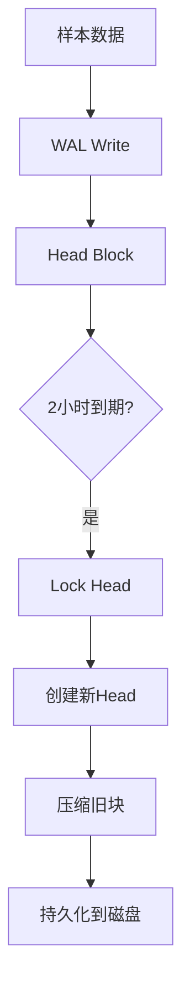

# Prometheus故障数据保护：TSDB、Remote Write与Thanos备份策略详解

## 情境与背景

Prometheus是云原生监控的核心，但作为时序数据库其本地存储存在单点故障风险。本指南详细讲解Prometheus数据保护策略，包括TSDB本地保护、Remote Write远程备份、Thanos Sidecar对象存储等方案，以及告警历史记录和定期备份的最佳实践。

## 一、Prometheus数据存储机制

### 1.1 TSDB存储结构

**TSDB存储原理**：

```markdown
## Prometheus数据存储机制

### TSDB存储结构

**存储层级**：

```yaml
tsdb_structure:
  head_block:
    description: "当前正在写入的块"
    location: "wal/head/"
    data: "最近2小时的样本数据"
    
  blocks:
    description: "已关闭的历史数据块"
    location: "data/XXXXXX/"
    data: "每个块包含2小时数据"
    format: "chunk/spaces/Meta.json"
    
  wal:
    description: "预写日志"
    location: "wal/"
    purpose: "崩溃恢复保证数据不丢失"
    duration: "保存至少3个块的数据"
```

**数据写入流程**：


```

### 1.2 数据丢失风险

**常见故障场景**：

```yaml
failure_scenarios:
  disk_full:
    description: "磁盘空间耗尽"
    impact: "无法写入新数据"
    risk: "近期数据丢失"
    
  oom:
    description: "内存溢出崩溃"
    impact: "进程异常终止"
    risk: "WAL未刷盘数据丢失"
    
  pod_restart:
    description: "K8s Pod重启"
    impact: "临时Pod数据丢失"
    risk: "未挂载持久卷则全失"
    
  node_failure:
    description: "节点宕机"
    impact: "本地存储不可访问"
    risk: "全部历史数据丢失"
```
```

## 二、本地TSDB保护策略

### 2.1 TSDB配置优化

**存储配置**：

```markdown
## 本地TSDB保护策略

### TSDB配置优化

**prometheus.yml配置**：

```yaml
global:
  scrape_interval: 15s
  evaluation_interval: 15s

storage:
  tsdb:
    # 数据保留时间（必须设置）
    retention.time: 15d
    
    # 块大小（默认2小时）
    tsdb.block.duration: 2h
    
    # WAL保留时间
    tsdb.wal-compression: true
    
  # 老版本配置
  # retention: 15d (Prometheus 2.21之前)

# 命令行参数
# --storage.tsdb.path=/prometheus
# --storage.tsdb.retention.time=15d
# --storage.tsdb.wal-segment-size=32MB
```

**磁盘空间估算**：

```yaml
disk_space_estimation:
  per_metric:
    average_size: "~1.5KB/天"
    
  example:
    metrics_count: 100000
    retention_days: 15
    estimated_size: "100000 * 15 * 1.5KB ≈ 2.25GB"
    
  safety_factor: 1.5
  recommended_disk: "50GB+"
```
```

### 2.2 WAL保护机制

**WAL配置**：

```yaml
wal_protection:
  # 启用WAL压缩
  tsdb.wal-compression: true
  
  # 段文件大小
  tsdb.wal-segment-size: 32MB
  
  # 检查点配置
  tsdb.min-block-duration: 2h
```

**WAL恢复验证**：

```bash
# 检查WAL完整性
promtool tsdb verify --index-file=/prometheus/data/indexrindex /prometheus/wal

# 检查数据块
promtool tsdb dump /prometheus/data
```
```

## 三、Remote Write远程备份

### 3.1 Remote Write原理

**Remote Write架构**：

```markdown
## Remote Write远程备份

### Remote Write原理

**数据流图**：


**支持的远程存储**：

```yaml
remote_storage_support:
  influxdb:
    description: "InfluxDB时序数据库"
    protocol: "HTTP"
    
  thanos:
    description: "Thanos Receive"
    protocol: "HTTP/gRPC"
    
  cortex:
    description: "Cortex Distributor"
    protocol: "HTTP"
    
  victorial_metrics:
    description: "VictoriaMetrics"
    protocol: "HTTP"
    
  opentsdb:
    description: "OpenTSDB"
    protocol: "HTTP"
```
```

### 3.2 Remote Write配置

**Prometheus配置**：

```yaml
# remote_write配置
remote_write:
  - url: "http://thanos-receive:19291/api/v1/receive"
    name: "thanos"
    write_relabel_configs:
      - source_labels: [__name__]
        regex: "up|kube_.*|node_.*"
        action: keep
    queue_config:
      capacity: 10000
      max_shards: 5
      min_shards: 1
      max_samples_per_send: 2000
      batch_send_deadline: 30s
```

**Thanos Receive配置**：

```yaml
# Thanos Receive部署
apiVersion: apps/v1
kind: StatefulSet
metadata:
  name: thanos-receive
spec:
  serviceName: thanos-receive
  replicas: 3
  selector:
    matchLabels:
      app: thanos-receive
  template:
    spec:
      containers:
      - name: receive
        image: quay.io/thanos/thanos:v0.32.0
        args:
        - receive
        - '--listen-address=:19291'
        - '--grpc-listen-address=:19292'
        - '--objstore.config-file=/etc/thanos/object-storage.yaml'
        - '--receive.replication-factor=3'
        - '--receive.default-sub-tenant-default-commit-file.yaml'
```
```

### 3.3 Remote Read回读

**Remote Read配置**：

```yaml
# remote_read配置（可选，用于查询历史数据）
remote_read:
  - url: "http://thanos-query:10902/api/v1/read"
    name: "thanos"
    read_recent: true
    filters:
      - enabled: true
        name: "cache"
        config:
          url: "memcached:11211"
```

**数据回刷脚本**：

```yaml
# 使用promtool恢复数据
#!/bin/bash
PROMETHEUS_DATA="/prometheus/data"
REMOTE_URL="http://backup-prometheus:9090"

# 从远程恢复
curl -X POST "${REMOTE_URL}/api/v1/admin/tsdb/snapshot" | jq -r '.data.name'

# 应用快照
tar -xzf /snapshots/$(ls -t /snapshots/ | head -1) -C ${PROMETHEUS_DATA}
```
```

## 四、Thanos Sidecar备份

### 4.1 Sidecar部署

**与Prometheus同Pod部署**：

```markdown
## Thanos Sidecar备份

### Sidecar部署

**Kubernetes部署配置**：

```yaml
apiVersion: v1
kind: Pod
metadata:
  name: prometheus-with-thanos
spec:
  containers:
  - name: prometheus
    image: prom/prometheus:latest
    args:
    - '--storage.tsdb.path=/prometheus'
    - '--storage.tsdb.retention.time=15d'
    - '--web.enable-lifecycle'
    volumeMounts:
    - name: prometheus-data
      mountPath: /prometheus
    - name: prometheus-config
      mountPath: /etc/prometheus
      
  - name: thanos-sidecar
    image: quay.io/thanos/thanos:v0.32.0
    args:
    - sidecar
    - '--prometheus.url=http://localhost:9090'
    - '--objstore.config-file=/etc/thanos/object-storage.yaml'
    - '--tsdb.path=/prometheus'
    - '--shipper.upload-compacted'
    volumeMounts:
    - name: prometheus-data
      mountPath: /prometheus
    - name: thanos-object-storage
      mountPath: /etc/thanos
```

**对象存储配置**：

```yaml
# object-storage.yaml (S3兼容)
type: S3
config:
  bucket: prometheus-data
  endpoint: s3.amazonaws.com
  region: us-west-2
  access_key: ${AWS_ACCESS_KEY}
  secret_key: ${AWS_SECRET_KEY}
  s3_force_path_style: true
  signature_version2: false
```
```

### 4.2 数据上传机制

**上传时机**：

```yaml
upload_timing:
  initial:
    - "Prometheus启动时上传已有块"
    - "每隔5分钟检查新块"
    
  compaction:
    - "每2小时创建新块"
    - "Sidecar检测到新块后上传"
    
  retention:
    - "本地保留15天"
    - "对象存储保留1年+"
```
```

## 五、AlertManager告警记录

### 5.1 告警历史存储

**告警日志配置**：

```markdown
## AlertManager告警记录

### 告警历史存储

**Webhook配置**：

```yaml
# AlertManager配置
global:
  resolve_timeout: 5m

route:
  group_by: ['alertname']
  group_wait: 10s
  receiver: 'webhook'

receivers:
- name: 'webhook'
  webhook_configs:
  - url: 'http://alert-logger:8080/alerts'
    send_resolved: true
```

**告警记录器服务**：

```yaml
# alert-logger服务
apiVersion: apps/v1
kind: Deployment
metadata:
  name: alert-logger
spec:
  selector:
    matchLabels:
      app: alert-logger
  template:
    metadata:
      labels:
        app: alert-logger
    spec:
      containers:
      - name: logger
        image: golang:1.21-alpine
        command: ["/app/alert-logger"]
        ports:
        - containerPort: 8080
        volumeMounts:
        - name: alert-logs
          mountPath: /var/log/alerts
      volumes:
      - name: alert-logs
        persistentVolumeClaim:
          claimName: alert-logs-pvc
```
```

## 六、定期备份策略

### 6.1 快照备份

**定时快照脚本**：

```bash
#!/bin/bash
# prometheus-snapshot-backup.sh

PROMETHEUS_DATA="/prometheus/data"
SNAPSHOT_DIR="/backups/snapshots"
S3_BUCKET="s3://prometheus-backups"
DATE=$(date +%Y%m%d-%H%M%S)

# 创建快照
echo "Creating snapshot..."
SNAPSHOT_NAME=$(curl -X POST http://localhost:9090/api/v1/admin/tsdb/snapshot | jq -r '.data.name')

# 打包备份
echo "Packaging snapshot..."
tar -czf ${SNAPSHOT_DIR}/snapshot-${DATE}.tar.gz -C / ${SNAPSHOT_NAME}

# 上传到S3
echo "Uploading to S3..."
aws s3 cp ${SNAPSHOT_DIR}/snapshot-${DATE}.tar.gz ${S3_BUCKET}/

# 清理本地快照
rm -rf /tmp/snapshots/${SNAPSHOT_NAME}

# 保留策略（保留最近10个）
cd ${SNAPSHOT_DIR}
ls -t | tail -n +11 | xargs -r rm -f

echo "Backup completed: snapshot-${DATE}.tar.gz"
```

**CronJob配置**：

```yaml
apiVersion: batch/v1
kind: CronJob
metadata:
  name: prometheus-backup
spec:
  schedule: "0 3 * * *"  # 每天凌晨3点
  successfulJobsHistoryLimit: 5
  jobTemplate:
    spec:
      template:
        spec:
          containers:
          - name: backup
            image: amazon/aws-cli:latest
            command: ["/scripts/backup.sh"]
            env:
            - name: AWS_ACCESS_KEY_ID
              valueFrom:
                secretKeyRef:
                  name: aws-credentials
                  key: access-key
            - name: AWS_SECRET_ACCESS_KEY
              valueFrom:
                secretKeyRef:
                  name: aws-credentials
                  key: secret-key
            volumeMounts:
            - name: scripts
              mountPath: /scripts
          volumes:
          - name: scripts
            configMap:
              name: prometheus-backup-script
          restartPolicy: OnFailure
```
```

### 6.2 K8s PV备份

**PV快照策略**：

```yaml
# VolumeSnapshot配置
apiVersion: snapshot.storage.k8s.io/v1
kind: VolumeSnapshot
metadata:
  name: prometheus-data-snapshot
spec:
  volumeSnapshotClassName: csi-aws-vsc
  source:
    persistentVolumeClaimName: prometheus-data
```

## 七、故障恢复流程

### 7.1 恢复决策树

**恢复流程**：


```

### 7.2 恢复操作

**从Thanos恢复**：

```bash
# Thanos Store恢复数据
thanos tools bucket verify --objstore.config-file=/etc/thanos/object-storage.yaml

# 下载指定时间段数据
thanos tools bucket cp \
    --objstore.config-file=/etc/thanos/object-storage.yaml \
    --from=2024-01-01T00:00:00Z \
    --to=2024-01-15T23:59:59Z \
    --destination=/tmp/recovered-data
```

**从快照恢复**：

```bash
# 停止Prometheus
kubectl scale deployment prometheus --replicas=0

# 下载快照
aws s3 cp s3://prometheus-backups/snapshot-20240115-030000.tar.gz /tmp/

# 解压到数据目录
tar -xzf /tmp/snapshot-20240115-030000.tar.gz -C /prometheus/data

# 启动Prometheus
kubectl scale deployment prometheus --replicas=1
```

## 八、生产环境最佳实践

### 8.1 多层保护策略

**数据保护层级**：

```yaml
multi_layer_protection:
  layer_1:
    name: "本地TSDB"
    protection: "基础保护"
    retention: "15天"
    
  layer_2:
    name: "Remote Write"
    protection: "实时备份"
    destination: "Thanos/InfluxDB"
    
  layer_3:
    name: "Thanos对象存储"
    protection: "长期保留"
    retention: "1年+"
    
  layer_4:
    name: "定期快照"
    protection: "灾备"
    frequency: "每天"
```

### 8.2 监控自身健康

**自身监控指标**：

```yaml
prometheus_self_monitoring:
  # Remote Write健康状态
  - "prometheus_remote_storage_succeeded_samples_total"
  - "prometheus_remote_storage_failed_samples_total"
  - "prometheus_remote_storage_pending_samples"
  
  # TSDB健康状态
  - "prometheus_tsdb_head_samples"
  - "prometheus_tsdb_head_chunks"
  - "prometheus_tsdb_compactions_failed_total"
  
  # 告警规则
  - alert: PrometheusTSDBDown
    expr: "prometheus_tsdb_head_samples == 0"
    for: 5m
```

### 8.3 容量规划

**存储容量计算器**：

```yaml
capacity_planning:
  # 单指标日均大小
  per_metric_daily: "~1.5KB"
  
  # 计算公式
  formula: |
    Total = Metrics * SamplesPerDay * Retention * Factor
    
  # 示例
  example:
    metrics: 100000
    scrape_interval: 15s
    samples_per_day: 5760
    retention_days: 15
    safety_factor: 1.5
    total: "100000 * 5760 * 15 * 1.5 / 1024 / 1024 ≈ 7.9GB"
```

## 九、面试1分钟精简版（直接背）

**完整版**：

Prometheus数据保护策略分多层：1. 本地TSDB：配置15天保留周期和WAL压缩，保障基本数据；2. Remote Write：配置实时同步到Thanos Receive/InfluxDB，网络故障本地缓冲；3. Thanos Sidecar：与Prometheus同Pod部署，每2小时自动上传数据块到对象存储（S3），保留1年+；4. 告警记录：通过AlertManager Webhook记录历史告警到ES；5. 定期快照：每天凌晨定时创建快照上传S3。故障恢复：优先从Remote Write缓冲恢复，其次从Thanos对象存储恢复。

**30秒超短版**：

Prometheus防丢失：本地TSDB是基础，Remote Write实时同步，Thanos对象存储备份，告警记录要保存，快照备份是保障。

## 十、总结

### 10.1 方案对比

```yaml
protection_comparison:
  local_tsd:
    protection_level: "基础"
    complexity: "低"
    cost: "低"
    recovery_speed: "快"
    
  remote_write:
    protection_level: "中等"
    complexity: "中"
    cost: "中"
    recovery_speed: "快"
    
  thanos_sidecar:
    protection_level: "强"
    complexity: "中"
    cost: "中"
    recovery_speed: "中"
    
  snapshot_backup:
    protection_level: "最强"
    complexity: "中"
    cost: "高"
    recovery_speed: "慢"
```

### 10.2 最佳实践清单

```yaml
best_practices_checklist:
  basic:
    - "配置15天+数据保留"
    - "启用WAL压缩"
    - "使用持久卷存储"
    
  backup:
    - "配置Remote Write备份"
    - "部署Thanos Sidecar"
    - "对象存储保存1年+"
    
  alerting:
    - "AlertManager记录历史告警"
    - "监控Remote Write健康状态"
    
  recovery:
    - "定期测试恢复流程"
    - "记录恢复SLA"
    - "保持恢复文档更新"
```

### 10.3 记忆口诀

```
Prometheus防丢失，保护层级要分明，
本地TSDB是基础，WAL压缩不能少，
Remote Write实时写，Thanos对象存，
告警记录要保存，快照备份是保障，
故障恢复不慌张，数据安全稳当当。
```

> **参考链接**：[SRE运维面试题全解析：从理论到实践（第二部分）]()