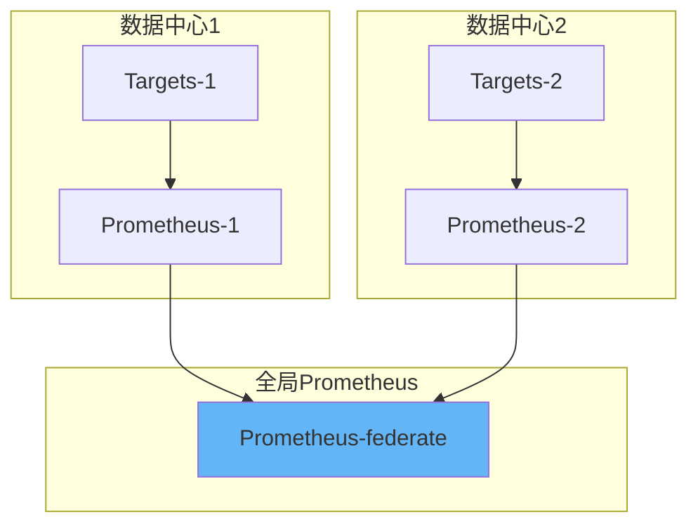
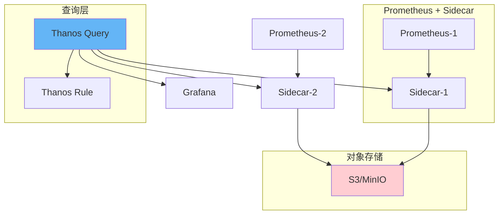
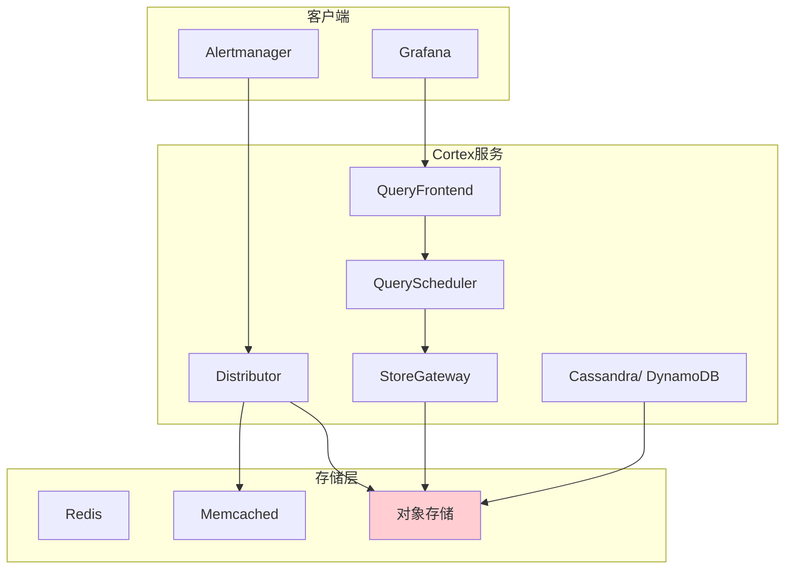

# Prometheus高可用架构：生产环境监控高可用设计指南

## 情境与背景

Prometheus是云原生时代最流行的监控系统，但单实例Prometheus存在存储容量和可用性限制。本指南详细讲解Prometheus高可用架构设计方案，包括联邦集群、Thanos、Cortex等方案的原理、架构和最佳实践。

## 一、Prometheus高可用概述

### 1.1 单实例瓶颈

**单实例问题**：

```markdown
## Prometheus高可用概述

### 单实例瓶颈

**存储容量限制**：

```yaml
single_instance_limits:
  disk_space:
    - "本地存储有限"
    - "数据保留期限短（通常15天）"
    
  memory:
    - "指标多了OOM"
    - "查询性能下降"
    
  cpu:
    - "大量target抓取慢"
    - "复杂查询超时"
    
  network:
    - "出口带宽瓶颈"
    - "无法水平扩展"
```

**可用性风险**：

```yaml
availability_risks:
  - "实例挂了无法监控"
  - "数据丢失无法恢复"
  - "无法满足SLA要求"
  - "告警漏报风险"
```
```

### 1.2 高可用需求

**业务需求分析**：

```yaml
ha_requirements:
  data_retention:
    short_term: "15天（本地）"
    medium_term: "90天（长期存储）"
    long_term: "1年+（归档）"
    
  availability:
    sla: "99.9%"
    downtime: "< 9小时/年"
    
  query:
    performance: "< 1秒响应"
    concurrency: "100+并发"
    
  scale:
    targets: "10000+"
    metrics: "1000000+"
```

## 二、联邦集群架构

### 2.1 联邦集群原理

**Federation架构**：

```markdown
## 联邦集群架构

### 联邦集群原理

**架构图**：



**工作原理**：

```yaml
federation_working:
  scrape:
    - "各数据中心Prometheus抓取本地target"
    - "数据存储在本地"
    
  federate:
    - "全局Prometheus通过federation汇聚"
    - "抓取各数据中心聚合指标"
    - "通常抓取grouped_data如up指标"
    
  config:
    - "federation配置示例"
    scrape_configs:
      - job_name: 'federate'
        honor_labels: true
        metrics_path: '/federate'
        params:
          'match[]':
            - '{job="kubernetes-nodes"}'
        static_configs:
          - targets:
            - 'prometheus1:9090'
            - 'prometheus2:9090'
```
```

### 2.2 联邦集群部署

**部署配置**：

```yaml
# 全局Prometheus配置
global:
  scrape_interval: 15s
  external_labels:
    cluster: 'global'
    env: 'prod'

federation_config:
  - job_name: 'federate-k8s'
    honor_labels: true
    params:
      'match[]':
        - '{job="kubernetes-apiserver"}'
        - '{job="kubelet"}'
        - '{job="node-exporter"}'
    static_configs:
      - targets:
        - 'prometheus-dc1:9090'
        - 'prometheus-dc2:9090'
```

**优缺点分析**：

```yaml
federation_pros_cons:
  pros:
    - "简单易部署"
    - "无额外存储成本"
    - "数据本地存储速度快"
    - "故障隔离好"
    
  cons:
    - "跨数据中心网络依赖"
    - "全局视图有限"
    - "无法做跨实例查询"
    - "指标名冲突风险"
```
```

## 三、Thanos高可用方案

### 3.1 Thanos架构原理

**Thanos架构**：

```markdown
## Thanos高可用方案

### Thanos架构原理

**架构图**：



**核心组件**：

```yaml
thanos_components:
  thanos-sidecar:
    role: "连接到Prometheus"
    function: "数据压缩、上传对象存储、实时查询"
    
  thanos-query:
    role: "查询入口"
    function: "并行查询多个Store、查询去重"
    
  thanos-store:
    role: "对象存储网关"
    function: "从对象存储读取历史数据"
    
  thanos-rule:
    role: "告警和记录规则"
    function: "告警、预计算、写入对象存储"
    
  thanos-compactor:
    role: "压缩和降采样"
    function: "合并历史数据、创建降采样数据"
```
```

### 3.2 Thanos部署配置

**Sidecar配置**：

```yaml
# Prometheus配置（添加Sidecar）
apiVersion: v1
kind: Pod
metadata:
  name: prometheus
spec:
  containers:
  - name: prometheus
    image: prom/prometheus:latest
    args:
    - '--storage.tsdb.path=/prometheus'
    - '--storage.tsdb.retention.time=15d'
    volumeMounts:
    - name: config
      mountPath: /etc/prometheus
  - name: thanos-sidecar
    image: quay.io/thanos/thanos:v0.32.0
    args:
    - sidecar
    - '--prometheus.url=http://localhost:9090'
    - '--objstore.config-file=/etc/thanos/object-storage.yaml'
    volumeMounts:
    - name: object-storage
      mountPath: /etc/thanos
```

**对象存储配置**：

```yaml
# object-storage.yaml (S3配置)
type: S3
config:
  bucket: thanos-data
  endpoint: s3.amazonaws.com
  region: us-west-2
  access_key: ${AWS_ACCESS_KEY}
  secret_key: ${AWS_SECRET_KEY}
  s3_force_path_style: true
```

**Query配置**：

```yaml
# Thanos Query部署
apiVersion: apps/v1
kind: Deployment
metadata:
  name: thanos-query
spec:
  selector:
    matchLabels:
      app: thanos-query
  template:
    metadata:
      labels:
        app: thanos-query
    spec:
      containers:
      - name: query
        image: quay.io/thanos/thanos:v0.32.0
        args:
        - query
        - '--store=prometheus-1:10901'
        - '--store=prometheus-2:10901'
        - '--store=prometheus-3:10901'
        - '--query.replica-label=replica'
        ports:
        - containerPort: 10902
```
```

### 3.3 Thanos高级特性

**降采样配置**：

```yaml
# Compactor降采样规则
apiVersion: batch/v1
kind: CronJob
metadata:
  name: thanos-compactor
spec:
  schedule: "0 */6 * * *"
  jobTemplate:
    spec:
      template:
        spec:
          containers:
          - name: compactor
            image: quay.io/thanos/thanos:v0.32.0
            args:
            - compact
            - '--data-dir=/data'
            - '--objstore.config-file=/etc/thanos/object-storage.yaml'
            - '--retention.resolution-raw=30d'
            - '--retention.resolution-5m=90d'
            - '--retention.resolution-1h=1y'
```

**全局视图查询**：

```yaml
# Grafana配置Thanos数据源
apiVersion: v1
kind: ConfigMap
metadata:
  name: grafana-datasources
data:
  datasources.yaml: |
    apiVersion: 1
    datasources:
    - name: Thanos
      type: prometheus
      access: proxy
      url: http://thanos-query:10902
      isDefault: true
```
```

## 四、Cortex方案

### 4.1 Cortex架构

**Cortex架构图**：

```markdown
## Cortex方案

### Cortex架构

**架构图**：



**与Thanos对比**：

```yaml
cortex_vs_thanos:
  cortex:
    - "微服务架构"
    - "水平扩展能力强"
    - "多租户支持好"
    - "依赖多（Cassandra/Redis）"
    
  thanos:
    - "单体架构（Sidecar模式）"
    - "部署简单"
    - "与Prometheus兼容好"
    - "需要对象存储"
```
```

## 五、VictoriaMetrics方案

### 5.1 VictoriaMetrics特点

**VM架构**：

```markdown
## VictoriaMetrics方案

### VictoriaMetrics特点

**特点总结**：

```yaml
victoria_metrics_features:
  performance:
    - "写入性能是Prometheus 10倍"
    - "查询性能是Prometheus 5倍"
    - "支持100M+指标"
    
  compatibility:
    - "Prometheus协议兼容"
    - "Grafana原生支持"
    - "无需修改现有配置"
    
  deployment:
    - "单实例部署简单"
    - "支持集群模式"
    - "支持远程存储"
```
```

## 六、生产环境最佳实践

### 6.1 架构选型指南

**方案选择**：

```yaml
architecture_selection:
  small_scale:
    criteria: "< 100K指标，< 1000 targets"
    recommendation: "单实例Prometheus"
    retention: "15-30天"
    
  medium_scale:
    criteria: "< 1M指标，< 5000 targets"
    recommendation: "联邦集群"
    retention: "本地15天 + 长期存储90天"
    
  large_scale:
    criteria: "> 1M指标，> 5000 targets"
    recommendation: "Thanos"
    retention: "本地15天 + 对象存储1年+"
```
```

### 6.2 高可用部署配置

**Prometheus高可用部署**：

```yaml
# Prometheus高可用 StatefulSet
apiVersion: apps/v1
kind: StatefulSet
metadata:
  name: prometheus
spec:
  serviceName: prometheus
  replicas: 2
  selector:
    matchLabels:
      app: prometheus
  template:
    metadata:
      labels:
        app: prometheus
    spec:
      affinity:
        podAntiAffinity:
          requiredDuringSchedulingIgnoredDuringExecution:
          - labelSelector:
              matchExpressions:
              - key: app
                operator: In
                values:
                - prometheus
            topologyKey: kubernetes.io/hostname
      containers:
      - name: prometheus
        image: prom/prometheus:latest
        args:
        - '--storage.tsdb.path=/prometheus'
        - '--storage.tsdb.retention.time=15d'
        - '--web.enable-lifecycle'
        - '--web.federation'
        volumeMounts:
        - name: prometheus-data
          mountPath: /prometheus
```

**Thanos高可用部署**：

```yaml
# Thanos多副本配置
apiVersion: apps/v1
kind: StatefulSet
metadata:
  name: thanos-sidecar
spec:
  serviceName: thanos-sidecar
  replicas: 2
  selector:
    matchLabels:
      app: thanos-sidecar
  template:
    spec:
      affinity:
        podAntiAffinity:
          preferredDuringSchedulingIgnoredDuringExecution:
          - weight: 100
            podAffinityTerm:
              labelSelector:
                matchLabels:
                  app: thanos-sidecar
              topologyKey: topology.kubernetes.io/zone
      containers:
      - name: thanos
        image: quay.io/thanos/thanos:v0.32.0
        args:
        - sidecar
        - '--prometheus.url=http://prometheus:9090'
        - '--objstore.config-file=/etc/thanos/object-storage.yaml'
        - '--reloader.config-file=/etc/prometheus/prometheus.yml'
```

### 6.3 告警高可用

**Alertmanager集群**：

```yaml
# Alertmanager高可用配置
global:
  resolve_timeout: 5m

route:
  group_by: ['alertname', 'cluster']
  group_wait: 10s
  group_interval: 10s
  repeat_interval: 12h
  receiver: 'cluster-alerting'

receivers:
- name: 'cluster-alerting'
  webhook_configs:
  - url: 'http://alert-webhook:5000/alerts'
    send_resolved: true

cluster:
  advertise_address: '${HOST_IP}:9093'
  listen_address: '0.0.0.0:9093'
  peers: 'alertmanager-0.alertmanager:9093,alertmanager-1.alertmanager:9093'
```
```

### 6.4 监控指标

**关键监控指标**：

```yaml
prometheus_monitor_metrics:
  instance_health:
    - "up{job=\"prometheus\"}"
    - "prometheus_tsdb_head_samples"
    - "prometheus_target_scrapes_exceeded_target_limit"
    
  query_performance:
    - "prometheus_query_duration_seconds"
    - "prometheus_query_engineevaluations_seconds_total"
    
  storage:
    - "prometheus_tsdb_head_chunk_ops_total"
    - "prometheus_tsdb_storage_blocks_bytes"
```
```

## 七、面试1分钟精简版（直接背）

**完整版**：

Prometheus高可用方案：1. 基础方案：联邦集群，多个Prometheus实例分别抓取不同目标，通过federation汇聚聚合数据；2. Thanos方案：通过Sidecar连接Prometheus，支持数据压缩存储到对象存储（S3），支持全局查询、去重和长期存储；3. Cortex/VictoriaMetrics提供类似能力。核心组件：Sidecar数据上传、Query并行查询、StoreGateway历史读取、Compactor压缩降采样。架构选型：中小规模用联邦，大规模用Thanos。

**30秒超短版**：

Prometheus高可用：联邦集群做数据汇聚，Thanos对象存储做长期保留，Query层做查询去重，故障转移靠多副本。

## 八、总结

### 8.1 方案对比总结

```yaml
ha_solution_comparison:
  federation:
    storage: "本地"
    scale: "中"
    complexity: "低"
    cost: "低"
    
  thanos:
    storage: "对象存储"
    scale: "大"
    complexity: "中"
    cost: "中"
    
  cortex:
    storage: "Cassandra/DynamoDB"
    scale: "超大"
    complexity: "高"
    cost: "高"
```

### 8.2 最佳实践清单

```yaml
best_practices_checklist:
  deployment:
    - "Prometheus多副本部署"
    - "Alertmanager集群"
    - "TSDB数据冗余"
    
  storage:
    - "本地存储+对象存储"
    - "降采样策略"
    - "数据保留策略"
    
  query:
    - "Thanos Query做统一入口"
    - "配置replica标签去重"
    - "Grafana配置单一数据源"
    
  alerting:
    - "告警去重"
    - "告警静默管理"
    - "告警恢复通知"
```

### 8.3 记忆口诀

```
Prometheus高可用，联邦集群是入门，
Thanos对象存储，Cortex微服务，
查询去重是核心，告警集群保可靠，
监控不间断，业务稳当当。
```

> **参考链接**：[SRE运维面试题全解析：从理论到实践（第二部分）]()