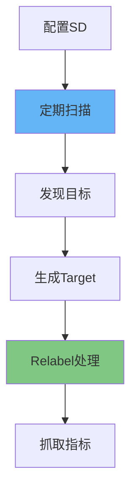

# Prometheus自动发现规则：SD配置与动态监控实践指南

## 情境与背景

Prometheus的服务发现（Service Discovery，简称SD）是其动态管理监控目标的核心能力。本指南详细讲解Prometheus支持的各种自动发现方式、配置方法、以及生产环境中的最佳实践。

## 一、服务发现概述

### 1.1 什么是服务发现

**服务发现原理**：

```markdown
## 服务发现概述

### 什么是服务发现

**核心概念**：

```yaml
service_discovery:
  description: "自动发现和管理监控目标"
  
  necessity:
    - "云原生环境动态变化"
    - "容器编排平台频繁扩缩容"
    - "手动配置无法应对"
    
  benefits:
    - "自动化管理"
    - "减少人为错误"
    - "提高系统可靠性"
```

**发现流程**：



### 1.2 常见发现方式

**发现方式对比**：

```yaml
discovery_methods:
  static_configs:
    description: "静态配置"
    use_case: "固定IP服务"
    dynamic: false
    
  file_sd:
    description: "文件发现"
    use_case: "动态文件配置"
    dynamic: true
    
  kubernetes_sd:
    description: "K8s发现"
    use_case: "K8s集群监控"
    dynamic: true
    
  dns_sd:
    description: "DNS发现"
    use_case: "DNS服务"
    dynamic: true
    
  consul_sd:
    description: "Consul发现"
    use_case: "Consul服务注册"
    dynamic: true
    
  ec2_sd:
    description: "EC2发现"
    use_case: "AWS EC2实例"
    dynamic: true
    
  azure_sd:
    description: "Azure发现"
    use_case: "Azure虚拟机"
    dynamic: true
```
```

## 二、静态配置

### 2.1 static_configs

**基础配置**：

```yaml
# prometheus.yml
global:
  scrape_interval: 15s

scrape_configs:
  - job_name: 'static-targets'
    static_configs:
      - targets:
        - 'localhost:9090'
        - 'localhost:9100'
        - 'prometheus.example.com:9090'
      - targets:
        - 'node1.example.com:9100'
        - 'node2.example.com:9100'
        labels:
          env: 'production'
```

**标签配置**：

```yaml
scrape_configs:
  - job_name: 'api-servers'
    static_configs:
      - targets:
        - 'api-1.example.com:8080'
        - 'api-2.example.com:8080'
      labels:
        job: 'api-server'
        environment: 'production'
        region: 'us-west-2'
```

### 2.2 适用场景

**static_configs适用场景**：

```yaml
static_use_cases:
  - "基础设施服务（固定IP）"
  - "监控系统自身（Prometheus、Alertmanager）"
  - "测试环境（少量固定目标）"
  - "无法使用动态发现的场景"
```

## 三、文件服务发现

### 3.1 file_sd配置

**文件发现配置**：

```markdown
## 文件服务发现

### file_sd配置

**基础配置**：

```yaml
# prometheus.yml
scrape_configs:
  - job_name: 'file-targets'
    file_sd_configs:
      - files:
        - '/etc/prometheus/targets/*.json'
        - '/etc/prometheus/targets/*.yml'
      refresh_interval: 1m
```

**目标文件格式（JSON）**：

```json
[
  {
    "targets": [
      "web-1.example.com:8080",
      "web-2.example.com:8080"
    ],
    "labels": {
      "job": "web-server",
      "env": "production"
    }
  },
  {
    "targets": [
      "api-1.example.com:9090",
      "api-2.example.com:9090"
    ],
    "labels": {
      "job": "api-server",
      "env": "staging"
    }
  }
]
```

**目标文件格式（YAML）**：

```yaml
- targets:
  - web-1.example.com:8080
  - web-2.example.com:8080
  labels:
    job: web-server
    env: production
- targets:
  - api-1.example.com:9090
  - api-2.example.com:9090
  labels:
    job: api-server
    env: staging
```

### 3.2 热更新机制

**热更新原理**：

```yaml
file_sd_hot_reload:
  mechanism: "文件监听"
  
  refresh_interval:
    default: "5m"
    minimum: "10s"
    
  update_trigger:
    - "文件内容变化"
    - "文件创建/删除"
    
  reload_method:
    - "自动检测"
    - "无需重启Prometheus"
```

**配置示例**：

```yaml
scrape_configs:
  - job_name: 'dynamic-targets'
    file_sd_configs:
      - files:
        - '/etc/prometheus/dynamic/*.json'
      refresh_interval: 30s  # 30秒检查一次
```

## 四、Kubernetes服务发现

### 4.1 kubernetes_sd配置

**K8s发现角色**：

```markdown
## Kubernetes服务发现

### kubernetes_sd配置

**支持的角色**：

```yaml
kubernetes_sd_roles:
  node:
    description: "发现集群节点"
    use_case: "节点监控"
    
  pod:
    description: "发现Pod"
    use_case: "容器监控"
    
  service:
    description: "发现Service"
    use_case: "服务监控"
    
  endpoints:
    description: "发现Endpoint"
    use_case: "端点监控"
    
  ingress:
    description: "发现Ingress"
    use_case: "入口监控"
    
  namespace:
    description: "发现Namespace"
    use_case: "命名空间监控"
    
  secret:
    description: "发现Secret"
    use_case: "敏感信息"
    
  configmap:
    description: "发现ConfigMap"
    use_case: "配置监控"
```

**Pod发现配置**：

```yaml
scrape_configs:
  - job_name: 'kubernetes-pods'
    kubernetes_sd_configs:
      - role: pod
    relabel_configs:
      # 只监控带有prometheus.io/scrape=true标签的Pod
      - source_labels: [__meta_kubernetes_pod_label_prometheus_io_scrape]
        action: keep
        regex: true
      # 使用prometheus.io/port作为端口
      - source_labels: [__meta_kubernetes_pod_label_prometheus_io_port]
        action: replace
        target_label: __address__
        replacement: $1
```

**Node发现配置**：

```yaml
scrape_configs:
  - job_name: 'kubernetes-nodes'
    kubernetes_sd_configs:
      - role: node
    scheme: https
    tls_config:
      ca_file: /var/run/secrets/kubernetes.io/serviceaccount/ca.crt
    bearer_token_file: /var/run/secrets/kubernetes.io/serviceaccount/token
    relabel_configs:
      - action: labelmap
        regex: __meta_kubernetes_node_label_(.+)
```

### 4.2 常见元标签

**K8s元标签**：

```yaml
kubernetes_metadata_labels:
  pod:
    - "__meta_kubernetes_pod_name"
    - "__meta_kubernetes_pod_namespace"
    - "__meta_kubernetes_pod_label_<labelname>"
    - "__meta_kubernetes_pod_annotation_<annotation>"
    - "__meta_kubernetes_pod_ip"
    
  service:
    - "__meta_kubernetes_service_name"
    - "__meta_kubernetes_service_namespace"
    - "__meta_kubernetes_service_label_<labelname>"
    
  node:
    - "__meta_kubernetes_node_name"
    - "__meta_kubernetes_node_label_<labelname>"
```

## 五、DNS服务发现

### 5.1 dns_sd配置

**DNS发现配置**：

```markdown
## DNS服务发现

### dns_sd配置

**A记录发现**：

```yaml
scrape_configs:
  - job_name: 'dns-a-targets'
    dns_sd_configs:
      - names:
        - 'web-servers.example.com'
        type: A
        port: 8080
```

**SRV记录发现**：

```yaml
scrape_configs:
  - job_name: 'dns-srv-targets'
    dns_sd_configs:
      - names:
        - '_http._tcp.web-servers.example.com'
        type: SRV
```

**MX记录发现**：

```yaml
scrape_configs:
  - job_name: 'dns-mx-targets'
    dns_sd_configs:
      - names:
        - 'example.com'
        type: MX
        port: 25
```

### 5.2 适用场景

**DNS发现适用场景**：

```yaml
dns_sd_use_cases:
  - "Consul DNS"
  - "Kubernetes DNS"
  - "自定义DNS服务"
  - "跨集群服务发现"
```

## 六、Consul服务发现

### 6.1 consul_sd配置

**Consul发现配置**：

```yaml
scrape_configs:
  - job_name: 'consul-services'
    consul_sd_configs:
      - server: 'consul.example.com:8500'
        services: []  # 发现所有服务
        # services: ['web', 'api']  # 只发现特定服务
        tags:
          - 'production'
        node_meta:
          region: 'us-west-2'
```

**带ACL的Consul配置**：

```yaml
scrape_configs:
  - job_name: 'consul-with-acl'
    consul_sd_configs:
      - server: 'consul.example.com:8500'
        token: 'my-consul-token'
        services:
          - 'web'
```

## 七、relabel_configs详解

### 7.1 relabel操作类型

**relabel操作**：

```markdown
## relabel_configs详解

### relabel操作类型

**操作类型**：

```yaml
relabel_actions:
  keep:
    description: "保留匹配的target"
    
  drop:
    description: "删除匹配的target"
    
  replace:
    description: "替换标签值"
    
  hashmod:
    description: "哈希取模"
    
  labelmap:
    description: "映射标签"
    
  labeldrop:
    description: "删除标签"
    
  labelkeep:
    description: "保留标签"
```

**配置示例**：

```yaml
scrape_configs:
  - job_name: 'example'
    static_configs:
      - targets: ['localhost:9090']
    relabel_configs:
      # 1. 保留特定标签的target
      - source_labels: [__address__]
        regex: 'localhost:9090'
        action: keep
        
      # 2. 删除特定标签的target
      - source_labels: [__address__]
        regex: 'localhost:9100'
        action: drop
        
      # 3. 替换标签值
      - source_labels: [__address__]
        regex: '(.+):(.+)'
        target_label: instance
        replacement: '${1}'
        
      # 4. 添加标签
      - target_label: env
        replacement: 'production'
        
      # 5. 删除标签
      - regex: 'secret_.*'
        action: labeldrop
```

### 7.2 常用relabel场景

**场景配置**：

```yaml
common_relabel_scenarios:
  # 场景1：根据标签过滤
  filter_by_label:
    - source_labels: [__meta_kubernetes_pod_label_app]
      regex: 'my-app'
      action: keep
      
  # 场景2：重命名标签
  rename_label:
    - source_labels: [__meta_kubernetes_pod_name]
      target_label: pod
      
  # 场景3：添加固定标签
  add_label:
    - target_label: environment
      replacement: 'production'
      
  # 场景4：从地址提取主机名
  extract_host:
    - source_labels: [__address__]
      regex: '([^:]+):(.+)'
      target_label: hostname
      replacement: '${1}'
```

## 八、生产环境最佳实践

### 8.1 配置分层

**分层策略**：

```markdown
## 生产环境最佳实践

### 配置分层

**分层配置**：

```yaml
configuration_layers:
  base:
    description: "基础配置"
    file: "prometheus-base.yml"
    content:
      - "global配置"
      - "alerting配置"
      - "rule_files"
      
  discovery:
    description: "发现配置"
    file: "prometheus-discovery.yml"
    content:
      - "kubernetes_sd"
      - "file_sd"
      
  jobs:
    description: "抓取任务"
    file: "prometheus-jobs.yml"
    content:
      - "各个scrape_config"
      
  rules:
    description: "规则配置"
    file: "rules/*.yml"
    content:
      - "记录规则"
      - "告警规则"
```

**include配置**：

```yaml
# prometheus.yml
global:
  scrape_interval: 15s

rule_files:
  - "rules/*.yml"

scrape_configs:
  - job_name: 'prometheus'
    static_configs:
      - targets: ['localhost:9090']

# 包含其他配置文件
include:
  - 'prometheus-discovery.yml'
  - 'prometheus-jobs.yml'
```

### 8.2 性能优化

**优化策略**：

```yaml
performance_optimization:
  scrape_interval:
    default: "15s"
    slow_targets: "60s"
    
  scrape_timeout:
    default: "10s"
    
  sample_limit:
    description: "每个target的样本数限制"
    value: 10000
    
  relabel_configs:
    description: "尽早过滤不需要的target"
    
  honor_labels:
    description: "保留原始标签"
    value: true
```

### 8.3 监控服务发现

**监控指标**：

```yaml
discovery_metrics:
  prometheus_sd_discovered_targets: "发现的target数量"
  prometheus_sd_config_last_refresh_successful: "最后刷新是否成功"
  prometheus_sd_config_refresh_failures_total: "刷新失败次数"
```

**告警规则**：

```yaml
groups:
- name: discovery-alerts
  rules:
  - alert: SDRefreshFailure
    expr: |
      prometheus_sd_config_refresh_failures_total > 0
    for: 5m
    labels:
      severity: warning
    annotations:
      summary: "服务发现刷新失败"
      description: "服务发现配置刷新失败，可能导致监控目标丢失"
```

## 九、面试1分钟精简版（直接背）

**完整版**：

Prometheus自动发现规则：1. static_configs：静态配置目标列表，适合固定IP服务；2. file_sd：从文件读取目标，支持热更新，刷新间隔可配置；3. kubernetes_sd：发现K8s资源，支持多种角色（Pod/Service/Endpoint/Node），根据元标签过滤；4. dns_sd：通过DNS记录（A/SRV/MX）发现服务；5. consul_sd：从Consul发现服务。核心流程：SD配置→定期扫描→生成target→relabel处理→抓取指标。生产建议：K8s环境用kubernetes_sd，配合label选择器过滤，外部服务用dns_sd或consul_sd。

**30秒超短版**：

自动发现四种方式：static静态、file_sd文件、k8s_sd动态、dns_sd服务发现，核心流程SD→发现→relabel→抓取。

## 十、总结

### 10.1 发现方式选择

```yaml
discovery_selection:
  kubernetes:
    recommend: "kubernetes_sd"
    
  consul:
    recommend: "consul_sd"
    
  external_dns:
    recommend: "dns_sd"
    
  dynamic_file:
    recommend: "file_sd"
    
  static:
    recommend: "static_configs"
```

### 10.2 最佳实践清单

```yaml
best_practices_checklist:
  kubernetes:
    - "使用label选择器过滤target"
    - "利用annotation传递配置"
    - "配置合适的relabel规则"
    
  performance:
    - "合理设置scrape_interval"
    - "限制sample数量"
    - "尽早过滤不需要的target"
    
  monitoring:
    - "监控discovery指标"
    - "配置刷新失败告警"
```

### 10.3 记忆口诀

```
Prometheus自动发现，static静态配置，
file_sd文件更新，k8s_sd动态监控，
dns_sd服务发现，consul_sd注册中心，
relabel处理标签，生产环境保可靠。
```

> **参考链接**：[SRE运维面试题全解析：从理论到实践（第二部分）]()