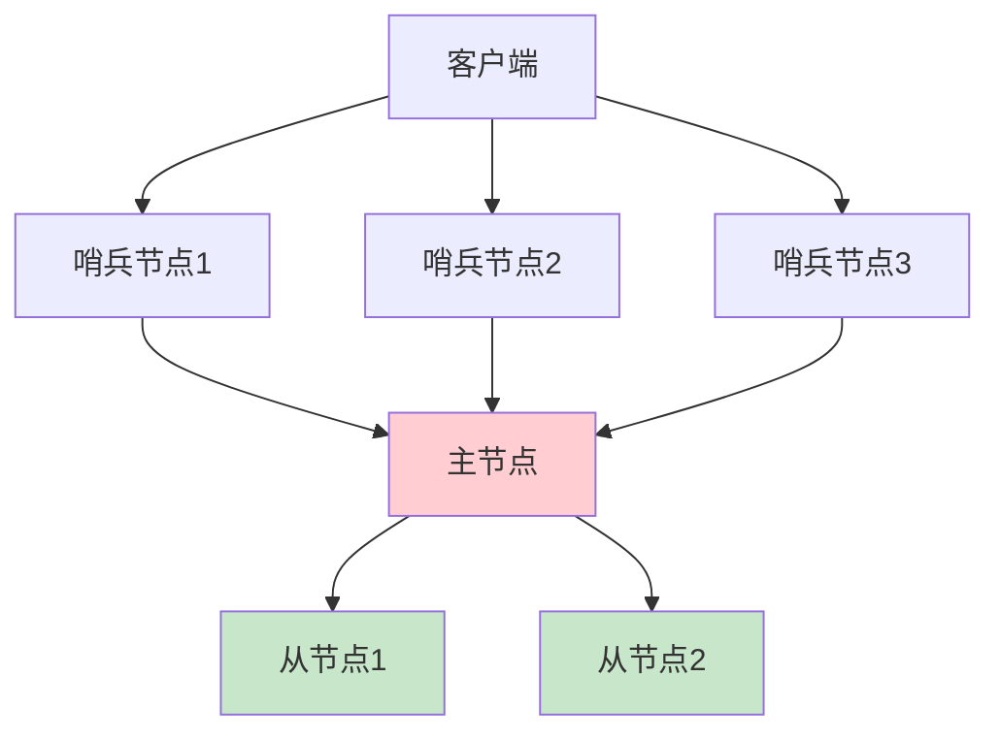
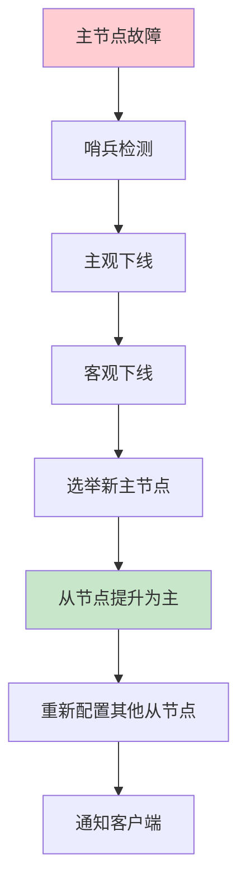
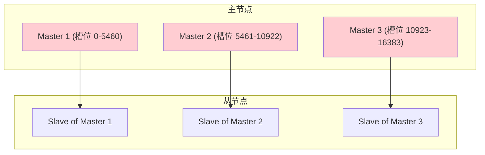
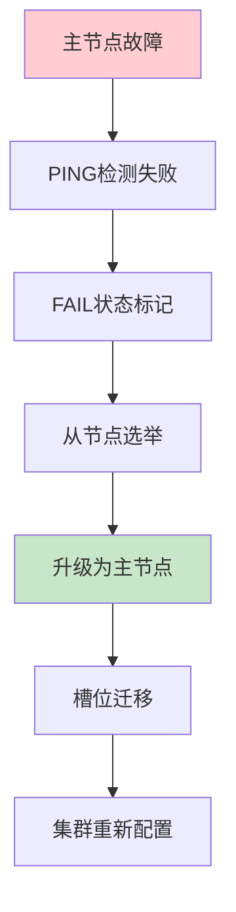

# Redis高可用架构：哨兵模式与集群模式深度解析

## 情境与背景

Redis作为高性能内存数据库，高可用性是生产环境中必须解决的核心问题。哨兵模式和集群模式是Redis提供的两种高可用方案，各自适用于不同的业务场景。作为高级DevOps/SRE工程师，需要深入理解这两种模式的区别和适用场景，做出正确的架构选择。

## 一、哨兵模式详解

### 1.1 架构设计

**哨兵模式架构图**：



**哨兵节点职责**：

```yaml
# 哨兵节点职责
sentinel_responsibilities:
  - "监控（Monitoring）：检查主从节点是否正常运行"
  - "通知（Notification）：向客户端发送故障通知"
  - "故障转移（Failover）：主节点故障时自动选举新主节点"
  - "配置提供者（Configuration Provider）：客户端连接时提供主节点地址"
```

### 1.2 配置示例

**哨兵配置文件**：

```ini
# sentinel.conf
port 26379
daemonize yes
logfile "/var/log/redis/sentinel.log"

# 监控主节点
sentinel monitor mymaster 192.168.1.100 6379 2
sentinel down-after-milliseconds mymaster 30000
sentinel failover-timeout mymaster 180000
sentinel parallel-syncs mymaster 1

# 认证配置
sentinel auth-pass mymaster redis@123
```

### 1.3 故障转移流程

**故障转移步骤**：



### 1.4 优缺点分析

**哨兵模式优缺点**：

| 优点 | 缺点 |
|------|------|
| 部署简单 | 不支持数据分片 |
| 自动故障转移 | 扩展性有限 |
| 读写分离支持 | 单节点性能瓶颈 |
| 配置简单 | 主节点故障期间短暂不可写 |

## 二、集群模式详解

### 2.1 架构设计

**集群模式架构图**：



### 2.2 槽位分配

**槽位分配原理**：

```yaml
# Redis Cluster槽位配置
cluster_slots:
  total_slots: 16384
  distribution:
    - master_1: "0-5460"
    - master_2: "5461-10922"
    - master_3: "10923-16383"
    
  key_hashing:
    algorithm: "CRC16"
    formula: "CRC16(key) % 16384"
```

### 2.3 配置示例

**集群节点配置**：

```ini
# redis.conf (集群模式)
port 6379
daemonize yes
cluster-enabled yes
cluster-config-file nodes.conf
cluster-node-timeout 15000
appendonly yes
protected-mode no

# 集群创建命令
redis-cli --cluster create \
  192.168.1.100:6379 \
  192.168.1.101:6379 \
  192.168.1.102:6379 \
  192.168.1.103:6379 \
  192.168.1.104:6379 \
  192.168.1.105:6379 \
  --cluster-replicas 1
```

### 2.4 故障转移流程

**集群故障转移**：



### 2.5 优缺点分析

**集群模式优缺点**：

| 优点 | 缺点 |
|------|------|
| 数据分片 | 部署复杂 |
| 水平扩展 | 配置复杂 |
| 自动故障转移 | 跨槽操作复杂 |
| 高吞吐量 | 需要至少3个主节点 |

## 三、两种模式对比

### 3.1 特性对比表

**详细特性对比**：

| 特性 | 哨兵模式 | 集群模式 |
|:----:|----------|----------|
| **数据分片** | ❌ 不支持 | ✅ 支持（16384槽位） |
| **故障转移** | ✅ 半自动（哨兵监控） | ✅ 全自动 |
| **扩展性** | ❌ 有限（垂直扩展） | ✅ 水平扩展 |
| **读写分离** | ✅ 支持 | ✅ 支持 |
| **部署复杂度** | 低 | 高 |
| **节点数量** | 至少3节点（1主2从+哨兵） | 至少6节点（3主3从） |
| **数据一致性** | 最终一致性 | 最终一致性 |
| **跨节点事务** | ✅ 支持 | ❌ 不支持（跨槽） |
| **适用场景** | 中小规模 | 大规模 |

### 3.2 性能对比

**性能指标对比**：

```yaml
# 性能对比（理论值）
performance:
  sentinel:
    max_clients: 10000
    throughput: "10万QPS（单节点）"
    latency: "<1ms"
    
  cluster:
    max_clients: 无限（水平扩展）
    throughput: "100万+QPS（多节点）"
    latency: "<1ms"
    
  note: "实际性能受硬件和网络影响"
```

### 3.3 适用场景

**场景选择指南**：

| 场景 | 推荐方案 | 原因 |
|------|----------|------|
| **中小规模** | 哨兵模式 | 部署简单，维护成本低 |
| **大规模** | 集群模式 | 需要水平扩展 |
| **高吞吐量** | 集群模式 | 多节点并行处理 |
| **简单架构** | 哨兵模式 | 配置简单，易于维护 |
| **云原生环境** | 集群模式 | 更好的弹性伸缩 |

## 四、生产环境最佳实践

### 4.1 哨兵模式部署建议

**哨兵模式最佳实践**：

```yaml
# 哨兵模式部署建议
sentinel_best_practices:
  # 哨兵节点数量
  sentinel_count: 3  # 奇数，避免脑裂
  
  # 主从配置
  master_slave:
    master_count: 1
    slave_count: 2
    
  # 监控配置
  monitoring:
    down_after_milliseconds: 30000  # 30秒
    failover_timeout: 180000        # 3分钟
    parallel_syncs: 1               # 串行同步
    
  # 客户端配置
  client:
    sentinel_addresses:
      - "sentinel1:26379"
      - "sentinel2:26379"
      - "sentinel3:26379"
```

### 4.2 集群模式部署建议

**集群模式最佳实践**：

```yaml
# 集群模式部署建议
cluster_best_practices:
  # 节点配置
  nodes:
    master_count: 3
    slave_count_per_master: 1
    total_nodes: 6
    
  # 槽位分配
  slots:
    distribution: "均匀分布"
    rebalance: "定期检查"
    
  # 网络配置
  network:
    timeout: 15000  # 15秒
    ping_interval: 1000  # 1秒
    
  # 客户端配置
  client:
    max_redirects: 3
    read_from_slave: false  # 主从分离场景可开启
```

### 4.3 监控告警配置

**监控指标**：

```yaml
# Redis监控指标
monitoring_metrics:
  # 哨兵模式
  sentinel:
    - "sentinel_down_since_seconds"
    - "sentinel_failover_in_progress"
    - "sentinel_master_link_status"
    
  # 集群模式
  cluster:
    - "cluster_slots_assigned"
    - "cluster_slots_ok"
    - "cluster_slots_pfail"
    - "cluster_slots_fail"
    
  # 通用指标
  common:
    - "redis_connected_clients"
    - "redis_used_memory"
    - "redis_commands_total"
    - "redis_keyspace_hits"
    - "redis_keyspace_misses"
```

**Prometheus告警规则**：

```yaml
# Redis告警规则
groups:
  - name: redis-alerts
    rules:
      - alert: RedisMasterDown
        expr: redis_up{role="master"} == 0
        for: 1m
        labels:
          severity: critical
          
      - alert: RedisSlaveDown
        expr: redis_up{role="slave"} == 0
        for: 1m
        labels:
          severity: warning
          
      - alert: RedisMemoryHigh
        expr: redis_used_memory / redis_total_system_memory > 0.8
        for: 5m
        labels:
          severity: warning
          
      - alert: RedisClusterSlotFail
        expr: cluster_slots_fail > 0
        for: 1m
        labels:
          severity: critical
```

### 4.4 客户端配置建议

**客户端配置**：

```python
# Python Redis客户端配置示例
import redis
from redis.sentinel import Sentinel
from redis.cluster import RedisCluster

# 哨兵模式客户端
sentinel = Sentinel([
    ('sentinel1', 26379),
    ('sentinel2', 26379),
    ('sentinel3', 26379)
], socket_timeout=0.1)

master = sentinel.master_for('mymaster', socket_timeout=0.1)
slave = sentinel.slave_for('mymaster', socket_timeout=0.1)

# 集群模式客户端
cluster = RedisCluster(
    host='redis-cluster.example.com',
    port=6379,
    decode_responses=True,
    skip_full_coverage_check=True
)
```

## 五、故障排查

### 5.1 哨兵模式故障排查

**常见问题排查**：

```bash
# 查看哨兵状态
redis-cli -p 26379 SENTINEL master mymaster
redis-cli -p 26379 SENTINEL slaves mymaster

# 查看主从复制状态
redis-cli INFO replication

# 查看故障转移日志
tail -f /var/log/redis/sentinel.log

# 手动触发故障转移
redis-cli -p 26379 SENTINEL failover mymaster
```

### 5.2 集群模式故障排查

**集群问题排查**：

```bash
# 查看集群状态
redis-cli CLUSTER INFO
redis-cli CLUSTER NODES

# 检查槽位分配
redis-cli CLUSTER SLOTS

# 手动故障转移
redis-cli CLUSTER FAILOVER

# 修复槽位
redis-cli --cluster fix 192.168.1.100:6379

# 重新平衡槽位
redis-cli --cluster rebalance 192.168.1.100:6379
```

### 5.3 常见问题解决方案

**问题解决方案表**：

| 问题 | 原因 | 解决方案 |
|------|------|----------|
| **哨兵无法选举** | 网络问题或哨兵数量不足 | 检查网络，确保至少3个哨兵 |
| **脑裂** | 网络分区 | 增加哨兵数量，调整quorum |
| **槽位丢失** | 主节点故障 | 手动故障转移或等待自动恢复 |
| **数据不一致** | 复制延迟 | 增加从节点数量，优化网络 |
| **性能下降** | 客户端连接过多 | 调整maxclients，使用连接池 |

## 六、面试1分钟精简版（直接背）

**完整版**：

哨兵模式主要提供高可用性，通过监控主从节点实现故障自动转移，但不支持数据分片，适合中小规模场景；集群模式通过16384个槽位实现数据分片，支持水平扩展和自动故障转移，适合大规模场景。我们根据业务规模选择：中小规模用哨兵+主从，大规模用Cluster模式。

**30秒超短版**：

哨兵管故障转移，集群管数据分片；中小规模用哨兵，大规模用集群。

## 七、总结

### 7.1 方案选择指南

| 因素 | 哨兵模式 | 集群模式 |
|------|----------|----------|
| 数据量 | 较小 | 较大 |
| 吞吐量 | 中等 | 高 |
| 扩展性 | 有限 | 无限 |
| 复杂度 | 低 | 高 |
| 成本 | 低 | 高 |

### 7.2 最佳实践清单

```yaml
best_practices:
  - "哨兵模式：至少3个哨兵节点，避免脑裂"
  - "集群模式：至少3主3从，均匀分配槽位"
  - "监控告警：监控主从状态、内存使用、命令执行"
  - "客户端配置：使用连接池，设置合理超时"
  - "备份策略：定期RDB/AOF备份"
  - "升级计划：滚动升级，避免同时重启"
```

### 7.3 记忆口诀

```
哨兵管故障，集群管分片，
中小规模用哨兵，大规模用集群，
监控告警不能少，备份恢复要做好。
```

> **参考链接**：[SRE运维面试题全解析：从理论到实践（第二部分）]()