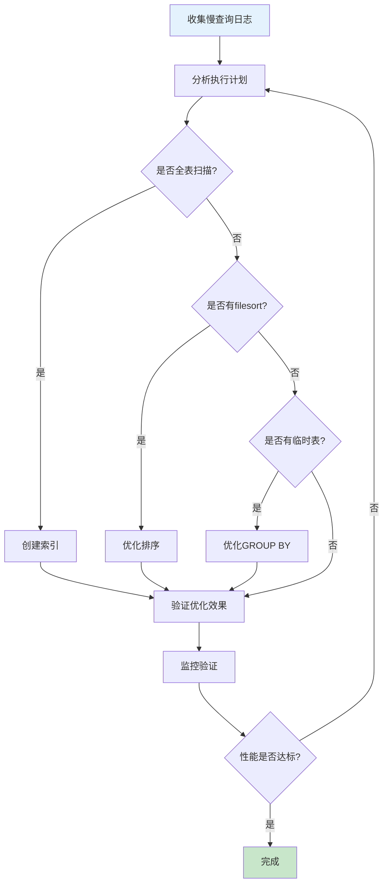

# SQL慢查询分析与优化：从日志到执行计划全攻略

## 情境与背景

慢查询是数据库性能问题的主要来源，严重影响系统响应速度和用户体验。作为高级DevOps/SRE工程师，需要掌握完整的慢查询分析和优化流程，从日志收集到执行计划分析，再到索引优化和SQL重构。本博客详细介绍慢查询分析的完整方法论和最佳实践。

## 一、慢查询日志配置

### 1.1 启用慢查询日志

**MySQL配置**：

```sql
-- 查看当前配置
SHOW VARIABLES LIKE 'slow_query%';
SHOW VARIABLES LIKE 'long_query_time';

-- 临时启用（重启后失效）
SET GLOBAL slow_query_log = 'ON';
SET GLOBAL slow_query_log_file = '/var/log/mysql/slow.log';
SET GLOBAL long_query_time = 1;  -- 超过1秒记录
SET GLOBAL log_queries_not_using_indexes = 'ON';  -- 记录未使用索引的查询

-- 永久启用（修改my.cnf）
[mysqld]
slow_query_log = 1
slow_query_log_file = /var/log/mysql/slow.log
long_query_time = 1
log_queries_not_using_indexes = 1
log_slow_admin_statements = 1  -- 记录管理语句
```

### 1.2 日志格式解析

**慢查询日志格式**：

```
# Time: 2024-01-15T10:30:00.000000Z
# User@Host: appuser[appuser] @ localhost []
# Query_time: 5.234  Lock_time: 0.001 Rows_sent: 100  Rows_examined: 1000000
SET timestamp=1705321800;
SELECT * FROM orders WHERE status = 'pending' ORDER BY created_at DESC;
```

**日志字段说明**：

| 字段 | 说明 |
|------|------|
| **Query_time** | 查询执行时间（秒） |
| **Lock_time** | 等待锁的时间（秒） |
| **Rows_sent** | 返回给客户端的行数 |
| **Rows_examined** | 检查的行数 |

### 1.3 日志轮转

**日志轮转配置**：

```bash
# /etc/logrotate.d/mysql-slow
/var/log/mysql/slow.log {
    daily
    rotate 7
    compress
    delaycompress
    missingok
    notifempty
    create 640 mysql mysql
    postrotate
        /usr/bin/mysqladmin flush-logs slow
    endscript
}
```

## 二、执行计划分析

### 2.1 EXPLAIN基础

**使用EXPLAIN分析查询**：

```sql
EXPLAIN SELECT * FROM orders 
WHERE status = 'completed' 
  AND created_at > '2024-01-01'
ORDER BY total_amount DESC;
```

**EXPLAIN输出字段**：

| 字段 | 说明 |
|------|------|
| **id** | 查询ID，标识查询执行顺序 |
| **select_type** | 查询类型（SIMPLE、SUBQUERY、DERIVED等） |
| **table** | 表名 |
| **type** | 访问类型（ALL、index、range、ref、eq_ref等） |
| **possible_keys** | 可能使用的索引 |
| **key** | 实际使用的索引 |
| **key_len** | 使用的索引长度 |
| **ref** | 与索引比较的列或常量 |
| **rows** | 预计检查的行数 |
| **Extra** | 额外信息（Using where、Using index、Using filesort等） |

### 2.2 type字段详解

**访问类型优先级**：

```
ALL < index < range < ref < eq_ref < const < system
```

**常见type值说明**：

| type | 说明 | 是否优化 |
|:----:|------|:--------:|
| **ALL** | 全表扫描 | 需要优化 |
| **index** | 全索引扫描 | 需要优化 |
| **range** | 索引范围扫描 | 可接受 |
| **ref** | 非唯一索引扫描 | 良好 |
| **eq_ref** | 唯一索引扫描 | 优秀 |
| **const/system** | 常量查询 | 最优 |

### 2.3 Extra字段详解

**关键Extra值**：

| Extra | 说明 | 是否优化 |
|-------|------|:--------:|
| **Using filesort** | 使用文件排序 | 需要优化 |
| **Using temporary** | 使用临时表 | 需要优化 |
| **Using where** | 使用WHERE条件过滤 | 正常 |
| **Using index** | 使用覆盖索引 | 优秀 |
| **Using join buffer** | 使用连接缓冲区 | 可接受 |
| **Impossible WHERE** | WHERE条件永远为假 | 需要检查 |

### 2.4 EXPLAIN ANALYZE

**执行计划+实际执行**：

```sql
EXPLAIN ANALYZE SELECT * FROM orders 
WHERE status = 'completed'
ORDER BY created_at DESC
LIMIT 100;
```

## 三、索引优化

### 3.1 索引设计原则

**索引设计最佳实践**：

```yaml
# 索引设计原则
index_principles:
  - "WHERE条件字段优先"
  - "JOIN条件字段必须"
  - "ORDER BY/GROUP BY字段考虑"
  - "避免过多索引（影响写入性能）"
  - "复合索引遵循最左前缀原则"
```

### 3.2 索引类型选择

**索引类型对比**：

| 类型 | 适用场景 | 特点 |
|:----:|----------|------|
| **B-Tree** | 等值查询、范围查询 | 默认索引类型 |
| **Hash** | 等值查询 | 不支持范围查询 |
| **Full-text** | 全文搜索 | 支持全文索引 |
| **Spatial** | 空间数据 | 地理信息查询 |

### 3.3 索引失效场景

**避免索引失效**：

```sql
-- ❌ 索引失效场景
-- 1. 索引列上使用函数
SELECT * FROM orders WHERE YEAR(created_at) = 2024;

-- 2. 索引列上进行运算
SELECT * FROM products WHERE price * 1.1 > 100;

-- 3. 使用OR连接非索引字段
SELECT * FROM users WHERE id = 1 OR name = 'test';

-- 4. LIKE以%开头
SELECT * FROM users WHERE email LIKE '%@gmail.com';

-- 5. 数据类型不匹配
SELECT * FROM orders WHERE user_id = '123';  -- user_id是INT

-- ✅ 正确写法
SELECT * FROM orders WHERE created_at >= '2024-01-01' AND created_at < '2025-01-01';
SELECT * FROM products WHERE price > 100 / 1.1;
SELECT * FROM users WHERE id = 1 UNION SELECT * FROM users WHERE name = 'test';
SELECT * FROM users WHERE email LIKE 'test%@gmail.com';
SELECT * FROM orders WHERE user_id = 123;
```

### 3.4 复合索引设计

**复合索引最佳实践**：

```sql
-- 创建复合索引（遵循最左前缀原则）
CREATE INDEX idx_orders_status_created ON orders(status, created_at);

-- 有效查询（使用索引）
SELECT * FROM orders WHERE status = 'completed';
SELECT * FROM orders WHERE status = 'completed' AND created_at > '2024-01-01';
SELECT * FROM orders WHERE status = 'completed' ORDER BY created_at;

-- 无效查询（不使用索引）
SELECT * FROM orders WHERE created_at > '2024-01-01';
```

## 四、SQL优化技巧

### 4.1 避免SELECT *

**指定需要的列**：

```sql
-- ❌ 错误：查询所有列
SELECT * FROM orders WHERE status = 'completed';

-- ✅ 正确：只查询需要的列
SELECT id, order_no, total_amount, created_at 
FROM orders WHERE status = 'completed';
```

### 4.2 分页优化

**优化LIMIT OFFSET**：

```sql
-- ❌ 低效分页（OFFSET过大）
SELECT * FROM orders ORDER BY id LIMIT 1000000, 10;

-- ✅ 高效分页（基于范围查询）
SELECT * FROM orders 
WHERE id > 1000000 
ORDER BY id 
LIMIT 10;

-- ✅ 使用游标分页
SELECT * FROM orders 
WHERE created_at > '2024-01-15 10:00:00' 
ORDER BY created_at 
LIMIT 100;
```

### 4.3 JOIN优化

**优化JOIN查询**：

```sql
-- ❌ 低效：小表驱动大表
SELECT * FROM small_table s
JOIN large_table l ON s.id = l.small_id;

-- ✅ 高效：确保小表在前
SELECT * FROM large_table l
JOIN small_table s ON l.small_id = s.id;

-- ✅ 使用STRAIGHT_JOIN强制顺序
SELECT STRAIGHT_JOIN * 
FROM large_table l
JOIN small_table s ON l.small_id = s.id;
```

### 4.4 子查询优化

**优化子查询**：

```sql
-- ❌ 低效子查询
SELECT * FROM orders 
WHERE user_id IN (
    SELECT id FROM users WHERE country = 'China'
);

-- ✅ 高效JOIN
SELECT o.* FROM orders o
JOIN users u ON o.user_id = u.id
WHERE u.country = 'China';

-- ✅ 使用EXISTS
SELECT * FROM orders o
WHERE EXISTS (
    SELECT 1 FROM users u 
    WHERE u.id = o.user_id AND u.country = 'China'
);
```

## 五、工具辅助分析

### 5.1 pt-query-digest

**使用pt-query-digest分析日志**：

```bash
# 安装Percona Toolkit
sudo apt-get install percona-toolkit

# 分析慢查询日志
pt-query-digest /var/log/mysql/slow.log > slow_report.txt

# 分析最近1小时的慢查询
pt-query-digest --since 1h /var/log/mysql/slow.log

# 输出分析报告
pt-query-digest /var/log/mysql/slow.log --report
```

**报告解读**：

```
# Profile
# Rank Query ID           Response time Calls R/Call  Apdx V/M   Item
# ==== ================== ============ ===== ====== ==== ===== =====
#    1 0x7F3A2B1C4D5E6F78 500.23s 80%   1000  0.50s   1.0  0.10 SELECT orders
#    2 0x1A2B3C4D5E6F7890 100.50s 16%   2000  0.05s   1.0  0.05 SELECT users
#    3 0x9A8B7C6D5E4F3G2H  25.30s  4%    500  0.05s   1.0  0.01 UPDATE products
```

### 5.2 Performance Schema

**实时性能监控**：

```sql
-- 启用Performance Schema
SET GLOBAL performance_schema = ON;

-- 查询慢查询统计
SELECT * FROM performance_schema.events_statements_summary_by_digest
WHERE DIGEST_TEXT LIKE '%orders%'
ORDER BY SUM_TIMER_WAIT DESC;

-- 查询索引使用情况
SELECT * FROM performance_schema.table_io_waits_summary_by_index_usage
ORDER BY COUNT_STAR DESC;
```

### 5.3 MySQL Enterprise Monitor

**企业级监控工具**：

```yaml
# MySQL Enterprise Monitor功能
monitoring_features:
  - "慢查询自动检测"
  - "执行计划分析"
  - "索引建议"
  - "性能趋势分析"
  - "告警通知"
```

## 六、优化流程

### 6.1 标准化优化流程

**优化流程**：



### 6.2 优化检查表

**优化检查清单**：

```yaml
# SQL优化检查清单
optimization_checklist:
  - "是否使用SELECT *?"
  - "WHERE条件是否有索引?"
  - "是否有全表扫描(type=ALL)?"
  - "是否有Using filesort?"
  - "是否有Using temporary?"
  - "JOIN顺序是否合理?"
  - "子查询是否可以优化为JOIN?"
  - "分页是否高效?"
```

### 6.3 优化前后对比

**性能对比示例**：

```sql
-- 优化前
EXPLAIN SELECT * FROM orders 
WHERE status = 'pending';
-- type: ALL, rows: 1000000

-- 创建索引
CREATE INDEX idx_orders_status ON orders(status);

-- 优化后
EXPLAIN SELECT * FROM orders 
WHERE status = 'pending';
-- type: ref, rows: 1000
```

## 七、实战案例

### 7.1 案例一：全表扫描优化

**问题**：查询用户订单列表慢

```sql
-- 慢查询
SELECT * FROM orders 
WHERE user_id = 12345 
ORDER BY created_at DESC;

-- EXPLAIN分析
-- type: ALL, rows: 500000

-- 优化：创建复合索引
CREATE INDEX idx_orders_user_created ON orders(user_id, created_at);

-- 优化后
-- type: ref, rows: 50
```

### 7.2 案例二：文件排序优化

**问题**：ORDER BY导致文件排序

```sql
-- 慢查询
SELECT id, name, price 
FROM products 
WHERE category_id = 1 
ORDER BY price DESC;

-- EXPLAIN分析
-- Extra: Using where; Using filesort

-- 优化：创建覆盖索引
CREATE INDEX idx_products_category_price ON products(category_id, price DESC);

-- 优化后
-- Extra: Using index
```

### 7.3 案例三：JOIN优化

**问题**：多表JOIN查询慢

```sql
-- 慢查询
SELECT o.id, o.order_no, u.username, p.product_name
FROM orders o
LEFT JOIN users u ON o.user_id = u.id
LEFT JOIN order_items oi ON o.id = oi.order_id
LEFT JOIN products p ON oi.product_id = p.id
WHERE o.status = 'completed';

-- 优化：确保JOIN字段有索引
CREATE INDEX idx_order_items_order ON order_items(order_id);
CREATE INDEX idx_order_items_product ON order_items(product_id);
```

## 八、面试1分钟精简版（直接背）

**完整版**：

我会通过以下步骤分析和优化慢查询：首先启用慢查询日志，设置合理阈值（如1秒）；然后用EXPLAIN分析慢SQL的执行计划，看是否有全表扫描、临时表、文件排序等问题；接着检查索引是否缺失，根据WHERE条件和JOIN字段创建合适的索引；最后验证优化效果，对比优化前后的执行时间。常用工具包括pt-query-digest分析日志，Performance Schema监控性能。

**30秒超短版**：

启用慢查询日志，EXPLAIN分析执行计划，创建合适索引，验证优化效果。

## 九、总结

### 9.1 优化步骤速查

| 步骤 | 操作 | 工具 |
|:----:|------|------|
| **1** | 收集慢查询日志 | slow_query_log |
| **2** | 分析执行计划 | EXPLAIN |
| **3** | 检查索引 | SHOW INDEX |
| **4** | 创建/优化索引 | CREATE INDEX |
| **5** | 验证效果 | EXPLAIN ANALYZE |
| **6** | 持续监控 | Performance Schema |

### 9.2 优化口诀

```
慢查询先看日志，EXPLAIN分析执行计划，
type是ALL要优化，Extra有filesort要注意，
索引缺失就添加，遵循最左前缀原则，
优化后再验证，性能提升最关键。
```

### 9.3 最佳实践清单

```yaml
best_practices:
  - "定期分析慢查询日志"
  - "使用EXPLAIN分析所有复杂SQL"
  - "遵循索引设计原则"
  - "避免SELECT *"
  - "优化分页查询"
  - "监控索引使用情况"
  - "定期清理无用索引"
```

> **参考链接**：[SRE运维面试题全解析：从理论到实践（第二部分）]()