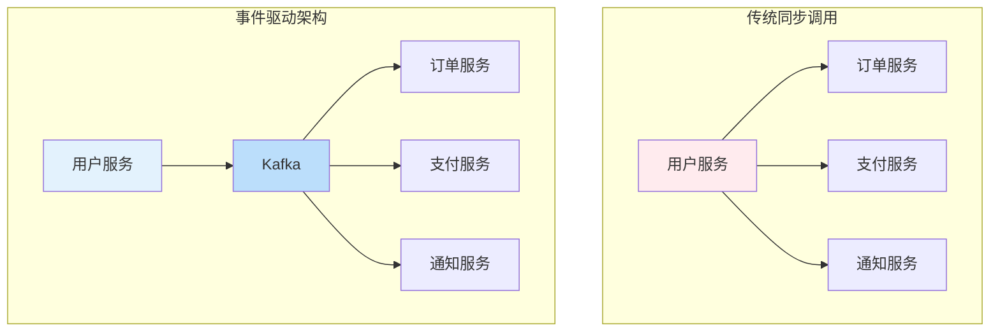
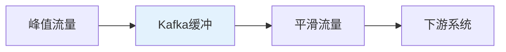
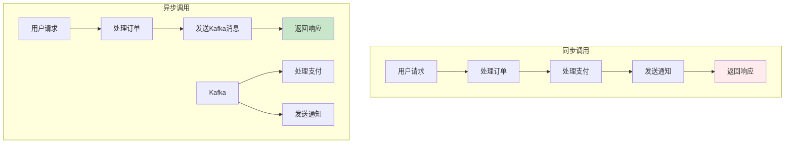
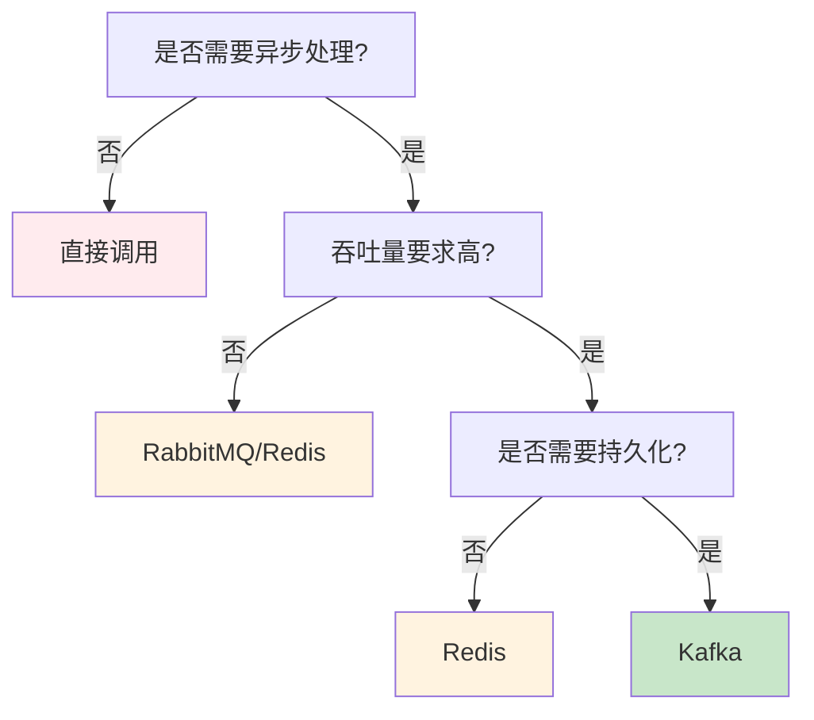
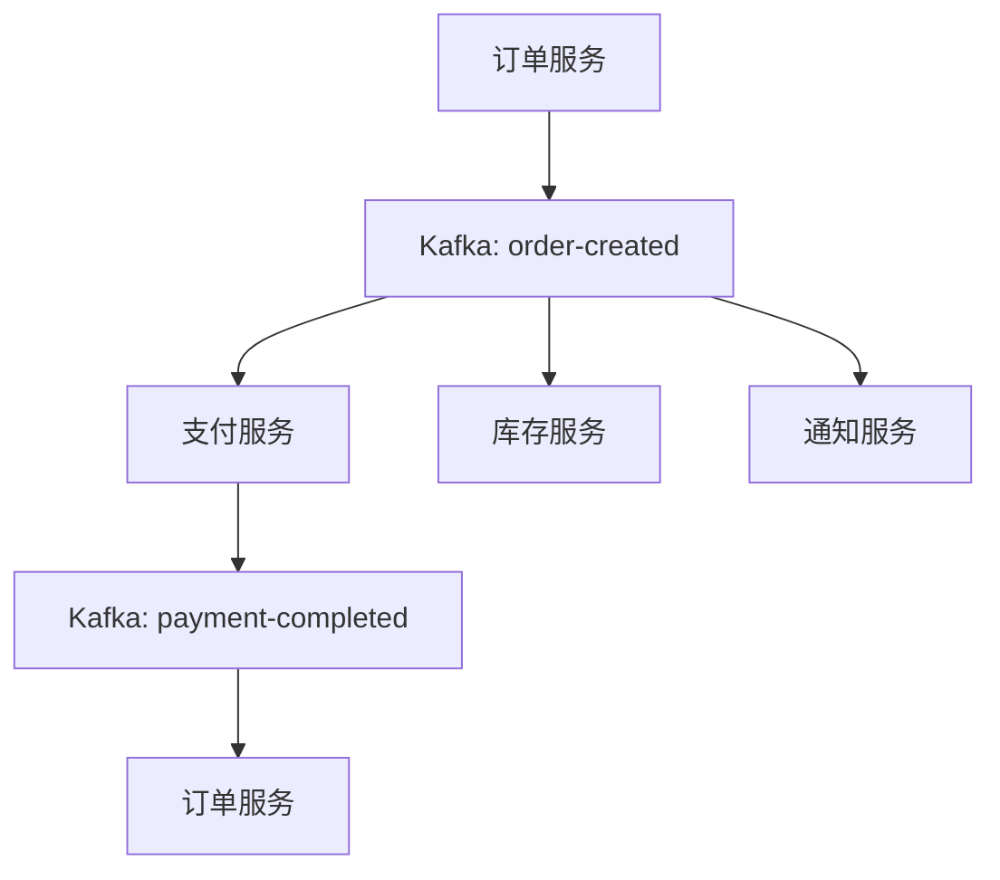

# 为什么系统需要Kafka？架构视角下的消息队列价值

## 情境与背景

在分布式系统设计中，是否需要引入消息队列是一个关键决策。本文从架构视角深入分析为什么Kafka成为现代系统的核心组件，以及它相比直接调用的优势。

## 一、架构演进：从直接调用到消息队列

### 1.1 架构对比

**两种架构模式**：



### 1.2 架构演进历程

**架构演进阶段**：

```yaml
architecture_evolution:
  stage_1:
    name: "单体应用"
    description: "所有功能在一个进程中"
    problem: "扩展性差、维护困难"
    
  stage_2:
    name: "SOA架构"
    description: "服务拆分，同步调用"
    problem: "耦合度高、故障传播"
    
  stage_3:
    name: "微服务架构"
    description: "细粒度服务拆分"
    problem: "服务间通信复杂"
    
  stage_4:
    name: "事件驱动架构"
    description: "异步消息传递"
    solution: "解耦、高可用、弹性扩展"
```

## 二、为什么需要Kafka：核心价值分析

### 2.1 解耦：系统演进的基础

**解耦价值**：

```markdown
## 价值1：解耦

**问题**：
直接调用模式下，生产者必须知道所有消费者的存在，任何消费者变化都会影响生产者。

**解决方案**：
Kafka作为中间层，生产者只需要将消息发送到Kafka，无需关心谁来消费。

**架构对比**：

| 维度 | 直接调用 | Kafka模式 |
|:----:|----------|-----------|
| **耦合度** | 紧耦合 | 松耦合 |
| **依赖关系** | N:N | 1:1:N |
| **变更影响** | 牵一发而动全身 | 独立演进 |
| **技术异构** | 受限 | 自由选择 |

**示例**：
```yaml
before:
  producer: "用户服务"
  consumers:
    - "订单服务"
    - "支付服务"
    - "通知服务"
  problem: "新增/删除服务需要修改用户服务"

after:
  producer: "用户服务"
  broker: "Kafka"
  consumers:
    - "订单服务"
    - "支付服务"
    - "通知服务"
    - "数据分析服务" # 新增无需修改生产者
  benefit: "服务独立演进"
```
```

### 2.2 可靠性：数据不丢失的保障

**可靠性价值**：

```markdown
## 价值2：可靠性

**问题**：
直接调用依赖网络和下游服务可用性，任何环节失败都会导致数据丢失。

**解决方案**：
Kafka持久化消息到磁盘，多副本保证数据不丢失。

**可靠性保障**：

```yaml
reliability_features:
  persistence:
    description: "消息持久化到磁盘"
    mechanism: "顺序写、段文件管理"
    
  replication:
    description: "多副本冗余"
    recommendation: "3副本"
    
  ISR:
    description: "In-Sync Replicas"
    mechanism: "只有同步副本才能成为leader"
    
  acks:
    description: "确认机制"
    production: "acks=all"
```

**对比分析**：

| 场景 | 直接调用 | Kafka |
|:----:|----------|-------|
| **网络故障** | 数据丢失 | 消息持久化 |
| **下游宕机** | 请求失败 | 消息队列缓冲 |
| **服务重启** | 状态丢失 | 从offset恢复 |
| **数据恢复** | 困难 | 从副本恢复 |
```

### 2.3 削峰填谷：系统弹性的关键

**削峰填谷价值**：

```markdown
## 价值3：削峰填谷

**问题**：
直接调用模式下，下游服务必须处理峰值流量，容易被压垮。

**解决方案**：
Kafka作为缓冲层，平滑流量峰值。

**流量模型**：



**场景示例**：

```yaml
scenario:
  event: "电商秒杀"
  peak_traffic: "100,000 QPS"
  downstream_capacity: "10,000 QPS"
  
  without_kafka:
    result: "下游系统崩溃"
    impact: "服务不可用"
    
  with_kafka:
    buffer: "Kafka存储峰值消息"
    processing: "下游系统以10,000 QPS处理"
    result: "系统稳定运行"
```

**配置建议**：

```yaml
kafka_config:
  topic_partitions: 100
  replication_factor: 3
  retention_ms: "86400000" # 24小时
  max_message_bytes: "10485760" # 10MB
```
```

### 2.4 异步通信：提升用户体验

**异步通信价值**：

```markdown
## 价值4：异步通信

**问题**：
同步调用需要等待所有下游服务响应，响应时间长，用户体验差。

**解决方案**：
Kafka实现异步处理，主流程快速响应。

**流程对比**：



**响应时间对比**：

| 流程 | 步骤 | 耗时 |
|:----:|------|------|
| **同步** | 订单+支付+通知 | 500ms+ |
| **异步** | 订单+消息发送 | 100ms |

**场景示例**：

```yaml
user_registration:
  synchronous:
    steps:
      - "验证用户"
      - "创建用户"
      - "发送邮件"
      - "初始化配置"
      - "通知其他服务"
    response_time: "300ms"
    
  asynchronous:
    sync_steps:
      - "验证用户"
      - "创建用户"
    async_steps:
      - "发送邮件"
      - "初始化配置"
      - "通知其他服务"
    response_time: "50ms"
    improvement: "6倍提升"
```
```

### 2.5 扩展性：无限扩展的可能

**扩展性价值**：

```markdown
## 价值5：扩展性

**问题**：
直接调用模式下，扩展需要协调所有服务，复杂且容易出错。

**解决方案**：
Kafka支持水平扩展，生产者和消费者独立扩展。

**扩展模式**：

```yaml
scalability:
  producer_scaling:
    description: "增加生产者实例"
    benefit: "提高消息产生能力"
    
  consumer_scaling:
    description: "增加消费者数量"
    limitation: "不能超过分区数"
    benefit: "提高消息处理能力"
    
  broker_scaling:
    description: "增加Kafka broker"
    benefit: "提高整体吞吐量和可用性"
    
  partition_scaling:
    description: "增加topic分区数"
    consideration: "需要重新分配"
    benefit: "提高并行处理能力"
```

**扩展对比**：

| 维度 | 直接调用 | Kafka |
|:----:|----------|-------|
| **扩展方式** | 垂直扩展 | 水平扩展 |
| **扩展粒度** | 整体扩展 | 独立扩展 |
| **扩展复杂度** | 高 | 低 |
| **扩展上限** | 有限 | 近乎无限 |
```

## 三、Kafka vs 其他方案对比

### 3.1 方案对比

**消息队列对比**：

```yaml
message_queue_comparison:
  kafka:
    use_case:
      - "高吞吐场景"
      - "实时数据处理"
      - "日志收集"
      - "事件驱动架构"
    advantages:
      - "高吞吐量"
      - "低延迟"
      - "持久化"
      - "分布式"
    disadvantages:
      - "配置复杂"
      - "需要维护"
      
  direct_call:
    use_case:
      - "简单同步场景"
      - "强一致性要求"
    advantages:
      - "简单直接"
      - "实时性强"
    disadvantages:
      - "耦合度高"
      - "扩展性差"
      - "可靠性低"
      
  redis:
    use_case:
      - "简单消息队列"
      - "缓存场景"
    advantages:
      - "简单易用"
      - "高性能"
    disadvantages:
      - "消息可能丢失"
      - "持久化有限"
      
  rabbitmq:
    use_case:
      - "任务队列"
      - "RPC通信"
    advantages:
      - "灵活路由"
      - "丰富功能"
    disadvantages:
      - "吞吐量有限"
      - "不适合大数据"
```

### 3.2 选型决策树

**选型决策**：



## 四、生产环境最佳实践

### 4.1 架构设计原则

**架构原则**：

```yaml
architecture_principles:
  single_responsibility:
    description: "每个服务只做一件事"
    application: "生产者负责生产，消费者负责消费"
    
  loose_coupling:
    description: "服务间最小依赖"
    application: "通过Kafka解耦"
    
  high_cohesion:
    description: "相关功能放在一起"
    application: "同类消息放在同一个topic"
    
  event_driven:
    description: "基于事件驱动"
    application: "状态变化发布事件"
    
  resilience:
    description: "故障恢复能力"
    application: "Kafka多副本、消费者重试"
```

### 4.2 配置最佳实践

**Kafka配置**：

```yaml
kafka_production_config:
  broker:
    listeners:
      - "PLAINTEXT://:9092"
      - "SSL://:9093"
    num_partitions: 100
    default_replication_factor: 3
    min_insync_replicas: 2
    unclean_leader_election: false
    log_retention_ms: "604800000" # 7天
    
  producer:
    acks: "all"
    retries: 3
    compression_type: "snappy"
    batch_size: 16384
    linger_ms: 5
    enable_idempotence: true
    
  consumer:
    group_id: "业务场景"
    auto_offset_reset: "latest"
    enable_auto_commit: false
    max_poll_records: 500
    session_timeout_ms: 30000
```

### 4.3 监控告警

**监控配置**：

```yaml
monitoring_config:
  metrics:
    broker:
      - "UnderReplicatedPartitions"
      - "IsrShrinksPerSec"
      - "MessagesInPerSec"
      - "BytesInPerSec"
      
    producer:
      - "record-send-rate"
      - "record-error-rate"
      - "batch-size-avg"
      
    consumer:
      - "records-consumed-rate"
      - "consumer-lag"
      - "commit-rate"
      
  alerts:
    - name: "UnderReplicatedPartitions"
      condition: "value > 0"
      severity: "critical"
      
    - name: "ConsumerLagHigh"
      condition: "value > 10000"
      severity: "critical"
      
    - name: "BrokerUnavailable"
      condition: "count < expected"
      severity: "critical"
```

## 五、实战案例

### 5.1 案例：电商订单系统

**案例描述**：

```markdown
## 案例1：电商订单系统

**问题**：
订单系统直接调用支付、库存、通知服务，耦合度高，扩展性差。

**解决方案**：
引入Kafka实现事件驱动架构。

**架构设计**：



**效果**：
- 服务解耦，独立扩展
- 故障隔离，不影响核心流程
- 异步处理，提升响应速度
- 支持多种消费模式

**配置**：
```yaml
kafka_topics:
  - name: "order-created"
    partitions: 50
    replication_factor: 3
    
  - name: "payment-completed"
    partitions: 30
    replication_factor: 3
```
```

### 5.2 案例：实时数据平台

**案例描述**：

```markdown
## 案例2：实时数据平台

**问题**：
多个数据源需要实时同步到多个下游系统，传统方式难以维护。

**解决方案**：
Kafka作为统一数据总线。

**架构设计**：

```yaml
data_platform:
  sources:
    - "MySQL CDC"
    - "PostgreSQL CDC"
    - "API日志"
    - "传感器数据"
    
  kafka_topics:
    - "mysql-cdc"
    - "pg-cdc"
    - "api-logs"
    - "sensor-data"
    
  consumers:
    - "Elasticsearch"
    - "ClickHouse"
    - "Redis"
    - "Flink实时计算"
```

**效果**：
- 统一数据入口
- 实时数据流转
- 灵活扩展消费端
- 数据复用
```

## 六、面试1分钟精简版（直接背）

**完整版**：

系统需要Kafka主要有以下原因：1. 解耦：生产者和消费者解耦，各自独立演进；2. 可靠性：Kafka持久化消息，保证数据不丢失；3. 削峰填谷：缓冲突发流量，保护下游系统；4. 异步通信：提升主流程响应速度；5. 扩展性：支持多消费组并行消费，灵活扩展。相比直接调用，Kafka提供了更高的可靠性、吞吐量和系统弹性。

**30秒超短版**：

解耦、可靠性、削峰填谷、异步通信、扩展性；Kafka提供高可用高吞吐，相比直接调用优势明显。

## 七、总结

### 7.1 Kafka价值总结

```yaml
kafka_value_summary:
  decoupling:
    description: "解耦生产者和消费者"
    benefit: "独立演进、技术异构"
    
  reliability:
    description: "消息持久化和多副本"
    benefit: "数据不丢失、故障恢复"
    
  peak_shaving:
    description: "缓冲流量峰值"
    benefit: "系统保护、弹性伸缩"
    
  async_communication:
    description: "异步处理任务"
    benefit: "响应更快、用户体验提升"
    
  scalability:
    description: "水平扩展能力"
    benefit: "无限扩展、高吞吐量"
```

### 7.2 最佳实践清单

```yaml
best_practices:
  architecture:
    - "使用事件驱动架构"
    - "服务间通过Kafka通信"
    - "单一职责原则"
    
  kafka_config:
    - "使用3副本"
    - "合理设置分区数"
    - "acks=all保证可靠性"
    
  monitoring:
    - "监控broker状态"
    - "监控consumer lag"
    - "设置告警规则"
    
  operations:
    - "定期备份"
    - "滚动升级"
    - "灾难恢复演练"
```

### 7.3 记忆口诀

```
系统为何需要Kafka，五大价值要牢记，
解耦演进更自由，可靠不丢数据，
削峰填谷稳系统，异步提升响应速，
扩展无限能力强，架构优化好帮手。
```

> **参考链接**：[SRE运维面试题全解析：从理论到实践（第二部分）]()