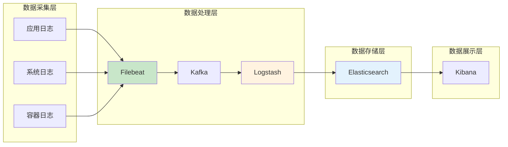
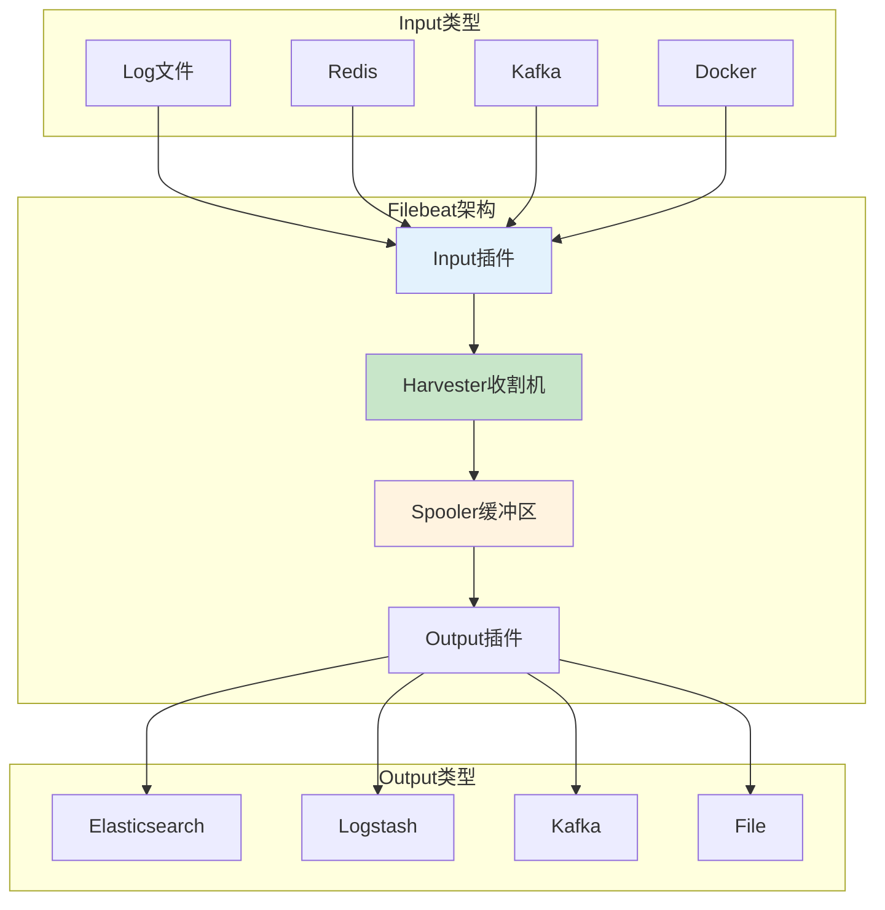
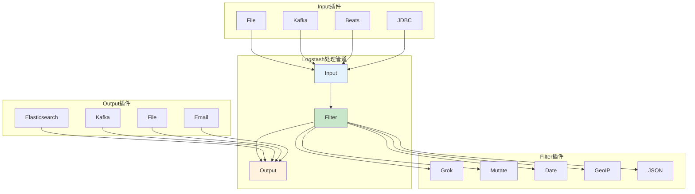
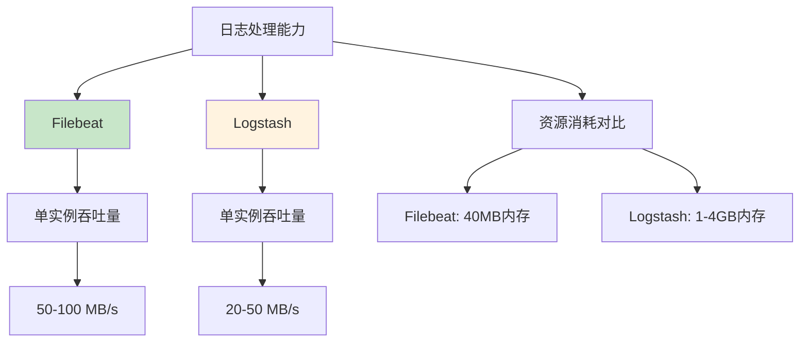
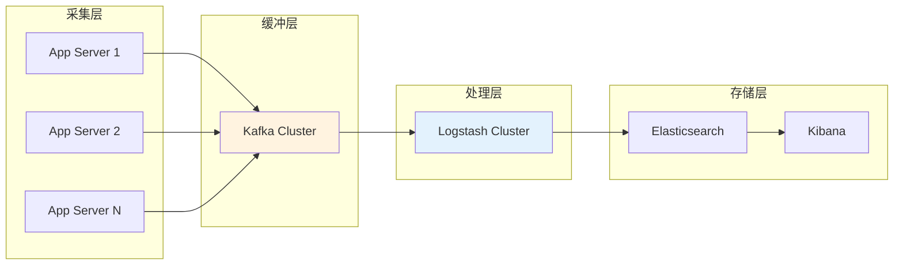

# Filebeat与Logstash对比分析：ELK日志收集架构最佳实践

## 情境与背景

在现代分布式系统中，日志收集与分析是保障业务稳定运行的关键能力。ELK（Elasticsearch、Logstash、Kibana）技术栈是日志处理领域最成熟的解决方案之一，而Filebeat和Logstash作为ELK的核心组件，承担着日志采集与处理的重任。

理解两者的定位差异和使用场景，是构建高效、可靠日志系统的基础。作为高级DevOps/SRE工程师，掌握Filebeat与Logstash的选型和配置，是必备的核心技能。**两者是互补关系：Filebeat负责轻量级采集，Logstash负责复杂处理，联合使用才能发挥ELK的最大价值。**

## 一、ELK技术栈概述

### 1.1 ELK组件架构



### 1.2 组件职责

| 组件 | 职责 | 特点 |
|:----:|------|------|
| **Filebeat** | 日志采集 | 轻量、低资源占用、靠近日志源 |
| **Logstash** | 日志处理 | 功能强大、插件丰富、集中处理 |
| **Elasticsearch** | 数据存储 | 分布式搜索、高性能、实时索引 |
| **Kibana** | 数据可视化 | Web界面、仪表盘、查询分析 |

## 二、Filebeat详解

### 2.1 Filebeat是什么

Filebeat是Elastic官方开发的轻量级日志采集器，用Go语言编写，单进程内存占用仅约40MB。**Filebeat设计目标是用最少的资源完成可靠的日志采集，通过backpressure机制避免数据丢失。**



### 2.2 Filebeat核心概念

| 概念 | 说明 | 作用 |
|:----:|------|------|
| **Harvester** | 收割机，负责读取单个文件 | 逐行读取日志文件内容 |
| **Input** | 输入源配置 | 定义日志来源（文件/Redis/Kafka等） |
| **Spooler** | 缓冲区，负责批量发送 | 缓冲数据，backpressure控制 |
| **Registrar** | 注册表，记录消费位置 | 记录已读取文件位置，确保不重复 |
| **Module** | 预配置方案 | 官方提供的Nginx、MySQL等日志配置 |

### 2.3 Filebeat配置示例

```yaml
# filebeat.yml
filebeat.inputs:
  - type: log
    enabled: true
    paths:
      - /var/log/*.log
      - /var/log/nginx/*.log
    multiline.pattern: '^[0-9]{4}-[0-9]{2}-[0-9]{2}'
    multiline.negate: true
    multiline.match: after
    fields:
      service: myapp
      environment: production

  - type: docker
    containers.paths:
      - /var/lib/docker/containers/*/*.log
    containers.ids:
      - '*'

processors:
  - add_host_metadata:
      when.not.contains.tags: forwarded
  - add_docker_metadata: ~
  - decode_json_fields:
      fields: ["message"]
      target: ""
      overwrite_keys: true
      add_error_key: true

output.kafka:
  hosts: ["kafka1:9092", "kafka2:9092"]
  topic: 'logs-%{[fields.service]}'
  partition.round_robin:
    reachable_only: false
  required_acks: 1
  compression: gzip
  max_message_bytes: 1048576

logging.level: info
logging.to_files: true
logging.files:
  path: /var/log/filebeat
  name: filebeat
  keepfiles: 7
  permissions: 0644
```

## 三、Logstash详解

### 3.1 Logstash是什么

Logstash是ELK技术栈中的数据处理引擎，用JRuby编写，运行在JVM上。**Logstash提供了丰富的Input/Filter/Output插件，能够完成复杂的数据采集、解析、转换和输出任务。**



### 3.2 Logstash核心概念

| 概念 | 说明 | 作用 |
|:----:|------|------|
| **Pipeline** | 管道 | 完整的处理流程，包含Input/Filter/Output |
| **Event** | 事件 | 处理的基本单元，类似日志条目 |
| **Plugin** | 插件 | Input/Filter/Output的功能扩展 |
| **Worker** | 工作线程 | 并行处理的数量 |
| **Queue** | 队列 | 内存/磁盘队列缓冲 |

### 3.3 Logstash配置示例

```ruby
# pipeline.conf
input {
  kafka {
    bootstrap_servers => "kafka1:9092,kafka2:9092"
    topics => ["logs-*"]
    group_id => "logstash-consumer"
    codec => json
    decorate_events => true
  }

  beats {
    port => 5044
    ssl => true
    ssl_certificate => "/etc/logstash/certs/logstash.crt"
    ssl_key => "/etc/logstash/certs/logstash.key"
  }
}

filter {
  if [fields][service] == "nginx" {
    grok {
      match => {
        "message" => '%{IPORHOST:[nginx][client_ip]} - %{DATA:[nginx][user]} \[%{HTTPDATE:[nginx][timestamp]}\] "%{WORD:[nginx][method]} %{URIPATHPARAM:[nginx][uri]} HTTP/%{NUMBER:[nginx][http_version]}" %{NUMBER:[nginx][status]} %{NUMBER:[nginx][body_bytes]} "%{DATA:[nginx][referrer]}" "%{DATA:[nginx][agent]}"'
      }
      remove_field => "message"
    }

    mutate {
      convert => {
        "[nginx][status]" => "integer"
        "[nginx][body_bytes]" => "integer"
      }
    }

    date {
      match => ["[nginx][timestamp]", "dd/MMM/yyyy:HH:mm:ss Z"]
      target => "@timestamp"
    }

    geoip {
      source => "[nginx][client_ip]"
      target => "[nginx][geoip]"
      database => "/etc/logstash/GeoLite2-City.mmdb"
    }
  }

  if [fields][service] == "application" {
    json {
      source => "message"
      target => "parsed"
    }

    mutate {
      rename => {
        "[parsed][level]" => "[log][level]"
        "[parsed][message]" => "[log][message]"
        "[parsed][trace_id]" => "[trace][id]"
      }
      remove_field => ["parsed", "message"]
    }
  }

  mutate {
    add_field => {
      "[@metadata][index_prefix]" => "logs-%{+YYYY.MM.dd}"
    }
  }
}

output {
  elasticsearch {
    hosts => ["es1:9200", "es2:9200", "es3:9200"]
    manage_template => false
    index => "%{[@metadata][index_prefix]}"
    document_type => "_doc"
    action => "index"
    sniffing => true
    pool_max => 50
    pool_max_per_route => 25
  }

  kafka {
    bootstrap_servers => "kafka1:9092,kafka2:9092"
    topic_id => "logs-processed"
    codec => json
    compression => "snappy"
  }

  if "ERROR" in [log][level] {
    email {
      to => "oncall@example.com"
      from => "logstash-alert@example.com"
      subject => "Error Alert: %{[log][message]}"
      via => "smtp"
      options => {
        address => "smtp.example.com"
        port => 587
        enable_starttls_auto => true
      }
    }
  }

  stdout {
    codec => rubydebug
  }
}
```

## 四、Filebeat与Logstash对比

### 4.1 核心维度对比

| 对比维度 | Filebeat | Logstash | 说明 |
|:--------:|----------|----------|------|
| **开发语言** | Go | JRuby(JVM) | Go更轻量，JVM更重量 |
| **内存占用** | ~40MB | 1GB+ | 资源消耗差异显著 |
| **启动时间** | 秒级 | 十秒级 | 紧急场景响应差异 |
| **配置语法** | YAML | DSL(Ruby) | YAML更易读 |
| **插件数量** | 有限 | 丰富 | Logstash插件生态更完整 |
| **数据处理** | 基础过滤 | 复杂转换 | 功能深度差异 |
| **部署模式** | 分散部署 | 集中部署 | 架构设计差异 |
| **可靠性** | 高 | 高 | 两者都支持数据持久化 |
| **监控指标** | 丰富 | 中等 | Filebeat监控更完善 |

### 4.2 性能对比



### 4.3 选型决策树

```mermaid
flowchart TB
    A["日志处理需求"] --> B{"是否需要复杂解析?"}
    B -->|是| C["Logstash"]
    B -->|否| D{"日志量大吗?"}
    D -->|是| E{"需要多输出吗?"}
    D -->|否| F["Filebeat"]
    E -->|是| G["Filebeat + Logstash"]
    E -->|否| H["Filebeat + Kafka"]
    C --> I["是否需要横向扩展?"}
    I -->|是| J["Logstash集群"]
    I -->|否| K["单节点Logstash"]

    style C fill:#fff3e0
    style G fill:#e3f2fd
    style F fill:#c8e6c9
```

## 五、生产环境最佳实践

### 5.1 架构模式选择

**模式一：Filebeat + Kafka + Logstash（推荐大型生产环境）**



| 优势 | 说明 |
|------|------|
| **解耦** | 日志采集与处理分离，互不影响 |
| **削峰填谷** | Kafka缓冲突发流量 |
| **可靠传输** | Kafka持久化保证数据不丢失 |
| **灵活扩展** | 独立扩展采集和处理层 |

**模式二：Filebeat直连Logstash（中小型环境）**


| 适用场景 | 说明 |
|----------|------|
| **小型集群** | 少于10台服务器 |
| **简单日志** | 无需复杂解析 |
| **低延迟要求** | 实时性要求高 |
| **资源受限** | 无法部署Kafka |

**模式三：Filebeat直连Elasticsearch（极简场景）**


| 适用场景 | 说明 |
|----------|------|
| **测试环境** | 快速验证 |
| **单一日志格式** | Nginx、Systemd等官方Module |
| **资源敏感** | 最小化组件 |

### 5.2 Filebeat最佳实践

**K8s环境部署配置**

```yaml
# filebeat-kubernetes.yaml
apiVersion: v1
kind: ConfigMap
metadata:
  name: filebeat-config
  namespace: logging
data:
  filebeat.yml: |
    filebeat.inputs:
      - type: container
        paths:
          - /var/log/containers/*.log
        processors:
          - add_kubernetes_metadata:
              host: ${NODE_NAME}
              matchers:
                - logs_path:
                    logs_path: "/var/log/containers/"

    processors:
      - add_host_metadata:
          when.not.contains.tags: forwarded
      - add_cloud_metadata: ~
      - add_docker_metadata: ~

    output.elasticsearch:
      hosts: ['${ELASTICSEARCH_HOST:elasticsearch}:${ELASTICSEARCH_PORT:9200}']
      index: "filebeat-%{[agent.version]}-%{+yyyy.MM.dd}"

    setup.kibana:
      host: '${KIBANA_HOST:kibana}:${KIBANA_PORT:5601}'

    setup.ilm.enabled: auto
    setup.ilm.rollover_alias: "filebeat"
    setup.ilm.pattern: "{now/d}-000001"
    setup.ilm.policy_name: "filebeat-policy"
---
apiVersion: apps/v1
kind: DaemonSet
metadata:
  name: filebeat
  namespace: logging
spec:
  selector:
    matchLabels:
      app: filebeat
  template:
    metadata:
      labels:
        app: filebeat
    spec:
      serviceAccountName: filebeat
      terminationGracePeriodSeconds: 30
      hostNetwork: true
      dnsPolicy: ClusterFirstWithHostNet
      containers:
        - name: filebeat
          image: docker.elastic.co/beats/filebeat:8.12.0
          args:
            - -c
            - /etc/filebeat.yml
            - -e
          env:
            - name: NODE_NAME
              valueFrom:
                fieldRef:
                  fieldPath: spec.nodeName
          securityContext:
            runAsUser: 0
          resources:
            requests:
              cpu: 100m
              memory: 128Mi
            limits:
              cpu: 1000m
              memory: 512Mi
          volumeMounts:
            - name: config
              mountPath: /etc/filebeat.yml
              readOnly: true
              subPath: filebeat.yml
            - name: data
              mountPath: /usr/share/filebeat/data
            - name: varlogcontainers
              mountPath: /var/log/containers
              readOnly: true
            - name: varlogpods
              mountPath: /var/log/pods
              readOnly: true
            - name: varlibdockercontainers
              mountPath: /var/lib/docker/containers
              readOnly: true
      volumes:
        - name: config
          configMap:
            defaultMode: 0640
            name: filebeat-config
        - name: varlogcontainers
          hostPath:
            path: /var/log/containers
        - name: varlogpods
          hostPath:
            path: /var/log/pods
        - name: varlibdockercontainers
          hostPath:
            path: /var/lib/docker/containers
        - name: data
          emptyDir: {}
```

**Filebeat Module使用**

```yaml
# 启用官方Module，自动解析Nginx日志
filebeat.modules:
  - module: nginx
    access:
      enabled: true
      var.paths: ["/var/log/nginx/access.log*"]
    error:
      enabled: true
      var.paths: ["/var/log/nginx/error.log*"]

  - module: system
    syslog:
      enabled: true
    auth:
      enabled: true

  - module: docker
    enabled: true
    containers:
      path: /var/lib/docker/containers
      stream: all
```

### 5.3 Logstash最佳实践

**JVM调优配置**

```bash
# jvm.options
-Xms4g
-Xmx4g
-XX:+UseG1GC
-XX:MaxGCPauseMillis=500
-XX:+PrintGCTimeStamps
-XX:+PrintGCDateStostamps
-XX:+PrintTenuringDistribution
-XX:NumberOfGCLogFiles=10
-XX:+UseGCLogFileRotation
-Xloggc:/var/log/logstash/gc.log

# 关闭JMX远程监控（生产环境）
-Dcom.sun.management.jmxremote=false
```

**Pipeline并发优化**

```ruby
# pipelines.yml
- pipeline.id: main
  path.config: "/etc/logstash/pipelines/main/*.conf"
  pipeline.workers: 4
  pipeline.batch.size: 125
  pipeline.batch.delay: 50

- pipeline.id: slow-logs
  path.config: "/etc/logstash/pipelines/slow/*.conf"
  pipeline.workers: 2
  pipeline.batch.size: 50
  queue.type: persisted
  queue.max_bytes: 1gb
```

**内存管道配置**

```ruby
# pipeline.conf
pipeline {
  workers: 4
  batch_size: 125
  batch_delay: 50
}

# 启用持久化队列，防止数据丢失
queue {
  type => persisted
  path => "/var/lib/logstash/queue"
  capacity {
    max_bytes => 10gb
    max_events => 0
  }
}
```

### 5.4 Kafka缓冲配置

**Kafka主题配置**

```bash
# 创建日志主题
kafka-topics.sh --create \
  --bootstrap-server kafka1:9092,kafka2:9092 \
  --topic logs-raw \
  --partitions 12 \
  --replication-factor 2 \
  --config retention.ms=604800000 \
  --config max.message.bytes=10485760

# 配置保留策略
kafka-topics.sh --alter \
  --topic logs-raw \
  --bootstrap-server kafka1:9092,kafka2:9092 \
  --add-config cleanup.policy=delete,retention.ms=604800000
```

### 5.5 故障排查

**Filebeat排查命令**

```bash
# 测试配置
filebeat test config -c /etc/filebeat/filebeat.yml

# 查看采集状态
filebeat -e -d "*"  # 调试模式运行

# 查看Harvester状态
GET _nodes/<node_id>/stats/fs?pretty  # 通过Elasticsearch API

# 检查registrar状态
filebeat export registry --dir=/var/lib/filebeat/registry

# 监控日志采集
filebeat监控 API: GET /_node/stats?pretty
```

**Logstash排查命令**

```bash
# 测试配置语法
/usr/share/logstash/bin/logstash --config.test_and_exit -f /etc/logstash/pipeline.conf

# 调试模式运行
/usr/share/logstash/bin/logstash --debug -f /etc/logstash/pipeline.conf

# 查看JVM状态
jstat -gcutil <pid> 1000 10

# 线程dump
jstack <pid> > /tmp/logstash-threaddump.txt

# GC日志分析
gceasy.io 分析gc.log
```

**常见问题与解决**

| 问题现象 | 可能原因 | 解决方案 |
|---------|---------|---------|
| **Filebeat CPU 100%** | multiline处理大文件 | 分割日志文件，调整multiline.size |
| **Logstash处理延迟** | JVM内存不足 | 增加-Xms/-Xmx，优化pipeline.workers |
| **Kafka消费积压** | Logstash消费能力不足 | 增加Logstash实例，调整batch_size |
| **Elasticsearch写入慢** | 索引mapping不合理 | 优化mapping，关闭_source存储 |
| **数据丢失** | Registrar未持久化 | 配置filebeat数据目录为持久化存储 |
| **重复数据** | at-least-once语义 | 使用fingerprint或document_id去重 |

### 5.6 监控告警

**Filebeat监控指标**

```yaml
# filebeat监控配置
filebeat.metrics:
  enabled: true
  # 报告间隔
  period: 30s

# 通过Elasticsearch监控
GET /_nodes/<node_id>/stats/filebeat?pretty
```

| 指标 | 说明 | 告警阈值 |
|------|------|----------|
| **beat.filebeat.harvester.running** | 运行中的Harvester数 | - |
| **beat.filebeat.harvester.skipped** | 跳过的文件数 | > 0 |
| **beat.output.write.bytes** | 输出字节数 | - |
| **beat.pipeline.events.failed** | 处理失败事件数 | > 0 |
| **beat.pipeline.events.total** | 总事件数 | - |

**Logstash监控指标**

```json
# Logstash API
GET /_node/stats/pipeline?pretty
GET /_node/stats/jvm?pretty

# 关键指标
{
  "pipeline": {
    "events": {
      "duration_in_millis": 1250,
      "in": 1000,
      "out": 998,
      "filtered": 998
    },
    "queue": {
      "capacity": {
        "queue_size_in_bytes": 1073741824,
        "max_queue_size_in_bytes": 10737418240
      }
    }
  },
  "jvm": {
    "mem": {
      "heap_used_in_bytes": 2143000000,
      "heap_max_in_bytes": 4290000000
    }
  }
}
```

## 六、面试精简版

### 6.1 一分钟版本

Filebeat和Logstash是ELK日志系统的两个核心组件，定位不同：Filebeat是轻量级日志采集器，用Go编写，资源消耗低（约40MB内存），负责从日志源采集数据、做基本过滤和多行合并，适合大规模分散部署在每台主机上；Logstash是重量级日志处理管道，用JVM运行，功能强大，支持丰富的Input/Filter/Output插件，能做复杂的数据解析、转换和富化，适合集中部署做复杂处理。生产环境最佳实践是Filebeat负责采集，通过Kafka缓冲后，Logstash做集中处理，最后写入Elasticsearch。

### 6.2 记忆口诀

```
日志采集选Filebeat，轻量低耗Go语言；
日志处理选Logstash，插件丰富JVM跑；
量大轻量Filebeat，复杂解析Logstash；
生产架构Kafka解耦，采集处理分离跑。
```

### 6.3 关键词速记

| 关键词 | 说明 |
|:------:|------|
| **Harvester** | Filebeat读取器 |
| **Registrar** | Filebeat位置记录 |
| **Pipeline** | Logstash处理管道 |
| **backpressure** | 反压机制 |
| **Module** | Filebeat预配置方案 |

> **参考链接**：[SRE运维面试题全解析：从理论到实践（第三部分）]()