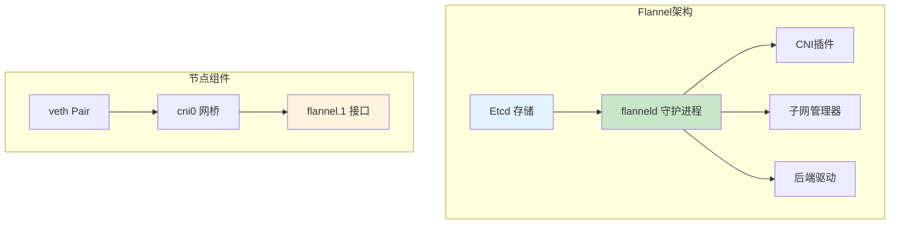
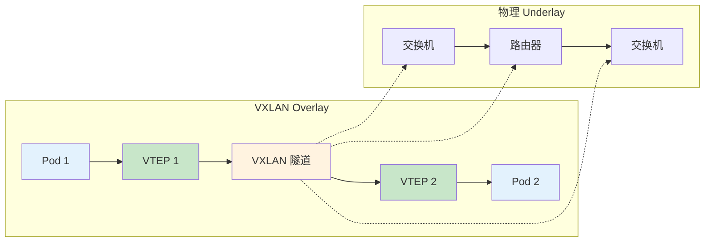
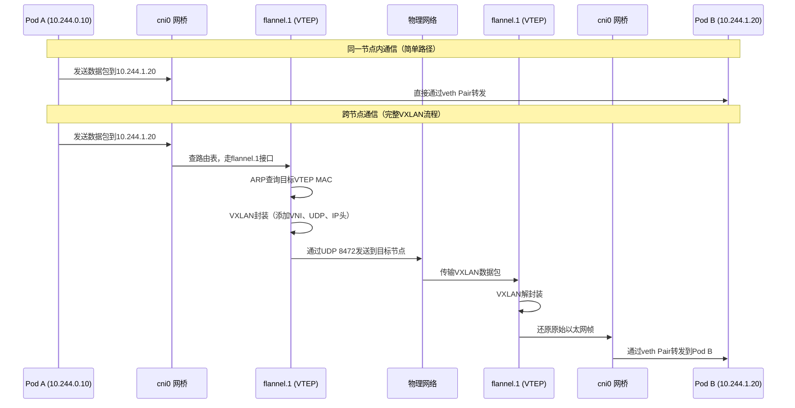

# Kubernetes网络Flannel与VXLAN详解：从原理到生产环境实践

## 情境与背景

在Kubernetes集群中，Pod之间的跨节点网络通信是云原生架构的核心基础设施。Flannel作为最广泛使用的CNI（容器网络接口）插件之一，为K8s提供了简单而强大的网络解决方案。而VXLAN（Virtual Extensible LAN）则是Flannel在生产环境中最常用的后端模式，它通过在三层网络上构建二层overlay网络，实现了大规模容器网络的灵活扩展。

作为高级DevOps/SRE工程师，深入理解Flannel和VXLAN的工作原理，对于设计高性能、高可用的K8s网络架构至关重要。本文将从原理出发，结合生产环境最佳实践，帮助你全面掌握这一核心技术。

## 一、Flannel概述

### 1.1 Flannel是什么

Flannel是CoreOS开发的Kubernetes网络插件，专为K8s集群提供跨节点Pod网络通信能力。**Flannel不依赖底层物理网络细节，而是在现有网络之上构建一层overlay网络，实现Pod IP的全局唯一和跨节点通信。**

Flannel的核心功能：

| 功能 | 说明 |
|:----:|------|
| **子网分配** | 为每个节点分配唯一的Pod CIDR |
| **网络封装** | 支持多种后端（VXLAN、host-gw、udp等） |
| **拓扑发现** | 维护全集群的节点和子网信息 |
| **路由同步** | 将路由信息同步到各节点内核 |

### 1.2 Flannel架构组件



**核心组件说明**：

| 组件 | 作用 | 位置 |
|:----:|------|------|
| **flanneld** | 主守护进程，负责子网分配和网络封装 | 每节点部署 |
| **Etcd** | 存储集群网络配置和拓扑信息 | K8s master节点 |
| **cni0** | 网桥设备，连接本地Pod | 每节点 |
| **flannel.1** | VTEP设备，执行VXLAN封装/解封装 | 每节点 |

### 1.3 Flannel后端类型

| 后端类型 | 原理 | 适用场景 | 性能 |
|:--------:|------|----------|:----:|
| **VXLAN** | UDP隧道封装 | 生产环境推荐 | 高 |
| **host-gw** | 直接路由 | 同二层网络 | 最高 |
| **udp** | 用户态封装 | 内核不支持VXLAN | 低 |
| **aws-vpc** | AWS VPC路由 | AWS云环境 | 高 |
| **gce** | GCP路由 | GCP云环境 | 高 |

## 二、VXLAN技术详解

### 2.1 VXLAN是什么

VXLAN（Virtual Extensible LAN）是一种网络虚拟化技术，最初由VMware、Cisco等厂商提出，现已成为RFC 7348标准。**VXLAN在三层IP网络上构建二层overlay网络，通过24bit VNI（VXLAN Network Identifier）支持1600万个虚拟网络隔离。**



### 2.2 VXLAN核心概念

| 概念 | 说明 | 在Flannel中对应 |
|:----:|------|----------------|
| **VTEP** | VXLAN Tunnel End Point，隧道端点 | flannel.1接口 |
| **VNI** | VXLAN Network Identifier，24bit网络标识 | Flannel的Network ID |
| **NVE** | Network Virtualization Endpoint | flanneld进程 |
| **BD** | Bridge Domain，广播域 | Pod子网 |
| **UDP 8472** | VXLAN默认端口 | Flannel通信端口 |

### 2.3 VXLAN数据包封装格式


| 层次 | 头部字段 | 大小 | 说明 |
|:----:|---------|:----:|------|
| **最内层** | 原始L2帧 | 可变 | Pod发出的以太网帧（含MAC、IP、TCP等） |
| **VXLAN头** | Flags | 8bit | I flag必须设为1 |
| | Reserved | 24bit | 保留字段，置0 |
| | VNI | 24bit | 虚拟网络标识，Flannel使用全局唯一值 |
| **UDP头** | 源端口 | 16bit | 随机生成（ECMP负载均衡用） |
| | 目的端口 | 16bit | 固定8472 |
| **IP头** | 源IP | 32bit | 源VTEP节点IP |
| | 目的IP | 32bit | 目标VTEP节点IP |
| **最外层** | Ethernet | 可变 | 物理网络封装（含物理MAC） |

## 三、Flannel VXLAN通信过程详解

### 3.1 完整通信流程



### 3.2 各阶段详细说明

**阶段1：子网分配（节点初始化时）**

| 步骤 | 操作 | 说明 |
|:----:|------|------|
| 1 | flanneld从Etcd申请子网 | 节点加入集群时自动分配 |
| 2 | flanneld创建flannel.1接口 | 类型为VXLAN（Type 3） |
| 3 | flanneld配置路由表 | 添加到其他节点子网的路由 |
| 4 | flanneld同步ARP表 | 缓存目标VTEP的MAC和IP映射 |
| 5 | flanneld通知CNI插件 | 更新CNI配置 |

**阶段2：同节点Pod通信（节点内）**


| 特点 | 说明 |
|:----:|------|
| **不经过flannel.1** | 同节点通信直接走cni0网桥 |
| **无封装开销** | 直接通过veth Pair转发 |
| **性能损耗** | 基本等同于本地网络 |

**阶段3：跨节点Pod通信（VXLAN隧道）**

| 步骤 | 源节点操作 | 目标节点操作 |
|:----:|-----------|-------------|
| 1 | Pod A发送IP包到Pod B | - |
| 2 | veth Pair将包送到cni0 | - |
| 3 | cni0查路由表，发现目标IP不在本地子网 | - |
| 4 | 路由匹配到flannel.1接口 | - |
| 5 | 内核将包交给flannel.1（VTEP） | - |
| 6 | VTEP查ARP表获取目标VTEP信息 | - |
| 7 | VTEP执行VXLAN封装 | - |
| 8 | 通过UDP 8472发送 | 接收UDP 8472数据 |
| 9 | - | VTEP解封装VXLAN头部 |
| 10 | - | 还原原始以太网帧 |
| 11 | - | 交给cni0网桥 |
| 12 | - | 通过veth Pair发送到Pod B |

### 3.3 关键数据结构

**路由表示例（节点A：10.244.0.0/24）**

```bash
# 内核路由表
[root@node-a ~]# ip route
10.244.0.0/24 dev cni0 proto kernel scope link src 10.244.0.1
10.244.1.0/24 via 10.244.1.0 dev flannel.1 onlink
10.244.2.0/24 via 10.244.2.0 dev flannel.1 onlink

# flannel.1接口信息
[root@node-a ~]# ip -d link show flannel.1
4: flannel.1: <BROADCAST,MULTICAST,UP,LOWER_UP> mtu 1450 qdisc noqueue
    link/ether 8e:8f:4a:3b:1c:2d brd ff:ff:ff:ff:ff:ff
    vxlan id 1 local 192.168.1.10 dev eth0 port 4789 4789 6784
```

**ARP表示例（VTEP映射）**

```bash
# VTEP ARP表
[root@node-a ~]# ip neigh show dev flannel.1
10.244.1.0 lladdr 5a:5f:2a:4c:3d:1e STALE    # 目标VTEP MAC
10.244.2.0 lladdr 7b:6d:3f:5a:2c:4f STALE    # 目标VTEP MAC

# FDB表（转发数据库）
[root@node-a ~]# bridge fdb show dev flannel.1
5a:5f:2a:4c:3d:1e dst 192.168.1.11 self       # 目标VTEP IP映射
7b:6d:3f:5a:2c:4f dst 192.168.1.12 self       # 目标VTEP IP映射
```

## 四、生产环境最佳实践

### 4.1 网络规划

**子网划分策略**

| 规划项 | 建议 | 说明 |
|:------:|------|------|
| **Pod CIDR大小** | /16或/12 | 每个节点分配/24，保证足够扩展性 |
| **节点数量规划** | 提前规划100+节点规模 | 避免后期子网冲突 |
| **服务网段隔离** | 与Pod网段分开 | 建议10.96.0.0/12用于Service |
| **保留地址** | 开头结尾各留一段 | 防止特殊用途冲突 |

```yaml
# Flannel网络配置示例
net-conf.json: |
  {
    "Network": "10.244.0.0/16",
    "SubnetLen": 24,
    "Backend": {
      "Type": "vxlan",
      "VNI": 1,
      "Port": 8472
    }
  }
```

### 4.2 性能优化

**MTU优化**

| 配置项 | 推荐值 | 说明 |
|:------:|:------:|------|
| **物理网卡MTU** | 1500 | 标准以太网MTU |
| **flannel.1 MTU** | 1450 | 1500 - 50(VXLAN开销) |
| **Pod veth MTU** | 1450 | 与flannel.1保持一致 |
| **容器内MTU** | 1400 | 留出HTTP/TCP头部空间 |

```bash
# 检查MTU配置
ip link show flannel.1
ethtool -k flannel.1 | grep tso

# 开启TSO/GSO优化
ethtool -K flannel.1 tso on gso on
```

**UDP缓冲调优**

```bash
# 增加UDP buffer大小
sysctl -w net.core.rmem_max=16777216
sysctl -w net.core.rmem_default=16777216
sysctl -w net.core.wmem_max=16777216
sysctl -w net.core.wmem_default=16777216

# 写入/etc/sysctl.conf永久生效
cat >> /etc/sysctl.conf << EOF
net.core.rmem_max=16777216
net.core.rmem_default=16777216
net.core.wmem_max=16777216
net.core.wmem_default=16777216
EOF
```

### 4.3 安全加固

**防火墙规则配置**

```bash
# 开放Flannel VXLAN端口（UDP 8472）
# 在所有K8s节点上执行
firewall-cmd --permanent --add-port=8472/udp
firewall-cmd --reload

# iptables规则示例（iptables场景）
iptables -A INPUT -p udp --dport 8472 -s <pod-cidr> -j ACCEPT
iptables -A INPUT -p udp --dport 8472 -s <node-cidr> -j ACCEPT
iptables -A INPUT -p udp --dport 8472 -j DROP
```

**网络策略隔离**

```yaml
apiVersion: networking.k8s.io/v1
kind: NetworkPolicy
metadata:
  name: backend-network-policy
  namespace: production
spec:
  podSelector:
    matchLabels:
      app: backend
  policyTypes:
  - Ingress
  - Egress
  ingress:
  - from:
    - podSelector:
        matchLabels:
          app: frontend
    ports:
    - protocol: TCP
      port: 8080
  egress:
  - to:
    - podSelector:
        matchLabels:
          app: database
    ports:
    - protocol: TCP
      port: 5432
```

### 4.4 故障排查

**常见问题排查命令**

| 问题 | 排查命令 | 预期结果 |
|------|----------|----------|
| **VTEP不通** | `ping -I flannel.1 <target-pod-ip>` | 应能ping通 |
| **UDP通道** | `tcpdump -i flannel.1 udp port 8472` | 应有数据包 |
| **路由表** | `ip route show` | 应有flannel.1路由 |
| **ARP表** | `ip neigh show dev flannel.1` | 应有目标VTEP |
| **FDB表** | `bridge fdb show dev flannel.1` | 应有目标MAC |

**VXLAN封装问题排查**

```bash
# 1. 检查flanneld进程状态
systemctl status flanneld

# 2. 检查flannel.1接口
ip link show flannel.1
ip addr show flannel.1

# 3. 检查VXLAN统计
ip -s link show flannel.1

# 4. 抓包分析VXLAN封装
tcpdump -i eth0 udp port 8472 -nn

# 5. 检查Etcd中的网络配置
etcdctl get /coreos.com/network/subnets/$(hostname)

# 6. 检查内核VXLAN模块
modprobe vxlan
lsmod | grep vxlan
```

**典型故障案例**

| 故障现象 | 可能原因 | 解决方案 |
|---------|---------|---------|
| Pod之间ping不通 | flanneld未运行 | 重启flanneld服务 |
| 跨节点不通，同节点通 | VTEP MAC未学习 | 检查FDB表 |
| 大量丢包 | MTU不匹配 | 统一MTU配置 |
| UDP端口不通 | 防火墙未开放 | 开放8472/udp端口 |
| flannel.1不存在 | CNI配置错误 | 检查CNI配置文件 |

### 4.5 监控告警

**关键监控指标**

| 指标 | 获取方式 | 告警阈值 |
|------|---------|----------|
| **flannel.1流量** | `ip -s link show flannel.1` | 带宽>80% |
| **VXLAN封装错误** | `ip -s -s link show flannel.1` | errors > 0 |
| **UDP buffer使用** | `ss -s` | > 80% |
| **VTEP邻居数** | `ip neigh show dev flannel.1 | wc -l` | < 预期节点数 |
| **flanneld重启** | systemd监控 | 任何重启触发告警 |

**Prometheus监控配置**

```yaml
# flannel网络监控指标
- job_name: 'kubernetes-network'
  kubernetes_sd_configs:
  - role: node
  relabel_configs:
  - source_labels: [__address__]
    regex: '(.*):10250'
    replacement: '${1}:9100'
    target_label: __metrics_path__
    metric_relabel_configs:
    - source_labels: [__name__]
      regex: 'node_network_receive_bytes_total|node_network_transmit_bytes_total'
      action: keep
```

## 五、与其他CNI对比

### 5.1 Flannel vs Calico vs Cilium

| 特性 | Flannel | Calico | Cilium |
|:----:|---------|--------|--------|
| **网络类型** | overlay | 路由/overlay | 路由/overlay |
| **数据平面** | VXLAN/Geneve | IP-in-IP/VXLAN | eBPF |
| **网络策略** | 基本 | 丰富 | 极致 |
| **性能** | 中等 | 高 | 最高 |
| **运维复杂度** | 低 | 中 | 高 |
| **适用场景** | 通用K8s | 需要网络策略 | 大规模/安全敏感 |

### 5.2 选型建议

| 场景 | 推荐CNI | 原因 |
|------|---------|------|
| **中小规模集群** | Flannel VXLAN | 简单易用，运维成本低 |
| **需要网络策略** | Calico | 丰富的网络策略能力 |
| **大规模高性能** | Cilium eBPF | 内核级加速，优秀扩展性 |
| **混合云环境** | Flannel + Submariner | 跨集群网络打通 |

## 六、面试精简版

### 6.1 一分钟版本

Flannel是K8s常用的CNI插件，通过为每个节点分配Pod CIDR实现跨节点通信。VXLAN是Flannel最常用的后端模式，它在三层网络上构建二层overlay网络。工作原理：Pod发送数据包到cni0网桥，内核根据路由表将包交给flannel.1接口（VTEP），VTEP将原始L2帧封装为VXLAN数据包，通过UDP 8472端口在物理网络上传输；目标节点VTEP解封装后交给cni0网桥，网桥通过veth Pair转发到目标Pod。VXLAN使用24bit VNI，支持1600万虚拟网络，满足大规模集群需求。

### 6.2 记忆口诀

```
Flannel分配子网，cni0网桥转发，
路由匹配flannel.1，VTEP封装隧道，
UDP8472传数据，目标解封装送Pod，
VNI二十四位，虚拟网络无限好。
```

### 6.3 关键词速记

| 关键词 | 说明 |
|:------:|------|
| **flannel.1** | VTEP设备 |
| **8472** | VXLAN UDP端口 |
| **VNI** | 24bit虚拟网络标识 |
| **cni0** | Pod网桥 |
| **Etcd** | 子网配置存储 |

> **参考链接**：[SRE运维面试题全解析：从理论到实践（第三部分）]()