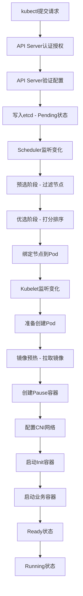
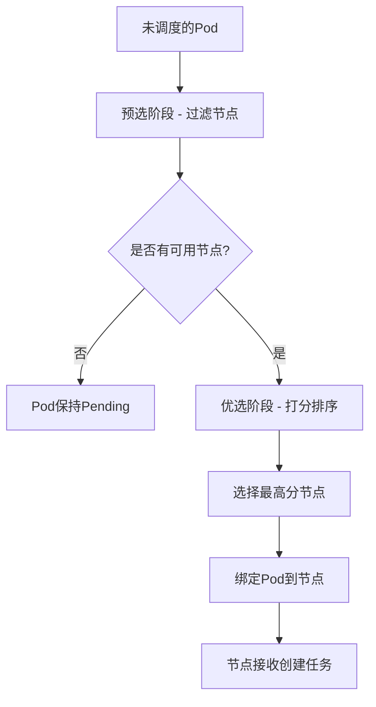
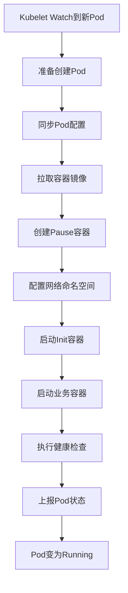

# Kubernetes Pod创建流程深度解析：从请求到运行

## 情境(Situation)

在Kubernetes集群管理中，理解Pod的创建流程是掌握Kubernetes工作原理的基础。Pod创建涉及API Server、Scheduler、Kubelet、容器运行时等多个组件的协作，任何一个环节出现问题都可能导致Pod创建失败。

作为SRE工程师，我们需要深入理解Pod创建的完整流程，掌握各组件的职责和协作机制，以便在实际工作中快速定位和解决Pod创建相关的问题。

## 冲突(Conflict)

在实际应用中，SRE工程师经常面临以下挑战：

- **流程复杂**：Pod创建涉及多个组件，难以全面理解
- **问题定位难**：Pod创建失败时不知问题出在哪个阶段
- **调度原理不清**：不理解预选、优选的调度机制
- **组件协作混乱**：不清楚组件之间的通信机制
- **网络配置复杂**：不理解CNI网络配置过程
- **性能优化困难**：不理解调度策略难以优化集群性能

## 问题(Question)

如何深入理解Kubernetes Pod创建的完整流程，掌握各组件的协作机制？

## 答案(Answer)

本文将从SRE视角出发，详细介绍Kubernetes Pod创建的完整流程、各组件的职责和协作机制、调度算法原理、以及常见问题的排查方法，提供一套完整的Pod创建流程知识体系。核心方法论基于 [SRE面试题解析：pod的创建流程是啥？](#62-pod的创建流程是啥)。

---

## 一、Pod创建流程概述

### 1.1 Pod创建完整流程

**Pod创建流程图**：



### 1.2 组件职责总览

**Pod创建涉及的核心组件**：

| 组件 | 职责 | 在Pod创建中的作用 |
|:------|:------|:------|
| **kubectl** | Kubernetes命令行工具 | 发送Pod创建请求 |
| **API Server** | Kubernetes API网关 | 认证授权、配置验证、写入etcd |
| **etcd** | 分布式键值存储 | 存储集群状态和配置 |
| **Scheduler** | Kubernetes调度器 | 预选、优选、选择最佳节点 |
| **Kubelet** | 节点代理 | 管理Pod生命周期、执行创建任务 |
| **容器运行时** | 容器引擎 | 拉取镜像、创建容器 |
| **CNI插件** | 网络插件 | 配置Pod网络 |
| **Pause容器** | 基础设施容器 | 持有网络命名空间 |

### 1.3 创建流程时间线

**Pod创建流程时间线**：

| 阶段 | 时长 | 主要操作 |
|:------|:------|:------|
| **API处理** | 毫秒级 | 认证授权、配置验证、写入etcd |
| **调度阶段** | 毫秒-秒级 | 预选、优选、绑定节点 |
| **镜像拉取** | 秒-分钟级 | 取决于镜像大小和网络 |
| **容器创建** | 秒级 | 创建Pause容器、业务容器 |
| **网络配置** | 秒级 | CNI插件配置网络 |
| **健康检查** | 秒级 | 启动探针、执行健康检查 |
| **总计** | 秒-分钟级 | 取决于镜像大小和集群状态 |

---

## 二、API Server处理阶段

### 2.1 API Server认证授权

**认证(Authentication)**：
- 验证用户身份
- 支持多种认证方式：证书、Token、Basic Auth、OIDC等

**授权(Authorization)**：
- 检查用户权限
- 基于RBAC(Role-Based Access Control)进行权限控制

**准入控制(Admission Control)**：
- 修改或验证资源
- 支持多种Webhook和内置控制器
- 如ResourceQuota、LimitRange、PodSecurityPolicy等

### 2.2 配置验证

**配置验证过程**：
- 验证Pod配置的完整性和正确性
- 检查容器镜像是否存在
- 验证资源请求和限制是否合理
- 验证环境变量、卷挂载等配置

**验证示例**：

```bash
# 验证Pod配置（不实际创建）
kubectl apply -f pod.yaml --dry-run=client

# 验证并查看详细的验证错误
kubectl apply -f pod.yaml --dry-run=server

# 查看Pod的JSON Schema验证
kubectl explain pod.spec
```

### 2.3 写入etcd

**写入etcd过程**：
1. API Server将Pod配置序列化为JSON
2. 通过Raft协议复制到集群中的所有etcd节点
3. 返回写入成功响应

**etcd存储内容**：
- Pod对象及其状态
- Pod的元数据（名称、命名空间、标签等）
- Pod的规格（容器配置、资源请求等）
- Pod的事件

**查看etcd中的Pod数据**：

```bash
# 通过kubectl查看Pod
kubectl get pod <pod-name> -n <namespace> -o yaml

# 查看Pod状态
kubectl get pod <pod-name> -n <namespace> -o jsonpath='{.status}'
```

---

## 三、调度阶段

### 3.1 Scheduler工作原理

**Scheduler职责**：
- 监控未调度的Pod
- 为Pod选择最佳节点
- 将Pod绑定到选定的节点

**调度流程**：



### 3.2 预选阶段

**预选阶段(Predicates)**：
- 过滤不符合Pod调度条件的节点
- 多个预选条件同时满足

**常见预选算法**：

| 预选算法 | 作用 |
|:------|:------|
| **PodFitsResources** | 检查节点资源是否满足Pod需求 |
| **PodFitsHostPorts** | 检查主机端口是否冲突 |
| **HostName** | 检查Pod是否指定了特定节点 |
| **MatchNodeSelector** | 检查节点选择器是否匹配 |
| **NoVolumeZoneConflict** | 检查PV的可用区是否匹配 |
| **MaxEBSVolumeCount** | 检查EBS卷数量是否超限 |
| **MaxGCEPDVolumeCount** | 检查GCE PD卷数量是否超限 |
| **MaxAzureDiskVolumeCount** | 检查Azure磁盘数量是否超限 |
| **MatchInterPodAffinity** | 检查Pod亲和性/反亲和性 |
| **NoDiskConflict** | 检查磁盘是否冲突 |

**预选配置示例**：

```yaml
apiVersion: v1
kind: Pod
metadata:
  name: nginx
spec:
  containers:
  - name: nginx
    image: nginx
  nodeSelector:  # 节点选择器
    disktype: ssd
  affinity:  # 亲和性配置
    nodeAffinity:
      requiredDuringSchedulingIgnoredDuringExecution:
        nodeSelectorTerms:
        - matchExpressions:
          - key: kubernetes.io/e2e-az-name
            operator: In
            values:
            - e2e-az1
            - e2e-az2
```

### 3.3 优选阶段

**优选阶段(Priorities)**：
- 对通过预选的节点进行打分
- 选择得分最高的节点
- 多个优先级算法综合计算

**常见优选算法**：

| 优选算法 | 作用 | 分数范围 |
|:------|:------|:------|
| **SelectorSpreadPriority** | 分散同标签Pod到不同节点 | 0-10 |
| **InterPodAffinityPriority** | 考虑Pod亲和性/反亲和性 | 0-10 |
| ** LeastRequestedPriority** | 偏向资源使用少的节点 | 0-10 |
| **BalancedResourceAllocation** | 平衡CPU和内存使用 | 0-10 |
| **NodeAffinityPriority** | 考虑节点亲和性 | 0-10 |
| **TaintTolerationPriority** | 考虑污点容忍 | 0-10 |
| **ImageLocalityPriority** | 偏向已有镜像的节点 | 0-10 |

**优选配置示例**：

```yaml
apiVersion: v1
kind: Pod
metadata:
  name: nginx
spec:
  containers:
  - name: nginx
    image: nginx
  affinity:
    podAffinity:  # Pod亲和性
      preferredDuringSchedulingIgnoredDuringExecution:
      - weight: 100
        podAffinityTerm:
          labelSelector:
            matchExpressions:
            - key: app
              operator: In
              values:
              - web
          topologyKey: kubernetes.io/hostname
    podAntiAffinity:  # Pod反亲和性
      preferredDuringSchedulingIgnoredDuringExecution:
      - weight: 100
        podAffinityTerm:
          labelSelector:
            matchExpressions:
            - key: app
              operator: In
              values:
              - cache
          topologyKey: kubernetes.io/hostname
```

### 3.4 绑定阶段

**绑定过程**：
1. Scheduler选择最佳节点
2. Scheduler向API Server发送绑定请求
3. API Server更新etcd中的Pod配置
4. Kubelet通过Watch机制感知到新的Pod任务

**绑定配置**：

```yaml
apiVersion: v1
kind: Binding
metadata:
  name: nginx
  namespace: default
target:
  apiVersion: v1
  kind: Node
  name: node-1
```

---

## 四、Kubelet执行阶段

### 4.1 Kubelet工作原理

**Kubelet职责**：
- 管理节点上的Pod生命周期
- 与容器运行时交互
- 上报节点和Pod状态到API Server

**Kubelet工作流程**：



### 4.2 镜像预热

**镜像拉取策略**：

| 策略 | 行为 |
|:------|:------|
| **Always** | 每次创建容器都拉取镜像 |
| **IfNotPresent** | 镜像不存在时拉取 |
| **Never** | 从不拉取，使用本地镜像 |

**镜像预热优化**：
- 使用镜像缓存
- 配置镜像预热策略
- 使用本地镜像仓库

**镜像拉取配置**：

```yaml
apiVersion: v1
kind: Pod
metadata:
  name: nginx
spec:
  containers:
  - name: nginx
    image: nginx:1.15.4
    imagePullPolicy: IfNotPresent  # 镜像拉取策略
  imagePullSecrets:  # 私有仓库认证
  - name: my-secret
```

### 4.3 Pause容器

**Pause容器作用**：
- 持有Pod的网络命名空间
- 持有Pod的IP地坦
- 作为Pod中其他容器的父容器

**Pause容器特点**：
- 永远处于Running状态
- 不执行任何业务逻辑
- 持有网络和存储资源

**Pause容器原理**：

```bash
# 查看Pause容器
docker ps | grep pause

# 查看Pause容器的网络命名空间
docker inspect <pause-container-id> --format '{{.NetworkMode}}'

# 查看Pause容器的PID命名空间
docker inspect <pause-container-id> --format '{{.HostConfig.PidMode}}'
```

### 4.4 CNI网络配置

**CNI插件职责**：
- 为Pod分配IP地址
- 配置Pod的网络命名空间
- 设置网络规则和策略

**常见CNI插件**：

| 插件 | 特点 | 适用场景 |
|:------|:------|:------|
| **Flannel** | 简单大二层网络 | 小规模集群 |
| **Calico** | 高性能、安全策略 | 中大规模集群 |
| **Cilium** | eBPF、深度可观测性 | 大规模集群 |
| **Weave** | 去中心化、加密 | 混合云场景 |

**CNI配置流程**：

1. Kubelet调用CNI插件
2. CNI插件创建网络命名空间
3. 分配IP地址
4. 配置网络接口
5. 设置网络规则

**网络配置查看**：

```bash
# 查看Pod的IP
kubectl get pod <pod-name> -n <namespace> -o jsonpath='{.status.podIP}'

# 查看Pod的网络信息
kubectl exec <pod-name> -n <namespace> -- ip addr

# 查看Pod的网络接口
kubectl exec <pod-name> -n <namespace> -- netstat -i

# 查看Pod的路由表
kubectl exec <pod-name> -n <namespace> -- route -n
```

### 4.5 Init容器

**Init容器特点**：
- 在业务容器之前运行
- 必须运行完成才能启动业务容器
- 可以有多个，按顺序执行

**Init容器用途**：
- 等待依赖服务就绪
- 初始化配置
- 准备数据

**Init容器配置**：

```yaml
apiVersion: v1
kind: Pod
metadata:
  name: myapp
spec:
  initContainers:
  - name: init-myservice
    image: busybox:1.28
    command: ['sh', '-c', 'until nslookup myservice; do echo waiting for myservice; sleep 2; done;']
  - name: init-mydb
    image: busybox:1.28
    command: ['sh', '-c', 'until nslookup mydb; do echo waiting for mydb; sleep 2; done;']
  containers:
  - name: myapp
    image: myapp:1.0
    ports:
    - containerPort: 80
```

### 4.6 业务容器启动

**容器启动顺序**：
1. Init容器运行完成
2. 启动业务容器
3. 执行健康检查
4. 上报状态

**容器启动配置**：

```yaml
apiVersion: v1
kind: Pod
metadata:
  name: nginx
spec:
  containers:
  - name: nginx
    image: nginx:1.15.4
    ports:
    - containerPort: 80
      name: http
      protocol: TCP
    env:
    - name: NGINX_HOST
      value: "localhost"
    - name: NGINX_PORT
      value: "80"
    resources:
      requests:
        memory: "64Mi"
        cpu: "250m"
      limits:
        memory: "128Mi"
        cpu: "500m"
    livenessProbe:
      httpGet:
        path: /healthz
        port: 80
      initialDelaySeconds: 10
      periodSeconds: 10
    readinessProbe:
      httpGet:
        path: /ready
        port: 80
      initialDelaySeconds: 5
      periodSeconds: 5
    lifecycle:
      postStart:
        exec:
          command: ["/bin/sh", "-c", "echo Hello > /usr/share/message"]
      preStop:
        exec:
          command: ["/usr/sbin/nginx", "-s", "quit"]
```

---

## 五、状态转换与上报

### 5.1 Pod状态详解

**Pod生命周期状态**：

| 状态 | 说明 | 触发条件 |
|:------|:------|:------|
| **Pending** | 等待调度或创建中 | Pod被API Server接受 |
| **Running** | 容器正在运行 | 至少一个容器运行 |
| **Succeeded** | 所有容器正常终止 | 所有容器运行完成 |
| **Failed** | 所有容器异常终止 | 容器以失败终止 |
| **Unknown** | 状态未知 | 节点通信问题 |

**容器状态**：

| 状态 | 说明 |
|:------|:------|
| **Waiting** | 等待中 |
| **Running** | 运行中 |
| **Terminated** | 已终止 |

### 5.2 Kubelet状态上报

**状态上报机制**：
- Kubelet定期向API Server上报Pod状态
- 状态变化时立即上报
- API Server更新etcd

**状态上报频率**：
- 默认同步间隔：10秒
- 状态变化时立即同步

**查看Pod状态**：

```bash
# 查看Pod状态
kubectl get pod <pod-name> -n <namespace>

# 查看Pod详细信息
kubectl describe pod <pod-name> -n <namespace>

# 查看Pod的YAML配置
kubectl get pod <pod-name> -n <namespace> -o yaml

# 查看Pod的事件
kubectl get events -n <namespace> --field-selector involvedObject.name=<pod-name>
```

---

## 六、调度器高级配置

### 6.1 调度器配置

**调度器配置文件**：

```yaml
# scheduler-config.yaml
apiVersion: kubescheduler.config.k8s.io/v1beta2
kind: KubeSchedulerConfiguration
clientConnection:
  kubeconfig: /etc/kubernetes/scheduler.conf
leaderElection:
  leaderElect: true
  resourceLock: leases
  resourceName: kube-scheduler
algorithms:
  policy:
    apiVersion: kubescheduler.config.k8s.io/v1
    kind: Policy
    predicates:
    - name: PodFitsResources
    - name: HostName
    - name: MatchNodeSelector
    priorityConfigs:
    - name: LeastRequestedPriority
      weight: 1
    - name: BalancedResourceAllocation
      weight: 1
    - name: SelectorSpreadPriority
      weight: 1
```

### 6.2 亲和性与反亲和性

**节点亲和性**：

```yaml
apiVersion: v1
kind: Pod
metadata:
  name: nginx
spec:
  affinity:
    nodeAffinity:
      requiredDuringSchedulingIgnoredDuringExecution:  # 硬亲和性
        nodeSelectorTerms:
        - matchExpressions:
          - key: topology.kubernetes.io/zone
            operator: In
            values:
            - zone-a
      preferredDuringSchedulingIgnoredDuringExecution:  # 软亲和性
      - weight: 100
        preference:
          matchExpressions:
          - key: disktype
            operator: In
            values:
            - ssd
  containers:
  - name: nginx
    image: nginx
```

**Pod亲和性与反亲和性**：

```yaml
apiVersion: v1
kind: Pod
metadata:
  name: web-server
spec:
  affinity:
    podAffinity:  # 与其他Pod共置
      requiredDuringSchedulingIgnoredDuringExecution:
      - labelSelector:
          matchExpressions:
          - key: app
            operator: In
            values:
            - database
        topologyKey: kubernetes.io/hostname
    podAntiAffinity:  # 不与其他Pod共置
      preferredDuringSchedulingIgnoredDuringExecution:
      - weight: 100
        podAffinityTerm:
          labelSelector:
            matchExpressions:
            - key: app
              operator: In
              values:
              - cache
          topologyKey: kubernetes.io/hostname
  containers:
  - name: web-server
    image: nginx
```

### 6.3 污点与容忍

**污点(Taints)**：

```bash
# 添加污点
kubectl taint nodes node-1 dedicated=nginx:NoSchedule

# 移除污点
kubectl taint nodes node-1 dedicated=nginx:NoSchedule-

# 查看节点污点
kubectl describe node node-1 | grep Taints
```

**容忍(Tolerations)**：

```yaml
apiVersion: v1
kind: Pod
metadata:
  name: nginx
spec:
  tolerations:
  - key: "dedicated"
    operator: "Equal"
    value: "nginx"
    effect: "NoSchedule"
  - key: "dedicated"
    operator: "Equal"
    value: "nginx"
    effect: "NoExecute"
    tolerationSeconds: 3600
  - key: "node.kubernetes.io/not-ready"
    operator: "Exists"
    effect: "NoExecute"
    tolerationSeconds: 300
  containers:
  - name: nginx
    image: nginx
```

### 6.4 资源请求与限制

**资源配置**：

```yaml
apiVersion: v1
kind: Pod
metadata:
  name: nginx
spec:
  containers:
  - name: nginx
    image: nginx
    resources:
      requests:
        memory: "64Mi"
        cpu: "250m"
        ephemeral-storage: "1Gi"
      limits:
        memory: "128Mi"
        cpu: "500m"
        ephemeral-storage: "2Gi"
    limits:
      memory: "256Mi"
      cpu: "1"
```

---

## 七、问题排查与优化

### 7.1 常见问题排查

**Pending状态**：

| 原因 | 排查方法 | 解决方案 |
|:------|:------|:------|
| **资源不足** | kubectl describe node | 增加节点或减少Pod资源请求 |
| **调度失败** | kubectl describe pod | 检查亲和性、污点等 |
| **PVC未绑定** | kubectl get pvc | 创建PVC或等待绑定 |
| **节点不可用** | kubectl get nodes | 恢复节点 |

**ContainerCreating状态**：

| 原因 | 排查方法 | 解决方案 |
|:------|:------|:------|
| **镜像拉取失败** | kubectl describe pod | 检查镜像名称和认证 |
| **网络配置失败** | kubectl describe pod | 检查CNI配置 |
| **存储挂载失败** | kubectl describe pod | 检查PVC和存储类 |
| **端口冲突** | kubectl describe pod | 修改容器端口 |

### 7.2 调度性能优化

**调度性能优化策略**：

1. **减少调度器延迟**：
   - 优化预选和优选算法
   - 使用调度框架扩展
   - 配置合适的并发度

2. **提高调度精度**：
   - 合理配置资源请求
   - 使用合适的亲和性策略
   - 避免过度调度

3. **调度器配置优化**：

```yaml
# scheduler-config.yaml
apiVersion: kubescheduler.config.k8s.io/v1beta2
kind: KubeSchedulerConfiguration
clientConnection:
  kubeconfig: /etc/kubernetes/scheduler.conf
  burst: 200
  qps: 50
leaderElection:
  leaderElect: true
  leaseDuration: 15s
  renewDeadline: 10s
  retryPeriod: 5s
  resourceLock: leases
  resourceName: kube-scheduler
```

### 7.3 镜像拉取优化

**镜像拉取优化策略**：

1. **使用本地镜像仓库**：
   - 配置私有镜像仓库
   - 使用镜像缓存

2. **优化镜像大小**：
   - 使用多阶段构建
   - 使用轻量级基础镜像

3. **配置镜像预热**：
   - 定期预热常用镜像
   - 使用镜像预热工具

**镜像预热配置**：

```yaml
apiVersion: v1
kind: Pod
metadata:
  name: nginx
spec:
  initContainers:
  - name: image-check
    image: nginx:1.15.4
    command: ['sh', '-c', 'echo Image pulled']
  containers:
  - name: nginx
    image: nginx:1.15.4
    imagePullPolicy: IfNotPresent
```

---

## 八、最佳实践总结

### 8.1 配置最佳实践

**Pod配置最佳实践**：

- [ ] 合理设置资源请求和限制
- [ ] 配置适当的健康检查探针
- [ ] 使用Init容器处理依赖
- [ ] 配置合适的镜像拉取策略
- [ ] 使用有意义的标签和名称
- [ ] 配置污点容忍处理特殊情况
- [ ] 使用亲和性分散Pod到不同节点

### 8.2 调度最佳实践

**调度最佳实践**：

- [ ] 合理分配节点资源
- [ ] 使用节点池管理不同类型节点
- [ ] 配置合适的亲和性策略
- [ ] 使用污点处理特殊节点
- [ ] 避免过度调度
- [ ] 定期检查调度器性能

### 8.3 运维最佳实践

**运维最佳实践**：

- [ ] 监控Pod创建时间和成功率
- [ ] 建立Pod创建问题排查文档
- [ ] 定期审计调度策略
- [ ] 优化镜像仓库访问速度
- [ ] 配置自动扩缩容策略
- [ ] 建立调度异常告警

---

## 总结

理解Kubernetes Pod创建流程是掌握Kubernetes工作原理的基础。通过本文的详细介绍，我们可以全面理解Pod创建涉及的各个阶段、各组件的职责和协作机制。

**核心要点**：

1. **API Server处理**：认证授权、配置验证、写入etcd
2. **调度阶段**：预选过滤、优选打分、绑定节点
3. **Kubelet执行**：镜像拉取、容器创建、网络配置
4. **状态上报**：Kubelet上报状态、API Server更新状态
5. **组件协作**：通过Watch机制实现组件间通信
6. **调度优化**：合理配置资源、亲和性、污点容忍
7. **问题排查**：理解各状态的含义和解决方法
8. **性能优化**：优化镜像、调度器、资源配置

通过深入理解Pod创建流程，我们可以更好地设计和优化Kubernetes集群，提高系统的可靠性和性能。

> **延伸学习**：更多面试相关的Pod创建流程知识，请参考 [SRE面试题解析：pod的创建流程是啥？](#62-pod的创建流程是啥)。

---

## 参考资料

- [Kubernetes官方文档](https://kubernetes.io/docs/)
- [Pod生命周期](https://kubernetes.io/docs/concepts/workloads/pods/pod-lifecycle/)
- [Kubernetes调度器](https://kubernetes.io/docs/concepts/scheduling-eviction/kube-scheduler/)
- [Kubelet文档](https://kubernetes.io/docs/reference/command-line-tools-reference/kubelet/)
- [CNI插件文档](https://github.com/containernetworking/cni)
- [Pause容器原理](https://www.ianlewis.org/en/kubernetes-pause-container)
- [调度算法](https://kubernetes.io/docs/reference/scheduling/policies/)
- [亲和性配置](https://kubernetes.io/docs/concepts/scheduling-eviction/assign-pod-node/)
- [污点与容忍](https://kubernetes.io/docs/concepts/scheduling-eviction/taint-and-toleration/)
- [资源管理](https://kubernetes.io/docs/concepts/configuration/manage-resources-containers/)
- [健康检查](https://kubernetes.io/docs/tasks/configure-pod-container/configure-liveness-readiness-startup-probes/)
- [Init容器](https://kubernetes.io/docs/concepts/workloads/pods/init-containers/)
- [调度器配置](https://kubernetes.io/docs/reference/scheduling/kube-scheduler/)
- [CNI插件对比](https://kubernetes.io/docs/concepts/extend-kubernetes/compute-storage-net/network-plugins/)
- [Flannel文档](https://github.com/flannel-io/flannel)
- [Calico文档](https://docs.projectcalico.org/)
- [Cilium文档](https://docs.cilium.io/)
- [etcd文档](https://etcd.io/docs/)
- [API Server文档](https://kubernetes.io/docs/reference/command-line-tools-reference/kube-apiserver/)
- [kubectl命令参考](https://kubernetes.io/docs/reference/generated/kubectl/kubectl-commands)
- [Kubernetes架构](https://kubernetes.io/docs/concepts/overview/components/)
- [调度框架](https://kubernetes.io/docs/concepts/scheduling-eviction/scheduling-framework/)
- [Pod拓扑分布约束](https://kubernetes.io/docs/concepts/scheduling-eviction/topology-spread-constraints/)
- [资源配额](https://kubernetes.io/docs/concepts/policy/resource-quotas/)
- [LimitRange](https://kubernetes.io/docs/concepts/policy/limit-range/)
- [PodDisruptionBudget](https://kubernetes.io/docs/concepts/workloads/pods/disruptions/)
- [优先级调度](https://kubernetes.io/docs/concepts/scheduling-eviction/pod-priority-preemption/)
- [调度器性能调优](https://kubernetes.io/docs/concepts/scheduling-eviction/scheduler-perf-tuning/)