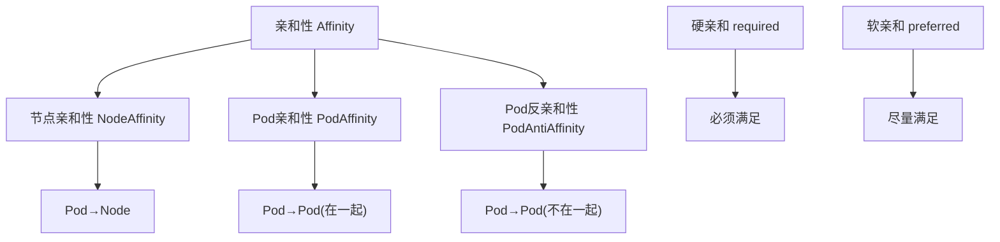
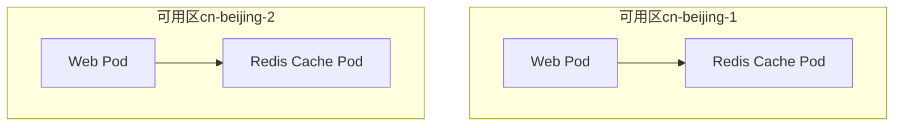
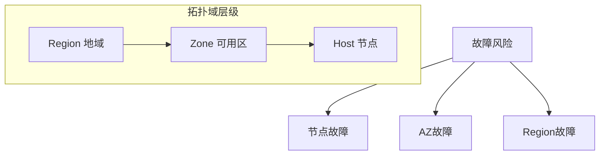
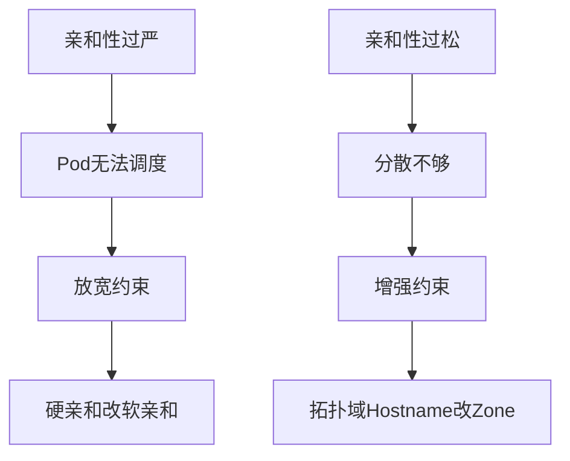

# K8s亲和性详解：NodeAffinity/PodAffinity/PodAntiAffinity生产最佳实践

## 情境与背景

在Kubernetes生产环境中，我们经常需要精细控制Pod的调度位置，例如：让Web应用尽量跟Cache在同一个可用区、让数据库主从分散到不同的节点、让计算密集型作业调度到特定资源的节点上。**亲和性（Affinity）是K8s提供的强大调度工具，包括节点亲和性（NodeAffinity）和Pod间亲和性（PodAffinity/PodAntiAffinity）。**

作为高级DevOps/SRE工程师，深入理解亲和性的工作原理、掌握各类亲和性的适用场景，是构建高可用、高性能集群的必备技能。

## 一、亲和性概述

### 1.1 三种亲和性类型



| 类型 | 作用对象 | 功能 | 适用场景 |
|:----:|---------|------|---------|
| **NodeAffinity** | Pod→Node | 根据节点标签筛选Pod调度位置 | 特定节点资源调度（GPU/高内存节点） |
| **PodAffinity** | Pod→Pod | 让Pod尽量和某些Pod在同一拓扑域 | 提升性能，减少网络延迟（Web+Cache同AZ） |
| **PodAntiAffinity** | Pod→Pod | 让Pod尽量不和某些Pod在同一拓扑域 | 提升可用性，分散风险（多副本不集中） |

### 1.2 亲和性强度

| 强度 | 关键字 | 调度行为 | 风险 | 权衡 |
|:----:|------|---------|------|------|
| **硬亲和** | `requiredDuringSchedulingIgnoredDuringExecution` | 必须满足，否则Pending | 调度失败风险 | 保证强但可能失败 |
| **软亲和** | `preferredDuringSchedulingIgnoredDuringExecution` | 尽量满足，不强制 | 更灵活但保证弱 | 灵活但不强求 |

## 二、节点亲和性 NodeAffinity

### 2.1 基本配置

```yaml
apiVersion: v1
kind: Pod
metadata:
  name: node-affinity-pod
spec:
  affinity:
    nodeAffinity:
      requiredDuringSchedulingIgnoredDuringExecution:
        nodeSelectorTerms:
        - matchExpressions:
          - key: kubernetes.io/os
            operator: In
            values:
            - linux
          - key: topology.kubernetes.io/zone
            operator: In
            values:
            - cn-beijing-1
            - cn-beijing-2
      preferredDuringSchedulingIgnoredDuringExecution:
      - weight: 100
        preference:
          matchExpressions:
          - key: disktype
            operator: In
            values:
            - ssd
      - weight: 50
        preference:
          matchExpressions:
          - key: team
            operator: In
            values:
            - platform
  containers:
  - name: test
    image: nginx:1.21
```

### 2.2 操作符Operator

| 操作符 | 说明 |
|:------:|------|
| `In` | label value包含列表中的值 |
| `NotIn` | label value不在列表中 |
| `Exists` | label存在 |
| `DoesNotExist` | label不存在 |
| `Gt` | label value大于（数值类型） |
| `Lt` | label value小于（数值类型） |

```yaml
# 组合使用多个操作符
requiredDuringSchedulingIgnoredDuringExecution:
  nodeSelectorTerms:
  - matchExpressions:
    - key: node-type
      operator: In
      values:
      - compute
    - key: kubernetes.io/os
      operator: In
      values:
      - linux
    - key: min-memory
      operator: Gt
      values:
      - "32"
```

## 三、Pod亲和性 PodAffinity

### 3.1 基本配置

```yaml
apiVersion: v1
kind: Pod
metadata:
  name: web-pod
  labels:
    app: web
spec:
  affinity:
    podAffinity:
      requiredDuringSchedulingIgnoredDuringExecution:
      - labelSelector:
          matchLabels:
            app: redis-cache
        topologyKey: topology.kubernetes.io/zone
      preferredDuringSchedulingIgnoredDuringExecution:
      - weight: 80
        podAffinityTerm:
          labelSelector:
            matchLabels:
              app: monitoring
          topologyKey: kubernetes.io/hostname
  containers:
  - name: web
    image: nginx:1.21
```

### 3.2 Web+Cache架构示例



```yaml
apiVersion: apps/v1
kind: Deployment
metadata:
  name: web-frontend
spec:
  replicas: 6
  selector:
    matchLabels:
      app: web-frontend
  template:
    metadata:
      labels:
        app: web-frontend
    spec:
      affinity:
        podAffinity:
          preferredDuringSchedulingIgnoredDuringExecution:
          - weight: 100
            podAffinityTerm:
              labelSelector:
                matchLabels:
                  app: redis-cache
              topologyKey: topology.kubernetes.io/zone
      containers:
      - name: web
        image: nginx:1.21
        resources:
          requests:
            memory: "128Mi"
            cpu: "100m"
```

## 四、Pod反亲和性 PodAntiAffinity

### 4.1 基本配置

```yaml
apiVersion: v1
kind: Pod
metadata:
  name: db-pod
  labels:
    app: mysql
spec:
  affinity:
    podAntiAffinity:
      requiredDuringSchedulingIgnoredDuringExecution:
      - labelSelector:
          matchLabels:
            app: mysql
        topologyKey: kubernetes.io/hostname
      preferredDuringSchedulingIgnoredDuringExecution:
      - weight: 100
        podAffinityTerm:
          labelSelector:
            matchLabels:
              app: mysql
          topologyKey: topology.kubernetes.io/zone
  containers:
  - name: mysql
    image: mysql:8.0
```

### 4.2 数据库高可用示例

```yaml
apiVersion: apps/v1
kind: StatefulSet
metadata:
  name: mysql
spec:
  serviceName: mysql
  replicas: 3
  selector:
    matchLabels:
      app: mysql
  template:
    metadata:
      labels:
        app: mysql
    spec:
      affinity:
        podAntiAffinity:
          requiredDuringSchedulingIgnoredDuringExecution:
          - labelSelector:
              matchLabels:
                app: mysql
            topologyKey: topology.kubernetes.io/zone
      containers:
      - name: mysql
        image: mysql:8.0
        volumeMounts:
        - name: data
          mountPath: /var/lib/mysql
  volumeClaimTemplates:
  - metadata:
      name: data
    spec:
      accessModes: ["ReadWriteOnce"]
      resources:
        requests:
          storage: 100Gi
```

## 五、拓扑域 TopologyKey

### 5.1 常用拓扑域

| TopologyKey | 说明 | 隔离级别 |
|:----------:|------|---------|
| `kubernetes.io/hostname` | 节点主机名 | 节点级 |
| `topology.kubernetes.io/zone` | 可用区 | AZ级 |
| `topology.kubernetes.io/region` | 地域 | 区域级 |
| `node.kubernetes.io/instance-type` | 实例规格 | 自定义 |

### 5.2 拓扑域与故障隔离



| 隔离级别 | 节点分散程度 | 故障容忍能力 |
|:--------:|-----------|-----------|
| **Hostname** | 节点级分散 | 单节点故障不影响 |
| **Zone** | AZ级分散 | 单AZ故障不影响 |
| **Region** | 区域级分散 | 最严格的灾备 |

## 六、生产环境最佳实践

### 6.1 组合使用策略

```yaml
apiVersion: apps/v1
kind: Deployment
metadata:
  name: production-web
spec:
  replicas: 8
  selector:
    matchLabels:
      app: production-web
  template:
    metadata:
      labels:
        app: production-web
    spec:
      affinity:
        # 1. 节点亲和性：要求Linux节点，优先SSD节点
        nodeAffinity:
          requiredDuringSchedulingIgnoredDuringExecution:
            nodeSelectorTerms:
            - matchExpressions:
              - key: kubernetes.io/os
                operator: In
                values:
                - linux
          preferredDuringSchedulingIgnoredDuringExecution:
          - weight: 100
            preference:
              matchExpressions:
              - key: disktype
                operator: In
                values:
                - ssd
        # 2. Pod反亲和性：要求不同节点，尽量不同AZ
        podAntiAffinity:
          requiredDuringSchedulingIgnoredDuringExecution:
          - labelSelector:
              matchLabels:
                app: production-web
            topologyKey: kubernetes.io/hostname
          preferredDuringSchedulingIgnoredDuringExecution:
          - weight: 80
            podAffinityTerm:
              labelSelector:
                matchLabels:
                  app: production-web
              topologyKey: topology.kubernetes.io/zone
        # 3. Pod亲和性：尽量跟Cache同AZ
        podAffinity:
          preferredDuringSchedulingIgnoredDuringExecution:
          - weight: 100
            podAffinityTerm:
              labelSelector:
                matchLabels:
                  app: redis-cache
              topologyKey: topology.kubernetes.io/zone
      containers:
      - name: web
        image: nginx:1.21
        resources:
          requests:
            memory: "256Mi"
            cpu: "200m"
          limits:
            memory: "512Mi"
            cpu: "500m"
```

### 6.2 关键业务多AZ分散

```yaml
apiVersion: apps/v1
kind: StatefulSet
metadata:
  name: critical-database
spec:
  serviceName: critical-db
  replicas: 3
  selector:
    matchLabels:
      app: critical-database
  template:
    metadata:
      labels:
        app: critical-database
    spec:
      affinity:
        podAntiAffinity:
          requiredDuringSchedulingIgnoredDuringExecution:
          - labelSelector:
              matchLabels:
                app: critical-database
            topologyKey: topology.kubernetes.io/zone
        nodeAffinity:
          requiredDuringSchedulingIgnoredDuringExecution:
            nodeSelectorTerms:
            - matchExpressions:
              - key: node-type
                operator: In
                values:
                - database
      tolerations:
      - key: "dedicated"
        operator: "Equal"
        value: "database"
        effect: "NoSchedule"
      containers:
      - name: postgres
        image: postgres:13.4
        resources:
          requests:
            memory: "4Gi"
            cpu: "2"
          limits:
            memory: "8Gi"
            cpu: "4"
        volumeMounts:
        - name: data
          mountPath: /var/lib/postgresql/data
  volumeClaimTemplates:
  - metadata:
      name: data
    spec:
      accessModes: ["ReadWriteOnce"]
      resources:
        requests:
          storage: 500Gi
```

### 6.3 监控告警

```yaml
# Prometheus监控亲和性失败
groups:
- name: k8s_affinity_alerts
  rules:
  - alert: PodUnschedulableAffinity
    expr: kube_pod_status_phase{phase="Pending"} > 0
    for: 10m
    labels:
      severity: warning
    annotations:
      summary: "Pod {{ $labels.pod }} 亲和性调度失败"
```

## 七、常见问题排查

### 7.1 Pod无法调度

```bash
# 1. 查看Pod状态和事件
kubectl get pods
kubectl describe pod <pod-name>

# 2. 查看节点标签
kubectl get nodes --show-labels

# 3. 检查相关Pod分布
kubectl get pods -l app=<label> -o wide

# 4. 查看亲和性配置
kubectl get pod <pod-name> -o yaml
```

### 7.2 亲和性优化



## 八、面试精简版

### 8.1 一分钟版本

K8s的亲和性（Affinity）包括三类：节点亲和性（NodeAffinity，根据节点标签调度Pod）、Pod亲和性（PodAffinity，让Pod尽量在一起，如Web和Cache同AZ）、Pod反亲和性（PodAntiAffinity，让Pod尽量不在一起，如多副本分散到不同节点）。亲和性强度分硬亲和（required，必须满足否则Pending）和软亲和（preferred，尽量满足）。生产环境常用Pod反亲和性分散多副本提升可用性，用Pod亲和性优化性能。

### 8.2 记忆口诀

```
亲和性分三种，节点亲和NodeAffinity，
Pod亲和PodAffinity，Pod反亲和AntiAffinity，
硬的必须要满足，软的尽量来配合，
拓扑域选好键，节点主机hostname，
可用区topology.kubernetes.io/zone，
多副本要分散，性能优先聚同地。
```

### 8.3 关键词速查

| 关键词 | 说明 |
|:------:|------|
| NodeAffinity | 节点亲和性 |
| PodAffinity | Pod亲和性 |
| PodAntiAffinity | Pod反亲和性 |
| requiredDuringScheduling | 硬亲和，必须满足 |
| preferredDuringScheduling | 软亲和，尽量满足 |
| topologyKey | 拓扑域键 |

> **参考链接**：[SRE运维面试题全解析：从理论到实践（第三部分）]()
