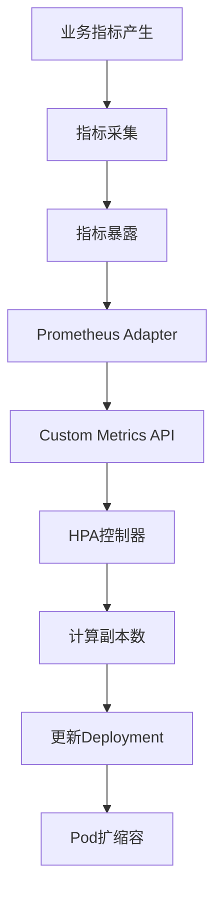

# K8s自定义HPA详解：从指标采集到扩缩容生产最佳实践

## 情境与背景

在Kubernetes生产环境中，默认的CPU/内存HPA扩缩容策略往往无法满足复杂业务场景的需求。例如：API网关需要根据QPS扩缩容、消息队列消费者需要根据队列长度调整Worker数量、批处理任务需要根据任务队列深度动态扩缩容。**自定义指标HPA能够根据业务指标进行精准扩缩容，是构建弹性云原生架构的核心能力。**

## 一、自定义HPA架构概览

### 1.1 核心组件



### 1.2 工作流程

| 阶段 | 组件 | 职责 |
|:----:|------|------|
| **指标采集** | Prometheus/自定义Exporter | 收集业务指标 |
| **指标转换** | Prometheus Adapter | 将PromQL转换为K8s标准API |
| **指标暴露** | Custom Metrics API | 提供标准化指标查询接口 |
| **扩缩容决策** | HPA控制器 | 根据指标计算目标副本数 |
| **执行扩缩容** | Deployment/StatefulSet | 调整Pod副本数 |

## 二、自定义指标类型

### 2.1 指标分类

| 类型 | 作用范围 | 示例 |
|:----:|---------|------|
| **Resource Metrics** | Pod级资源指标 | CPU、内存 |
| **Pod Metrics** | Pod级自定义指标 | QPS、请求延迟 |
| **Object Metrics** | 特定对象指标 | 队列长度、消息数 |
| **External Metrics** | 外部系统指标 | 数据库连接数、第三方服务指标 |

### 2.2 指标来源

```bash
# 常见指标来源
1. Prometheus + 自定义Exporter
2. Application-level metrics (如Spring Actuator)
3. Message Queue (Kafka/RabbitMQ)
4. Database metrics
5. External API metrics
```

## 三、Prometheus Adapter部署与配置

### 3.1 安装Prometheus Adapter

```yaml
apiVersion: apps/v1
kind: Deployment
metadata:
  name: prometheus-adapter
  namespace: monitoring
spec:
  replicas: 2
  selector:
    matchLabels:
      app: prometheus-adapter
  template:
    metadata:
      labels:
        app: prometheus-adapter
    spec:
      containers:
      - name: adapter
        image: quay.io/coreos/k8s-prometheus-adapter-amd64:v0.9.0
        args:
        - --metrics-relist-interval=1m
        - --prometheus-url=http://prometheus:9090/
        - --prometheus-port=9090
        - --config=/etc/adapter/config.yaml
        volumeMounts:
        - name: config
          mountPath: /etc/adapter
      volumes:
      - name: config
        configMap:
          name: adapter-config
```

### 3.2 配置指标规则

```yaml
# adapter-config ConfigMap
apiVersion: v1
kind: ConfigMap
metadata:
  name: adapter-config
  namespace: monitoring
data:
  config.yaml: |
    rules:
    - seriesQuery: 'http_requests_total{kubernetes_namespace!="",kubernetes_pod_name!=""}'
      resources:
        overrides:
          kubernetes_namespace: {resource: "namespace"}
          kubernetes_pod_name: {resource: "pod"}
      name:
        matches: "^(.*)_total$"
        as: "${1}_per_second"
      metricsQuery: 'sum(rate(<<.Series>>[2m])) by (<<.GroupBy>>)'

    - seriesQuery: 'queue_length{queue!=""}'
      resources:
        namespaced: true
      name:
        matches: "^(.*)$"
        as: "${1}"
      metricsQuery: 'sum(<<.Series>>) by (<<.GroupBy>>)'
```

### 3.3 验证指标

```bash
# 查看可用的自定义指标
kubectl get --raw "/apis/custom.metrics.k8s.io/v1beta1" | jq .

# 查看特定指标
kubectl get --raw "/apis/custom.metrics.k8s.io/v1beta1/namespaces/default/pods/*/requests_per_second" | jq .
```

## 四、自定义HPA配置实践

### 4.1 Pod级自定义指标

```yaml
apiVersion: autoscaling/v2
kind: HorizontalPodAutoscaler
metadata:
  name: web-api-hpa
spec:
  scaleTargetRef:
    apiVersion: apps/v1
    kind: Deployment
    name: web-api
  minReplicas: 2
  maxReplicas: 10
  metrics:
  - type: Pods
    pods:
      metric:
        name: requests_per_second
      target:
        type: AverageValue
        averageValue: "100"
```

### 4.2 外部指标（队列长度）

```yaml
apiVersion: autoscaling/v2
kind: HorizontalPodAutoscaler
metadata:
  name: consumer-hpa
spec:
  scaleTargetRef:
    apiVersion: apps/v1
    kind: Deployment
    name: kafka-consumer
  minReplicas: 3
  maxReplicas: 20
  metrics:
  - type: External
    external:
      metric:
        name: kafka_queue_length
        selector:
          matchLabels:
            queue: orders
      target:
        type: AverageValue
        averageValue: "500"
```

### 4.3 混合指标策略

```yaml
apiVersion: autoscaling/v2
kind: HorizontalPodAutoscaler
metadata:
  name: mixed-hpa
spec:
  scaleTargetRef:
    apiVersion: apps/v1
    kind: Deployment
    name: api-gateway
  minReplicas: 2
  maxReplicas: 15
  metrics:
  - type: Resource
    resource:
      name: cpu
      target:
        type: Utilization
        averageUtilization: 70
  - type: Pods
    pods:
      metric:
        name: requests_per_second
      target:
        type: AverageValue
        averageValue: "200"
  - type: External
    external:
      metric:
        name: active_users
      target:
        type: AverageValue
        averageValue: "1000"
```

## 五、高级配置技巧

### 5.1 扩缩容行为控制

```yaml
apiVersion: autoscaling/v2
kind: HorizontalPodAutoscaler
metadata:
  name: controlled-hpa
spec:
  scaleTargetRef:
    apiVersion: apps/v1
    kind: Deployment
    name: web-app
  minReplicas: 2
  maxReplicas: 10
  behavior:
    scaleUp:
      stabilizationWindowSeconds: 60
      policies:
      - type: Percent
        value: 100
        periodSeconds: 15
      - type: Pods
        value: 4
        periodSeconds: 15
      selectPolicy: Max
    scaleDown:
      stabilizationWindowSeconds: 300
      policies:
      - type: Percent
        value: 100
        periodSeconds: 60
      - type: Pods
        value: 2
        periodSeconds: 60
      selectPolicy: Min
  metrics:
  - type: Pods
    pods:
      metric:
        name: requests_per_second
      target:
        type: AverageValue
        averageValue: "100"
```

### 5.2 指标优先级

```yaml
apiVersion: autoscaling/v2
kind: HorizontalPodAutoscaler
metadata:
  name: priority-hpa
spec:
  scaleTargetRef:
    apiVersion: apps/v1
    kind: Deployment
    name: critical-service
  minReplicas: 3
  maxReplicas: 20
  metrics:
  - type: Resource
    resource:
      name: memory
      target:
        type: Utilization
        averageUtilization: 80
  - type: Pods
    pods:
      metric:
        name: error_rate
      target:
        type: AverageValue
        averageValue: "0.01"
```

## 六、生产环境最佳实践

### 6.1 指标选择策略

| 场景 | 推荐指标 | 目标值 |
|:----:|---------|--------|
| **API网关** | QPS | 100-500 req/s per Pod |
| **消息队列消费者** | 队列长度 | < 500消息 |
| **批处理Worker** | 任务队列深度 | < 100任务 |
| **数据库连接池** | 连接使用率 | < 80% |
| **缓存服务** | 命中率 | > 95% |

### 6.2 扩缩容参数调优

| 参数 | 建议值 | 说明 |
|:----:|--------|------|
| minReplicas | 2-3 | 保证最小可用性 |
| maxReplicas | 10-50 | 根据集群容量调整 |
| scaleUp.stabilizationWindowSeconds | 30-60 | 避免频繁扩容 |
| scaleDown.stabilizationWindowSeconds | 300-600 | 避免过早缩容 |
| scaleUp.policies.Percent | 50-100 | 每次扩容比例 |
| scaleUp.policies.Pods | 2-5 | 每次扩容Pod数 |

### 6.3 监控与告警

```yaml
# Prometheus监控HPA
groups:
- name: k8s_hpa_alerts
  rules:
  - alert: HpaMaxedOut
    expr: hpa_current_replicas == hpa_desired_replicas and hpa_desired_replicas == hpa_max_replicas
    for: 5m
    labels:
      severity: warning
    annotations:
      summary: "HPA {{ $labels.namespace }}/{{ $labels.hpa }} 已达到最大副本数"

  - alert: HpaNotReady
    expr: hpa_status_condition == 0
    for: 5m
    labels:
      severity: critical
    annotations:
      summary: "HPA {{ $labels.namespace }}/{{ $labels.hpa }} 状态异常"
```

### 6.4 部署检查清单

```bash
# 1. 验证Prometheus Adapter运行正常
kubectl get pods -n monitoring -l app=prometheus-adapter

# 2. 验证自定义指标可用
kubectl get --raw "/apis/custom.metrics.k8s.io/v1beta1" | jq .

# 3. 验证HPA状态
kubectl get hpa

# 4. 查看HPA详细状态
kubectl describe hpa web-api-hpa
```

## 七、常见问题排查

### 7.1 HPA无法获取指标

```bash
# 检查指标是否可用
kubectl get --raw "/apis/custom.metrics.k8s.io/v1beta1/namespaces/default/pods/*/requests_per_second"

# 检查Prometheus Adapter日志
kubectl logs -n monitoring prometheus-adapter-xxx

# 检查Prometheus查询
curl http://prometheus:9090/api/v1/query?query=http_requests_total
```

### 7.2 HPA不扩缩容

```bash
# 检查HPA状态
kubectl describe hpa my-hpa

# 常见原因：
# 1. 指标值未达到阈值
# 2. 已达到minReplicas/maxReplicas限制
# 3. 指标采集失败
# 4. 扩缩容冷却时间未过
```

## 八、面试精简版

### 8.1 一分钟版本

自定义HPA流程包括四个核心环节：1) 业务指标产生（如QPS、队列长度）；2) 指标采集（通过Prometheus等监控系统）；3) 指标转换（通过Prometheus Adapter转换为K8s标准API）；4) HPA控制器根据指标计算目标副本数并执行扩缩容。关键组件包括Prometheus用于采集、Prometheus Adapter用于API转换、HPA控制器负责决策。

### 8.2 记忆口诀

```
自定义HPA，指标来驱动，
Prometheus采集，Adapter转换API，
HPA做决策，副本数动态调整，
业务指标精准控，弹性伸缩更智能。
```

### 8.3 关键词速查

| 关键词 | 说明 |
|:------:|------|
| Custom Metrics API | 自定义指标API |
| Prometheus Adapter | 指标转换适配器 |
| Pod Metrics | Pod级自定义指标 |
| External Metrics | 外部系统指标 |
| stabilizationWindowSeconds | 扩缩容冷却时间 |

> **参考链接**：[SRE运维面试题全解析：从理论到实践（第三部分）]()
