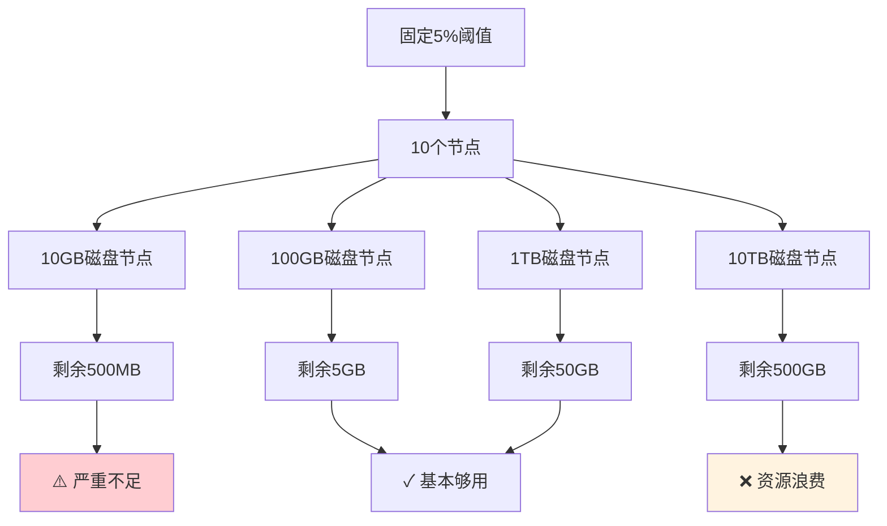
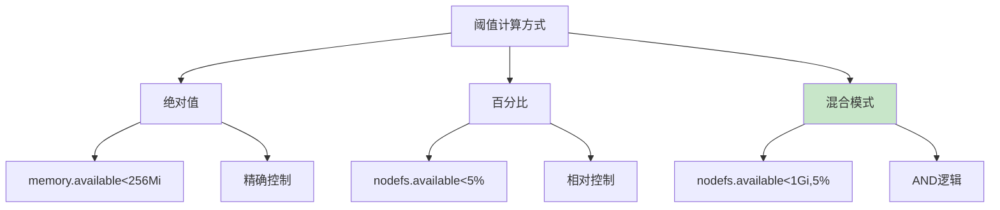
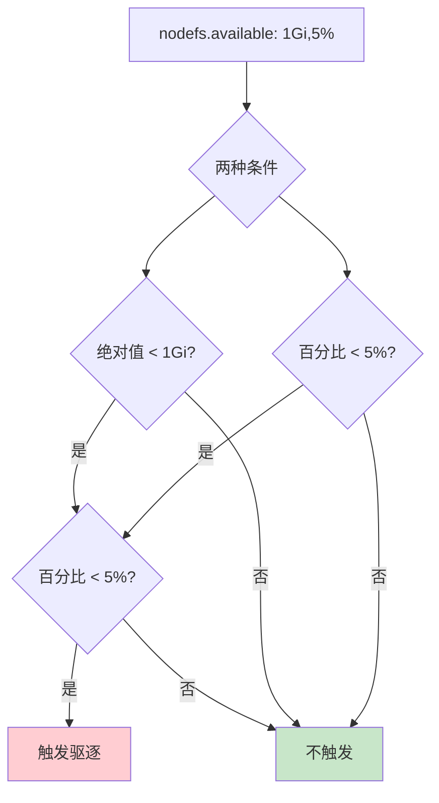
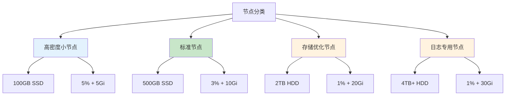
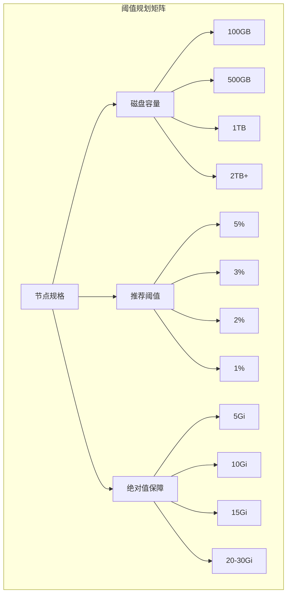
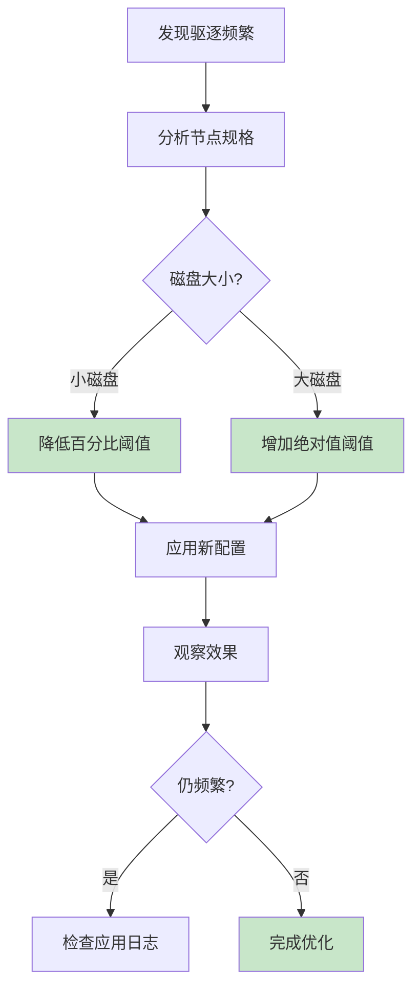

# K8s驱逐阈值动态调整策略：基于磁盘大小的精细化资源管理

## 情境与背景

在Kubernetes生产环境中，节点磁盘管理是保障集群稳定性的重要环节。然而，很多运维人员忽略了驱逐阈值与磁盘大小的适配问题：100GB磁盘的5%是5GB，2TB磁盘的5%却是100GB——这种固定百分比的配置策略会导致大磁盘节点预留过多空间，或者小磁盘节点空间不足。

作为高级DevOps/SRE工程师，**理解如何根据磁盘大小动态调整驱逐阈值，实现精细化资源管理，是提升集群稳定性和资源利用率的关键技能。**本文将从问题本质出发，结合生产环境最佳实践，帮助你掌握动态阈值配置方法。

## 一、问题本质：固定阈值的局限性

### 1.1 固定百分比的问题



| 磁盘大小 | 5%阈值 | 实际可用空间 | 问题分析 |
|:--------:|:------:|:------------:|---------|
| **10GB** | 500MB | 500MB | 严重不足，无法运行Pod |
| **100GB** | 5GB | 5GB | 基本够用 |
| **500GB** | 25GB | 25GB | 偏多，资源浪费 |
| **1TB** | 50GB | 50GB | 过多，资源浪费 |
| **10TB** | 500GB | 500GB | 严重浪费 |

### 1.2 为什么需要动态阈值

| 场景 | 问题 | 影响 |
|------|------|------|
| **小磁盘节点** | 百分比阈值过高 | 频繁驱逐，无法正常调度 |
| **大磁盘节点** | 百分比阈值过低 | 资源浪费，可用空间闲置 |
| **混合规格集群** | 统一配置 | 无法兼顾不同节点需求 |
| **日志写入量大** | 固定阈值不适应 | imagefs快速耗尽 |

## 二、K8s阈值计算机制

### 2.1 支持的计算方式

Kubelet支持三种阈值计算方式：



| 计算方式 | 语法示例 | 触发条件 | 说明 |
|:--------:|---------|---------|------|
| **绝对值** | `memory.available<256Mi` | 低于绝对值 | 精确控制 |
| **百分比** | `nodefs.available<5%` | 低于百分比 | 相对控制 |
| **混合AND** | `nodefs.available<1Gi,5%` | 两者同时满足 | 更严格 |
| **混合OR** | `nodefs.available<1Gi` | 满足任一条件 | 较宽松 |

### 2.2 混合模式的AND逻辑

```yaml
# 混合配置示例
evictionHard:
  nodefs.available: "1Gi,5%"
```

这表示：**只有当磁盘可用空间同时低于1Gi AND 5%时，才会触发驱逐。**



**计算示例**：

| 磁盘大小 | 1Gi计算 | 5%计算 | 触发阈值 |
|:--------:|:-------:|:------:|:--------:|
| **10GB** | 1GB | 500MB | 500MB（先满足5%） |
| **100GB** | 1GB | 5GB | 1GB（绝对值限制） |
| **500GB** | 1GB | 25GB | 1GB（绝对值限制） |
| **1TB** | 1GB | 50GB | 1GB（绝对值限制） |
| **10TB** | 1GB | 500GB | 1GB（绝对值限制） |

## 三、动态阈值配置策略

### 3.1 节点分类与配置



### 3.2 按节点规格配置

```yaml
# 高密度小节点配置 (100GB SSD)
evictionHard:
  memory.available: "200Mi"
  nodefs.available: "5Gi,5%"
  imagefs.available: "5Gi,5%

evictionMinimumReclaim:
  nodefs.available: "2Gi"
  imagefs.available: "2Gi"
```

```yaml
# 标准节点配置 (500GB SSD)
evictionHard:
  memory.available: "200Mi"
  nodefs.available: "10Gi,3%"
  imagefs.available: "10Gi,5%

evictionMinimumReclaim:
  nodefs.available: "5Gi"
  imagefs.available: "5Gi"
```

```yaml
# 存储优化节点配置 (2TB HDD)
evictionHard:
  memory.available: "200Mi"
  nodefs.available: "20Gi,1%"
  imagefs.available: "20Gi,2%

evictionMinimumReclaim:
  nodefs.available: "10Gi"
  imagefs.available: "10Gi"
```

```yaml
# 日志专用节点配置 (4TB+)
evictionHard:
  memory.available: "200Mi"
  nodefs.available: "30Gi,1%"
  imagefs.available: "50Gi,1%

evictionMinimumReclaim:
  nodefs.available: "15Gi"
  imagefs.available: "20Gi"
```

### 3.3 基于节点标签的差异化配置

```bash
# 为不同类型节点添加标签
kubectl label node node-001 node-type=high-density
kubectl label node node-002 node-type=standard
kubectl label node node-003 node-type=storage-optimized
kubectl label node node-004 node-type=log-optimized
```

```yaml
# kubelet配置文件 - 标准节点示例
apiVersion: kubelet.config.k8s.io/v1beta1
kind: KubeletConfiguration
evictionHard:
  memory.available: "200Mi"
  nodefs.available: "10Gi,3%"
  imagefs.available: "10Gi,5%
evictionSoft:
  memory.available: "1Gi"
  nodefs.available: "15Gi,10%
  imagefs.available: "15Gi,15%
evictionSoftGracePeriod:
  memory.available: "60s"
  nodefs.available: "60s"
  imagefs.available: "60s"
evictionMinimumReclaim:
  memory.available: "100Mi"
  nodefs.available: "5Gi"
  imagefs.available: "5Gi"
```

## 四、生产环境配置最佳实践

### 4.1 阈值规划矩阵



| 节点类型 | 磁盘容量 | nodefs阈值 | imagefs阈值 | 说明 |
|:--------:|:--------:|:----------:|:----------:|------|
| **开发测试** | 50GB | 10% | 10% | 空间紧张，提高阈值 |
| **高密度小节点** | 100GB | 5% + 5Gi | 5% + 5Gi | 混合配置 |
| **标准节点** | 500GB | 3% + 10Gi | 5% + 10Gi | 平衡配置 |
| **存储优化** | 1TB | 2% + 15Gi | 2% + 15Gi | 大磁盘降比 |
| **超大规模** | 2TB+ | 1% + 20Gi | 1% + 20Gi | 超大磁盘 |

### 4.2 evictionMinimumReclaim配置

**作用说明**：驱逐发生后，kubelet会持续回收资源直到达到minimumReclaim指定的阈值，确保驱逐后有足够缓冲空间。

```yaml
evictionMinimumReclaim:
  memory.available: "100Mi"
  nodefs.available: "5Gi"      # 驱逐后保证至少5Gi可用
  imagefs.available: "5Gi"
  nodefs.inodesfree: "4%"
  imagefs.inodesfree: "4%
```

| 配置项 | 作用 | 推荐值 |
|:------:|------|:------:|
| **nodefs.available** | 驱逐后保证nodefs可用空间 | 阈值的一半 |
| **imagefs.available** | 驱逐后保证imagefs可用空间 | 阈值的一半 |
| **memory.available** | 驱逐后保证内存可用 | 100-200Mi |

### 4.3 监控与告警配置

```yaml
# eviction-monitor-alerts.yaml
groups:
  - name: eviction-monitoring
    rules:
      - alert: NodeDiskPressureImminent
        expr: |
          (
            node_filesystem_avail_bytes{mountpoint="/var/lib/kubelet"} < 5 * 1024 * 1024 * 1024
            and
            node_filesystem_size_bytes{mountpoint="/var/lib/kubelet"} < 100 * 1024 * 1024 * 1024
          )
          or
          (
            node_filesystem_avail_bytes{mountpoint="/var/lib/kubelet"} <
            node_filesystem_size_bytes{mountpoint="/var/lib/kubelet"} * 0.03
            and
            node_filesystem_size_bytes{mountpoint="/var/lib/kubelet"} >= 100 * 1024 * 1024 * 1024
          )
        for: 5m
        labels:
          severity: warning
        annotations:
          summary: "Node {{ $labels.node }} disk pressure imminent"
          description: "Disk available will trigger eviction soon"

      - alert: LargeDiskLowThreshold
        expr: |
          node_filesystem_size_bytes{mountpoint="/var/lib/kubelet"} > 1024 * 1024 * 1024 * 1024
          and
          (node_filesystem_avail_bytes{mountpoint="/var/lib/kubelet"} / node_filesystem_size_bytes{mountpoint="/var/lib/kubelet"}) > 0.95
        for: 10m
        labels:
          severity: info
        annotations:
          summary: "Node {{ $labels.node }} has large disk with high free percentage"
          description: "Consider adjusting eviction threshold to use more space"
```

### 4.4 自动化配置脚本

```bash
#!/bin/bash
# auto-eviction-config.sh - 根据磁盘大小自动生成驱逐配置

DISK_SIZE=$(df -BG /var/lib/kubelet | awk 'NR==2 {print $2}' | sed 's/G//')
DISK_SIZE_GB=$((DISK_SIZE))

calculate_threshold() {
    local disk_gb=$1
    if [ $disk_gb -lt 100 ]; then
        echo "5%"
    elif [ $disk_gb -lt 500 ]; then
        echo "3%"
    elif [ $disk_gb -lt 1024 ]; then
        echo "2%"
    else
        echo "1%"
    fi
}

calculate_absolute() {
    local disk_gb=$1
    if [ $disk_gb -lt 100 ]; then
        echo "5Gi"
    elif [ $disk_gb -lt 500 ]; then
        echo "10Gi"
    elif [ $disk_gb -lt 1024 ]; then
        echo "20Gi"
    else
        echo "30Gi"
    fi
}

PERCENT=$(calculate_threshold $DISK_SIZE_GB)
ABSOLUTE=$(calculate_absolute $DISK_SIZE_GB)

echo "Generated eviction config for ${DISK_SIZE_GB}GB disk:"
echo "  nodefs.available: ${ABSOLUTE},${PERCENT}"
echo "  imagefs.available: ${ABSOLUTE},${PERCENT}"
```

## 五、故障排查与优化

### 5.1 常见问题诊断

```bash
# 1. 检查当前节点磁盘大小
df -h /var/lib/kubelet

# 2. 检查当前驱逐配置
kubectl get nodes -o jsonpath='{range .items[*]}{.metadata.name}{"\n"}{.status.capacity.storage}{"\n"}{end}'

# 3. 查看驱逐历史
kubectl get events --field-selector reason=Evicted

# 4. 检查节点压力状态
kubectl get nodes -o jsonpath='{range .items[*]}{.metadata.name}{"\t"}{.status.conditions[?(@.type=="DiskPressure")].status}{"\n"}{end}'

# 5. 查看kubelet驱逐日志
journalctl -u kubelet | grep -i eviction | tail -50
```

### 5.2 阈值优化流程



### 5.3 阈值调整决策树

| 场景 | 判断条件 | 调整策略 |
|------|---------|----------|
| **小磁盘频繁驱逐** | <100GB且频繁Evicted | 降低百分比至3-5% |
| **大磁盘资源浪费** | >1TB且可用>90% | 提高绝对值或降低百分比 |
| **imagefs经常满** | imagefs.available持续低 | 提高imagefs阈值 |
| **nodefs经常满** | nodefs可用持续低 | 提高nodefs阈值+清理日志 |

## 六、面试精简版

### 6.1 一分钟版本

K8s默认固定百分比阈值有问题：100GB磁盘的5%是5GB，2TB磁盘的5%是100GB，同样阈值对大磁盘浪费、对小磁盘不够。解决方案是使用混合配置如`nodefs.available: "10Gi,3%"`，表示绝对值和百分比同时满足才触发。生产环境应该根据节点规格差异化配置：高密度小节点用5%+5Gi，标准节点用3%+10Gi，存储大节点用1%+20Gi。同时配置evictionMinimumReclaim保证驱逐后能回收足够空间。

### 6.2 记忆口诀

```
阈值配置不一刀切，小盘高百大盘低，
混合配置AND逻辑，绝对值来把底抄，
百分比把相对保，MinimumReclaim不能少。
```

### 6.3 关键词速查

| 关键词 | 说明 |
|:------:|------|
| `nodefs.available: "1Gi,5%"` | 混合AND配置 |
| `evictionMinimumReclaim` | 驱逐后最小回收空间 |
| `imagefs` vs `nodefs` | 镜像存储 vs kubelet目录 |
| 混合模式 | 绝对值+百分比同时满足 |

> **参考链接**：[SRE运维面试题全解析：从理论到实践（第三部分）]()