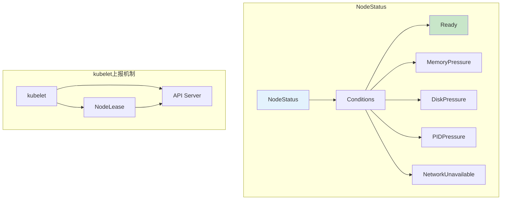
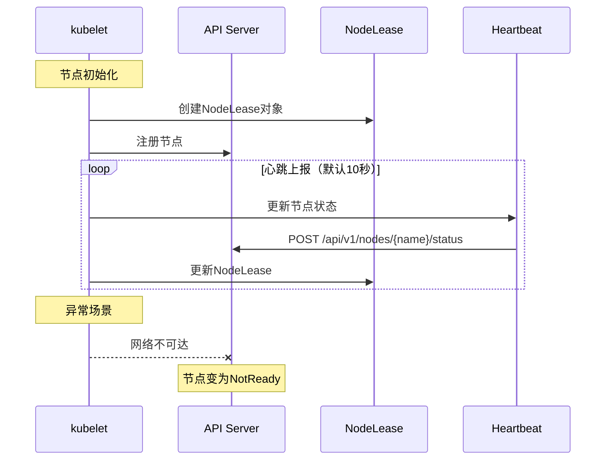

# K8s节点NotReady故障排查与恢复：生产环境最佳实践

## 情境与背景

Kubernetes集群中，节点状态是保障业务连续性的关键指标。当节点进入NotReady状态时，该节点上的Pod将无法被调度，已经运行的Pod也面临被驱逐的风险。作为高级DevOps/SRE工程师，快速定位和恢复NotReady节点是必备的核心技能。

**节点NotReady的本质是kubelet无法向API Server报告节点的健康状态。**这可能由多种原因导致：kubelet进程异常、网络中断、资源耗尽、证书问题等。本文将从原理出发，结合生产环境最佳实践，帮助你全面掌握节点故障排查与恢复技能。

## 一、节点状态机制解析

### 1.1 K8s节点状态与Condition

Kubernetes节点通过NodeStatus报告状态，其中包含多个Condition：



| Condition | 正常值 | NotReady触发条件 |
|:---------:|:------:|-----------------|
| **Ready** | True | kubelet无法报告健康状态超过timeout（默认40秒） |
| **MemoryPressure** | False | 节点内存不足 |
| **DiskPressure** | False | 节点磁盘空间不足 |
| **PIDPressure** | False | 进程数过多 |
| **NetworkUnavailable** | False | 网络插件未就绪 |

### 1.2 kubelet状态上报流程



**心跳机制说明**：

| 参数 | 默认值 | 说明 |
|:----:|:------:|------|
| **nodeStatusReportFrequency** | 10秒 | kubelet向API Server报告频率 |
| **nodeStatusUpdateFrequency** | 10秒 | kubelet更新状态频率 |
| **nodeLeaseInterval** | 40秒 | NodeLease超时判定NotReady |
| **gracePeriod** | 30秒 | 状态变化宽限期 |

## 二、常见NotReady原因与排查

### 2.1 kubelet进程异常

**原因说明**：kubelet进程崩溃、OOM、被误杀等

```bash
# 1. 检查kubelet进程状态
systemctl status kubelet

# 2. 查看kubelet启动日志
journalctl -u kubelet -n 200 --no-pager

# 3. 如果进程不存在，手动启动
systemctl start kubelet

# 4. 查看kubelet配置文件
cat /var/lib/kubelet/config.yaml

# 5. 检查kubelet服务配置
systemctl cat kubelet
```

**常见错误及解决方案**：

| 错误信息 | 原因 | 解决方案 |
|---------|------|----------|
| **Failed to start kubelet** | 配置文件错误 | 检查/var/lib/kubelet/config.yaml |
| ** kubelet exited** | OOM被kill | 增加内存或减少Pod数量 |
| **connection refused** | API Server问题 | 检查API Server是否正常 |

### 2.2 网络插件异常

**原因说明**：Flannel、Calico等CNI插件故障导致网络不通

```bash
# 1. 检查CNI插件Pod状态
kubectl get pods -n kube-system -l k8s-app=flannel
kubectl get pods -n kube-system -l k8s-app=calico-node

# 2. 检查flanneld服务状态
systemctl status flanneld

# 3. 查看flannel日志
journalctl -u flanneld -n 100 --no-pager

# 4. 检查flannel接口
ip link show flannel.1

# 5. 重启CNI插件（如需要）
kubectl delete pod -n kube-system -l k8s-app=flannel
kubectl rollout restart daemonset -n kube-system flanneld
```

**Flannel故障排查命令**：

```bash
# 检查flannel网络配置
cat /var/run/flannel/subnet.env

# 查看flannel日志
tail -f /var/log/flannel/flannel.log

# 重启flannel后验证
systemctl restart flanneld
ip link show flannel.1
```

### 2.3 资源耗尽

**原因说明**：磁盘空间不足、内存耗尽、文件描述符用尽

```bash
# 1. 检查磁盘空间
df -h
df -i  # 检查inode

# 2. 检查内存使用
free -m
cat /proc/meminfo | grep -E "MemAvailable|MemFree"

# 3. 检查文件描述符
lsof | wc -l
cat /proc/sys/fs/file-nr

# 4. 检查进程数
ps aux | wc -l
cat /proc/sys/kernel/pid_max
```

**资源阈值与解决方案**：

| 资源类型 | 告警阈值 | 解决方案 |
|---------|----------|----------|
| **磁盘使用率** | > 85% | 清理日志、删除无用镜像 |
| **内存使用率** | > 90% | 驱逐低优先级Pod |
| **文件描述符** | > 90% | 增加ulimit |
| **inode使用率** | > 85% | 删除大量小文件 |

**磁盘清理操作**：

```bash
# 清理旧日志
journalctl --vacuum-size=500M
rm -rf /var/log/*.gz

# 清理Docker资源
docker system prune -af
docker image prune -af

# 清理kubelet缓存
rm -rf /var/lib/kubelet/cache/*
```

### 2.4 证书问题

**原因说明**：kubelet证书过期或不被API Server信任

```bash
# 1. 检查kubelet证书过期时间
openssl x509 -in /var/lib/kubelet/pki/cert.crt -noout -dates

# 2. 检查kubelet配置文件
cat /var/lib/kubelet/config.yaml

# 3. 查看kubelet日志中的证书错误
journalctl -u kubelet -n 100 | grep -i cert

# 4. 如果证书过期，更新证书
kubeadm certs renew all
systemctl restart kubelet
```

**证书问题解决方案**：

```bash
# 使用kubeadm管理证书时
kubeadm certs check-expiration
kubeadm certs renew all

# 重启kubelet使新证书生效
systemctl restart kubelet
```

### 2.5 swap未关闭

**原因说明**：Kubernetes默认要求节点关闭swap

```bash
# 1. 检查swap状态
swapon -s
free -m

# 2. 临时关闭swap
swapoff -a

# 3. 永久关闭swap（注释掉/etc/fstab中的swap行）
sed -i '/swap/s/^/#/' /etc/fstab

# 4. 重启kubelet
systemctl restart kubelet
```

### 2.6 NTP时间不同步

**原因说明**：节点时间与API Server偏差过大

```bash
# 1. 检查系统时间
timedatectl

# 2. 检查时区
timedatectl status

# 3. 同步时间
ntpdate pool.ntp.org
# 或
chronyc -a makestep

# 4. 启用NTP服务
systemctl enable --now chronyd
```

## 三、自动化恢复方案

### 3.1 节点自愈脚本

```bash
#!/bin/bash
# node-recovery.sh - K8s节点NotReady自动恢复脚本

NODE_NAME=$(hostname)
LOG_FILE="/var/log/node-recovery.log"

log() {
    echo "[$(date '+%Y-%m-%d %H:%M:%S')] $1" | tee -a $LOG_FILE
}

check_kubelet() {
    if ! systemctl is-active --quiet kubelet; then
        log "Kubelet is not running, starting..."
        systemctl start kubelet
        sleep 10
    fi
}

check_flannel() {
    if ! systemctl is-active --quiet flanneld; then
        log "Flannel is not running, restarting..."
        systemctl restart flanneld
        sleep 5
    fi
}

check_disk() {
    DISK_USAGE=$(df -h / | awk 'NR==2 {print $5}' | sed 's/%//')
    if [ $DISK_USAGE -gt 85 ]; then
        log "Disk usage is high ($DISK_USAGE%), cleaning up..."
        docker system prune -af > /dev/null 2>&1
        journalctl --vacuum-size=200M > /dev/null 2>&1
    fi
}

check_swap() {
    if swapon -s | grep -q "/dev"; then
        log "Swap is enabled, disabling..."
        swapoff -a
    fi
}

main() {
    log "Starting node recovery for $NODE_NAME"
    check_kubelet
    check_flannel
    check_disk
    check_swap
    log "Recovery completed"
}

main
```

### 3.2 Prometheus告警规则

```yaml
# node-alerts.yaml
groups:
  - name: node-alerts
    rules:
      - alert: NodeNotReady
        expr: kube_node_status_condition{condition="Ready",status="true"} == 0
        for: 2m
        labels:
          severity: critical
        annotations:
          summary: "Node {{ $labels.node }} is NotReady"
          description: "Node {{ $labels.node }} has been NotReady for more than 2 minutes"

      - alert: NodeDiskPressure
        expr: kube_node_status_condition{condition="DiskPressure",status="true"} == 1
        for: 5m
        labels:
          severity: warning
        annotations:
          summary: "Node {{ $labels.node }} has disk pressure"
          description: "Node {{ $labels.node }} has disk pressure"

      - alert: NodeMemoryPressure
        expr: kube_node_status_condition{condition="MemoryPressure",status="true"} == 1
        for: 5m
        labels:
          severity: warning
        annotations:
          summary: "Node {{ $labels.node }} has memory pressure"
          description: "Node {{ $labels.node }} has memory pressure"

      - alert: NodeDiskUsageHigh
        expr: (node_filesystem_avail_bytes{mountpoint="/"} / node_filesystem_size_bytes{mountpoint="/"}) < 0.15
        for: 5m
        labels:
          severity: warning
        annotations:
          summary: "Node {{ $labels.node }} disk usage is high"
          description: "Disk usage on {{ $labels.node }} is above 85%"
```

### 3.3 自动恢复Webhook

```yaml
# node-recovery-webhook.yaml
apiVersion: v1
kind: Service
metadata:
  name: node-recovery-webhook
  namespace: kube-system
spec:
  selector:
    app: node-recovery
  ports:
    - port: 443
      targetPort: 8443
---
apiVersion: apps/v1
kind: Deployment
metadata:
  name: node-recovery-webhook
  namespace: kube-system
spec:
  replicas: 1
  selector:
    matchLabels:
      app: node-recovery
  template:
    metadata:
      labels:
        app: node-recovery
    spec:
      containers:
        - name: webhook
          image: your-registry/node-recovery-webhook:latest
          ports:
            - containerPort: 8443
          env:
            - name: WEBHOOK_TOKEN
              valueFrom:
                secretKeyRef:
                  name: webhook-secret
                  key: token
```

## 四、预防措施

### 4.1 节点健康检查清单

```bash
#!/bin/bash
# node-health-check.sh - 节点健康检查脚本

check_all() {
    echo "=== 节点健康检查 ==="
    echo ""

    echo "[1] Kubelet状态:"
    systemctl is-active kubelet
    echo ""

    echo "[2] Flannel状态:"
    systemctl is-active flanneld
    ip link show flannel.1 | grep -q UP && echo "flannel.1 is UP" || echo "flannel.1 is DOWN"
    echo ""

    echo "[3] 磁盘使用:"
    df -h / | awk 'NR==2 {print "使用率: " $5}'
    echo ""

    echo "[4] 内存使用:"
    free -m | awk 'NR==2 {print "使用率: " $3/$2*100 "%"}'
    echo ""

    echo "[5] Swap状态:"
    swapon -s | grep -v Filename || echo "Swap未启用"
    echo ""

    echo "[6] Docker状态:"
    systemctl is-active docker
    echo ""

    echo "[7] 时间同步:"
    timedatectl status | grep "System clock"
}

check_all
```

### 4.2 节点初始化最佳实践

```bash
#!/bin/bash
# node-init.sh - K8s节点初始化脚本

# 关闭swap
swapoff -a
sed -i '/swap/s/^/#/' /etc/fstab

# 设置内核参数
cat >> /etc/sysctl.conf << EOF
net.bridge.bridge-nf-call-iptables = 1
net.bridge.bridge-nf-call-ip6tables = 1
net.ipv4.ip_forward = 1
vm.swappiness = 0
vm.max_map_count = 262144
EOF

sysctl -p

# 增加文件描述符限制
cat >> /etc/security/limits.conf << EOF
* soft nofile 655360
* hard nofile 655360
* soft nproc 655360
* hard nproc 655360
EOF

# 关闭防火墙（或配置正确规则）
systemctl disable --now firewalld

# 安装NTP
yum install -y chrony
systemctl enable --now chronyd

# 设置journal大小
mkdir -p /etc/systemd/journald.conf.d
cat > /etc/systemd/journald.conf.d/size.conf << EOF
[Journal]
SystemMaxUse=500M
SystemMaxFileSize=50M
MaxRetentionSec=7day
EOF

systemctl restart systemd-journald
```

## 五、面试精简版

### 5.1 一分钟版本

节点NotReady排查思路：先kubectl describe node看Events定位问题方向，再根据线索深入排查。常见原因包括kubelet停止（systemctl restart kubelet）、网络插件异常（重启flanneld或calico-node）、节点资源耗尽（磁盘满df -h、内存不足free -m）、证书过期openssl检查、重启节点等。生产环境要配置Prometheus监控告警，节点NotReady时自动触发恢复脚本，同时定期做节点健康检查。

### 5.2 记忆口诀

```
NotReady先查kubelet，网络插件要确认，
磁盘空间用df看，内存不足free帮，
证书过期openssl，时间同步NTP忙，
swap没关要关闭，重启节点保健康。
```

### 5.3 关键词速查

| 命令 | 作用 |
|------|------|
| `kubectl describe node` | 查看节点详情和Events |
| `journalctl -u kubelet` | 查看kubelet日志 |
| `systemctl status kubelet` | 检查kubelet状态 |
| `df -h` | 检查磁盘空间 |
| `free -m` | 检查内存使用 |
| `openssl x509 -in cert.crt -dates` | 检查证书过期时间 |
| `swapon -s` | 检查swap状态 |

> **参考链接**：[SRE运维面试题全解析：从理论到实践（第三部分）]()