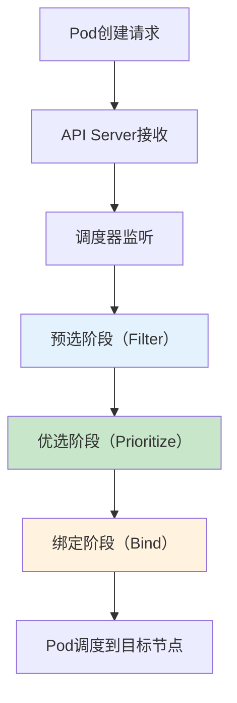
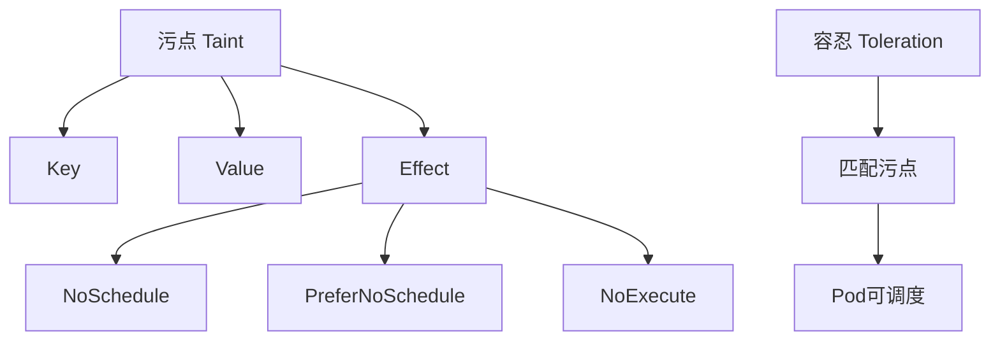

# K8s节点调度策略详解：从原理到生产环境最佳实践

## 情境与背景

在Kubernetes生产环境中，Pod调度是集群高效运行的关键。从简单的NodeSelector到复杂的亲和性、抢占机制，K8s提供了丰富的调度能力。**调度策略的合理配置，直接影响资源利用率、应用性能和业务高可用性。**作为高级DevOps/SRE工程师，深入理解调度器工作原理和各种策略的适用场景，是构建生产级K8s集群的必备技能。

## 一、调度器工作原理

### 1.1 调度器三阶段流程



| 阶段 | 职责 | 说明 |
|:----:|------|------|
| **预选阶段** | 筛选可用节点 | 排除资源不足、不匹配约束等的节点 |
| **优选阶段** | 对候选节点打分 | 基于多个优先级策略计算得分 |
| **绑定阶段** | 选择得分最高节点 | 将Pod与目标节点绑定 |

### 1.2 调度器启动方式

```yaml
# kube-scheduler配置示例
apiVersion: kube-scheduler.config.k8s.io/v1beta3
kind: KubeSchedulerConfiguration
clientConnection:
  kubeconfig: /etc/kubernetes/scheduler.conf
leaderElection:
  leaderElect: true
```

## 二、基础调度策略

### 2.1 NodeName - 直接指定节点

NodeName是最简单的调度策略，直接指定Pod运行的节点名，跳过调度器的预选和优选阶段。

```yaml
apiVersion: v1
kind: Pod
metadata:
  name: nginx
spec:
  nodeName: node-001   # 直接指定节点
  containers:
  - name: nginx
    image: nginx:1.21
```

| 优点 | 缺点 | 适用场景 |
|:----:|------|---------|
| 简单直接 | 无法自动调度到其他节点 | 静态Pod、特定应用绑定 |
| 性能好 | 灵活性差 | 系统组件部署 |

### 2.2 NodeSelector - 标签筛选

NodeSelector根据节点标签筛选调度目标，是常用的基础调度策略。

```yaml
apiVersion: v1
kind: Pod
metadata:
  name: nginx
spec:
  nodeSelector:
    disktype: ssd           # 筛选有ssd标签的节点
    zone: cn-beijing-1      # 筛选特定可用区
  containers:
  - name: nginx
    image: nginx:1.21
```

```bash
# 给节点打标签
kubectl label nodes node-001 disktype=ssd
kubectl label nodes node-001 zone=cn-beijing-1
```

| 优点 | 缺点 | 适用场景 |
|:----:|------|---------|
| 简单易用 | 仅支持硬约束 | 基础资源筛选 |
| 标签灵活 | 不支持复杂逻辑 | 区分节点类型 |

### 2.3 Taints & Tolerations - 污点与容忍

污点（Taint）让节点排斥特定Pod，容忍（Toleration）让Pod能运行在有污点的节点上。



```yaml
# 给节点打污点
kubectl taint nodes node-001 dedicated=database:NoSchedule
```

```yaml
apiVersion: v1
kind: Pod
metadata:
  name: db-pod
spec:
  tolerations:
  - key: "dedicated"
    operator: "Equal"
    value: "database"
    effect: "NoSchedule"
  containers:
  - name: db
    image: mysql:8.0
```

| Effect | 说明 | 适用场景 |
|:------:|------|---------|
| **NoSchedule** | 新Pod无法调度 | 节点隔离 |
| **PreferNoSchedule** | 尽量不调度 | 软隔离 |
| **NoExecute** | 新Pod不调度+现有Pod驱逐 | 故障节点 |

## 三、高级调度策略

### 3.1 NodeAffinity - 节点亲和性

NodeAffinity支持更丰富的节点亲和表达式，包括硬约束（required）和软约束（preferred）。

```yaml
apiVersion: v1
kind: Pod
metadata:
  name: nginx
spec:
  affinity:
    nodeAffinity:
      requiredDuringSchedulingIgnoredDuringExecution:
        nodeSelectorTerms:
        - matchExpressions:
          - key: kubernetes.io/os
            operator: In
            values:
            - linux
      preferredDuringSchedulingIgnoredDuringExecution:
      - weight: 100
        preference:
          matchExpressions:
          - key: disktype
            operator: In
            values:
            - ssd
  containers:
  - name: nginx
    image: nginx:1.21
```

| 操作符 | 说明 |
|:------:|------|
| In | label value包含列表中的值 |
| NotIn | label value不在列表中 |
| Exists | label存在 |
| DoesNotExist | label不存在 |
| Gt | label value大于 |
| Lt | label value小于 |

### 3.2 PodAffinity/PodAntiAffinity - Pod间亲和性

PodAffinity让Pod尽量调度到与特定Pod相近的拓扑域，PodAntiAffinity则相反。

```yaml
apiVersion: v1
kind: Pod
metadata:
  name: web-pod
spec:
  affinity:
    podAffinity:
      requiredDuringSchedulingIgnoredDuringExecution:
      - labelSelector:
          matchExpressions:
          - key: app
            operator: In
            values:
            - redis
        topologyKey: topology.kubernetes.io/zone
    podAntiAffinity:
      preferredDuringSchedulingIgnoredDuringExecution:
      - weight: 100
        podAffinityTerm:
          labelSelector:
            matchExpressions:
            - key: app
              operator: In
              values:
              - web
          topologyKey: kubernetes.io/hostname
  containers:
  - name: web
    image: nginx:1.21
```

| 场景 | 推荐策略 | 说明 |
|:----:|---------|------|
| **Web+Cache** | PodAffinity | 让Web与Redis同AZ |
| **Web多副本** | PodAntiAffinity | 分散到不同节点 |
| **DB主从** | PodAntiAffinity | 必须分离 |

### 3.3 Priority & Preemption - 优先级与抢占

PriorityClass定义Pod优先级，高优先级Pod可在资源不足时抢占低优先级Pod。

```yaml
apiVersion: scheduling.k8s.io/v1
kind: PriorityClass
metadata:
  name: high-priority
value: 1000000
globalDefault: false
description: "高优先级Pod类"
```

```yaml
apiVersion: v1
kind: Pod
metadata:
  name: critical-app
spec:
  priorityClassName: high-priority
  containers:
  - name: app
    image: myapp:v1
```

| 优先级 | value范围 | 说明 |
|:------:|----------|------|
| **系统最高优先级** | 2000000000+ | kube-system组件 |
| **高优先级** | 1000000 | 关键业务 |
| **默认优先级** | 0 | 普通应用 |
| **低优先级** | <0 | 测试应用 |

## 四、优选阶段优先级策略

### 4.1 常用优先级策略

| 策略名称 | 说明 | 权重 |
|:-------:|------|------|
| LeastRequestedPriority | 节点使用率最低优先 | 默认启用 |
| MostRequestedPriority | 节点使用率最高优先 | 默认关闭 |
| BalancedResourceAllocation | CPU/Memory均衡分配 | 默认启用 |
| SelectorSpreadPriority | Pod均匀分布 | 默认启用 |
| ImageLocalityPriority | 节点已有镜像优先 | 默认启用 |
| TaintTolerationPriority | 污点容忍优先 | 默认启用 |

### 4.2 自定义调度器配置

```yaml
apiVersion: kube-scheduler.config.k8s.io/v1beta3
kind: KubeSchedulerConfiguration
profiles:
- schedulerName: my-scheduler
  plugins:
    score:
      disabled:
      - name: TaintTolerationPriority
      enabled:
      - name: LeastRequestedPriority
        weight: 5
```

## 五、生产环境最佳实践

### 5.1 节点分层与标签规划

```yaml
# 节点标签示例
# kubectl label nodes node-001 node-type=compute
# kubectl label nodes node-001 env=prod
# kubectl label nodes node-001 zone=cn-beijing-1
```

| 标签维度 | 说明 | 示例 |
|:-------:|------|------|
| **节点类型** | compute/storage/ingress | node-type=compute |
| **环境** | prod/staging/dev | env=prod |
| **AZ** | cn-beijing-1/2/3 | zone=cn-beijing-1 |
| **资源规格** | large/medium/small | size=large |

### 5.2 应用Pod调度配置示例

```yaml
apiVersion: apps/v1
kind: Deployment
metadata:
  name: web-frontend
spec:
  replicas: 6
  selector:
    matchLabels:
      app: web-frontend
  template:
    metadata:
      labels:
        app: web-frontend
    spec:
      priorityClassName: medium-priority
      nodeSelector:
        env: prod
        node-type: compute
      affinity:
        podAntiAffinity:
          requiredDuringSchedulingIgnoredDuringExecution:
          - labelSelector:
              matchLabels:
                app: web-frontend
            topologyKey: kubernetes.io/hostname
        podAffinity:
          preferredDuringSchedulingIgnoredDuringExecution:
          - weight: 80
            podAffinityTerm:
              labelSelector:
                matchLabels:
                  app: redis-cache
              topologyKey: topology.kubernetes.io/zone
      tolerations:
      - key: "dedicated"
        operator: "Equal"
        value: "web"
        effect: "NoSchedule"
      containers:
      - name: web
        image: nginx:1.21
        resources:
          requests:
            memory: "128Mi"
            cpu: "100m"
          limits:
            memory: "256Mi"
            cpu: "500m"
```

### 5.3 调度失败排查与监控

```bash
# 1. 查看Pod调度状态
kubectl get pods -o wide
kubectl describe pod <pod-name>

# 2. 查看节点标签和污点
kubectl get nodes --show-labels
kubectl describe nodes node-001 | grep -i taint

# 3. 查看调度器日志
kubectl logs -n kube-system kube-scheduler-<node-name>
```

```yaml
# Prometheus监控告警示例
groups:
- name: k8s_scheduler_alerts
  rules:
  - alert: PodUnscheduled
    expr: kube_pod_status_phase{phase="Pending"} > 0
    for: 5m
    labels:
      severity: warning
    annotations:
      summary: "Pod {{ $labels.pod }} 未调度"
```

## 六、面试精简版

### 6.1 一分钟版本

K8s调度分三个阶段：预选阶段（Filter）根据约束条件（NodeName/NodeSelector/Affinity/Taints）筛选节点；优选阶段（Prioritize）对候选节点打分；绑定阶段（Bind）选择得分最高的节点。主要调度策略包括NodeName直接指定、NodeSelector标签筛选、NodeAffinity/PodAffinity亲和性、Taints/Tolerations污点与容忍、PriorityClass优先级与抢占机制。生产环境需根据业务场景组合使用，例如有状态服务用NodeAffinity+Taints隔离，Web前端用PodAntiAffinity实现高可用。

### 6.2 记忆口诀

```
预选过滤不能错，优选打分来排序，
NodeName直接指定，NodeSelector选标签，
亲和反亲和灵活用，污点容忍需配合，
优先级抢占要谨慎，调度监控不能忘。
```

### 6.3 关键词速查

| 关键词 | 说明 |
|:------:|------|
| Filter | 预选阶段，筛选节点 |
| Prioritize | 优选阶段，节点打分 |
| Bind | 绑定阶段，最终调度 |
| requiredDuringScheduling | 硬约束，必须满足 |
| preferredDuringScheduling | 软约束，尽量满足 |
| Taint Effect | 污点效果（NoSchedule等） |
| PriorityClass | Pod优先级 |

> **参考链接**：[SRE运维面试题全解析：从理论到实践（第三部分）]()
