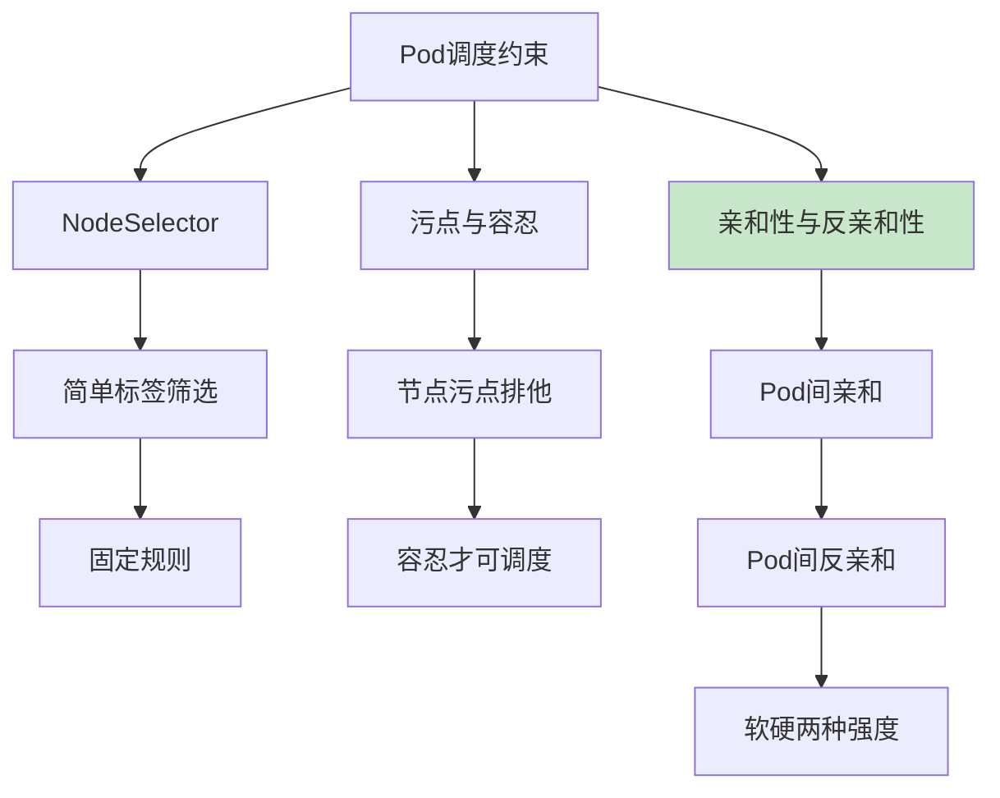
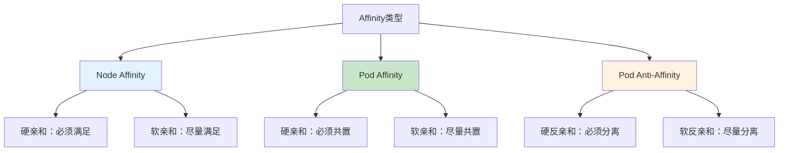
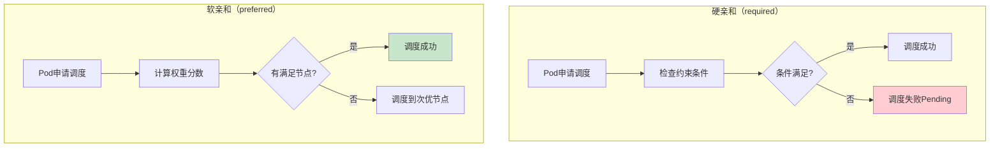
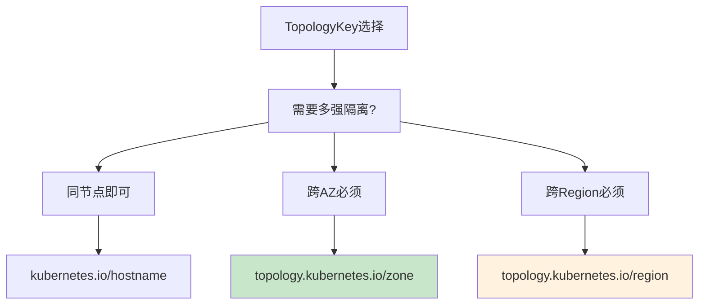
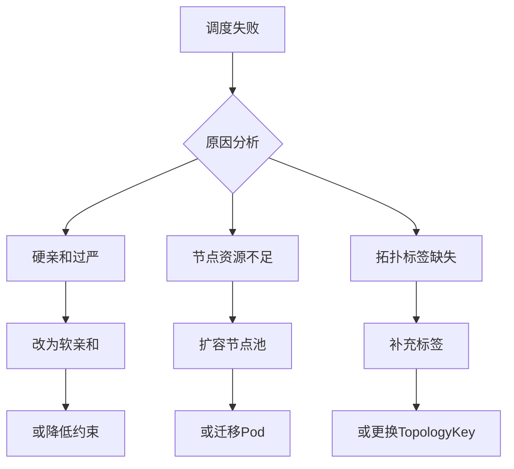

# K8s Pod亲和性与反亲和性详解：高可用架构设计最佳实践

## 情境与背景

在Kubernetes生产环境中，Pod调度策略直接影响业务的高可用性和性能表现。Pod亲和性（Affinity）与反亲和性（Anti-Affinity）是K8s提供的强大调度能力，允许我们根据业务需求控制Pod的部署位置。

很多工程师认为"硬亲和比软亲和更安全"，但这是一个常见的误解。**软亲和（Preferred）和硬亲和（Required）各有适用场景，盲目使用硬亲和可能导致调度失败，反而影响业务可用性。**作为高级DevOps/SRE工程师，理解何时用软、何时用硬，以及如何组合使用，是构建高可用架构的关键技能。

## 一、亲和性核心概念

### 1.1 三种调度约束机制



| 机制 | 作用对象 | 强度控制 | 复杂度 |
|------|---------|---------|--------|
| **NodeSelector** | Pod→Node | 无（仅硬） | 低 |
| **Taints/Tolerations** | Node→Pod | 硬 | 中 |
| **Affinity/Anti-Affinity** | Pod↔Pod | 软+硬 | 高 |

### 1.2 亲和性类型分类



| 类型 | 作用 | 典型场景 |
|------|------|----------|
| **Node Affinity** | Pod与Node的关系 | 调度到特定标签节点 |
| **Pod Affinity** | Pod与Pod共置 | Web与Cache同AZ |
| **Pod Anti-Affinity** | Pod与Pod分离 | 多副本分散部署 |

## 二、软硬亲和核心区别

### 2.1 调度行为对比



| 特性 | 硬亲和（Required） | 软亲和（Preferred） |
|:----:|-------------------|-------------------|
| **调度逻辑** | 必须满足约束 | 尽量满足约束 |
| **调度失败** | Pod保持Pending | 降级到次优节点 |
| **权重控制** | 无 | weight: 1-100 |
| **TopologyKey** | 常用zone/node | 任意 |
| **资源利用率** | 可能较低 | 更高 |

### 2.2 硬亲和适用场景

| 场景 | 配置示例 | 说明 |
|------|---------|------|
| **数据库主从分离** | 硬反亲和，不同节点 | 确保主从不在同一节点 |
| **ETCD集群** | 硬反亲和+跨AZ | 必须分散到不同可用区 |
| **消息队列多副本** | 硬反亲和 | 确保副本不共存 |
| **有状态服务** | 硬亲和特定节点池 | 调度到高性能节点 |

```yaml
# 数据库主从反亲和配置
apiVersion: apps/v1
kind: StatefulSet
metadata:
  name: mysql
spec:
  serviceName: mysql
  replicas: 3
  selector:
    matchLabels:
      app: mysql
  template:
    metadata:
      labels:
        app: mysql
    spec:
      affinity:
        podAntiAffinity:
          requiredDuringSchedulingIgnoredDuringExecution:
            - labelSelector:
                matchExpressions:
                  - key: app
                    operator: In
                    values:
                      - mysql
              topologyKey: kubernetes.io/hostname
      containers:
        - name: mysql
          image: mysql:8.0
```

### 2.3 软亲和适用场景

| 场景 | 配置示例 | 说明 |
|------|---------|------|
| **Web+Cache同AZ** | 软亲和同AZ | 优先同AZ，降级可跨AZ |
| **日志采集+Agent** | 软亲和同节点 | 减少网络开销 |
| **多副本均衡分布** | 软反亲和 | 尽量分散，不强制 |
| **性能敏感服务** | 软亲和高性能节点 | 优先高性能，容忍低性能 |

```yaml
# Web + Redis软亲和配置
apiVersion: apps/v1
kind: Deployment
metadata:
  name: web-backend
spec:
  replicas: 5
  selector:
    matchLabels:
      app: web-backend
  template:
    metadata:
      labels:
        app: web-backend
    spec:
      affinity:
        podAffinity:
          preferredDuringSchedulingIgnoredDuringExecution:
            - weight: 100
              podAffinityTerm:
                labelSelector:
                  matchLabels:
                    app: redis-cache
                topologyKey: topology.kubernetes.io/zone
        podAntiAffinity:
          preferredDuringSchedulingIgnoredDuringExecution:
            - weight: 50
              podAffinityTerm:
                labelSelector:
                  matchLabels:
                    app: web-backend
                topologyKey: kubernetes.io/hostname
      containers:
        - name: web
          image: nginx:1.21
```

## 三、TopologyKey选择策略

### 3.1 常用TopologyKey对比

| TopologyKey | 含义 | 隔离级别 | 适用场景 |
|-------------|------|---------|----------|
| **kubernetes.io/hostname** | 主机名 | 节点级 | 同节点vs不同节点 |
| **topology.kubernetes.io/zone** | 可用区 | AZ级 | 同AZvs跨AZ |
| **topology.kubernetes.io/region** | 地域 | 区域级 | 同regionvs跨region |
| ** topology.disk.example.com** | 自定义域 | 自定义 | 自定义拓扑域 |



### 3.2 TopologyKey选择决策

| 业务需求 | 推荐TopologyKey | 说明 |
|---------|----------------|------|
| **一般多副本分散** | hostname | 简单有效 |
| **高可用同AZ优先** | zone | 同AZ性能好，跨AZ可接受 |
| **超高级别高可用** | region | 极端故障场景 |
| **自定义隔离域** | 自定义key | 特定业务逻辑 |

## 四、生产环境最佳实践

### 4.1 高可用Web应用架构

```yaml
# 高可用Web应用 - 组合使用硬软亲和
apiVersion: apps/v1
kind: Deployment
metadata:
  name: web-frontend
spec:
  replicas: 6
  strategy:
    type: RollingUpdate
  selector:
    matchLabels:
      app: web-frontend
      tier: frontend
  template:
    metadata:
      labels:
        app: web-frontend
        tier: frontend
    spec:
      affinity:
        # 硬反亲和：确保副本在不同节点
        podAntiAffinity:
          requiredDuringSchedulingIgnoredDuringExecution:
            - labelSelector:
                matchLabels:
                  app: web-frontend
              topologyKey: kubernetes.io/hostname

        # 软亲和：同AZ优先（减少跨AZ流量）
        podAffinity:
          preferredDuringSchedulingIgnoredDuringExecution:
            - weight: 100
              podAffinityTerm:
                labelSelector:
                  matchLabels:
                    app: web-frontend
                topologyKey: topology.kubernetes.io/zone
      containers:
        - name: nginx
          image: nginx:1.21
          resources:
            requests:
              memory: "128Mi"
              cpu: "100m"
            limits:
              memory: "256Mi"
              cpu: "500m"
```

### 4.2 有状态数据库架构

```yaml
# MongoDB副本集 - 硬反亲和跨AZ部署
apiVersion: apps/v1
kind: StatefulSet
metadata:
  name: mongodb
spec:
  serviceName: mongodb
  replicas: 3
  selector:
    matchLabels:
      app: mongodb
  template:
    metadata:
      labels:
        app: mongodb
    spec:
      affinity:
        podAntiAffinity:
          requiredDuringSchedulingIgnoredDuringExecution:
            - labelSelector:
                matchLabels:
                  app: mongodb
              topologyKey: topology.kubernetes.io/zone
      containers:
        - name: mongodb
          image: mongo:5.0
          ports:
            - containerPort: 27017
          volumeMounts:
            - name: mongodb-data
              mountPath: /data/db
  volumeClaimTemplates:
    - metadata:
        name: mongodb-data
      spec:
        accessModes: ["ReadWriteOnce"]
        resources:
          requests:
            storage: 50Gi
```

### 4.3 缓存服务架构

```yaml
# Redis缓存 - 软亲和同节点优先
apiVersion: apps/v1
kind: Deployment
metadata:
  name: redis-cache
spec:
  replicas: 3
  selector:
    matchLabels:
      app: redis-cache
  template:
    metadata:
      labels:
        app: redis-cache
    spec:
      affinity:
        # 软反亲和：尽量不同节点，但不强制
        podAntiAffinity:
          preferredDuringSchedulingIgnoredDuringExecution:
            - weight: 50
              podAffinityTerm:
                labelSelector:
                  matchLabels:
                    app: redis-cache
                topologyKey: kubernetes.io/hostname

        # 软亲和：与Web应用同AZ优先
        podAffinity:
          preferredDuringSchedulingIgnoredDuringExecution:
            - weight: 80
              podAffinityTerm:
                labelSelector:
                  matchLabels:
                    app: web-frontend
                topologyKey: topology.kubernetes.io/zone
      containers:
        - name: redis
          image: redis:7.0-alpine
          resources:
            requests:
              memory: "512Mi"
              cpu: "250m"
            limits:
              memory: "1Gi"
              cpu: "500m"
```

### 4.4 ETCD集群架构

```yaml
# ETCD集群 - 硬反亲和跨AZ
apiVersion: apps/v1
kind: StatefulSet
metadata:
  name: etcd
spec:
  serviceName: etcd
  replicas: 3
  selector:
    matchLabels:
      app: etcd
  template:
    metadata:
      labels:
        app: etcd
    spec:
      affinity:
        podAntiAffinity:
          requiredDuringSchedulingIgnoredDuringExecution:
            - labelSelector:
                matchLabels:
                  app: etcd
              topologyKey: topology.kubernetes.io/zone
      containers:
        - name: etcd
          image: quay.io/coreos/etcd:v3.5.9
          env:
            - name: INITIAL_CLUSTER_SIZE
              value: "3"
          ports:
            - containerPort: 2379
              name: client
            - containerPort: 2380
              name: peer
```

## 五、调度失败排查与处理

### 5.1 常见调度失败原因

| 错误类型 | 原因分析 | 解决方案 |
|---------|---------|---------|
| **0/N nodes available** | 硬亲和约束无法满足 | 降低约束或扩容节点 |
| **No nodes match affinity** | 标签不存在 | 检查拓扑标签配置 |
| **No nodes match anti-affinity** | 节点数不足 | 减少副本数或节点数 |
| **Affinity timeout** | 调度器超时 | 优化调度配置 |

```bash
# 1. 查看Pod调度状态
kubectl get pods -o wide | grep -v Running

# 2. 查看调度失败原因
kubectl describe pod <pod-name> | grep -A 20 "Events"

# 3. 查看节点标签
kubectl get nodes --show-labels

# 4. 检查拓扑标签
kubectl get nodes -L topology.kubernetes.io/zone -L kubernetes.io/hostname
```

### 5.2 调度优化策略



## 六、面试精简版

### 6.1 一分钟版本

Pod亲和性分软硬：硬亲和（required）必须满足约束否则调度失败，适合高可用场景如数据库主从分离；软亲和（preferred）尽量满足，调度器可灵活处理，适合性能优化如同AZ部署。不能简单说硬亲和更安全，要根据业务场景选择。生产环境最佳实践是组合使用：硬反亲和保证Pod分散到不同节点+软亲和优化同AZ部署。同时注意硬亲和可能导致Pending，需要配合容量规划和监控。

### 6.2 记忆口诀

```
硬亲和必须满足，软亲和尽量满足，
高可用用硬反亲和，性能优化用软亲和，
TopologyKey按需选，hostname简单zone跨AZ，
组合使用最全面，容量规划不能忘。
```

### 6.3 关键词速查

| 关键词 | 说明 |
|:------:|------|
| `requiredDuringSchedulingIgnoredDuringExecution` | 硬亲和/反亲和 |
| `preferredDuringSchedulingIgnoredDuringExecution` | 软亲和/反亲和 |
| `topologyKey` | 拓扑域键 |
| `kubernetes.io/hostname` | 节点级隔离 |
| `topology.kubernetes.io/zone` | 可用区级隔离 |

> **参考链接**：[SRE运维面试题全解析：从理论到实践（第三部分）]()