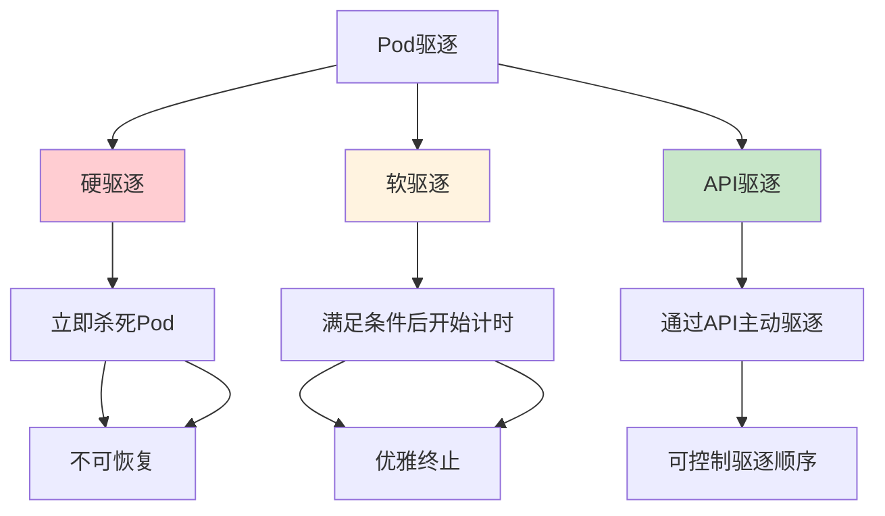
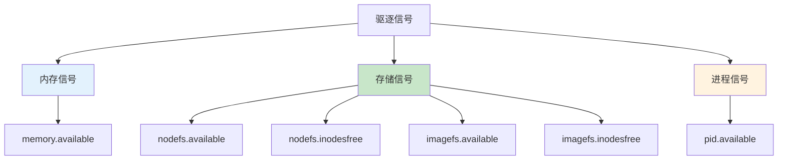
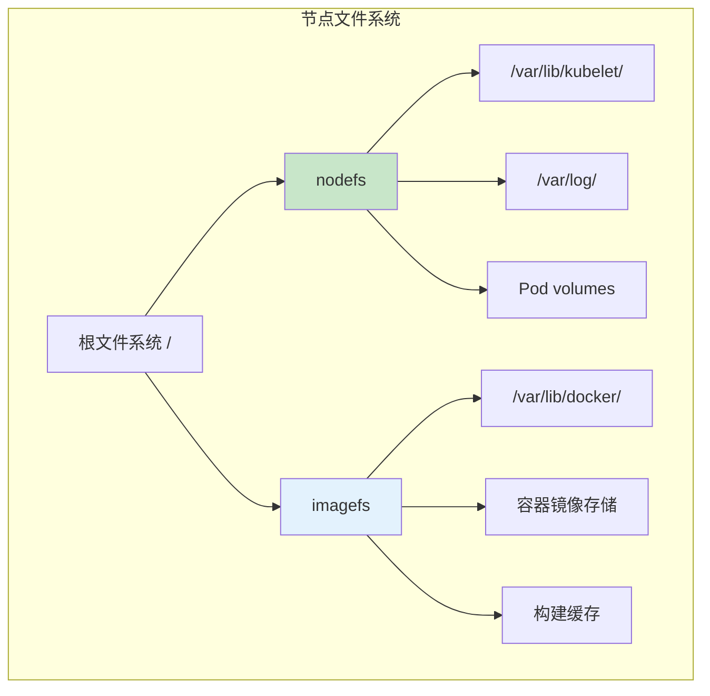
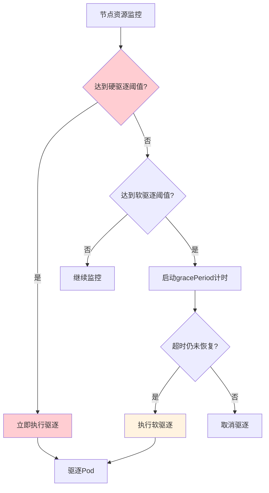
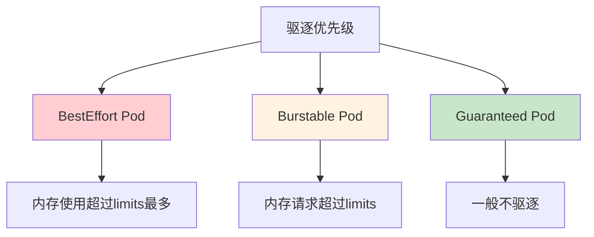
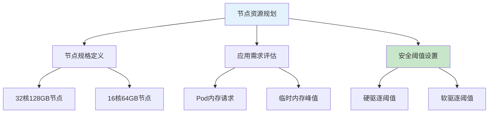

# K8s Pod硬驱逐与软驱逐详解：资源阈值配置与生产环境最佳实践

## 情境与背景

在Kubernetes集群中，节点资源管理是保障集群稳定性的关键。当节点资源紧张时，kubelet会主动驱逐部分Pod以释放资源。**理解硬驱逐（Hard Eviction）和软驱逐（Soft Eviction）的阈值条件，是生产环境避免意外Pod丢失、保障业务连续性的核心技能。**

作为高级DevOps/SRE工程师，需要深入理解K8s的驱逐机制，合理配置阈值参数，在保障节点稳定性的同时，最大限度减少对业务的影响。

## 一、Pod驱逐机制概述

### 1.1 驱逐类型分类



| 驱逐类型 | 触发方式 | 特点 |
|:--------:|----------|------|
| **硬驱逐** | 资源达到硬阈值 | 立即杀死Pod，无宽限期 |
| **软驱逐** | 资源达到软阈值 | 有gracePeriod宽限期 |
| **API驱逐** | kubectl evict手动触发 | 可控制驱逐顺序和条件 |

### 1.2 驱逐信号体系



## 二、驱逐阈值详解

### 2.1 硬驱逐阈值（Hard Eviction）

硬驱逐一旦触发，kubelet立即终止Pod，不等待任何优雅期限。

```yaml
# kubelet配置示例
apiVersion: kubelet.config.k8s.io/v1beta1
kind: KubeletConfiguration
evictionHard:
  memory.available: "256Mi"
  nodefs.available: "5%"
  nodefs.inodesfree: "4%"
  imagefs.available: "10%"
  imagefs.inodesfree: "4%"
  pid.available: "4%"
```

| 驱逐信号 | 默认值 | 类型 | 说明 |
|---------|:------:|:----:|------|
| **memory.available** | 256Mi | 内存 | 节点可用内存低于此值触发 |
| **nodefs.available** | 5% | 存储 | nodefs文件系统可用空间低于此值触发 |
| **nodefs.inodesfree** | 4% | inode | inode可用数量低于此值触发 |
| **imagefs.available** | 10% | 存储 | imagefs文件系统可用空间低于此值触发 |
| **imagefs.inodesfree** | 4% | inode | imagefs inode可用数量低于此值触发 |
| **pid.available** | 4% | 进程 | 可用PID数量低于此值触发 |

### 2.2 软驱逐阈值（Soft Eviction）

软驱逐在达到阈值后进入观察期，只有超过gracePeriod仍未恢复才会真正驱逐。

```yaml
# kubelet配置示例
apiVersion: kubelet.config.k8s.io/v1beta1
kind: KubeletConfiguration
evictionSoft:
  memory.available: "500Mi"
  nodefs.available: "10%"
  imagefs.available: "15%"
evictionSoftGracePeriod:
  memory.available: "30s"
  nodefs.available: "30s"
  imagefs.available: "30s"
evictionPressureTransitionPeriod: 30s
```

| 驱逐信号 | 默认值 | gracePeriod | 说明 |
|---------|:------:|:-----------:|------|
| **memory.available** | 500Mi | 30s | 软驱逐内存阈值 |
| **nodefs.available** | 10% | 30s | 软驱逐nodefs阈值 |
| **imagefs.available** | 15% | 30s | 软驱逐imagefs阈值 |

### 2.3 imagefs与nodefs区分



| 文件系统 | kubelet标志 | 监控路径 | 触发条件 |
|---------|-------------|---------|---------|
| **nodefs** | `--root-dir` | `/var/lib/kubelet`、`/var/log` | `nodefs.available`、`nodefs.inodesfree` |
| **imagefs** | `--storage-driver-root` | `/var/lib/docker`、`overlay2` | `imagefs.available`、`imagefs.inodesfree` |

### 2.4 阈值计算方式

| 计算方式 | 示例 | 说明 |
|---------|-----|------|
| **绝对值** | `memory.available<256Mi` | 直接比较数值 |
| **百分比** | `nodefs.available<5%` | 可用空间占总空间的百分比 |
| **比例值** | `memory.available<10%` | 可用内存占总内存的百分比 |

## 三、驱逐触发流程

### 3.1 kubelet驱逐决策流程



### 3.2 Pod驱逐顺序

当需要驱逐多个Pod时，kubelet按照以下优先级排序：



| Pod QoS等级 | 驱逐优先级 | 判定标准 |
|:-----------:|:----------:|----------|
| **BestEffort** | 最高 | 资源使用最少、运行时间最长 |
| **Burstable** | 中等 | 请求超过限制、运行时间 |
| **Guaranteed** | 最低 | 仅在极端情况驱逐 |

## 四、生产环境配置最佳实践

### 4.1 kubelet配置示例

```yaml
# /var/lib/kubelet/config.yaml
apiVersion: kubelet.config.k8s.io/v1beta1
kind: KubeletConfiguration
address: "0.0.0.0"
port: 10250
readOnlyPort: 10255

# 资源清理阈值
evictionHard:
  memory.available: "200Mi"
  nodefs.available: "5%"
  nodefs.inodesfree: "4%"
  imagefs.available: "10%"
  imagefs.inodesfree: "4%"
  pid.available: "4%

evictionSoft:
  memory.available: "1Gi"
  nodefs.available: "10%"
  imagefs.available: "15%

evictionSoftGracePeriod:
  memory.available: "60s"
  nodefs.available: "60s"
  imagefs.available: "60s"

evictionPressureTransitionPeriod: 30s
evictionMinimumReclaim:
  memory.available: "100Mi"
  nodefs.available: "5%"
  imagefs.available: "5%
```

### 4.2 驱逐阈值规划



| 节点规格 | 硬驱逐内存 | 软驱逐内存 | 推荐理由 |
|:--------:|:---------:|:---------:|----------|
| **32C128G** | 2Gi | 4Gi | 预留1.5-2%给系统 |
| **16C64G** | 1Gi | 2Gi | 预留1.5-2%给系统 |
| **8C32G** | 512Mi | 1Gi | 预留约2%给系统 |

### 4.3 Pod资源限制建议

```yaml
# Pod配置示例
apiVersion: v1
kind: Pod
metadata:
  name: production-app
spec:
  containers:
    - name: app
      image: myapp:latest
      resources:
        requests:
          memory: "512Mi"
          cpu: "500m"
        limits:
          memory: "1Gi"
          cpu: "1000m"
      # 生产环境必须设置limits
```

| 配置策略 | requests | limits | 适用场景 |
|:--------:|:--------:|:------:|----------|
| **Guaranteed** | 等于limits | 等于requests | 关键业务Pod |
| **Burstable** | 设置，低于limits | 可选设置 | 一般业务Pod |
| **BestEffort** | 不设置 | 不设置 | 测试/临时Pod |

### 4.4 监控告警配置

```yaml
# eviction-alerts.yaml
groups:
  - name: eviction-alerts
    rules:
      - alert: NodeMemoryPressure
        expr: node_memory_Available_bytes < 500000000
        for: 1m
        labels:
          severity: warning
        annotations:
          summary: "Node {{ $labels.node }} memory pressure"
          description: "Available memory is below 500Mi"

      - alert: NodeDiskPressure
        expr: |
          (node_filesystem_avail_bytes{mountpoint="/"} /
           node_filesystem_size_bytes{mountpoint="/"}) < 0.15
        for: 5m
        labels:
          severity: warning
        annotations:
          summary: "Node {{ $labels.node }} disk pressure"
          description: "Disk available is below 15%"

      - alert: PodEvicted
        expr: increase(kube_pod_status_evicted_total[5m]) > 0
        labels:
          severity: warning
        annotations:
          summary: "{{ $value }} pods evicted on {{ $labels.node }}"
```

## 五、故障排查与恢复

### 5.1 排查命令

```bash
# 1. 查看节点压力状态
kubectl get nodes -o jsonpath='{range .items[*]}{.metadata.name}{"\t"}{.status.conditions[?(@.type=="MemoryPressure")].status}{"\n"}{end}'

# 2. 查看驱逐历史
kubectl get events --field-selector involvedObject.kind=Pod | grep -i evict

# 3. 查看Pod驱逐详情
kubectl describe pod <pod-name> | grep -A 10 "Events"

# 4. 查看节点资源状态
kubectl top node <node-name>

# 5. 查看kubelet驱逐配置
kubectl get nodes -o jsonpath='{range .items[*]}{.metadata.name}{"\n"}{.status.capacity.memory}{"\n"}{end}'

# 6. 查看系统日志中的驱逐信息
journalctl -u kubelet | grep -i eviction
```

### 5.2 常见问题与解决

| 问题现象 | 可能原因 | 解决方案 |
|---------|---------|---------|
| **Pod频繁被驱逐** | 内存阈值设置过低 | 调高evictionHard阈值 |
| **业务Pod被驱逐** | 未设置resources.limits | 为Pod配置合理limits |
| **驱逐后无法恢复** | 调度到问题节点 | 检查目标节点资源状态 |
| **imagefs满** | 大量未使用镜像 | 定期清理镜像 `docker image prune -a` |

### 5.3 驱逐恢复流程

```bash
# 1. 确认节点状态
kubectl get nodes

# 2. 查看驱逐原因
kubectl describe node <node-name> | grep -A 20 "Conditions"

# 3. 释放节点资源
# 清理Docker镜像
docker system prune -af

# 清理日志
journalctl --vacuum-size=500M

# 4. 验证资源恢复
df -h
free -m

# 5. 等待节点恢复
# 节点自动从Pressure状态恢复
```

## 六、面试精简版

### 6.1 一分钟版本

K8s驱逐阈值分硬驱逐和软驱逐：硬驱逐达到阈值立即杀Pod，软驱逐有gracePeriod（如30-60秒）宽限期。常见驱逐信号包括memory.available（硬256Mi软500Mi）、nodefs.available（硬5%软10%）、imagefs.available（硬10%软15%）以及inode相关信号。生产环境要配置合理阈值、给Pod设置resources.limits、开启监控告警，提前发现资源压力。

### 6.2 记忆口诀

```
硬驱逐立即杀，软驱逐有宽限，
memory256Mi硬，500Mi软，
nodefs5%硬，10%软，
imagefs10%硬，15%软，
Pod要设limits，监控告警要配置。
```

### 6.3 关键词速查

| 参数 | 说明 |
|------|------|
| `--eviction-hard` | 硬驱逐阈值 |
| `--eviction-soft` | 软驱逐阈值 |
| `--eviction-soft-grace-period` | 软驱逐宽限期 |
| `memory.available` | 内存可用信号 |
| `nodefs.available` | nodefs存储信号 |
| `imagefs.available` | imagefs存储信号 |

> **参考链接**：[SRE运维面试题全解析：从理论到实践（第三部分）]()