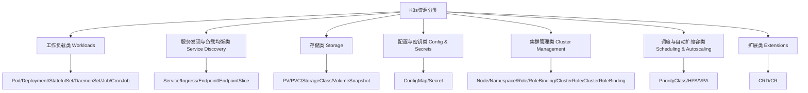

# K8s资源体系详解：从工作负载到自定义资源生产最佳实践

## 情境与背景

Kubernetes的核心设计理念是「以资源为中心」的声明式API。理解K8s的资源体系，掌握各类资源的用途和最佳实践，是每一位高级DevOps/SRE工程师必备的核心知识。**从基本的Pod/Deployment到自定义CRD，K8s资源体系完整覆盖了应用生命周期、服务发现、数据持久化、权限管理等所有方面。**

## 一、K8s资源分类总览

### 1.1 资源分类体系



### 1.2 资源查看命令

```bash
# 查看所有资源
kubectl api-resources

# 按分类查看
kubectl api-resources --namespaced=true    # 命名空间级资源
kubectl api-resources --namespaced=false   # 集群级资源
```

## 二、工作负载类 Workloads

### 2.1 Pod

Pod是K8s的最小部署单元，包含一个或多个容器。

```yaml
apiVersion: v1
kind: Pod
metadata:
  name: simple-pod
spec:
  containers:
  - name: app
    image: nginx:1.21
    ports:
    - containerPort: 80
```

### 2.2 Deployment - 无状态应用

Deployment适合部署无状态应用，支持滚动更新、回滚、扩缩容。

```yaml
apiVersion: apps/v1
kind: Deployment
metadata:
  name: web-frontend
spec:
  replicas: 3
  selector:
    matchLabels:
      app: web-frontend
  strategy:
    type: RollingUpdate
    rollingUpdate:
      maxUnavailable: 25%
      maxSurge: 25%
  template:
    metadata:
      labels:
        app: web-frontend
    spec:
      containers:
      - name: web
        image: nginx:1.21
        resources:
          requests:
            memory: "128Mi"
            cpu: "100m"
          limits:
            memory: "256Mi"
            cpu: "500m"
```

### 2.3 StatefulSet - 有状态应用

StatefulSet适合部署有状态应用，提供稳定的网络标识和持久存储。

```yaml
apiVersion: apps/v1
kind: StatefulSet
metadata:
  name: mysql
spec:
  serviceName: mysql
  replicas: 3
  selector:
    matchLabels:
      app: mysql
  template:
    metadata:
      labels:
        app: mysql
    spec:
      containers:
      - name: mysql
        image: mysql:8.0
        volumeMounts:
        - name: data
          mountPath: /var/lib/mysql
  volumeClaimTemplates:
  - metadata:
      name: data
    spec:
      accessModes: ["ReadWriteOnce"]
      resources:
        requests:
          storage: 100Gi
```

### 2.4 DaemonSet - 每个节点一个Pod

DaemonSet让每个节点（或符合条件的节点）都运行一个Pod副本。

```yaml
apiVersion: apps/v1
kind: DaemonSet
metadata:
  name: filebeat
spec:
  selector:
    matchLabels:
      app: filebeat
  template:
    metadata:
      labels:
        app: filebeat
    spec:
      tolerations:
      - key: "node-role.kubernetes.io/control-plane"
        operator: "Exists"
        effect: "NoSchedule"
      containers:
      - name: filebeat
        image: elastic/filebeat:7.15
        volumeMounts:
        - name: varlibdockercontainers
          mountPath: /var/lib/docker/containers
      volumes:
      - name: varlibdockercontainers
        hostPath:
          path: /var/lib/docker/containers
```

### 2.5 Job & CronJob - 一次性/定时任务

```yaml
# Job - 一次性任务
apiVersion: batch/v1
kind: Job
metadata:
  name: batch-job
spec:
  template:
    spec:
      restartPolicy: OnFailure
      containers:
      - name: job
        image: mybatchapp:v1
```

```yaml
# CronJob - 定时任务
apiVersion: batch/v1
kind: CronJob
metadata:
  name: daily-backup
spec:
  schedule: "0 2 * * *"
  jobTemplate:
    spec:
      template:
        spec:
          restartPolicy: OnFailure
          containers:
          - name: backup
            image: mybackupapp:v1
```

## 三、服务发现与负载均衡类

### 3.1 Service - 服务访问

```yaml
# ClusterIP Service（默认）
apiVersion: v1
kind: Service
metadata:
  name: web-service
spec:
  selector:
    app: web-frontend
  type: ClusterIP
  ports:
  - protocol: TCP
    port: 80
    targetPort: 80
```

```yaml
# NodePort Service
apiVersion: v1
kind: Service
metadata:
  name: web-service
spec:
  selector:
    app: web-frontend
  type: NodePort
  ports:
  - protocol: TCP
    port: 80
    targetPort: 80
    nodePort: 30080
```

```yaml
# LoadBalancer Service
apiVersion: v1
kind: Service
metadata:
  name: web-service
spec:
  selector:
    app: web-frontend
  type: LoadBalancer
  ports:
  - protocol: TCP
    port: 80
    targetPort: 80
```

### 3.2 Ingress - 统一入口流量

```yaml
apiVersion: networking.k8s.io/v1
kind: Ingress
metadata:
  name: web-ingress
  annotations:
    nginx.ingress.kubernetes.io/rewrite-target: /
spec:
  ingressClassName: nginx
  rules:
  - host: myapp.example.com
    http:
      paths:
      - path: /
        pathType: Prefix
        backend:
          service:
            name: web-service
            port:
              number: 80
```

## 四、存储类 Storage

### 4.1 PV/PVC

```yaml
# PersistentVolume
apiVersion: v1
kind: PersistentVolume
metadata:
  name: pv-100g
spec:
  capacity:
    storage: 100Gi
  accessModes:
    - ReadWriteOnce
  persistentVolumeReclaimPolicy: Retain
  storageClassName: manual
  hostPath:
    path: /mnt/data
```

```yaml
# PersistentVolumeClaim
apiVersion: v1
kind: PersistentVolumeClaim
metadata:
  name: my-pvc
spec:
  accessModes:
    - ReadWriteOnce
  resources:
    requests:
      storage: 50Gi
  storageClassName: manual
```

### 4.2 StorageClass - 动态存储

```yaml
apiVersion: storage.k8s.io/v1
kind: StorageClass
metadata:
  name: fast
provisioner: kubernetes.io/aws-ebs
parameters:
  type: gp3
  fsType: ext4
```

## 五、配置与密钥类

### 5.1 ConfigMap - 应用配置

```yaml
apiVersion: v1
kind: ConfigMap
metadata:
  name: app-config
data:
  app.properties: |
    log.level=INFO
    db.host=mysql
    db.port=3306
```

```yaml
# 在Pod中使用
apiVersion: v1
kind: Pod
metadata:
  name: configmap-pod
spec:
  containers:
  - name: app
    image: myapp:v1
    volumeMounts:
    - name: config-volume
      mountPath: /etc/config
  volumes:
  - name: config-volume
    configMap:
      name: app-config
```

### 5.2 Secret - 敏感信息

```yaml
apiVersion: v1
kind: Secret
metadata:
  name: db-secret
type: Opaque
data:
  username: dXNlcjE=   # base64编码
  password: cGFzc3dvcmQ=
```

## 六、集群管理类

### 6.1 Namespace - 命名空间

```bash
# 创建命名空间
kubectl create namespace dev
kubectl create namespace prod

# 在命名空间中操作
kubectl get pods -n dev
kubectl config set-context --current --namespace=prod
```

### 6.2 RBAC - 权限管理

```yaml
# Role - 命名空间级权限
apiVersion: rbac.authorization.k8s.io/v1
kind: Role
metadata:
  name: pod-reader
  namespace: default
rules:
- apiGroups: [""]
  resources: ["pods"]
  verbs: ["get", "list"]
```

```yaml
# RoleBinding - 权限绑定
apiVersion: rbac.authorization.k8s.io/v1
kind: RoleBinding
metadata:
  name: read-pods
  namespace: default
subjects:
- kind: User
  name: jane
roleRef:
  kind: Role
  name: pod-reader
  apiGroup: rbac.authorization.k8s.io
```

## 七、调度与自动扩缩容类

### 7.1 PriorityClass - Pod优先级

```yaml
apiVersion: scheduling.k8s.io/v1
kind: PriorityClass
metadata:
  name: high-priority
value: 1000000
globalDefault: false
description: "高优先级Pod"
```

### 7.2 HPA - 水平Pod自动扩缩容

```yaml
apiVersion: autoscaling/v2
kind: HorizontalPodAutoscaler
metadata:
  name: web-hpa
spec:
  scaleTargetRef:
    apiVersion: apps/v1
    kind: Deployment
    name: web-frontend
  minReplicas: 2
  maxReplicas: 10
  metrics:
  - type: Resource
    resource:
      name: cpu
      target:
        type: Utilization
        averageUtilization: 50
```

## 八、扩展类 Extensions

### 8.1 CRD - 自定义资源

```yaml
apiVersion: apiextensions.k8s.io/v1
kind: CustomResourceDefinition
metadata:
  name: myapps.example.com
spec:
  group: example.com
  names:
    kind: MyApp
    plural: myapps
    singular: myapp
  scope: Namespaced
  versions:
  - name: v1
    served: true
    storage: true
    schema:
      openAPIV3Schema:
        type: object
        properties:
          spec:
            type: object
            properties:
              replicas:
                type: integer
```

## 九、生产环境最佳实践

### 9.1 资源命名规范

| 资源类型 | 命名建议 |
|:-------:|--------|
| Deployment/StatefulSet | 应用名-环境（如web-prod） |
| Service | 应用名-service（如web-frontend-service） |
| ConfigMap | 应用名-config（如app-config） |
| Secret | 应用名-secret（如db-secret） |
| Namespace | 环境名（如dev/staging/prod） |

### 9.2 资源限制设置

```yaml
apiVersion: apps/v1
kind: Deployment
metadata:
  name: web-frontend
spec:
  template:
    spec:
      containers:
      - name: web
        image: nginx:1.21
        resources:
          requests:
            memory: "128Mi"
            cpu: "100m"
          limits:
            memory: "256Mi"
            cpu: "500m"
```

### 9.3 监控与告警

```yaml
# Prometheus监控资源使用
groups:
- name: k8s_resource_alerts
  rules:
  - alert: PodCpuUsageHigh
    expr: sum(rate(container_cpu_usage_seconds_total{container!="POD"}[5m])) by (pod) > 0.8
    for: 5m
    labels:
      severity: warning
    annotations:
      summary: "Pod {{ $labels.pod }} CPU使用率超过80%"
```

## 十、面试精简版

### 10.1 一分钟版本

K8s资源可以分为7大类：工作负载类（Pod/Deployment/StatefulSet/DaemonSet/Job/CronJob）、服务发现与负载均衡类（Service/Ingress）、存储类（PV/PVC/StorageClass）、配置与密钥类（ConfigMap/Secret）、集群管理类（Node/Namespace/RBAC）、调度与自动扩缩容类（PriorityClass/HPA）、扩展类（CRD/CR）。生产环境无状态Web应用用Deployment+HPA，有状态数据库用StatefulSet+PVC，定时任务用CronJob。

### 10.2 记忆口诀

```
资源分类要记牢，工作负载最重要，
Pod是最小部署单元，Deployment无状态强，
StatefulSet有状态稳，DaemonSet每个节点跑，
Job/CronJob定时任务，服务发现Service靠，
Ingress统一流量口，存储PV/PVC管，
ConfigMap/Secret配置密钥，RBAC权限控，
HPA/VPA自动扩缩，CRD无限扩展能力。
```

### 10.3 关键词速查

| 分类 | 核心资源 |
|:----:|---------|
| 工作负载 | Pod/Deployment/StatefulSet/DaemonSet/Job/CronJob |
| 服务发现 | Service/Ingress/Endpoint |
| 存储 | PV/PVC/StorageClass |
| 配置密钥 | ConfigMap/Secret |
| 集群管理 | Namespace/Role/RoleBinding |
| 调度扩缩容 | PriorityClass/HPA/VPA |

> **参考链接**：[SRE运维面试题全解析：从理论到实践（第三部分）]()
