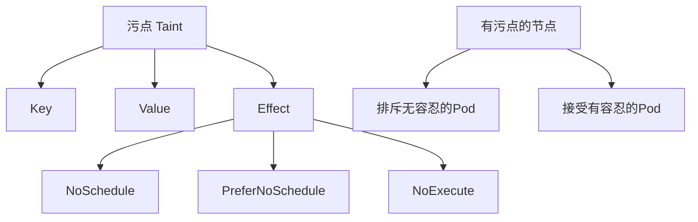
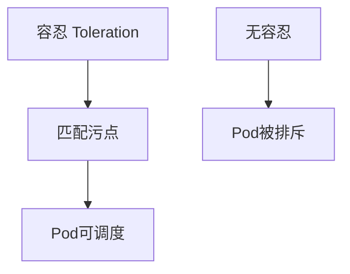
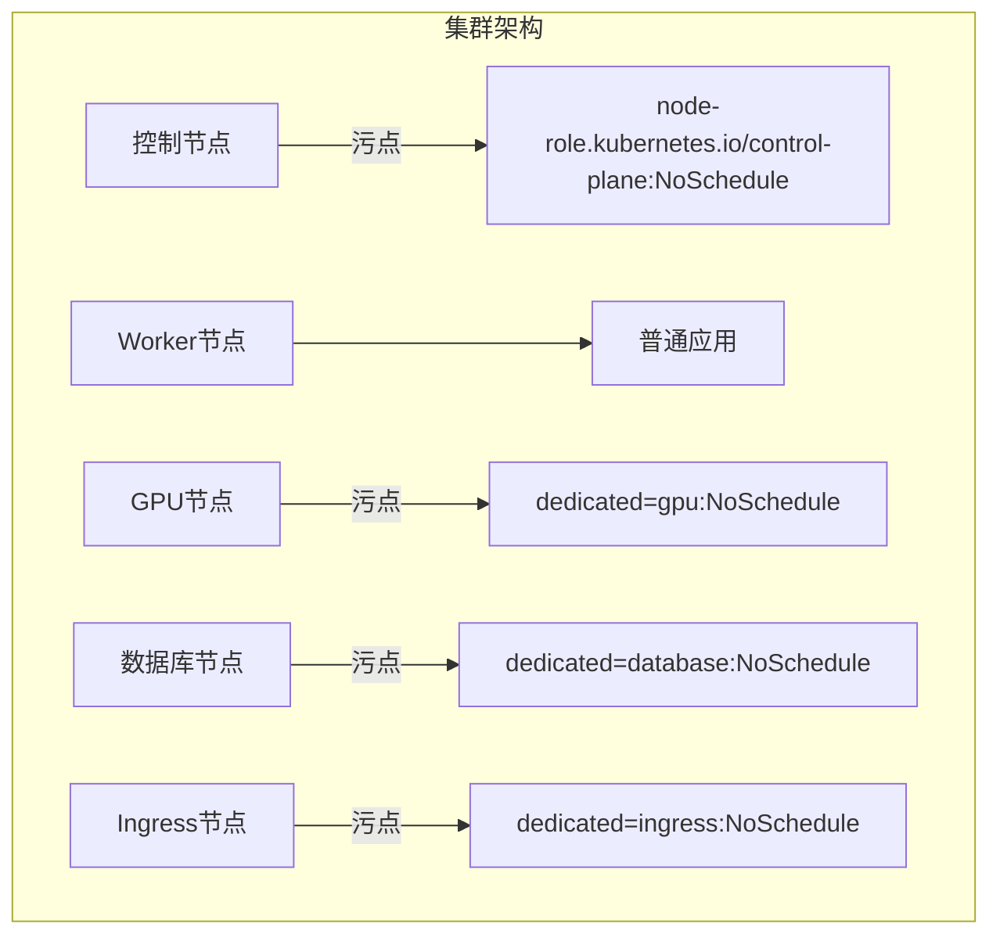

# K8s污点与容忍详解：节点隔离与专用节点最佳实践

## 情境与背景

在Kubernetes生产环境中，我们经常需要控制Pod在哪些节点上运行，例如专用GPU节点给AI作业用、数据库节点隔离出来给数据库用、控制节点不跑业务Pod等。**污点（Taint）与容忍（Toleration）是K8s提供的用于实现节点隔离和Pod选择性调度的核心机制。**

作为高级DevOps/SRE工程师，深入理解污点与容忍的工作原理、掌握各种Effect的区别和适用场景，是构建生产级K8s集群的必备技能。

## 一、污点与容忍核心概念

### 1.1 什么是污点（Taint）

污点是给节点（Node）添加的标签，具有排斥Pod的能力，让某些Pod无法调度到该节点上。



污点的三个组成部分：
- **Key**：污点的键（例如`dedicated`）
- **Value**：污点的值（例如`gpu`）
- **Effect**：污点的效果（NoSchedule/PreferNoSchedule/NoExecute）

### 1.2 什么是容忍（Toleration）

容忍是给Pod添加的配置，让Pod能够容忍节点上的某些污点，从而调度到该节点上。



容忍的主要配置项：
- **key/value**：要匹配的污点的key/value
- **operator**：`Equal`（值相等）或`Exists`（只要key存在）
- **effect**：要匹配的污点的effect，不指定则匹配所有
- **tolerationSeconds**：NoExecute场景下Pod在节点上的存活时间

## 二、污点Effect详解

### 2.1 NoSchedule - 不调度新Pod

NoSchedule是最常用的污点效果，让**新Pod无法调度到该节点上**，但**节点上已运行的Pod不受影响**。

```yaml
# 给节点打NoSchedule污点
kubectl taint nodes node-001 dedicated=gpu:NoSchedule
```

```yaml
# Pod配置容忍NoSchedule污点
apiVersion: v1
kind: Pod
metadata:
  name: gpu-pod
spec:
  tolerations:
  - key: "dedicated"
    operator: "Equal"
    value: "gpu"
    effect: "NoSchedule"
  containers:
  - name: cuda
    image: nvidia/cuda:11.0
```

| 优点 | 缺点 | 适用场景 |
|:----:|------|---------|
| 新Pod不调度 | 已有Pod继续运行 | 专用资源节点 |
| 实现节点隔离 | - | GPU/DB专用节点 |

### 2.2 PreferNoSchedule - 尽量不调度

PreferNoSchedule是软约束，**尽量不让Pod调度到该节点上**，但如果没有其他节点可选，Pod还是能调度上去。

```yaml
kubectl taint nodes node-001 dedicated=test:PreferNoSchedule
```

```yaml
apiVersion: v1
kind: Pod
metadata:
  name: test-pod
spec:
  tolerations:
  - key: "dedicated"
    operator: "Equal"
    value: "test"
    effect: "PreferNoSchedule"
  containers:
  - name: test
    image: busybox:1.34
```

| 优点 | 缺点 | 适用场景 |
|:----:|------|---------|
| 软隔离，不强制 | 可能被调度 | 测试节点标记 |

### 2.3 NoExecute - 不调度+驱逐

NoExecute是最严格的污点效果，**不仅不让新Pod调度，还会驱逐节点上已运行的Pod**。

```yaml
kubectl taint nodes node-001 node.kubernetes.io/unreachable:NoExecute
```

```yaml
apiVersion: v1
kind: Pod
metadata:
  name: critical-pod
spec:
  tolerations:
  - key: "node.kubernetes.io/unreachable"
    operator: "Exists"
    effect: "NoExecute"
    tolerationSeconds: 300  # 容忍5分钟
  containers:
  - name: critical
    image: mycriticalapp:v1
```

| 优点 | 缺点 | 适用场景 |
|:----:|------|---------|
| 强制隔离+驱逐 | 影响业务Pod | 故障/维护节点 |
| 快速释放资源 | - | 节点下线准备 |

## 三、容忍配置详解

### 3.1 基本容忍配置

```yaml
apiVersion: v1
kind: Pod
metadata:
  name: db-pod
spec:
  tolerations:
  # 使用Equal精确匹配
  - key: "dedicated"
    operator: "Equal"
    value: "database"
    effect: "NoSchedule"
  # 使用Exists匹配key存在
  - key: "node-role.kubernetes.io/worker"
    operator: "Exists"
  containers:
  - name: db
    image: mysql:8.0
```

### 3.2 容忍所有污点

```yaml
apiVersion: v1
kind: Pod
metadata:
  name: all-tolerations
spec:
  tolerations:
  - operator: "Exists"  # 匹配所有污点
  containers:
  - name: admin
    image: admin-tool:v1
```

### 3.3 tolerationSeconds - 存活时间

在NoExecute场景下，`tolerationSeconds`配置Pod能在有污点的节点上存活多久。

```yaml
apiVersion: v1
kind: Pod
metadata:
  name: fault-tolerant
spec:
  tolerations:
  - key: "node.kubernetes.io/unreachable"
    operator: "Exists"
    effect: "NoExecute"
    tolerationSeconds: 600  # 10分钟后才驱逐
  containers:
  - name: app
    image: myapp:v1
```

## 四、生产环境最佳实践

### 4.1 专用节点规划



### 4.2 GPU专用节点配置

```bash
# 1. 给GPU节点打污点
kubectl taint nodes gpu-node-001 dedicated=gpu:NoSchedule
kubectl taint nodes gpu-node-002 dedicated=gpu:NoSchedule

# 2. 给GPU节点打标签
kubectl label nodes gpu-node-001 accelerator=nvidia-gpu
kubectl label nodes gpu-node-002 accelerator=nvidia-gpu
```

```yaml
# GPU作业Pod配置
apiVersion: apps/v1
kind: Deployment
metadata:
  name: gpu-training
spec:
  replicas: 2
  selector:
    matchLabels:
      app: gpu-training
  template:
    metadata:
      labels:
        app: gpu-training
    spec:
      nodeSelector:
        accelerator: nvidia-gpu
      tolerations:
      - key: "dedicated"
        operator: "Equal"
        value: "gpu"
        effect: "NoSchedule"
      containers:
      - name: training
        image: my-gpu-app:v1
        resources:
          limits:
            nvidia.com/gpu: 1
```

### 4.3 数据库专用节点配置

```yaml
# StatefulSet配置数据库Pod
apiVersion: apps/v1
kind: StatefulSet
metadata:
  name: mysql
spec:
  serviceName: mysql
  replicas: 3
  selector:
    matchLabels:
      app: mysql
  template:
    metadata:
      labels:
        app: mysql
    spec:
      nodeSelector:
        node-type: database
      tolerations:
      - key: "dedicated"
        operator: "Equal"
        value: "database"
        effect: "NoSchedule"
      containers:
      - name: mysql
        image: mysql:8.0
        volumeMounts:
        - name: data
          mountPath: /var/lib/mysql
  volumeClaimTemplates:
  - metadata:
      name: data
    spec:
      accessModes: ["ReadWriteOnce"]
      resources:
        requests:
          storage: 100Gi
```

### 4.4 控制节点隔离

默认情况下，Kubernetes控制节点已经有污点：

```bash
kubectl describe nodes control-plane-001 | grep -i taint
```

```yaml
# 控制节点的默认污点
Taints: node-role.kubernetes.io/control-plane:NoSchedule
```

```yaml
# 如果需要让某些Pod调度到控制节点（系统组件）
apiVersion: v1
kind: Pod
metadata:
  name: system-component
  namespace: kube-system
spec:
  tolerations:
  - key: "node-role.kubernetes.io/control-plane"
    operator: "Exists"
    effect: "NoSchedule"
  containers:
  - name: monitoring
    image: monitoring-agent:v1
```

### 4.5 节点维护操作

```bash
# 步骤1: 对节点执行drain操作，驱逐Pod
kubectl drain node-001 --ignore-daemonsets

# 步骤2: (可选) 给节点打NoExecute污点
kubectl taint nodes node-001 maintenance=true:NoExecute

# 步骤3: 执行维护操作...

# 步骤4: 给节点解除污点
kubectl taint nodes node-001 maintenance=true:NoExecute-

# 步骤5: 让节点重新加入调度
kubectl uncordon node-001
```

### 4.6 监控告警

```yaml
# Prometheus监控污点变化
groups:
- name: node_taint_alerts
  rules:
  - alert: NodeHasNoExecuteTaint
    expr: kube_node_spec_taint{effect="NoExecute"} > 0
    for: 5m
    labels:
      severity: warning
    annotations:
      summary: "节点 {{ $labels.node }} 有NoExecute污点"
```

## 五、常见问题排查

### 5.1 Pod无法调度

```bash
# 1. 查看Pod状态和事件
kubectl get pods
kubectl describe pod <pod-name>

# 2. 查看节点污点
kubectl describe nodes <node-name> | grep -i taint

# 3. 检查Pod容忍配置
kubectl get pod <pod-name> -o yaml | grep -A 10 tolerations
```

### 5.2 Pod被驱逐

```bash
# 1. 查看Pod历史
kubectl get pods --show-all

# 2. 查看事件
kubectl get events --field-selector involvedObject.name=<pod-name>

# 3. 检查节点污点和tolerationSeconds
kubectl describe nodes <node-name>
```

## 六、面试精简版

### 6.1 一分钟版本

K8s的污点（Taint）是给节点添加排斥标签，让特定Pod无法调度；容忍（Toleration）是给Pod添加配置，让Pod能接受有污点的节点。污点有三个Effect：NoSchedule（不调度新Pod）、PreferNoSchedule（尽量不调度）、NoExecute（不调度+驱逐现有Pod）。生产环境常用污点实现专用节点（GPU/DB/Ingress）、控制节点隔离和故障节点维护。

### 6.2 记忆口诀

```
污点打在节点上，Pod加容忍才能上，
NoSchedule不能调度，PreferNoSchedule尽量不调，
NoExecute还驱逐跑，节点隔离全靠它，
专用节点规划好，资源利用效率高。
```

### 6.3 关键词速查

| 关键词 | 说明 |
|:------:|------|
| Taint | 污点，给节点添加排斥标签 |
| Toleration | 容忍，让Pod接受有污点的节点 |
| NoSchedule | 不调度新Pod |
| PreferNoSchedule | 尽量不调度 |
| NoExecute | 不调度+驱逐 |
| tolerationSeconds | NoExecute场景下Pod存活时间 |

> **参考链接**：[SRE运维面试题全解析：从理论到实践（第三部分）]()
