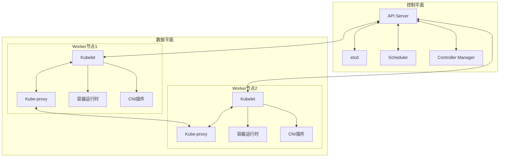
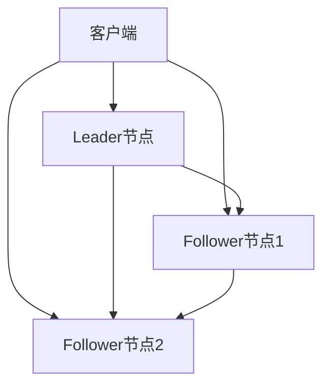
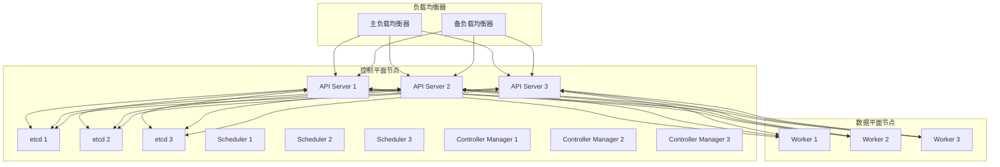

# Kubernetes核心组件深度解析：从架构到实践

## 情境(Situation)

在Kubernetes集群管理中，理解核心组件的工作原理和职责是掌握Kubernetes的基础。Kubernetes采用Master-Worker架构，包含控制平面和数据平面组件，这些组件协同工作，共同构成了一个完整的容器编排系统。

作为SRE工程师，我们需要深入理解Kubernetes核心组件的架构、职责和协作机制，以便在实际工作中更好地部署、配置和维护Kubernetes集群。

## 冲突(Conflict)

在实际应用中，SRE工程师经常面临以下挑战：

- **架构理解不足**：对Kubernetes组件架构理解不深入，难以排查问题
- **组件配置复杂**：各个组件的配置参数众多，难以掌握
- **高可用部署困难**：如何部署高可用的Kubernetes集群
- **性能优化挑战**：如何优化各组件的性能
- **故障排查困难**：组件故障时难以定位问题
- **版本升级风险**：组件版本升级时可能出现兼容性问题

## 问题(Question)

如何深入理解Kubernetes核心组件的架构、职责和最佳实践？

## 答案(Answer)

本文将从SRE视角出发，详细介绍Kubernetes核心组件的架构、职责、配置和最佳实践，提供一套完整的Kubernetes组件知识体系。核心方法论基于 [SRE面试题解析：k8s的组件都有啥？](#63-k8s的组件都有啥)。

---

## 一、Kubernetes架构概述

### 1.1 整体架构

**Kubernetes架构**：



### 1.2 组件层次

**Kubernetes组件层次**：

| 层次 | 组件 | 职责 |
|:------|:------|:------|
| **控制平面** | API Server | 核心组件，处理所有请求 |
| **控制平面** | etcd | 分布式键值存储 |
| **控制平面** | Scheduler | Pod调度 |
| **控制平面** | Controller Manager | 运行控制器 |
| **数据平面** | Kubelet | 管理Pod生命周期 |
| **数据平面** | Kube-proxy | 网络代理 |
| **数据平面** | 容器运行时 | 容器管理 |
| **数据平面** | CNI插件 | 网络配置 |

### 1.3 组件通信

**组件通信机制**：
- **API Server**：所有组件通过API Server通信
- **etcd**：仅API Server访问
- **其他组件**：通过API Server读写etcd
- **节点组件**：通过API Server上报状态

---

## 二、控制平面组件

### 2.1 API Server

**API Server职责**：
- 处理所有Kubernetes API请求
- 认证授权
- 准入控制
- 配置验证
- 与etcd交互

**API Server特点**：
- 无状态设计
- 可水平扩展
- RESTful API
- 支持多种认证方式

**API Server配置**：

```yaml
# kube-apiserver.yaml
apiVersion: v1
kind: Pod
metadata:
  name: kube-apiserver
  namespace: kube-system
spec:
  containers:
  - name: kube-apiserver
    image: k8s.gcr.io/kube-apiserver:v1.25.0
    command:
    - kube-apiserver
    - --advertise-address=192.168.1.100
    - --allow-privileged=true
    - --authorization-mode=Node,RBAC
    - --client-ca-file=/etc/kubernetes/pki/ca.crt
    - --enable-admission-plugins=NodeRestriction
    - --enable-bootstrap-token-auth=true
    - --etcd-cafile=/etc/kubernetes/pki/etcd/ca.crt
    - --etcd-certfile=/etc/kubernetes/pki/apiserver-etcd-client.crt
    - --etcd-keyfile=/etc/kubernetes/pki/apiserver-etcd-client.key
    - --etcd-servers=https://192.168.1.101:2379,https://192.168.1.102:2379,https://192.168.1.103:2379
    - --kubelet-client-certificate=/etc/kubernetes/pki/apiserver-kubelet-client.crt
    - --kubelet-client-key=/etc/kubernetes/pki/apiserver-kubelet-client.key
    - --kubelet-preferred-address-types=InternalIP,ExternalIP,Hostname
    - --proxy-client-cert-file=/etc/kubernetes/pki/front-proxy-client.crt
    - --proxy-client-key-file=/etc/kubernetes/pki/front-proxy-client.key
    - --requestheader-allowed-names=front-proxy-client
    - --requestheader-client-ca-file=/etc/kubernetes/pki/front-proxy-ca.crt
    - --requestheader-extra-headers-prefix=X-Remote-Extra-
    - --requestheader-group-headers=X-Remote-Group
    - --requestheader-username-headers=X-Remote-User
    - --secure-port=6443
    - --service-account-key-file=/etc/kubernetes/pki/sa.pub
    - --service-cluster-ip-range=10.96.0.0/12
    - --tls-cert-file=/etc/kubernetes/pki/apiserver.crt
    - --tls-private-key-file=/etc/kubernetes/pki/apiserver.key
```

**API Server性能优化**：
- 增加副本数
- 调整QPS和Burst
- 优化etcd配置
- 使用缓存
- 配置资源限制

### 2.2 etcd

**etcd职责**：
- 存储集群状态信息
- 存储配置数据
- 提供一致性保证
- 支持事务操作

**etcd特点**：
- 分布式键值存储
- 强一致性
- 高可用
- 支持TLS加密

**etcd架构**：



**etcd配置**：

```yaml
# etcd.yaml
apiVersion: v1
kind: Pod
metadata:
  name: etcd
  namespace: kube-system
spec:
  containers:
  - name: etcd
    image: k8s.gcr.io/etcd:3.5.3-0
    command:
    - etcd
    - --advertise-client-urls=https://192.168.1.101:2379
    - --cert-file=/etc/kubernetes/pki/etcd/server.crt
    - --client-cert-auth=true
    - --data-dir=/var/lib/etcd
    - --initial-advertise-peer-urls=https://192.168.1.101:2380
    - --initial-cluster=etcd1=https://192.168.1.101:2380,etcd2=https://192.168.1.102:2380,etcd3=https://192.168.1.103:2380
    - --key-file=/etc/kubernetes/pki/etcd/server.key
    - --listen-client-urls=https://127.0.0.1:2379,https://192.168.1.101:2379
    - --listen-metrics-urls=http://127.0.0.1:2381
    - --listen-peer-urls=https://192.168.1.101:2380
    - --name=etcd1
    - --peer-cert-file=/etc/kubernetes/pki/etcd/peer.crt
    - --peer-client-cert-auth=true
    - --peer-key-file=/etc/kubernetes/pki/etcd/peer.key
    - --peer-trusted-ca-file=/etc/kubernetes/pki/etcd/ca.crt
    - --snapshot-count=10000
    - --trusted-ca-file=/etc/kubernetes/pki/etcd/ca.crt
```

**etcd最佳实践**：
- 部署奇数个节点（3/5/7）
- 使用SSD存储
- 配置合适的备份策略
- 监控etcd状态
- 定期压缩数据

### 2.3 Scheduler

**Scheduler职责**：
- 监控未调度的Pod
- 为Pod选择最佳节点
- 执行调度决策

**Scheduler工作流程**：
1. 预选：过滤不符合条件的节点
2. 优选：对候选节点进行打分
3. 绑定：将Pod绑定到选定的节点

**Scheduler配置**：

```yaml
# kube-scheduler.yaml
apiVersion: v1
kind: Pod
metadata:
  name: kube-scheduler
  namespace: kube-system
spec:
  containers:
  - name: kube-scheduler
    image: k8s.gcr.io/kube-scheduler:v1.25.0
    command:
    - kube-scheduler
    - --authentication-kubeconfig=/etc/kubernetes/scheduler.conf
    - --authorization-kubeconfig=/etc/kubernetes/scheduler.conf
    - --bind-address=127.0.0.1
    - --kubeconfig=/etc/kubernetes/scheduler.conf
    - --leader-elect=true
    - --port=0
    - --policy-config-file=/etc/kubernetes/scheduler-policy.yaml
```

**调度器策略**：

```yaml
# scheduler-policy.yaml
apiVersion: kubescheduler.config.k8s.io/v1
kind: Policy
predicates:
- name: PodFitsResources
- name: PodFitsHostPorts
- name: HostName
- name: MatchNodeSelector
- name: NoVolumeZoneConflict
- name: MaxEBSVolumeCount
- name: MaxGCEPDVolumeCount
- name: MaxAzureDiskVolumeCount
- name: MatchInterPodAffinity
- name: NoDiskConflict
priorityConfigs:
- name: LeastRequestedPriority
  weight: 1
- name: BalancedResourceAllocation
  weight: 1
- name: SelectorSpreadPriority
  weight: 1
- name: InterPodAffinityPriority
  weight: 1
- name: NodeAffinityPriority
  weight: 1
- name: TaintTolerationPriority
  weight: 1
- name: ImageLocalityPriority
  weight: 1
```

**Scheduler最佳实践**：
- 配置合适的调度策略
- 优化调度器性能
- 使用调度框架扩展
- 监控调度器状态

### 2.4 Controller Manager

**Controller Manager职责**：
- 运行各种控制器
- 维护集群的期望状态
- 处理事件和协调

**控制器类型**：

| 控制器 | 职责 |
|:------|:------|
| **Replication Controller** | 确保Pod副本数 |
| **ReplicaSet** | 确保Pod副本数（新一代） |
| **Deployment** | 管理Pod和ReplicaSet |
| **StatefulSet** | 管理有状态应用 |
| **DaemonSet** | 在每个节点运行Pod |
| **Job** | 运行一次性任务 |
| **CronJob** | 运行定时任务 |
| **Service** | 提供网络访问 |
| **Endpoint** | 维护Service的后端 |
| **PersistentVolume** | 管理存储 |
| **PersistentVolumeClaim** | 申请存储 |
| **Node** | 管理节点 |
| **Namespace** | 管理命名空间 |
| **ServiceAccount** | 管理服务账号 |

**Controller Manager配置**：

```yaml
# kube-controller-manager.yaml
apiVersion: v1
kind: Pod
metadata:
  name: kube-controller-manager
  namespace: kube-system
spec:
  containers:
  - name: kube-controller-manager
    image: k8s.gcr.io/kube-controller-manager:v1.25.0
    command:
    - kube-controller-manager
    - --allocate-node-cidrs=true
    - --authentication-kubeconfig=/etc/kubernetes/controller-manager.conf
    - --authorization-kubeconfig=/etc/kubernetes/controller-manager.conf
    - --bind-address=127.0.0.1
    - --client-ca-file=/etc/kubernetes/pki/ca.crt
    - --cluster-cidr=10.244.0.0/16
    - --cluster-name=kubernetes
    - --cluster-signing-cert-file=/etc/kubernetes/pki/ca.crt
    - --cluster-signing-key-file=/etc/kubernetes/pki/ca.key
    - --controllers=*,bootstrapsigner,tokencleaner
    - --kubeconfig=/etc/kubernetes/controller-manager.conf
    - --leader-elect=true
    - --node-cidr-mask-size=24
    - --port=0
    - --requestheader-client-ca-file=/etc/kubernetes/pki/front-proxy-ca.crt
    - --root-ca-file=/etc/kubernetes/pki/ca.crt
    - --service-account-private-key-file=/etc/kubernetes/pki/sa.key
    - --use-service-account-credentials=true
```

**Controller Manager最佳实践**：
- 监控控制器状态
- 配置合适的并发度
- 优化控制器性能
- 定期检查控制器日志

---

## 三、数据平面组件

### 3.1 Kubelet

**Kubelet职责**：
- 管理节点上的Pod生命周期
- 与容器运行时交互
- 执行健康检查
- 上报节点和Pod状态
- 管理卷挂载

**Kubelet工作流程**：
1. 监听API Server的Pod变化
2. 同步Pod配置
3. 拉取镜像
4. 创建容器
5. 配置网络
6. 执行健康检查
7. 上报状态

**Kubelet配置**：

```yaml
# kubelet-config.yaml
kind: KubeletConfiguration
apiVersion: kubelet.config.k8s.io/v1beta1
address: 0.0.0.0
port: 10250
readOnlyPort: 10255
authentication:
  anonymous:
    enabled: false
  webhook:
    enabled: true
authorization:
  mode: Webhook
clusterDomain: cluster.local
clusterDNS:
- 10.96.0.10
maxPods: 110
cgroupDriver: systemd
runtimeRequestTimeout: 10m
```

**Kubelet最佳实践**：
- 配置合适的资源限制
- 启用健康检查
- 配置节点亲和性
- 监控Kubelet状态
- 定期检查节点状态

### 3.2 Kube-proxy

**Kube-proxy职责**：
- 为Service提供网络代理
- 实现负载均衡
- 维护网络规则

**Kube-proxy模式**：

| 模式 | 特点 | 适用场景 |
|:------|:------|:------|
| **iptables** | 基于iptables规则 | 大多数场景 |
| **IPVS** | 基于IPVS | 高并发场景 |
| **userspace** | 基于用户空间代理 | 旧版本，已废弃 |

**Kube-proxy配置**：

```yaml
# kube-proxy-config.yaml
kind: KubeProxyConfiguration
apiVersion: kubeproxy.config.k8s.io/v1alpha1
mode: ipvs
clusterCIDR: 10.244.0.0/16
ipvs:
  scheduler: rr
  excludeCIDRs:
  - 10.96.0.0/12
  minSyncPeriod: 0s
  syncPeriod: 30s
```

**Kube-proxy最佳实践**：
- 选择合适的代理模式
- 配置合适的调度算法
- 监控Kube-proxy状态
- 优化网络性能

### 3.3 容器运行时

**容器运行时职责**：
- 管理容器的生命周期
- 拉取镜像
- 创建和运行容器
- 管理容器资源

**常见容器运行时**：

| 运行时 | 特点 | 适用场景 |
|:------|:------|:------|
| **Docker** | 功能丰富，生态成熟 | 通用场景 |
| **containerd** | 轻量级，性能好 | 生产环境 |
| **CRI-O** | 专为Kubernetes设计 | 云原生环境 |
| **gVisor** | 安全隔离性高 | 安全敏感场景 |

**containerd配置**：

```toml
# /etc/containerd/config.toml
version = 2
root = "/var/lib/containerd"
state = "/run/containerd"
plugin_dir = ""
disabled_plugins = ["io.containerd.snapshotter.v1.aufs"]
required_plugins = []
gRPC = {
  address = "/run/containerd/containerd.sock",
  tcp_address = "",
  tcp_tls_cert = "",
  tcp_tls_key = "",
  uid = 0,
  gid = 0,
  max_recv_message_size = 16777216,
  max_send_message_size = 16777216
}
debug = false
trace = ""
metrics_address = ""
pprof_address = ""
level = "info"
timeout = "0s"
imports = ["/etc/containerd/conf.d/*.toml"]
snapshotter = "overlayfs"
diff_service = "io.containerd.diff.v1.walking"
metadata_store = ""
metadata_store_timeout = "0s"
gc_interval = "0s"
gc_thresh = 0
image_pull_progress_timeout = "1m0s"
subreaper = true
oom_score = 0
max_container_log_line_size = 16384
enable_selinux = false
selinux_category_range = 1024
cgroup_path = ""
skip_mount_home = false
user_namespace_remap = ""
max_concurrent_downloads = 3
max_concurrent_uploads = 5
disable_proc_mount = false
disable_tcp_service = true

[plugins]
  [plugins."io.containerd.gc.v1.scheduler"]
    pause_threshold = 0.02
    deletion_threshold = 0
    mutation_threshold = 100
    schedule_delay = "0s"
    startup_delay = "100ms"
  [plugins."io.containerd.grpc.v1.cri"]
    disable_tcp_service = true
    stream_server_address = "127.0.0.1"
    stream_server_port = "0"
    stream_idle_timeout = "4h0m0s"
    enable_selinux = false
    selinux_category_range = 1024
    sandbox_image = "k8s.gcr.io/pause:3.8"
    stats_collect_period = 10
    systemd_cgroup = false
    enable_tls_streaming = false
    max_container_log_line_size = 16384
    disable_cgroup = false
    disable_apparmor = false
    restrict_oom_score_adj = false
    max_concurrent_downloads = 3
    disable_proc_mount = false
    unset_seccomp_profile = ""
    tolerate_missing_hugetlb_controller = false
    disable_hugetlb_controller = false
    ignore_image_defined_volumes = false
    [plugins."io.containerd.grpc.v1.cri".containerd]
      snapshotter = "overlayfs"
      default_runtime_name = "runc"
      no_pivot = false
      disable_snapshot_annotations = false
      discard_unpacked_layers = false
      [plugins."io.containerd.grpc.v1.cri".containerd.default_runtime]
        runtime_type = "io.containerd.runc.v2"
        runtime_engine = ""
        runtime_root = ""
      [plugins."io.containerd.grpc.v1.cri".cni]
        bin_dir = "/opt/cni/bin"
        conf_dir = "/etc/cni/net.d"
        max_conf_num = 1
```

**容器运行时最佳实践**：
- 选择合适的容器运行时
- 配置合适的镜像仓库
- 优化镜像拉取
- 监控容器运行时状态
- 定期清理无用镜像

### 3.4 CNI插件

**CNI插件职责**：
- 为Pod配置网络
- 分配IP地址
- 设置网络规则
- 实现网络策略

**常见CNI插件**：

| 插件 | 特点 | 适用场景 |
|:------|:------|:------|
| **Flannel** | 简单大二层网络 | 小规模集群 |
| **Calico** | 高性能、安全策略 | 中大规模集群 |
| **Cilium** | eBPF、深度可观测性 | 大规模集群 |
| **Weave** | 去中心化、加密 | 混合云场景 |
| **Canal** | Flannel + Calico | 平衡性能和功能 |

**Flannel配置**：

```yaml
# kube-flannel.yml
apiVersion: v1
kind: ConfigMap
metadata:
  name: kube-flannel-cfg
  namespace: kube-system
data:
  cni-conf.json: |
    {
      "name": "cbr0",
      "cniVersion": "0.3.1",
      "type": "flannel",
      "delegate": {
        "hairpinMode": true,
        "isDefaultGateway": true
      }
    }
  net-conf.json: |
    {
      "Network": "10.244.0.0/16",
      "Backend": {
        "Type": "vxlan"
      }
    }
```

**CNI插件最佳实践**：
- 选择合适的CNI插件
- 配置合适的网络CIDR
- 实现网络策略
- 监控网络性能
- 优化网络配置

---

## 四、高可用部署

### 4.1 高可用架构

**高可用架构**：



### 4.2 高可用配置

**高可用配置要点**：
- 部署多个Master节点
- 部署多个etcd节点
- 配置负载均衡器
- 实现领导者选举
- 配置健康检查

**Kubernetes高可用部署**：

1. **Master节点部署**：
   - 至少3个Master节点
   - 配置负载均衡器
   - 启用领导者选举

2. **etcd集群部署**：
   - 至少3个etcd节点
   - 配置TLS加密
   - 定期备份

3. **Worker节点部署**：
   - 多个Worker节点
   - 配置节点亲和性
   - 实现自动扩缩容

**高可用部署示例**：

```bash
# 使用kubespray部署高可用集群
git clone https://github.com/kubernetes-sigs/kubespray.git
cd kubespray
cp -rfp inventory/sample inventory/mycluster

# 编辑inventory/mycluster/hosts.yml
# 配置Master节点和Worker节点

# 部署集群
ansible-playbook -i inventory/mycluster/hosts.yml cluster.yml -b
```

### 4.3 灾难恢复

**灾难恢复策略**：
- 定期备份etcd
- 配置自动故障转移
- 建立灾难恢复演练
- 制定恢复计划

**etcd备份**：

```bash
# 备份etcd
ETCDCTL_API=3 etcdctl snapshot save /backup/etcd-snapshot-$(date +%Y%m%d_%H%M%S).db \
  --endpoints=https://192.168.1.101:2379 \
  --cacert=/etc/kubernetes/pki/etcd/ca.crt \
  --cert=/etc/kubernetes/pki/apiserver-etcd-client.crt \
  --key=/etc/kubernetes/pki/apiserver-etcd-client.key

# 恢复etcd
ETCDCTL_API=3 etcdctl snapshot restore /backup/etcd-snapshot.db \
  --data-dir=/var/lib/etcd \
  --initial-cluster=etcd1=https://192.168.1.101:2380,etcd2=https://192.168.1.102:2380,etcd3=https://192.168.1.103:2380 \
  --initial-cluster-token=etcd-cluster-1 \
  --initial-advertise-peer-urls=https://192.168.1.101:2380
```

---

## 五、监控与管理

### 5.1 组件监控

**监控指标**：

| 组件 | 关键指标 |
|:------|:------|
| **API Server** | 请求率、错误率、延迟 |
| **etcd** | 磁盘使用、请求延迟、领导者状态 |
| **Scheduler** | 调度延迟、调度成功率 |
| **Controller Manager** | 控制器状态、协调时间 |
| **Kubelet** | 节点状态、Pod状态、资源使用 |
| **Kube-proxy** | 连接数、转发规则 |
| **容器运行时** | 容器状态、镜像拉取时间 |
| **CNI插件** | 网络延迟、丢包率 |

**Prometheus监控**：

```yaml
# prometheus.yml
scrape_configs:
  - job_name: 'kubernetes-apiservers'
    kubernetes_sd_configs:
    - role: endpoints
    scheme: https
    tls_config:
      ca_file: /var/run/secrets/kubernetes.io/serviceaccount/ca.crt
    bearer_token_file: /var/run/secrets/kubernetes.io/serviceaccount/token
    relabel_configs:
    - source_labels: [__meta_kubernetes_namespace, __meta_kubernetes_service_name, __meta_kubernetes_endpoint_port_name]
      action: keep
      regex: kube-system;kubernetes;https

  - job_name: 'kubernetes-nodes'
    kubernetes_sd_configs:
    - role: node
    scheme: https
    tls_config:
      ca_file: /var/run/secrets/kubernetes.io/serviceaccount/ca.crt
    bearer_token_file: /var/run/secrets/kubernetes.io/serviceaccount/token
    relabel_configs:
    - action: labelmap
      regex: __meta_kubernetes_node_label_(.+)

  - job_name: 'kubernetes-pods'
    kubernetes_sd_configs:
    - role: pod
    relabel_configs:
    - source_labels: [__meta_kubernetes_pod_annotation_prometheus_io_scrape]
      action: keep
      regex: true
    - source_labels: [__meta_kubernetes_pod_annotation_prometheus_io_path]
      action: replace
      target_label: __metrics_path__
      regex: (.+)
    - source_labels: [__address__, __meta_kubernetes_pod_annotation_prometheus_io_port]
      action: replace
      regex: ([^:]+)(?::\d+)?;(\d+)
      replacement: $1:$2
      target_label: __address__
    - action: labelmap
      regex: __meta_kubernetes_pod_label_(.+)
    - source_labels: [__meta_kubernetes_namespace]
      action: replace
      target_label: kubernetes_namespace
    - source_labels: [__meta_kubernetes_pod_name]
      action: replace
      target_label: kubernetes_pod_name
```

### 5.2 日志管理

**日志管理策略**：
- 集中收集组件日志
- 配置日志轮转
- 建立日志分析系统
- 实现日志告警

**日志收集**：

```yaml
# fluentd配置
apiVersion: v1
kind: ConfigMap
metadata:
  name: fluentd-config
  namespace: logging
data:
  fluent.conf: |
    <source>
      @type tail
      path /var/log/containers/*.log
      pos_file /var/log/fluentd.pos
      tag kubernetes.*
      <parse>
        @type json
        time_key time
        time_format %Y-%m-%dT%H:%M:%S.%NZ
      </parse>
    </source>
    <filter kubernetes.**>
      @type kubernetes_metadata
      @id filter_kube_metadata
    </filter>
    <match kubernetes.**>
      @type elasticsearch
      host elasticsearch.logging.svc.cluster.local
      port 9200
      logstash_format true
      logstash_prefix kubernetes
    </match>
```

### 5.3 健康检查

**健康检查配置**：

| 组件 | 健康检查端点 |
|:------|:------|
| **API Server** | /healthz, /livez, /readyz |
| **etcd** | /health, /metrics |
| **Scheduler** | /healthz, /metrics |
| **Controller Manager** | /healthz, /metrics |
| **Kubelet** | /healthz, /metrics |

**健康检查示例**：

```bash
# 检查API Server健康状态
curl -k https://192.168.1.100:6443/healthz

# 检查etcd健康状态
etcdctl endpoint health --endpoints=https://192.168.1.101:2379 \
  --cacert=/etc/kubernetes/pki/etcd/ca.crt \
  --cert=/etc/kubernetes/pki/apiserver-etcd-client.crt \
  --key=/etc/kubernetes/pki/apiserver-etcd-client.key

# 检查Kubelet健康状态
curl -k https://192.168.1.101:10250/healthz
```

---

## 六、最佳实践总结

### 6.1 部署最佳实践

**部署最佳实践**：

- [ ] 部署高可用Master节点（至少3个）
- [ ] 部署高可用etcd集群（至少3个）
- [ ] 配置负载均衡器
- [ ] 使用TLS加密所有通信
- [ ] 配置合适的资源限制
- [ ] 选择合适的容器运行时
- [ ] 选择合适的CNI插件
- [ ] 配置自动扩缩容
- [ ] 实现灾难恢复策略

### 6.2 配置最佳实践

**配置最佳实践**：

- [ ] 优化API Server配置
- [ ] 优化etcd配置
- [ ] 优化Scheduler配置
- [ ] 优化Controller Manager配置
- [ ] 优化Kubelet配置
- [ ] 优化Kube-proxy配置
- [ ] 优化容器运行时配置
- [ ] 优化CNI插件配置
- [ ] 配置合适的网络策略
- [ ] 配置合适的资源配额

### 6.3 运维最佳实践

**运维最佳实践**：

- [ ] 建立监控告警系统
- [ ] 建立日志管理系统
- [ ] 定期备份etcd
- [ ] 定期更新组件版本
- [ ] 定期清理无用资源
- [ ] 建立故障演练机制
- [ ] 制定灾难恢复计划
- [ ] 建立变更管理流程
- [ ] 定期审计集群配置
- [ ] 培训运维团队

---

## 总结

Kubernetes核心组件是构成容器编排系统的基础，理解这些组件的架构、职责和最佳实践对于SRE工程师至关重要。通过本文的详细介绍，我们可以全面掌握Kubernetes核心组件的工作原理和配置方法。

**核心要点**：

1. **控制平面组件**：API Server是核心，etcd存储状态，Scheduler负责调度，Controller Manager维护状态
2. **数据平面组件**：Kubelet管理Pod，Kube-proxy提供网络代理，容器运行时管理容器，CNI插件配置网络
3. **高可用部署**：部署多个Master节点和etcd节点，配置负载均衡器
4. **监控管理**：建立完善的监控和日志管理系统
5. **最佳实践**：优化配置，定期维护，建立灾难恢复策略

通过遵循这些最佳实践，我们可以构建一个高可用、高性能、安全的Kubernetes集群，为业务应用提供稳定的运行环境。

> **延伸学习**：更多面试相关的Kubernetes组件知识，请参考 [SRE面试题解析：k8s的组件都有啥？](#63-k8s的组件都有啥)。

---

## 参考资料

- [Kubernetes官方文档](https://kubernetes.io/docs/)
- [Kubernetes架构](https://kubernetes.io/docs/concepts/overview/components/)
- [API Server文档](https://kubernetes.io/docs/reference/command-line-tools-reference/kube-apiserver/)
- [etcd官方文档](https://etcd.io/docs/)
- [Scheduler文档](https://kubernetes.io/docs/concepts/scheduling-eviction/kube-scheduler/)
- [Controller Manager文档](https://kubernetes.io/docs/reference/command-line-tools-reference/kube-controller-manager/)
- [Kubelet文档](https://kubernetes.io/docs/reference/command-line-tools-reference/kubelet/)
- [Kube-proxy文档](https://kubernetes.io/docs/reference/command-line-tools-reference/kube-proxy/)
- [容器运行时接口](https://kubernetes.io/docs/concepts/architecture/cri/)
- [CNI规范](https://github.com/containernetworking/cni)
- [Flannel文档](https://github.com/flannel-io/flannel)
- [Calico文档](https://docs.projectcalico.org/)
- [Cilium文档](https://docs.cilium.io/)
- [containerd文档](https://containerd.io/docs/)
- [高可用部署](https://kubernetes.io/docs/setup/production-environment/tools/kubespray/)
- [etcd备份恢复](https://kubernetes.io/docs/tasks/administer-cluster/configure-upgrade-etcd/)
- [Prometheus监控](https://prometheus.io/docs/introduction/overview/)
- [Grafana监控](https://grafana.com/docs/grafana/latest/)
- [Fluentd日志收集](https://www.fluentd.org/)
- [Kubernetes安全最佳实践](https://kubernetes.io/docs/concepts/security/)
- [Kubernetes性能调优](https://kubernetes.io/docs/concepts/configuration/manage-resources-containers/)
- [Kubernetes网络最佳实践](https://kubernetes.io/docs/concepts/services-networking/)
- [Kubernetes存储最佳实践](https://kubernetes.io/docs/concepts/storage/)
- [Kubernetes升级策略](https://kubernetes.io/docs/tasks/administer-cluster/kubeadm/kubeadm-upgrade/)
- [Kubernetes故障排查](https://kubernetes.io/docs/tasks/debug-application-cluster/)
- [Kubernetes最佳实践](https://kubernetes.io/docs/concepts/configuration/overview/)
- [Kubernetes集群管理](https://kubernetes.io/docs/concepts/architecture/cloud-controller/)
- [Kubernetes认证授权](https://kubernetes.io/docs/reference/access-authn-authz/)
- [Kubernetes准入控制](https://kubernetes.io/docs/reference/access-authn-authz/admission-controllers/)
- [Kubernetes服务质量](https://kubernetes.io/docs/tasks/configure-pod-container/quality-service/)
- [Kubernetes网络策略](https://kubernetes.io/docs/concepts/services-networking/network-policies/)