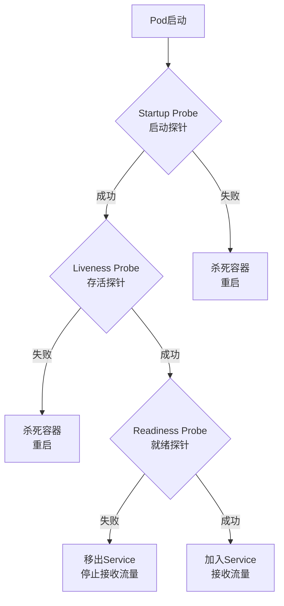

# Kubernetes探针详解：构建高可用服务的关键

## 情境(Situation)

在Kubernetes集群中，确保服务的高可用性是SRE工程师的核心职责之一。Kubernetes提供了三种类型的探针（Probe）：Liveness Probe（存活探针）、Readiness Probe（就绪探针）和Startup Probe（启动探针），用于检测容器的健康状态，确保服务的稳定性和可靠性。

作为SRE工程师，我们需要深入理解这些探针的工作原理、配置方法和最佳实践，以便在实际应用中构建高可用的服务。

## 冲突(Conflict)

在实际应用中，SRE工程师经常面临以下挑战：

- **探针配置不当**：探针参数设置不合理，导致服务被误杀或流量分配错误
- **探针类型选择**：不知道如何根据应用特性选择合适的探针类型
- **失败处理机制**：不了解探针失败时的处理逻辑，导致服务中断
- **性能影响**：探针过于频繁或复杂，影响应用性能
- **监控告警**：缺乏对探针状态的有效监控和告警

## 问题(Question)

如何正确配置和使用Kubernetes的三种探针，构建高可用的服务？

## 答案(Answer)

本文将从SRE视角出发，详细介绍Kubernetes三种探针的工作原理、配置方法、失败处理机制和最佳实践，提供一套完整的探针配置体系。核心方法论基于 [SRE面试题解析：pod的3种探针有什么特点，如果失败了是怎么处理的？](#65-pod的3种探针有什么特点如果失败了是怎么处理的)。

---

## 一、探针基础概念

### 1.1 探针类型

**Kubernetes三种探针**：

| 探针类型 | 检测目标 | 失败动作 | 适用场景 |
|:------|:------|:------|:------|
| **Liveness Probe** | 容器是否存活 | 重启容器 | 长期运行服务 |
| **Readiness Probe** | 能否接收流量 | 移出Service | 有依赖的服务 |
| **Startup Probe** | 启动是否完成 | 重启容器 | 慢启动应用 |

### 1.2 探针工作流程

**探针工作流程**：



### 1.3 探针检测方式

**探针检测方式**：

| 检测方式 | 适用场景 | 配置示例 |
|:------|:------|:------|
| **httpGet** | Web应用 | `httpGet: {path: /health, port: 8080}` |
| **exec** | 后台服务 | `exec: {command: ["cat", "/tmp/healthy"]}` |
| **tcpSocket** | 网络服务 | `tcpSocket: {port: 8080}` |

---

## 二、探针配置详解

### 2.1 Liveness Probe（存活探针）

**Liveness Probe职责**：
- 检测容器是否存活
- 失败时重启容器
- 确保应用进程正常运行

**配置示例**：

```yaml
livenessProbe:
  httpGet:
    path: /healthz
    port: 8080
  initialDelaySeconds: 30  # 启动后延迟检测
  periodSeconds: 10        # 检测间隔
  timeoutSeconds: 5         # 单次超时
  failureThreshold: 3       # 连续失败次数
  successThreshold: 1       # 恢复成功次数
```

**最佳实践**：
- 配置轻量级的检测端点
- 避免检查外部依赖
- 根据应用启动时间设置合理的`initialDelaySeconds`
- 确保检测间隔不会影响应用性能

### 2.2 Readiness Probe（就绪探针）

**Readiness Probe职责**：
- 检测容器是否就绪
- 失败时移出Service
- 确保只有健康的容器接收流量

**配置示例**：

```yaml
readinessProbe:
  httpGet:
    path: /ready
    port: 8080
  initialDelaySeconds: 5    # 启动后延迟检测
  periodSeconds: 10         # 检测间隔
  timeoutSeconds: 3         # 单次超时
  failureThreshold: 3       # 连续失败次数
  successThreshold: 1       # 恢复成功次数
```

**最佳实践**：
- 检查应用是否真正就绪（如数据库连接、依赖服务）
- 配置合理的`failureThreshold`，避免短暂故障导致流量中断
- 与Liveness Probe配合使用，确保服务稳定

### 2.3 Startup Probe（启动探针）

**Startup Probe职责**：
- 检测应用启动是否完成
- 失败时重启容器
- 保护慢启动应用不被误杀

**配置示例**：

```yaml
startupProbe:
  httpGet:
    path: /startup
    port: 8080
  initialDelaySeconds: 0     # 启动后立即检测
  periodSeconds: 5           # 检测间隔
  timeoutSeconds: 3           # 单次超时
  failureThreshold: 30        # 连续失败次数（给足启动时间）
  successThreshold: 1         # 恢复成功次数
```

**最佳实践**：
- 为慢启动应用配置足够的`failureThreshold`
- 启动探针成功后，存活探针和就绪探针开始工作
- 避免与存活探针的检测逻辑冲突

### 2.4 配置参数详解

**配置参数详解**：

| 参数 | 说明 | 建议值 |
|:------|:------|:------|
| `initialDelaySeconds` | 启动后延迟检测 | > 应用启动时间 |
| `periodSeconds` | 检测间隔 | 10-15秒 |
| `timeoutSeconds` | 单次超时 | 1-3秒 |
| `failureThreshold` | 连续失败次数 | 3-5次（启动探针可更大） |
| `successThreshold` | 恢复成功次数 | 1次（必须为1） |

---

## 三、失败处理机制

### 3.1 探针失败处理

**探针失败处理**：

| 探针 | 失败处理 | 影响 | 恢复机制 |
|:------|:------|:------|:------|
| **Liveness** | 重启容器 | 服务短暂中断 | 容器重启后恢复 |
| **Readiness** | 移出Service | 停止接收流量 | 探针成功后重新加入 |
| **Startup** | 重启容器 | 启动失败重试 | 容器重启后重新检测 |

### 3.2 常见失败场景

**常见失败场景**：

| 场景 | 原因 | 解决方案 |
|:------|:------|:------|
| **应用频繁重启** | `initialDelaySeconds`太小 | 调大至应用启动时间以上 |
| **流量丢失** | `readinessProbe`太严格 | 降低`failureThreshold` |
| **启动被误杀** | 没有`Startup Probe` | 添加`Startup Probe`保护 |
| **探测超时** | 端点响应慢 | 调大`timeoutSeconds` |
| **级联故障** | 探针检查外部依赖 | 避免在`Liveness Probe`中检查外部依赖 |

### 3.3 故障排查

**故障排查方法**：

1. **查看Pod状态**：`kubectl get pods`
2. **查看事件**：`kubectl describe pod <pod-name>`
3. **查看日志**：`kubectl logs <pod-name>`
4. **检查探针配置**：`kubectl get pod <pod-name> -o yaml | grep -A 20 probe`
5. **测试探针端点**：`curl http://<pod-ip>:<port>/health`

**示例**：

```bash
# 查看Pod状态
kubectl get pods

# 查看事件
kubectl describe pod myapp-5d6757c8d4-8x7z9

# 检查探针配置
kubectl get pod myapp-5d6757c8d4-8x7z9 -o yaml | grep -A 20 livenessProbe

# 测试探针端点
kubectl exec myapp-5d6757c8d4-8x7z9 -- curl http://localhost:8080/health
```

---

## 四、探针最佳实践

### 4.1 探针组合策略

**探针组合策略**：

| 应用类型 | 探针组合 | 配置要点 |
|:------|:------|:------|
| **Web应用** | 三种探针 | `Startup Probe`保护启动，`Readiness Probe`控制流量，`Liveness Probe`保证存活 |
| **后台服务** | 存活 + 就绪 | 确保服务稳定运行和流量分配 |
| **慢启动应用** | 三种探针 | 重点配置`Startup Probe`的`failureThreshold` |
| **批处理任务** | 就绪探针 | 确保任务完成后接收流量 |

### 4.2 探针端点设计

**探针端点设计原则**：

- **Liveness Probe**：轻量级，只检查本地状态
- **Readiness Probe**：检查依赖服务，确保服务真正就绪
- **Startup Probe**：检查启动状态，确保应用完全启动

**示例实现**：

```python
# Flask应用示例
from flask import Flask, jsonify
import time

app = Flask(__name__)

# 启动状态
is_started = False
# 就绪状态
is_ready = False

@app.route('/healthz')
def healthz():
    """Liveness Probe端点"""
    return jsonify({"status": "ok"}), 200

@app.route('/ready')
def ready():
    """Readiness Probe端点"""
    if is_ready:
        return jsonify({"status": "ready"}), 200
    else:
        return jsonify({"status": "not ready"}), 503

@app.route('/startup')
def startup():
    """Startup Probe端点"""
    if is_started:
        return jsonify({"status": "started"}), 200
    else:
        return jsonify({"status": "starting"}), 503

# 模拟启动过程
def simulate_startup():
    global is_started, is_ready
    print("Starting application...")
    time.sleep(30)  # 模拟30秒启动时间
    is_started = True
    print("Application started")
    time.sleep(10)  # 模拟10秒初始化时间
    is_ready = True
    print("Application ready")

if __name__ == '__main__':
    import threading
    threading.Thread(target=simulate_startup).start()
    app.run(host='0.0.0.0', port=8080)
```

### 4.3 性能优化

**探针性能优化**：

- **减少检测频率**：合理设置`periodSeconds`，避免频繁检测
- **优化检测端点**：确保探针端点响应迅速
- **使用缓存**：对耗时的检测逻辑使用缓存
- **避免重操作**：不要在探针中执行重量级操作
- **并行检测**：使用`exec`探针时，避免阻塞主应用

### 4.4 监控与告警

**监控指标**：
- 探针失败次数
- 探针检测延迟
- 容器重启次数
- 服务就绪状态

**Prometheus监控**：

```yaml
# 探针监控
apiVersion: monitoring.coreos.com/v1
kind: ServiceMonitor
metadata:
  name: kubernetes-pods
  namespace: monitoring
spec:
  selector:
    matchLabels:
      app: kubernetes
  endpoints:
  - port: https
    path: /metrics
    scheme: https
    tlsConfig:
      insecureSkipVerify: true
    metricRelabelings:
    - sourceLabels: [__name__]
      regex: kube_pod_container_status_probe_.*
      action: keep
```

**告警规则**：

```yaml
# 探针告警
apiVersion: monitoring.coreos.com/v1
kind: PrometheusRule
metadata:
  name: kubernetes-probe-alerts
  namespace: monitoring
spec:
  groups:
  - name: kubernetes-probe
    rules:
    - alert: LivenessProbeFailed
      expr: kube_pod_container_status_probe_failed_total{probe="liveness"} > 0
      for: 5m
      labels:
        severity: critical
      annotations:
        summary: "Liveness probe failed for {{ $labels.pod }}"
        description: "Liveness probe has failed for pod {{ $labels.pod }} in namespace {{ $labels.namespace }}."

    - alert: ReadinessProbeFailed
      expr: kube_pod_container_status_probe_failed_total{probe="readiness"} > 0
      for: 5m
      labels:
        severity: warning
      annotations:
        summary: "Readiness probe failed for {{ $labels.pod }}"
        description: "Readiness probe has failed for pod {{ $labels.pod }} in namespace {{ $labels.namespace }}."

    - alert: StartupProbeFailed
      expr: kube_pod_container_status_probe_failed_total{probe="startup"} > 0
      for: 10m
      labels:
        severity: critical
      annotations:
        summary: "Startup probe failed for {{ $labels.pod }}"
        description: "Startup probe has failed for pod {{ $labels.pod }} in namespace {{ $labels.namespace }}."
```

---

## 五、案例分析

### 5.1 案例一：慢启动应用保护

**问题**：Java应用启动时间长，经常被Liveness Probe误杀。

**解决方案**：
1. 添加Startup Probe，设置足够的failureThreshold
2. 配置合理的检测间隔
3. 确保应用完全启动后再开始Liveness检测

**配置示例**：

```yaml
startupProbe:
  httpGet:
    path: /actuator/health
    port: 8080
  initialDelaySeconds: 0
  periodSeconds: 5
  failureThreshold: 30  # 5秒×30次=150秒启动时间
livenessProbe:
  httpGet:
    path: /actuator/health
    port: 8080
  initialDelaySeconds: 0  # 由Startup Probe保护
  periodSeconds: 10
  failureThreshold: 3
```

### 5.2 案例二：数据库依赖服务

**问题**：应用依赖数据库，数据库重启时应用被Liveness Probe误杀。

**解决方案**：
1. Liveness Probe只检查应用本身状态
2. Readiness Probe检查数据库连接
3. 确保应用在数据库不可用时不接收流量，但不重启

**配置示例**：

```yaml
livenessProbe:
  exec:
    command: ["pgrep", "-f", "java"]
  periodSeconds: 10
readinessProbe:
  httpGet:
    path: /api/health
    port: 8080
  periodSeconds: 10
  failureThreshold: 3
```

### 5.3 案例三：Web服务流量控制

**问题**：Web服务启动后需要预热，直接接收流量会导致响应缓慢。

**解决方案**：
1. Startup Probe确保应用启动完成
2. Readiness Probe添加预热检查
3. 预热完成后才加入Service

**配置示例**：

```yaml
startupProbe:
  httpGet:
    path: /health
    port: 8080
  periodSeconds: 5
  failureThreshold: 20
readinessProbe:
  httpGet:
    path: /ready
    port: 8080
  periodSeconds: 5
  initialDelaySeconds: 10
```

---

## 六、常见误区与解决方案

### 6.1 常见误区

**常见误区**：

1. **探针配置过于简单**：只配置Liveness Probe，忽略Readiness和Startup Probe
2. **探针检查外部依赖**：Liveness Probe检查数据库连接，导致级联故障
3. **参数设置不合理**：initialDelaySeconds太小，导致应用被误杀
4. **探针端点性能差**：探针端点响应缓慢，影响应用性能
5. **监控告警不足**：缺乏对探针状态的监控和告警

### 6.2 解决方案

**解决方案**：

1. **合理组合探针**：根据应用特性配置三种探针
2. **分离关注点**：Liveness Probe只检查本地状态，Readiness Probe检查依赖
3. **参数调优**：根据应用特性设置合理的参数
4. **优化探针端点**：确保探针端点响应迅速
5. **建立监控**：配置探针状态监控和告警

---

## 七、最佳实践总结

### 7.1 配置最佳实践

**配置最佳实践**：

- [ ] 为所有应用配置Liveness Probe和Readiness Probe
- [ ] 为慢启动应用添加Startup Probe
- [ ] Liveness Probe要轻量，只检查本地状态
- [ ] Readiness Probe要检查依赖服务，确保服务真正就绪
- [ ] 根据应用启动时间设置合理的initialDelaySeconds
- [ ] 为Startup Probe设置足够的failureThreshold
- [ ] 避免在探针中执行重量级操作
- [ ] 定期测试探针端点的响应时间
- [ ] 配置探针状态监控和告警
- [ ] 建立探针配置的审查机制

### 7.2 部署最佳实践

**部署最佳实践**：

- [ ] 在CI/CD流程中验证探针配置
- [ ] 使用配置管理工具管理探针配置
- [ ] 定期检查探针状态和失败率
- [ ] 建立探针故障的应急响应流程
- [ ] 记录探针配置的变更历史
- [ ] 定期优化探针配置参数
- [ ] 为不同环境配置不同的探针参数
- [ ] 建立探针配置的最佳实践文档

### 7.3 监控最佳实践

**监控最佳实践**：

- [ ] 监控探针失败次数和频率
- [ ] 监控探针检测延迟
- [ ] 监控容器重启次数
- [ ] 监控服务就绪状态
- [ ] 配置探针失败告警
- [ ] 建立探针故障的根因分析机制
- [ ] 定期分析探针故障模式
- [ ] 优化监控指标和告警阈值

---

## 总结

Kubernetes的探针机制是构建高可用服务的关键。通过本文的详细介绍，我们可以掌握三种探针的工作原理、配置方法和最佳实践，建立一套完整的探针配置体系。

**核心要点**：

1. **探针类型**：Liveness Probe保证容器存活，Readiness Probe控制流量，Startup Probe保护慢启动应用
2. **配置参数**：根据应用特性设置合理的参数，避免误杀正常应用
3. **失败处理**：了解探针失败时的处理逻辑，确保服务稳定
4. **最佳实践**：合理组合探针，优化端点设计，建立监控告警
5. **案例分析**：从实际案例中学习探针配置经验
6. **常见误区**：避免探针配置中的常见错误，提高服务可靠性

通过遵循这些最佳实践，我们可以构建更加可靠、高可用的Kubernetes服务，为业务应用提供稳定的运行环境。

> **延伸学习**：更多面试相关的Kubernetes探针知识，请参考 [SRE面试题解析：pod的3种探针有什么特点，如果失败了是怎么处理的？](#65-pod的3种探针有什么特点如果失败了是怎么处理的)。

---

## 参考资料

- [Kubernetes探针文档](https://kubernetes.io/docs/concepts/workloads/pods/pod-lifecycle/#container-probes)
- [Kubernetes健康检查](https://kubernetes.io/docs/tasks/configure-pod-container/configure-liveness-readiness-startup-probes/)
- [Kubernetes Pod生命周期](https://kubernetes.io/docs/concepts/workloads/pods/pod-lifecycle/)
- [Kubernetes服务质量](https://kubernetes.io/docs/tasks/configure-pod-container/quality-service/)
- [Kubernetes故障排查](https://kubernetes.io/docs/tasks/debug-application-cluster/)
- [Prometheus监控](https://prometheus.io/docs/introduction/overview/)
- [Grafana监控](https://grafana.com/docs/grafana/latest/)
- [Kubernetes最佳实践](https://kubernetes.io/docs/concepts/configuration/overview/)
- [Kubernetes性能调优](https://kubernetes.io/docs/concepts/configuration/manage-resources-containers/)
- [Kubernetes安全最佳实践](https://kubernetes.io/docs/concepts/security/)
- [Kubernetes网络最佳实践](https://kubernetes.io/docs/concepts/services-networking/network-policies/)
- [Kubernetes存储最佳实践](https://kubernetes.io/docs/concepts/storage/)
- [Kubernetes升级策略](https://kubernetes.io/docs/tasks/administer-cluster/kubeadm/kubeadm-upgrade/)
- [Kubernetes故障排查指南](https://kubernetes.io/docs/tasks/debug-application-cluster/debug-pod-replication-controller/)
- [Kubernetes容器日志](https://kubernetes.io/docs/concepts/cluster-administration/logging/)
- [Kubernetes事件](https://kubernetes.io/docs/concepts/overview/working-with-objects/events/)
- [Kubernetes节点亲和性](https://kubernetes.io/docs/concepts/scheduling-eviction/assign-pod-node/)
- [Kubernetes污点和容忍度](https://kubernetes.io/docs/concepts/scheduling-eviction/taint-and-toleration/)
- [Kubernetes PodDisruptionBudget](https://kubernetes.io/docs/concepts/workloads/pods/disruptions/)
- [Kubernetes Pod优先级和抢占](https://kubernetes.io/docs/concepts/scheduling-eviction/pod-priority-preemption/)
- [Kubernetes服务发现](https://kubernetes.io/docs/concepts/services-networking/service/)
- [Kubernetes负载均衡](https://kubernetes.io/docs/concepts/services-networking/service/#loadbalancer)
- [Kubernetes ingress](https://kubernetes.io/docs/concepts/services-networking/ingress/)
- [Kubernetes网络策略](https://kubernetes.io/docs/concepts/services-networking/network-policies/)
- [Kubernetes存储类](https://kubernetes.io/docs/concepts/storage/storage-classes/)
- [Kubernetes持久卷](https://kubernetes.io/docs/concepts/storage/persistent-volumes/)
- [Kubernetes配置管理](https://kubernetes.io/docs/concepts/configuration/)
- [Kubernetes secrets](https://kubernetes.io/docs/concepts/configuration/secret/)
- [Kubernetes configmaps](https://kubernetes.io/docs/concepts/configuration/configmap/)