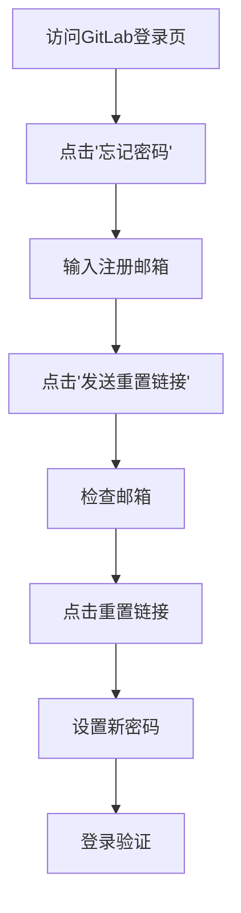
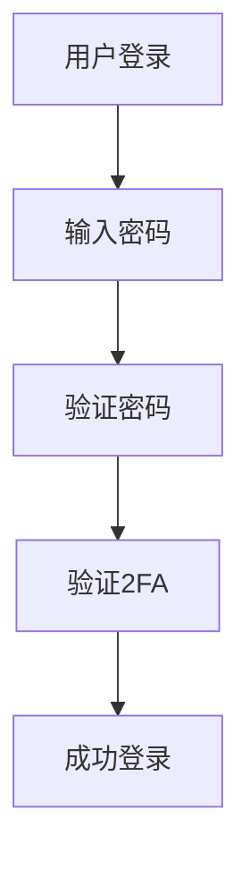

# GitLab管理员指南：密码管理与安全最佳实践

## 情境与背景

GitLab作为企业级代码托管平台，承载着企业核心代码资产。密码管理是GitLab安全的第一道防线，**密码丢失或泄露可能导致代码泄露、CI/CD流水线被篡改等严重安全事件。**掌握GitLab密码重置方法和安全管理策略，是DevOps/SRE工程师的必备技能。

## 一、密码重置方法

### 1.1 Web界面重置（用户自助）



**操作步骤：**
1. 访问GitLab登录页面
2. 点击"忘记密码"链接
3. 输入注册邮箱地址
4. 检查邮箱中的重置邮件
5. 点击邮件中的重置链接
6. 设置新密码（建议包含大小写字母、数字、特殊字符）
7. 使用新密码登录验证

### 1.2 管理员命令行重置

```bash
# 方法1：交互式重置（推荐）
gitlab-rake "gitlab:password:reset"
# 按照提示输入用户名或邮箱，然后设置新密码

# 方法2：直接指定用户重置
gitlab-rake "gitlab:password:reset[admin@example.com]"

# 方法3：通过rails console
gitlab-rails console
user = User.find_by(email: 'admin@example.com')
user.password = 'YourSecurePassword123!'
user.password_confirmation = 'YourSecurePassword123!'
user.save!
exit

# 方法4：批量重置（谨慎使用）
# 仅在特殊情况下使用，需要提前备份
```

### 1.3 API重置方法

```bash
# 通过GitLab API重置密码
curl -X PUT "https://gitlab.example.com/api/v4/users/1" \
     --header "PRIVATE-TOKEN: <admin-access-token>" \
     --header "Content-Type: application/json" \
     --data '{"password": "NewSecurePassword123!"}'

# 获取用户ID
curl "https://gitlab.example.com/api/v4/users?search=admin" \
     --header "PRIVATE-TOKEN: <admin-access-token>"
```

### 1.4 LDAP认证用户重置

```bash
# LDAP用户需要在LDAP服务器修改密码
# 以OpenLDAP为例
ldapmodify -x -D "cn=admin,dc=example,dc=com" -W <<EOF
dn: uid=john,ou=users,dc=example,dc=com
changetype: modify
replace: userPassword
userPassword: newpassword123
EOF

# GitLab会自动同步LDAP密码（通常每小时同步一次）
# 手动触发同步（如果需要立即生效）
gitlab-rake gitlab:ldap:sync
```

## 二、密码策略配置

### 2.1 修改密码强度要求

```ruby
# /etc/gitlab/gitlab.rb
gitlab_rails['password_length_min'] = 12
gitlab_rails['password_require_uppercase'] = true
gitlab_rails['password_require_lowercase'] = true
gitlab_rails['password_require_numbers'] = true
gitlab_rails['password_require_symbols'] = true

# 应用配置
gitlab-ctl reconfigure
```

### 2.2 密码过期策略

```ruby
# 设置密码有效期（天数）
gitlab_rails['password_expire_days'] = 90

# 密码过期前提醒天数
gitlab_rails['password_expire_alert_days'] = 7

# 应用配置
gitlab-ctl reconfigure
```

### 2.3 登录失败锁定策略

```ruby
# 登录失败次数限制
gitlab_rails['max_login_attempts'] = 10

# 锁定时长（秒）
gitlab_rails['login_lock_duration'] = 600

# 应用配置
gitlab_ctl reconfigure
```

## 三、双因素认证（2FA）

### 3.1 启用双因素认证



```bash
# 强制所有用户启用2FA（管理员）
# 通过管理界面或API设置

# 查看2FA状态
curl "https://gitlab.example.com/api/v4/users?two_factor_enabled=true" \
     --header "PRIVATE-TOKEN: <admin-token>"

# 强制用户启用2FA（API）
curl -X PUT "https://gitlab.example.com/api/v4/application/settings" \
     --header "PRIVATE-TOKEN: <admin-token>" \
     --header "Content-Type: application/json" \
     --data '{"require_two_factor_authentication": true}'
```

### 3.2 2FA恢复码管理

```bash
# 用户查看恢复码
# 在用户设置 -> 账户 -> 双因素认证 -> 管理恢复码

# 管理员重置用户2FA（用户丢失设备时）
curl -X POST "https://gitlab.example.com/api/v4/users/1/two_factor_recovery_codes" \
     --header "PRIVATE-TOKEN: <admin-token>"
```

## 四、审计日志监控

### 4.1 监控密码相关操作

```bash
# 查看GitLab审计日志
gitlab-ctl tail gitlab-rails/production.log | grep -i "password"

# 查看认证日志
gitlab-ctl tail gitlab-rails/production.log | grep -i "authentication"

# 失败登录尝试
gitlab-ctl tail gitlab-rails/production.log | grep -i "failed"
```

### 4.2 配置外部日志收集

```ruby
# /etc/gitlab/gitlab.rb
gitlab_rails['log_level'] = 'info'
gitlab_rails['audit_logs_enabled'] = true
gitlab_rails['audit_logs_directory'] = '/var/log/gitlab/audit'

# 配置日志转发到SIEM系统
# 使用rsyslog或其他日志收集工具
```

## 五、紧急恢复流程

### 5.1 管理员密码丢失应急响应

```bash
# 步骤1：SSH登录GitLab服务器
ssh root@gitlab.example.com

# 步骤2：停止GitLab服务（可选）
gitlab-ctl stop

# 步骤3：重置管理员密码
gitlab-rake "gitlab:password:reset"

# 步骤4：验证登录
# 通过Web界面登录确认

# 步骤5：检查系统完整性
gitlab-rake gitlab:check

# 步骤6：记录事件
# 在变更管理系统中记录此次操作
```

### 5.2 恢复流程检查表

| 步骤 | 操作 | 责任人 |
|:----:|------|--------|
| 1 | 确认密码丢失事实 | 安全团队 |
| 2 | 评估影响范围 | SRE团队 |
| 3 | 执行密码重置 | 管理员 |
| 4 | 验证系统可用性 | SRE团队 |
| 5 | 检查异常活动 | 安全团队 |
| 6 | 更新文档记录 | 管理员 |

## 六、安全最佳实践

### 6.1 密码管理策略

| 实践 | 说明 |
|:----:|------|
| **使用密码管理器** | 推荐使用1Password、Bitwarden等 |
| **定期轮换密码** | 建议90天轮换一次 |
| **禁止弱密码** | 配置密码强度要求 |
| **启用2FA** | 所有用户强制启用 |
| **限制管理员数量** | 最小权限原则 |

### 6.2 访问控制策略

```ruby
# 限制管理员登录IP
gitlab_rails['allowed_admin_ip_addresses'] = ['192.168.1.0/24', '10.0.0.0/8']

# 禁用密码登录（仅使用SSH/2FA）
gitlab_rails['password_authentication_enabled_for_web'] = false
```

### 6.3 备份策略

```bash
# 定期备份GitLab数据
gitlab-rake gitlab:backup:create

# 备份配置文件
cp /etc/gitlab/gitlab.rb /backup/gitlab.rb

# 备份恢复测试（定期执行）
gitlab-rake gitlab:backup:restore BACKUP=<timestamp>
```

## 七、故障排除

### 7.1 常见问题

| 问题 | 原因 | 解决方法 |
|:----:|------|---------|
| **收不到重置邮件** | SMTP配置问题 | 检查gitlab.rb中的SMTP配置 |
| **命令执行失败** | 权限问题 | 使用root用户执行 |
| **密码重置后仍无法登录** | 缓存问题 | 重启GitLab服务 |
| **2FA无法验证** | 时间同步问题 | 同步服务器时间 |

### 7.2 常用命令

```bash
# 检查GitLab状态
gitlab-ctl status

# 重启GitLab服务
gitlab-ctl restart

# 检查配置语法
gitlab-ctl reconfigure --dry-run

# 查看日志
gitlab-ctl tail gitlab-rails/production.log
```

## 八、面试精简版

### 8.1 一分钟版本

GitLab密码重置有三种方式：1) 用户自助重置，点击登录页"忘记密码"，通过邮箱接收重置链接；2) 管理员命令行重置，执行`gitlab-rake "gitlab:password:reset"`命令；3) LDAP用户需要在LDAP服务器修改密码后同步。生产环境建议启用双因素认证、配置密码强度要求、设置登录失败锁定策略，并定期备份和监控审计日志。

### 8.2 记忆口诀

```
密码遗忘不要慌，Web界面先尝试，
邮箱接收重置链接，管理员用命令行，
启用双因素认证，安全保障更全面。
```

### 8.3 关键词速查

| 关键词 | 说明 |
|:------:|------|
| gitlab-rake | GitLab命令行工具 |
| 2FA | 双因素认证 |
| LDAP | 目录服务认证 |
| 审计日志 | 操作记录追踪 |

> **参考链接**：[SRE运维面试题全解析：从理论到实践（第三部分）]()
