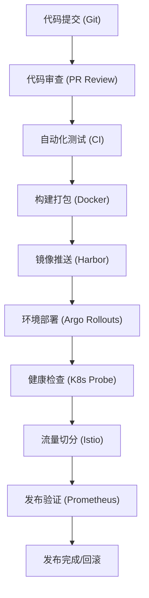
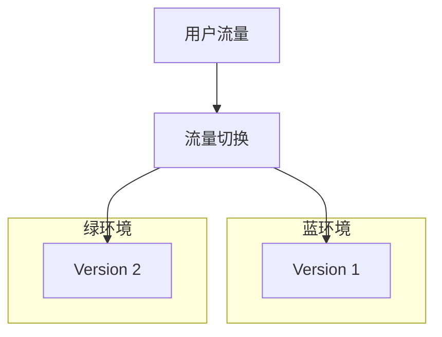
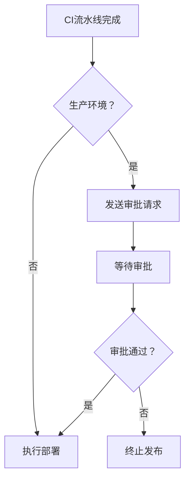

# 企业级软件发布流程详解：从CI/CD到灰度发布生产最佳实践

## 情境与背景

在现代软件开发中，软件发布流程的质量直接决定了产品交付的速度和稳定性。**一个成熟的发布流程需要实现自动化、可追溯、可回滚的持续交付能力**。作为高级DevOps/SRE工程师，设计和优化发布流程是核心职责之一。

## 一、发布流程架构总览

### 1.1 整体流程



### 1.2 流程阶段划分

| 阶段 | 目标 | 关键指标 |
|:----:|------|---------|
| **代码提交** | 版本控制 | 分支策略、提交规范 |
| **代码审查** | 质量保障 | 审查覆盖率、审查时间 |
| **自动化测试** | 功能验证 | 测试覆盖率、通过率 |
| **构建打包** | 制品生成 | 构建时间、成功率 |
| **镜像推送** | 制品存储 | 镜像安全扫描 |
| **环境部署** | 部署执行 | 部署时间、成功率 |
| **健康检查** | 服务验证 | 健康检查通过率 |
| **流量切分** | 灰度发布 | 流量比例、回滚时间 |
| **发布验证** | 效果确认 | 功能验证、性能指标 |

## 二、代码管理与审查

### 2.1 Git工作流选择

| 工作流 | 适用场景 | 特点 |
|:------:|---------|------|
| **GitFlow** | 大型项目、多版本维护 | 分支管理严格 |
| **GitHub Flow** | 小型项目、快速迭代 | 简单灵活 |
| **Trunk-Based** | 持续集成、频繁发布 | 主干开发 |

### 2.2 代码审查标准

```yaml
# CODEOWNERS配置示例
backend/*.py @backend-team
frontend/*.js @frontend-team
kubernetes/* @devops-team
```

**审查检查清单：**
- ✅ 代码风格符合团队规范
- ✅ 有足够的单元测试
- ✅ 没有硬编码敏感信息
- ✅ 性能影响评估
- ✅ 安全风险评估

## 三、CI/CD流水线设计

### 3.1 GitLab CI配置示例

```yaml
stages:
  - lint
  - test
  - build
  - deploy

lint:
  stage: lint
  script:
    - npm run lint

test:
  stage: test
  script:
    - npm test
    - npm run e2e

build:
  stage: build
  script:
    - docker build -t $CI_REGISTRY_IMAGE:$CI_COMMIT_SHA .
    - docker push $CI_REGISTRY_IMAGE:$CI_COMMIT_SHA

deploy-staging:
  stage: deploy
  environment: staging
  script:
    - helm upgrade --install app ./charts/app --set image.tag=$CI_COMMIT_SHA

deploy-production:
  stage: deploy
  environment: production
  script:
    - helm upgrade --install app ./charts/app --set image.tag=$CI_COMMIT_SHA
  when: manual
  only:
    - main
```

### 3.2 测试阶段设计

| 测试类型 | 执行时机 | 目标 |
|:--------:|---------|------|
| **单元测试** | 每次提交 | 验证单个函数/模块 |
| **集成测试** | PR合并前 | 验证模块间交互 |
| **E2E测试** | 构建前 | 验证完整业务流程 |
| **性能测试** | 预发布环境 | 验证性能指标 |
| **安全测试** | 构建后 | 扫描安全漏洞 |

## 四、容器镜像管理

### 4.1 镜像构建最佳实践

```dockerfile
# 多阶段构建
FROM node:16-alpine AS builder
WORKDIR /app
COPY package*.json ./
RUN npm ci --only=production

FROM node:16-alpine
WORKDIR /app
COPY --from=builder /app/node_modules ./node_modules
COPY . .
USER node
EXPOSE 3000
CMD ["node", "server.js"]
```

### 4.2 镜像仓库管理

```bash
# Harbor镜像仓库配置
# 1. 镜像标签规范
<registry>/<project>/<app>:<version>-<commit-sha>

# 2. 镜像清理策略
- 保留最近30个版本
- 删除未使用超过90天的镜像
- 定期安全扫描

# 3. 镜像签名验证
cosign sign <image>
cosign verify <image>
```

## 五、发布策略选择

### 5.1 滚动更新（Rolling Update）

```yaml
apiVersion: apps/v1
kind: Deployment
metadata:
  name: web-app
spec:
  strategy:
    type: RollingUpdate
    rollingUpdate:
      maxSurge: 25%
      maxUnavailable: 25%
```

### 5.2 蓝绿部署（Blue-Green Deployment）



### 5.3 金丝雀发布（Canary Release）

```yaml
apiVersion: argoproj.io/v1alpha1
kind: Rollout
metadata:
  name: canary-rollout
spec:
  strategy:
    canary:
      steps:
      - setWeight: 10
      - pause: {duration: 5m}
      - setWeight: 30
      - pause: {duration: 10m}
      - setWeight: 60
      - pause: {duration: 15m}
      - setWeight: 100
```

### 5.4 发布策略对比

| 策略 | 优点 | 缺点 | 适用场景 |
|:----:|------|------|---------|
| **滚动更新** | 简单、资源占用低 | 回滚慢 | 标准服务发布 |
| **蓝绿部署** | 零停机、快速回滚 | 资源占用翻倍 | 关键业务系统 |
| **金丝雀发布** | 风险可控 | 流程复杂 | 高风险变更 |
| **A/B测试** | 数据驱动决策 | 需要额外基础设施 | 功能实验 |

## 六、发布审批与安全

### 6.1 审批流程设计



### 6.2 安全扫描集成

```yaml
# GitLab CI安全扫描
include:
  - template: Security/SAST.gitlab-ci.yml
  - template: Security/Container-Scanning.gitlab-ci.yml
  - template: Security/Dependency-Scanning.gitlab-ci.yml
```

## 七、发布监控与回滚

### 7.1 发布监控指标

| 指标类型 | 监控内容 |
|:--------:|---------|
| **服务健康** | 存活探针、就绪探针 |
| **业务指标** | QPS、延迟、错误率 |
| **资源使用** | CPU、内存、磁盘 |
| **日志告警** | 错误日志、异常堆栈 |

### 7.2 自动回滚策略

```yaml
apiVersion: argoproj.io/v1alpha1
kind: Rollout
metadata:
  name: auto-rollback
spec:
  strategy:
    canary:
      analysis:
        templates:
        - templateName: success-rate
        startingStep: 1
        args:
        - name: service-name
          value: web-app
```

```yaml
# Prometheus告警规则
groups:
- name: release_alerts
  rules:
  - alert: ReleaseErrorRateHigh
    expr: sum(rate(http_errors_total[5m])) / sum(rate(http_requests_total[5m])) > 0.05
    for: 2m
    labels:
      severity: critical
    annotations:
      summary: "发布后错误率超过5%"
```

## 八、发布文档与复盘

### 8.1 发布文档模板

```markdown
# 发布文档

## 基本信息
- 发布版本: v1.2.3
- 发布时间: 2024-01-15 14:00
- 发布人: John
- 影响范围: API网关、用户服务

## 变更内容
- 新增: 用户注册功能
- 修改: 登录接口性能优化
- 修复: 订单创建bug

## 风险评估
- 高风险: 用户数据库迁移
- 中风险: API接口变更

## 回滚方案
- 执行: helm rollback app
- 预期时间: 5分钟

## 验证步骤
1. 检查Pod状态
2. 验证健康检查
3. 执行功能测试
```

### 8.2 发布复盘

| 维度 | 问题分析 | 改进措施 |
|:----:|---------|---------|
| **发布时间** | 构建时间过长 | 优化构建缓存 |
| **测试覆盖** | E2E测试遗漏 | 增加测试用例 |
| **回滚时间** | 回滚流程复杂 | 自动化回滚 |

## 九、生产环境最佳实践

### 9.1 环境管理

| 环境 | 用途 | 配置特点 |
|:----:|------|---------|
| **开发环境** | 日常开发 | 资源有限、配置简单 |
| **测试环境** | 功能测试 | 模拟生产配置 |
| **预发布环境** | 发布前验证 | 与生产完全一致 |
| **生产环境** | 线上运行 | 高可用、监控完善 |

### 9.2 发布窗口管理

```bash
# 发布窗口策略
- 工作日: 10:00-12:00, 14:00-18:00
- 紧急发布: 随时可发布，需审批
- 禁止发布时段: 业务高峰期、重大活动期间
```

### 9.3 发布频率

| 团队类型 | 推荐频率 | 说明 |
|:--------:|---------|------|
| **互联网产品** | 每日多次 | 快速迭代 |
| **企业软件** | 每周一次 | 稳定优先 |
| **金融系统** | 每月一次 | 合规要求高 |

## 十、面试精简版

### 10.1 一分钟版本

我们公司采用GitFlow工作流，代码提交后先经过双人代码审查，然后触发GitLab CI流水线执行自动化测试（单元测试+集成测试+E2E测试），测试通过后构建Docker镜像并推送到Harbor仓库，接着通过Argo Rollouts进行灰度发布。发布流程包括：代码提交→代码审查→自动化测试→构建打包→镜像推送→环境部署→健康检查→流量切分→发布验证→发布完成。我们采用蓝绿部署和滚动更新策略，确保零停机发布，同时具备一键回滚能力。

### 10.2 记忆口诀

```
代码提交审审查，测试构建打镜像，
部署验证再切流，回滚机制要健全，
CI/CD自动化，发布流程稳如磐。
```

### 10.3 关键词速查

| 关键词 | 说明 |
|:------:|------|
| GitFlow | Git工作流 |
| CI/CD | 持续集成/持续交付 |
| 蓝绿部署 | 零停机发布策略 |
| 金丝雀发布 | 小流量验证 |
| Argo Rollouts | K8s高级发布控制器 |

> **参考链接**：[SRE运维面试题全解析：从理论到实践（第三部分）]()
