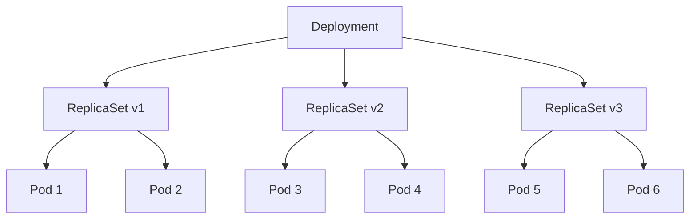
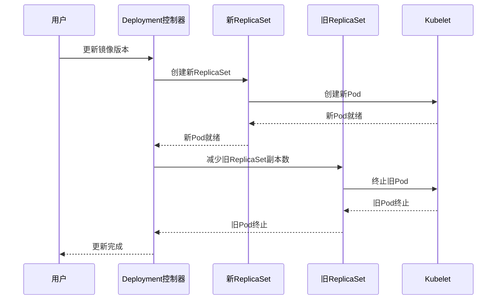

# Kubernetes Deployment与ReplicaSet深度解析：从原理到实践

## 情境(Situation)

在Kubernetes集群中，Deployment和ReplicaSet是核心的工作负载控制器，它们共同构成了Kubernetes的无状态应用管理体系。Deployment通过管理ReplicaSet实现Pod的版本控制和滚动更新，是生产环境中最常用的控制器之一。

作为SRE工程师，我们需要深入理解Deployment和ReplicaSet的工作原理、关系以及最佳实践，以便在实际应用中正确配置和管理无状态应用。

## 冲突(Conflict)

在实际应用中，SRE工程师经常面临以下挑战：

- **概念混淆**：对Deployment和ReplicaSet的关系理解不清
- **更新策略不当**：滚动更新配置不合理，导致服务中断
- **版本管理混乱**：历史版本过多或过少，影响回滚能力
- **资源管理不当**：Deployment和ReplicaSet配置不合理，导致资源浪费
- **监控告警不足**：缺乏对Deployment和ReplicaSet状态的有效监控

## 问题(Question)

如何理解Deployment与ReplicaSet的关系，掌握它们的工作原理和最佳实践？

## 答案(Answer)

本文将从SRE视角出发，详细介绍Kubernetes Deployment和ReplicaSet的关系、工作原理、配置方法、最佳实践以及常见问题排查，提供一套完整的无状态应用管理体系。核心方法论基于 [SRE面试题解析：k8s中deployment和rs啥关系？](#69-k8s中deployment和rs啥关系)。

---

## 一、Deployment与ReplicaSet关系

### 1.1 层级关系

**Deployment与ReplicaSet层级关系**：



**层级职责**：

| 层级 | 职责 | 管理者 |
|:------|:------|:------|
| **Deployment** | 声明式更新、版本管理 | 用户 |
| **ReplicaSet** | 确保Pod副本数 | Deployment |
| **Pod** | 容器运行载体 | ReplicaSet |

### 1.2 功能对比

**功能对比**：

| 特性 | Deployment | ReplicaSet |
|:------|:------|:------|
| **层级** | 高级控制器 | 基础控制器 |
| **版本管理** | ✅ 支持 | ❌ 不支持 |
| **滚动更新** | ✅ 支持 | ❌ 不支持 |
| **回滚** | ✅ 支持 | ❌ 不支持 |
| **直接使用** | ✅ 推荐 | ⚠️ 不推荐 |
| **历史版本** | ✅ 保留 | ❌ 不保留 |
| **更新策略** | ✅ 可配置 | ❌ 不可配置 |

### 1.3 命名规则

**命名规则**：
- **Deployment**：用户指定名称
- **ReplicaSet**：`{deployment-name}-{hash}`，其中hash由Pod模板生成
- **Pod**：`{replicaset-name}-{random-string}`

**示例**：
- Deployment：`nginx-deployment`
- ReplicaSet：`nginx-deployment-765d9c4589`
- Pod：`nginx-deployment-765d9c4589-5f678`

---

## 二、工作原理

### 2.1 创建过程

**创建流程**：
1. 用户创建Deployment配置
2. Kubernetes API Server接收请求并验证
3. Deployment控制器创建ReplicaSet
4. ReplicaSet控制器创建Pod
5. Kubelet在节点上启动容器

**配置示例**：

```yaml
apiVersion: apps/v1
kind: Deployment
metadata:
  name: nginx-deployment
spec:
  replicas: 3
  selector:
    matchLabels:
      app: nginx
  template:
    metadata:
      labels:
        app: nginx
    spec:
      containers:
      - name: nginx
        image: nginx:1.19.10
```

### 2.2 滚动更新

**滚动更新流程**：
1. 用户更新Deployment配置（如镜像版本）
2. Deployment控制器创建新的ReplicaSet
3. 新ReplicaSet开始创建Pod
4. 旧ReplicaSet开始缩容
5. 逐步调整新旧ReplicaSet的副本数
6. 完成后保留旧ReplicaSet用于回滚

**滚动更新策略**：

```yaml
strategy:
  type: RollingUpdate
  rollingUpdate:
    maxSurge: 25%    # 最大额外Pod数
    maxUnavailable: 25%  # 最大不可用Pod数
```

**更新过程**：



### 2.3 回滚操作

**回滚流程**：
1. 用户触发回滚操作
2. Deployment控制器重新激活旧的ReplicaSet
3. 逐步增加旧ReplicaSet的副本数
4. 逐步减少新ReplicaSet的副本数
5. 完成回滚

**回滚命令**：

```bash
# 查看历史版本
kubectl rollout history deployment/nginx-deployment

# 回滚到上一版本
kubectl rollout undo deployment/nginx-deployment

# 回滚到指定版本
kubectl rollout undo deployment/nginx-deployment --to-revision=2
```

---

## 三、配置详解

### 3.1 基本配置

**Deployment基本配置**：

```yaml
apiVersion: apps/v1
kind: Deployment
metadata:
  name: nginx-deployment
  namespace: default
spec:
  replicas: 3  # 副本数
  selector:
    matchLabels:
      app: nginx
  template:
    metadata:
      labels:
        app: nginx
    spec:
      containers:
      - name: nginx
        image: nginx:1.19.10
        ports:
        - containerPort: 80
        resources:
          requests:
            cpu: "100m"
            memory: "128Mi"
          limits:
            cpu: "200m"
            memory: "256Mi"
```

### 3.2 更新策略

**更新策略配置**：

```yaml
strategy:
  # 滚动更新（默认）
  type: RollingUpdate
  rollingUpdate:
    maxSurge: 1  # 最大额外Pod数
    maxUnavailable: 0  # 最大不可用Pod数

  # 或使用重建更新
  # type: Recreate
```

**更新策略对比**：

| 策略 | 特点 | 适用场景 |
|:------|:------|:------|
| **RollingUpdate** | 平滑更新，无 downtime | 生产环境，需要高可用 |
| **Recreate** | 先删除所有旧Pod，再创建新Pod | 测试环境，或需要完全重启的应用 |

### 3.3 历史版本管理

**历史版本配置**：

```yaml
spec:
  revisionHistoryLimit: 10  # 保留的历史版本数
```

**最佳实践**：
- 设置合理的历史版本数，建议3-10个
- 过多的历史版本会占用etcd空间
- 过少的历史版本会影响回滚能力

### 3.4 暂停与恢复

**暂停与恢复操作**：

```bash
# 暂停Deployment更新
kubectl rollout pause deployment/nginx-deployment

# 恢复Deployment更新
kubectl rollout resume deployment/nginx-deployment
```

**适用场景**：
- 批量更新多个参数
- 逐步验证更新效果
- 避免频繁触发更新

---

## 四、最佳实践

### 4.1 部署策略

**部署策略**：

| 场景 | 策略 | 配置 |
|:------|:------|:------|
| **生产环境** | RollingUpdate | maxSurge: 25%, maxUnavailable: 0 |
| **测试环境** | Recreate | 快速更新 |
| **大规模应用** | RollingUpdate | maxSurge: 10%, maxUnavailable: 10% |
| **关键服务** | RollingUpdate | maxSurge: 1, maxUnavailable: 0 |

### 4.2 资源管理

**资源管理最佳实践**：
- 为Pod设置合理的资源请求和限制
- 使用HPA自动调整副本数
- 配置PodDisruptionBudget确保高可用
- 监控资源使用情况，及时调整

**配置示例**：

```yaml
resources:
  requests:
    cpu: "100m"
    memory: "128Mi"
  limits:
    cpu: "200m"
    memory: "256Mi"
```

### 4.3 健康检查

**健康检查配置**：

```yaml
livenessProbe:
  httpGet:
    path: /health
    port: 80
  initialDelaySeconds: 30
  periodSeconds: 10
readinessProbe:
  httpGet:
    path: /ready
    port: 80
  initialDelaySeconds: 5
  periodSeconds: 10
```

**最佳实践**：
- 配置livenessProbe确保容器健康
- 配置readinessProbe确保服务就绪
- 与滚动更新策略配合使用

### 4.4 标签管理

**标签管理最佳实践**：
- 使用有意义的标签
- 保持标签一致性
- 避免过度使用标签
- 定期清理无用标签

**示例标签**：

```yaml
metadata:
  labels:
    app: nginx
    version: v1.0.0
    environment: production
    tier: frontend
```

### 4.5 命名规范

**命名规范**：
- Deployment：`{app-name}-deployment`
- Service：`{app-name}-service`
- ConfigMap：`{app-name}-config`
- Secret：`{app-name}-secret`

**示例**：
- Deployment：`nginx-deployment`
- Service：`nginx-service`
- ConfigMap：`nginx-config`
- Secret：`nginx-secret`

---

## 五、常见问题排查

### 5.1 更新失败

**更新失败原因**：
- 镜像拉取失败
- 健康检查失败
- 资源不足
- 配置错误

**排查方法**：

1. **查看Deployment状态**：
   ```bash
   kubectl rollout status deployment/nginx-deployment
   ```

2. **查看Pod状态**：
   ```bash
   kubectl get pods
   ```

3. **查看Pod日志**：
   ```bash
   kubectl logs <pod-name>
   ```

4. **查看事件**：
   ```bash
   kubectl describe deployment nginx-deployment
   ```

### 5.2 回滚失败

**回滚失败原因**：
- 历史版本不存在
- 资源不足
- 网络问题

**排查方法**：

1. **查看历史版本**：
   ```bash
   kubectl rollout history deployment/nginx-deployment
   ```

2. **检查资源**：
   ```bash
   kubectl describe node
   ```

3. **查看事件**：
   ```bash
   kubectl describe deployment nginx-deployment
   ```

### 5.3 副本数不一致

**副本数不一致原因**：
- 资源不足
- 节点亲和性冲突
- 污点和容忍度设置

**排查方法**：

1. **查看ReplicaSet状态**：
   ```bash
   kubectl get rs
   ```

2. **查看Pod事件**：
   ```bash
   kubectl describe pod <pod-name>
   ```

3. **检查节点状态**：
   ```bash
   kubectl get nodes
   ```

### 5.4 资源浪费

**资源浪费原因**：
- 副本数过多
- 资源限制设置过高
- 历史版本过多

**解决方案**：
- 使用HPA自动调整副本数
- 合理设置资源限制
- 配置合适的revisionHistoryLimit
- 定期清理无用资源

---

## 六、监控与告警

### 6.1 监控指标

**监控指标**：
- Deployment副本数
- 可用副本数
- 更新状态
- 回滚次数
- 资源使用情况
- 容器重启次数

**Prometheus监控**：

```yaml
# Deployment监控
apiVersion: monitoring.coreos.com/v1
kind: ServiceMonitor
metadata:
  name: kubernetes-deployments
  namespace: monitoring
spec:
  selector:
    matchLabels:
      app: kubernetes
  endpoints:
  - port: https
    path: /metrics
    scheme: https
    tlsConfig:
      insecureSkipVerify: true
    metricRelabelings:
    - sourceLabels: [__name__]
      regex: kube_deployment_.*
      action: keep
```

### 6.2 告警规则

**告警规则**：

```yaml
apiVersion: monitoring.coreos.com/v1
kind: PrometheusRule
metadata:
  name: kubernetes-deployment-alerts
  namespace: monitoring
spec:
  groups:
  - name: kubernetes-deployment
    rules:
    - alert: DeploymentReplicasMismatch
      expr: kube_deployment_status_replicas_available{job="kube-state-metrics"} != kube_deployment_spec_replicas{job="kube-state-metrics"}
      for: 5m
      labels:
        severity: warning
      annotations:
        summary: "Deployment {{ "{{" }} $labels.deployment }} replicas mismatch"
        description: "Deployment {{ "{{" }} $labels.deployment }} in namespace {{ "{{" }} $labels.namespace }} has {{ "{{" }} $value }} available replicas, expected {{ "{{" }} $labels.replicas }}."

    - alert: DeploymentRolloutStuck
      expr: kube_deployment_status_observed_generation{job="kube-state-metrics"} < kube_deployment_metadata_generation{job="kube-state-metrics"}
      for: 10m
      labels:
        severity: critical
      annotations:
        summary: "Deployment {{ "{{" }} $labels.deployment }} rollout stuck"
        description: "Deployment {{ "{{" }} $labels.deployment }} in namespace {{ "{{" }} $labels.namespace }} has been stuck in rollout for more than 10 minutes."
```

### 6.3 日志管理

**日志收集**：
- 收集Deployment和ReplicaSet的事件
- 分析更新和回滚操作
- 监控容器日志

**日志查询**：

```bash
# 查看Deployment事件
kubectl get events --field-selector involvedObject.kind=Deployment

# 查看ReplicaSet事件
kubectl get events --field-selector involvedObject.kind=ReplicaSet

# 查看Pod日志
kubectl logs -l app=nginx
```

---

## 七、案例分析

### 7.1 案例一：生产环境滚动更新

**需求**：在生产环境中更新应用，确保服务不中断。

**解决方案**：
- 使用RollingUpdate策略
- 配置合理的maxSurge和maxUnavailable
- 与健康检查配合使用

**配置示例**：

```yaml
apiVersion: apps/v1
kind: Deployment
metadata:
  name: api-deployment
spec:
  replicas: 4
  strategy:
    type: RollingUpdate
    rollingUpdate:
      maxSurge: 1
      maxUnavailable: 0
  template:
    spec:
      containers:
      - name: api
        image: myapp/api:v2.0.0
        livenessProbe:
          httpGet:
            path: /health
            port: 8080
          initialDelaySeconds: 30
          periodSeconds: 10
        readinessProbe:
          httpGet:
            path: /ready
            port: 8080
          initialDelaySeconds: 5
          periodSeconds: 10
```

**效果**：
- 服务不中断
- 平滑更新
- 自动回滚（如果失败）

### 7.2 案例二：批量更新配置

**需求**：批量更新多个配置参数，避免频繁触发更新。

**解决方案**：
- 暂停Deployment更新
- 更新多个配置
- 恢复更新

**操作步骤**：

```bash
# 暂停更新
kubectl rollout pause deployment/api-deployment

# 更新镜像
kubectl set image deployment/api-deployment api=myapp/api:v2.1.0

# 更新资源限制
kubectl set resources deployment/api-deployment -c api --limits=cpu=500m,memory=512Mi

# 恢复更新
kubectl rollout resume deployment/api-deployment

# 查看更新状态
kubectl rollout status deployment/api-deployment
```

**效果**：
- 批量更新，减少更新次数
- 避免中间状态
- 确保更新的一致性

### 7.3 案例三：回滚到之前版本

**需求**：新版本出现问题，需要回滚到之前的稳定版本。

**解决方案**：
- 查看历史版本
- 回滚到指定版本
- 验证回滚结果

**操作步骤**：

```bash
# 查看历史版本
kubectl rollout history deployment/api-deployment

# 回滚到上一版本
kubectl rollout undo deployment/api-deployment

# 或回滚到指定版本
kubectl rollout undo deployment/api-deployment --to-revision=3

# 查看回滚状态
kubectl rollout status deployment/api-deployment
```

**效果**：
- 快速回滚到稳定版本
- 最小化服务中断
- 恢复业务正常运行

---

## 八、最佳实践总结

### 8.1 配置最佳实践

**配置最佳实践**：

- [ ] **使用Deployment**：优先使用Deployment管理无状态应用
- [ ] **合理设置副本数**：根据业务需求和资源情况设置
- [ ] **配置滚动更新策略**：根据应用特性调整maxSurge和maxUnavailable
- [ ] **设置健康检查**：配置livenessProbe和readinessProbe
- [ ] **管理历史版本**：设置合适的revisionHistoryLimit
- [ ] **配置资源限制**：为Pod设置合理的资源请求和限制
- [ ] **使用标签管理**：保持标签一致性和可读性
- [ ] **遵循命名规范**：使用统一的命名规范

### 8.2 操作最佳实践

**操作最佳实践**：

- [ ] **定期更新**：定期更新应用版本和依赖
- [ ] **测试更新**：在测试环境验证更新效果
- [ ] **监控更新**：实时监控更新过程
- [ ] **准备回滚**：保留足够的历史版本
- [ ] **批量更新**：使用pause和resume进行批量更新
- [ ] **记录变更**：记录所有更新和回滚操作
- [ ] **定期清理**：清理无用的ReplicaSet和历史版本

### 8.3 监控与告警

**监控与告警**：

- [ ] **监控Deployment状态**：副本数、可用数、更新状态
- [ ] **监控资源使用**：CPU、内存、网络
- [ ] **配置告警规则**：更新失败、副本数不一致、回滚操作
- [ ] **分析日志**：收集和分析容器日志
- [ ] **建立Dashboard**：创建Deployment监控Dashboard

### 8.4 故障处理

**故障处理**：

- [ ] **快速定位**：使用kubectl命令快速定位问题
- [ ] **及时回滚**：出现问题时及时回滚到稳定版本
- [ ] **分析根因**：分析故障原因，避免重复发生
- [ ] **优化配置**：根据故障经验优化配置
- [ ] **建立预案**：制定故障处理预案

---

## 总结

Kubernetes Deployment和ReplicaSet是管理无状态应用的核心控制器，它们通过层级关系实现了版本管理和滚动更新。通过本文的详细介绍，我们可以深入理解它们的工作原理、关系以及最佳实践，建立一套完整的无状态应用管理体系。

**核心要点**：

1. **层级关系**：Deployment管理ReplicaSet，ReplicaSet管理Pod
2. **功能差异**：Deployment提供版本管理和滚动更新，ReplicaSet确保副本数
3. **滚动更新**：通过创建新ReplicaSet并逐步替换旧ReplicaSet实现
4. **回滚操作**：通过重新激活旧ReplicaSet实现
5. **最佳实践**：合理配置更新策略、健康检查、资源限制等
6. **监控告警**：建立完善的监控和告警机制
7. **故障处理**：快速定位问题并及时回滚

通过遵循这些最佳实践，我们可以确保无状态应用的稳定运行、平滑更新和快速回滚，提高集群的可靠性和可用性。

> **延伸学习**：更多面试相关的Deployment和ReplicaSet知识，请参考 [SRE面试题解析：k8s中deployment和rs啥关系？](#69-k8s中deployment和rs啥关系)。

---

## 参考资料

- [Kubernetes Deployment文档](https://kubernetes.io/docs/concepts/workloads/controllers/deployment/)
- [Kubernetes ReplicaSet文档](https://kubernetes.io/docs/concepts/workloads/controllers/replicaset/)
- [Kubernetes滚动更新](https://kubernetes.io/docs/concepts/workloads/controllers/deployment/#updating-a-deployment)
- [Kubernetes回滚操作](https://kubernetes.io/docs/concepts/workloads/controllers/deployment/#rolling-back-a-deployment)
- [Kubernetes健康检查](https://kubernetes.io/docs/tasks/configure-pod-container/configure-liveness-readiness-startup-probes/)
- [Kubernetes资源管理](https://kubernetes.io/docs/concepts/configuration/manage-resources-containers/)
- [Kubernetes标签和选择器](https://kubernetes.io/docs/concepts/overview/working-with-objects/labels/)
- [Kubernetes命名规范](https://kubernetes.io/docs/concepts/overview/working-with-objects/names/)
- [Kubernetes监控](https://kubernetes.io/docs/tasks/debug-application-cluster/resource-usage-monitoring/)
- [Prometheus监控](https://prometheus.io/docs/introduction/overview/)
- [Grafana监控](https://grafana.com/docs/grafana/latest/)
- [Kubernetes最佳实践](https://kubernetes.io/docs/concepts/configuration/overview/)
- [Kubernetes性能调优](https://kubernetes.io/docs/concepts/configuration/manage-resources-containers/)
- [Kubernetes安全最佳实践](https://kubernetes.io/docs/concepts/security/)
- [Kubernetes网络最佳实践](https://kubernetes.io/docs/concepts/services-networking/network-policies/)
- [Kubernetes存储最佳实践](https://kubernetes.io/docs/concepts/storage/)
- [Kubernetes升级策略](https://kubernetes.io/docs/tasks/administer-cluster/kubeadm/kubeadm-upgrade/)
- [Kubernetes故障排查](https://kubernetes.io/docs/tasks/debug-application-cluster/)
- [Kubernetes容器日志](https://kubernetes.io/docs/concepts/cluster-administration/logging/)
- [Kubernetes事件](https://kubernetes.io/docs/concepts/overview/working-with-objects/events/)
- [Kubernetes节点亲和性](https://kubernetes.io/docs/concepts/scheduling-eviction/assign-pod-node/)
- [Kubernetes污点和容忍度](https://kubernetes.io/docs/concepts/scheduling-eviction/taint-and-toleration/)
- [Kubernetes PodDisruptionBudget](https://kubernetes.io/docs/concepts/workloads/pods/disruptions/)
- [Kubernetes Pod优先级和抢占](https://kubernetes.io/docs/concepts/scheduling-eviction/pod-priority-preemption/)