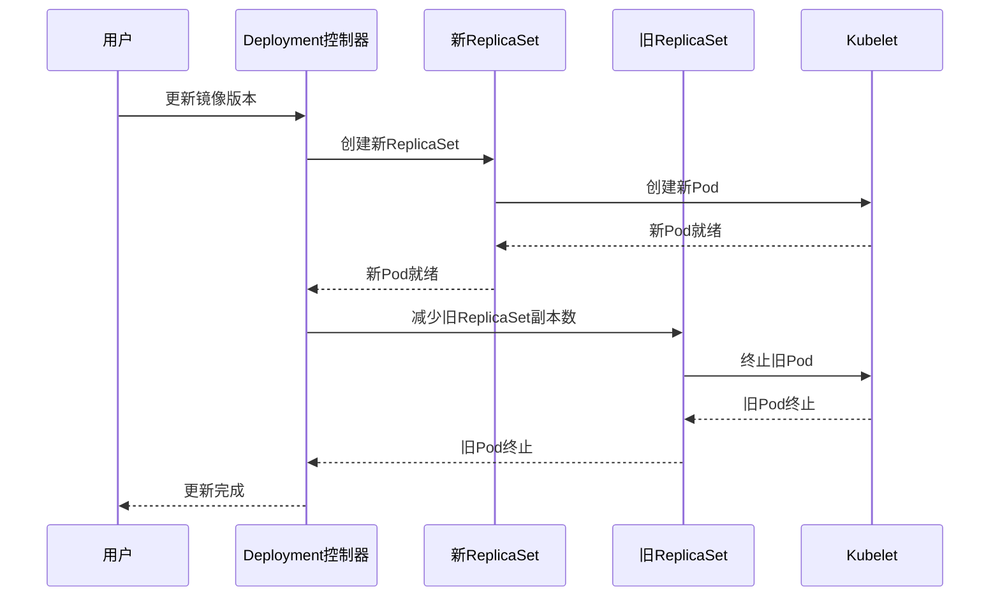

# Kubernetes与Ansible更新策略深度对比：从原理到实践

## 情境(Situation)

在现代DevOps实践中，应用部署和配置管理是核心环节。Kubernetes和Ansible作为两款流行的自动化工具，分别在容器编排和配置管理领域发挥着重要作用。两者都提供了更新策略，确保应用和配置的平滑过渡，避免服务中断。

作为SRE工程师，我们需要深入理解Kubernetes和Ansible的更新策略，掌握它们的工作原理、优缺点以及最佳实践，以便在实际应用中选择合适的工具和策略，确保服务的高可用性。

## 冲突(Conflict)

在实际应用中，SRE工程师经常面临以下挑战：

- **工具选择困难**：Kubernetes和Ansible在更新策略上各有特点，难以选择适合的工具
- **更新策略配置不当**：配置参数设置不合理，导致更新过程中服务中断
- **更新失败处理**：更新过程中出现故障，缺乏有效的回滚机制
- **混合环境管理**：在同时使用Kubernetes和Ansible的环境中，难以协调两者的更新策略
- **监控与告警不足**：缺乏对更新过程的有效监控，无法及时发现问题

## 问题(Question)

如何理解Kubernetes和Ansible的更新策略，掌握它们的工作原理和最佳实践？

## 答案(Answer)

本文将从SRE视角出发，详细对比Kubernetes和Ansible的更新策略，包括策略类型、工作原理、配置方法、最佳实践以及常见问题排查，提供一套完整的更新策略管理体系。核心方法论基于 [SRE面试题解析：k8s中的更新策略有哪些，对比ansible中更新配置有何相似之处？](#70-k8s中的更新策略有哪些对比ansible中更新配置有何相似之处)。

---

## 一、Kubernetes更新策略

### 1.1 策略类型

**Kubernetes更新策略**：

| 策略 | 特点 | 服务中断 | 适用场景 |
|:------|:------|:------|:------|
| **Recreate** | 先删除旧Pod，再创建新Pod | 完全中断 | 有状态应用、需要完全重启的服务 |
| **RollingUpdate** | 逐步替换旧Pod为新Pod | 持续可用 | 无状态应用、需要高可用的服务 |

### 1.2 滚动更新参数

**RollingUpdate参数**：

| 参数 | 描述 | 默认值 | 推荐值 |
|:------|:------|:------|:------|
| **maxSurge** | 最大额外Pod数 | 25% | 1或25% |
| **maxUnavailable** | 最大不可用Pod数 | 25% | 0或25% |

**参数组合效果**：

| 参数组合 | 效果 | 推荐场景 |
|:------|:------|:------|
| maxSurge=1, maxUnavailable=0 | 最高可用性，每次只更新一个Pod | 关键服务、金融系统 |
| maxSurge=25%, maxUnavailable=0 | 高可用性，较快的更新速度 | 一般生产服务 |
| maxSurge=0, maxUnavailable=25% | 资源节省，更新速度较慢 | 资源有限的环境 |
| maxSurge=25%, maxUnavailable=25% | 平衡速度和可用性 | 测试环境、非关键服务 |

### 1.3 配置示例

**Recreate策略**：

```yaml
apiVersion: apps/v1
kind: Deployment
metadata:
  name: stateful-app
spec:
  strategy:
    type: Recreate
  replicas: 3
  template:
    spec:
      containers:
      - name: app
        image: stateful-app:v2.0.0
```

**RollingUpdate策略**：

```yaml
apiVersion: apps/v1
kind: Deployment
metadata:
  name: stateless-app
spec:
  strategy:
    type: RollingUpdate
    rollingUpdate:
      maxSurge: 1
      maxUnavailable: 0
  replicas: 4
  template:
    spec:
      containers:
      - name: app
        image: stateless-app:v1.2.3
        readinessProbe:
          httpGet:
            path: /ready
            port: 8080
          initialDelaySeconds: 5
          periodSeconds: 10
```

### 1.4 滚动更新流程

**滚动更新流程**：
1. 用户更新Deployment配置（如镜像版本）
2. Deployment控制器创建新的ReplicaSet
3. 新ReplicaSet开始创建Pod（数量由maxSurge控制）
4. 旧ReplicaSet开始缩容（数量由maxUnavailable控制）
5. 逐步调整新旧ReplicaSet的副本数
6. 完成后保留旧ReplicaSet用于回滚

**更新过程**：



---

## 二、Ansible更新策略

### 2.1 滚动更新机制

**Ansible滚动更新**：
- 使用`serial`参数控制并发更新数量
- 支持按数量、百分比或列表方式控制更新批次
- 结合`wait_for`模块进行健康检查
- 支持`--force-handlers`确保失败时的处理

### 2.2 配置示例

**基本滚动更新**：

```yaml
- name: 滚动更新Web服务器
  hosts: webservers
  serial: 1  # 逐台执行
  tasks:
    - name: 停止服务
      service:
        name: nginx
        state: stopped

    - name: 部署新代码
      copy:
        src: app.tar.gz
        dest: /opt/app/

    - name: 启动服务
      service:
        name: nginx
        state: started

    - name: 健康检查
      wait_for:
        host: "{{ inventory_hostname }}"
        port: 80
        timeout: 30
```

**分批滚动更新**：

```yaml
- name: 分批滚动更新
  hosts: webservers
  serial: 
    - 1    # 先更新1台
    - 2    # 再更新2台
    - 5    # 最后更新5台
  tasks:
    - name: 停止服务
      service:
        name: nginx
        state: stopped

    - name: 部署新代码
      copy:
        src: app.tar.gz
        dest: /opt/app/

    - name: 启动服务
      service:
        name: nginx
        state: started

    - name: 健康检查
      uri:
        url: "http://{{ inventory_hostname }}/health"
        status_code: 200
```

**百分比滚动更新**：

```yaml
- name: 百分比滚动更新
  hosts: webservers
  serial: "30%"  # 每次更新30%的主机
  tasks:
    - name: 停止服务
      service:
        name: nginx
        state: stopped

    - name: 部署新代码
      copy:
        src: app.tar.gz
        dest: /opt/app/

    - name: 启动服务
      service:
        name: nginx
        state: started

    - name: 健康检查
      wait_for:
        host: "{{ inventory_hostname }}"
        port: 80
        timeout: 30
```

### 2.3 失败处理

**失败处理配置**：

```yaml
- name: 带失败处理的滚动更新
  hosts: webservers
  serial: 1
  force_handlers: true  # 确保handlers执行
  tasks:
    - name: 停止服务
      service:
        name: nginx
        state: stopped

    - name: 部署新代码
      copy:
        src: app.tar.gz
        dest: /opt/app/

    - name: 启动服务
      service:
        name: nginx
        state: started

    - name: 健康检查
      uri:
        url: "http://{{ inventory_hostname }}/health"
        status_code: 200
      register: health_check
      retries: 3
      delay: 5
      until: health_check.status == 200

  handlers:
    - name: 回滚代码
      copy:
        src: app-backup.tar.gz
        dest: /opt/app/
      when: health_check.failed

    - name: 重启服务
      service:
        name: nginx
        state: restarted
      when: health_check.failed
```

---

## 三、Kubernetes与Ansible更新策略对比

### 3.1 核心对比

**核心对比**：

| 特性 | Kubernetes | Ansible |
|:------|:------|:------|
| **控制方式** | 声明式 | 命令式 |
| **更新单位** | Pod | 服务器 |
| **更新策略** | Recreate、RollingUpdate | serial参数控制 |
| **自动回滚** | ✅ 内置 | ❌ 需要手动实现 |
| **健康检查** | ✅ 探针机制 | ⚠️ 需要手动配置 |
| **资源管理** | ✅ 自动扩缩容 | ❌ 无内置机制 |
| **并发控制** | maxSurge/maxUnavailable | serial参数 |
| **适用场景** | 容器编排 | 配置管理、基础设施管理 |

### 3.2 相似之处

**相似之处**：

| 维度 | Kubernetes | Ansible | 相似点 |
|:------|:------|:------|:------|
| **滚动更新** | RollingUpdate | serial | 控制并发度，避免同时更新 |
| **失败处理** | 自动回滚 | --force-handlers | 确保更新失败时的处理 |
| **分批更新** | maxSurge | serial: X | 控制每次更新的数量 |
| **服务可用性** | 保持部分Pod运行 | 按顺序更新 | 确保服务不中断 |
| **健康检查** | Readiness Probe | wait_for/uri模块 | 确保更新后服务正常 |

### 3.3 优缺点分析

**Kubernetes优缺点**：

| 优点 | 缺点 |
|:------|:------|
| 内置滚动更新机制 | 配置相对复杂 |
| 自动回滚功能 | 依赖Kubernetes集群 |
| 探针机制确保健康检查 | 资源消耗较高 |
| 声明式配置，易于管理 | 学习曲线较陡 |

**Ansible优缺点**：

| 优点 | 缺点 |
|:------|:------|
| 配置简单，易于使用 | 无内置自动回滚 |
| 支持多种更新策略 | 健康检查需要手动配置 |
| 适用于各种基础设施 | 依赖SSH连接 |
| 强大的变量和模板系统 | 执行速度相对较慢 |

---

## 四、最佳实践

### 4.1 Kubernetes最佳实践

**Kubernetes最佳实践**：

- [ ] **选择合适的更新策略**：无状态应用使用RollingUpdate，有状态应用使用Recreate
- [ ] **配置合理的滚动更新参数**：根据服务重要性调整maxSurge和maxUnavailable
- [ ] **配置健康检查**：使用Readiness Probe确保Pod就绪后再接收流量
- [ ] **设置合理的副本数**：确保滚动更新时有足够的Pod保持服务可用
- [ ] **使用标签管理**：合理使用标签，便于管理和监控
- [ ] **保留历史版本**：设置revisionHistoryLimit保留足够的历史版本
- [ ] **监控更新过程**：实时监控更新状态，及时发现问题
- [ ] **测试更新策略**：在测试环境验证更新策略的效果

**示例配置**：

```yaml
apiVersion: apps/v1
kind: Deployment
metadata:
  name: critical-app
spec:
  replicas: 4
  strategy:
    type: RollingUpdate
    rollingUpdate:
      maxSurge: 1
      maxUnavailable: 0
  revisionHistoryLimit: 10
  template:
    spec:
      containers:
      - name: app
        image: critical-app:v1.0.0
        readinessProbe:
          httpGet:
            path: /ready
            port: 8080
          initialDelaySeconds: 5
          periodSeconds: 10
        livenessProbe:
          httpGet:
            path: /health
            port: 8080
          initialDelaySeconds: 30
          periodSeconds: 10
```

### 4.2 Ansible最佳实践

**Ansible最佳实践**：

- [ ] **使用serial参数控制并发**：根据服务器数量和服务重要性设置合适的serial值
- [ ] **配置健康检查**：使用wait_for或uri模块确保服务正常
- [ ] **实现失败处理**：使用force_handlers和handlers实现回滚机制
- [ ] **分批更新**：对于大规模集群，使用分批更新减少风险
- [ ] **使用变量和模板**：提高配置的可维护性
- [ ] **记录更新过程**：使用debug模块记录更新状态
- [ ] **测试更新策略**：在测试环境验证更新效果
- [ ] **使用Ansible Vault**：保护敏感信息

**示例配置**：

```yaml
- name: 生产环境滚动更新
  hosts: production
  serial: 2
  force_handlers: true
  tasks:
    - name: 停止服务
      service:
        name: app
        state: stopped

    - name: 备份当前代码
      archive:
        path: /opt/app/
        dest: /backup/app-{{ ansible_date_time.date }}.tar.gz

    - name: 部署新代码
      copy:
        src: app-{{ version }}.tar.gz
        dest: /opt/app/

    - name: 解压代码
      unarchive:
        src: /opt/app/app-{{ version }}.tar.gz
        dest: /opt/app/
        remote_src: yes

    - name: 启动服务
      service:
        name: app
        state: started

    - name: 健康检查
      uri:
        url: "http://{{ inventory_hostname }}/health"
        status_code: 200
      register: health_check
      retries: 5
      delay: 10
      until: health_check.status == 200

  handlers:
    - name: 回滚代码
      unarchive:
        src: /backup/app-{{ ansible_date_time.date }}.tar.gz
        dest: /opt/app/
        remote_src: yes
      when: health_check.failed

    - name: 重启服务
      service:
        name: app
        state: restarted
      when: health_check.failed
```

### 4.3 混合使用最佳实践

**混合使用最佳实践**：

- [ ] **分工明确**：Kubernetes管理容器编排，Ansible管理基础设施配置
- [ ] **协同工作**：使用Ansible部署和管理Kubernetes集群
- [ ] **统一配置管理**：使用Ansible管理Kubernetes配置文件
- [ ] **自动化流程**：结合CI/CD工具实现自动化部署
- [ ] **监控集成**：统一监控Kubernetes和Ansible的执行状态

**示例工作流**：
1. 使用Ansible部署Kubernetes集群
2. 使用Ansible管理Kubernetes配置文件
3. 使用Kubernetes滚动更新容器应用
4. 使用Ansible更新基础设施配置
5. 使用CI/CD工具自动化整个流程

---

## 五、常见问题排查

### 5.1 Kubernetes更新失败

**更新失败原因**：
- 镜像拉取失败
- 健康检查失败
- 资源不足
- 配置错误
- 网络问题

**排查方法**：

1. **查看更新状态**：
   ```bash
   kubectl rollout status deployment/app
   ```

2. **查看Pod状态**：
   ```bash
   kubectl get pods
   ```

3. **查看Pod日志**：
   ```bash
   kubectl logs <pod-name>
   ```

4. **查看事件**：
   ```bash
   kubectl describe deployment app
   ```

5. **回滚操作**：
   ```bash
   kubectl rollout undo deployment/app
   ```

### 5.2 Ansible更新失败

**更新失败原因**：
- 网络连接问题
- 权限不足
- 配置错误
- 服务启动失败
- 健康检查失败

**排查方法**：

1. **查看执行日志**：
   ```bash
   ansible-playbook -vvv update.yml
   ```

2. **检查主机状态**：
   ```bash
   ansible webservers -m ping
   ```

3. **手动验证**：
   ```bash
   ssh <host> "systemctl status nginx"
   ```

4. **回滚操作**：
   ```bash
   ansible-playbook rollback.yml
   ```

### 5.3 混合环境问题

**混合环境问题**：
- 配置不同步
- 版本冲突
- 权限问题
- 网络隔离

**解决方案**：
- 使用统一的配置管理工具
- 建立版本控制机制
- 配置正确的权限和网络策略
- 定期同步配置和版本

---

## 六、监控与告警

### 6.1 Kubernetes监控

**监控指标**：
- Deployment副本数
- 可用副本数
- 更新状态
- 回滚次数
- 健康检查状态
- 容器重启次数

**Prometheus监控**：

```yaml
# Deployment监控
apiVersion: monitoring.coreos.com/v1
kind: ServiceMonitor
metadata:
  name: kubernetes-deployments
  namespace: monitoring
spec:
  selector:
    matchLabels:
      app: kubernetes
  endpoints:
  - port: https
    path: /metrics
    scheme: https
    tlsConfig:
      insecureSkipVerify: true
    metricRelabelings:
    - sourceLabels: [__name__]
      regex: kube_deployment_.*
      action: keep
```

**告警规则**：

```yaml
apiVersion: monitoring.coreos.com/v1
kind: PrometheusRule
metadata:
  name: kubernetes-deployment-alerts
  namespace: monitoring
spec:
  groups:
  - name: kubernetes-deployment
    rules:
    - alert: DeploymentRolloutStuck
      expr: kube_deployment_status_observed_generation{job="kube-state-metrics"} < kube_deployment_metadata_generation{job="kube-state-metrics"}
      for: 10m
      labels:
        severity: critical
      annotations:
        summary: "Deployment {{ $labels.deployment }} rollout stuck"
        description: "Deployment {{ $labels.deployment }} in namespace {{ $labels.namespace }} has been stuck in rollout for more than 10 minutes."

    - alert: DeploymentReplicasMismatch
      expr: kube_deployment_status_replicas_available{job="kube-state-metrics"} != kube_deployment_spec_replicas{job="kube-state-metrics"}
      for: 5m
      labels:
        severity: warning
      annotations:
        summary: "Deployment {{ $labels.deployment }} replicas mismatch"
        description: "Deployment {{ $labels.deployment }} in namespace {{ $labels.namespace }} has {{ $value }} available replicas, expected {{ $labels.replicas }}."
```

### 6.2 Ansible监控

**监控方法**：
- 使用Ansible Tower或AWX监控执行状态
- 集成ELK栈收集和分析日志
- 使用Prometheus监控执行结果
- 配置邮件或Slack通知

**示例监控配置**：

```yaml
# Ansible Tower监控
- name: 监控Ansible执行
  hosts: localhost
  tasks:
    - name: 检查执行状态
      uri:
        url: "https://tower.example.com/api/v2/jobs/{{ job_id }}/"
        user: admin
        password: password
        force_basic_auth: yes
        status_code: 200
      register: job_status

    - name: 发送通知
      slack:
        token: "{{ slack_token }}"
        channel: "#ansible-monitoring"
        msg: "Job {{ job_id }} status: {{ job_status.json.status }}"
      when: job_status.json.status != "running"
```

---

## 七、案例分析

### 7.1 案例一：生产环境Kubernetes滚动更新

**需求**：在生产环境中更新一个关键的Web服务，确保服务不中断。

**解决方案**：
- 使用RollingUpdate策略
- 配置maxSurge=1，maxUnavailable=0
- 配置Readiness Probe和Liveness Probe
- 监控更新过程

**配置示例**：

```yaml
apiVersion: apps/v1
kind: Deployment
metadata:
  name: web-service
spec:
  replicas: 4
  strategy:
    type: RollingUpdate
    rollingUpdate:
      maxSurge: 1
      maxUnavailable: 0
  template:
    spec:
      containers:
      - name: web
        image: web-service:v2.0.0
        ports:
        - containerPort: 80
        readinessProbe:
          httpGet:
            path: /ready
            port: 80
          initialDelaySeconds: 5
          periodSeconds: 10
        livenessProbe:
          httpGet:
            path: /health
            port: 80
          initialDelaySeconds: 30
          periodSeconds: 10
```

**效果**：
- 服务持续可用
- 平滑更新
- 自动回滚（如果失败）

### 7.2 案例二：大规模Ansible滚动更新

**需求**：更新100台Web服务器的配置，确保服务不中断。

**解决方案**：
- 使用serial参数控制并发
- 配置健康检查
- 实现失败处理和回滚机制
- 分批更新

**配置示例**：

```yaml
- name: 大规模滚动更新
  hosts: webservers
  serial: "20%"  # 每次更新20%的服务器
  force_handlers: true
  tasks:
    - name: 停止服务
      service:
        name: nginx
        state: stopped

    - name: 备份配置
      copy:
        src: /etc/nginx/nginx.conf
        dest: /etc/nginx/nginx.conf.bak

    - name: 更新配置
      template:
        src: nginx.conf.j2
        dest: /etc/nginx/nginx.conf

    - name: 启动服务
      service:
        name: nginx
        state: started

    - name: 健康检查
      uri:
        url: "http://{{ inventory_hostname }}"
        status_code: 200
      register: health_check
      retries: 3
      delay: 5
      until: health_check.status == 200

  handlers:
    - name: 回滚配置
      copy:
        src: /etc/nginx/nginx.conf.bak
        dest: /etc/nginx/nginx.conf
      when: health_check.failed

    - name: 重启服务
      service:
        name: nginx
        state: restarted
      when: health_check.failed
```

**效果**：
- 服务不中断
- 失败自动回滚
- 分批更新减少风险

### 7.3 案例三：混合环境更新

**需求**：同时更新Kubernetes集群中的应用和底层服务器配置。

**解决方案**：
- 使用Ansible更新服务器配置
- 使用Kubernetes滚动更新应用
- 协同工作，确保配置一致

**工作流程**：
1. 使用Ansible更新服务器内核和系统包
2. 使用Ansible更新Kubernetes集群配置
3. 使用Kubernetes滚动更新应用镜像
4. 验证服务状态

**配置示例**：

```yaml
# Ansible playbook
- name: 更新服务器配置
  hosts: kubernetes-nodes
  serial: 1
  tasks:
    - name: 更新系统包
      yum:
        name: '*'
        state: latest

    - name: 重启服务器
      reboot:
        post_reboot_delay: 60

    - name: 验证Kubernetes节点状态
      shell: kubectl get node {{ inventory_hostname }}
      delegate_to: localhost

# Kubernetes Deployment
apiVersion: apps/v1
kind: Deployment
metadata:
  name: app

spec:
  replicas: 3
  strategy:
    type: RollingUpdate
    rollingUpdate:
      maxSurge: 1
      maxUnavailable: 0
  template:
    spec:
      containers:
      - name: app
        image: app:v1.1.0
```

**效果**：
- 系统配置和应用版本同步更新
- 服务持续可用
- 自动化流程减少人工干预

---

## 八、最佳实践总结

### 8.1 工具选择

**工具选择指南**：

| 场景 | 推荐工具 | 理由 |
|:------|:------|:------|
| **容器编排** | Kubernetes | 内置滚动更新、自动回滚、健康检查 |
| **基础设施配置** | Ansible | 简单易用、支持多种更新策略 |
| **混合环境** | 两者结合 | 优势互补，协同工作 |

### 8.2 更新策略选择

**更新策略选择**：

| 服务类型 | 推荐策略 | 工具 |
|:------|:------|:------|
| **关键无状态服务** | 滚动更新，maxSurge=1, maxUnavailable=0 | Kubernetes |
| **一般无状态服务** | 滚动更新，maxSurge=25%, maxUnavailable=25% | Kubernetes |
| **有状态服务** | 重建更新 | Kubernetes |
| **服务器配置** | serial=1或serial="20%" | Ansible |
| **大规模集群** | 分批滚动更新 | Ansible |

### 8.3 配置最佳实践

**配置最佳实践**：

- [ ] **Kubernetes**：
  - 使用RollingUpdate策略
  - 配置合理的maxSurge和maxUnavailable
  - 配置健康检查探针
  - 设置合理的副本数
  - 保留足够的历史版本

- [ ] **Ansible**：
  - 使用serial参数控制并发
  - 配置健康检查
  - 实现失败处理和回滚
  - 分批更新减少风险
  - 使用变量和模板提高可维护性

- [ ] **混合环境**：
  - 分工明确，协同工作
  - 统一配置管理
  - 自动化流程
  - 监控集成

### 8.4 监控与告警

**监控与告警**：

- [ ] **监控指标**：
  - Kubernetes：Deployment状态、副本数、健康检查
  - Ansible：执行状态、成功/失败率、执行时间

- [ ] **告警规则**：
  - 更新失败告警
  - 服务不可用告警
  - 回滚操作告警
  - 执行超时告警

- [ ] **监控工具**：
  - Kubernetes：Prometheus、Grafana
  - Ansible：Ansible Tower、ELK栈

---

## 总结

Kubernetes和Ansible作为现代DevOps实践中的重要工具，各自提供了强大的更新策略。Kubernetes的RollingUpdate策略通过逐步替换Pod确保服务持续可用，而Ansible的serial参数通过控制并发更新数量减少风险。两者都旨在确保服务的高可用性，避免更新过程中的服务中断。

**核心要点**：

1. **Kubernetes更新策略**：Recreate（先删后建）和RollingUpdate（逐步替换）
2. **Ansible更新策略**：使用serial参数控制并发更新数量
3. **相似之处**：都支持滚动更新，避免同时更新所有实例
4. **不同之处**：Kubernetes是声明式，Ansible是命令式；Kubernetes内置自动回滚，Ansible需要手动实现
5. **最佳实践**：根据服务类型和重要性选择合适的更新策略
6. **混合使用**：Kubernetes管理容器，Ansible管理基础设施，优势互补
7. **监控告警**：建立完善的监控和告警机制，及时发现和处理问题

通过深入理解Kubernetes和Ansible的更新策略，我们可以在实际应用中选择合适的工具和策略，确保服务的平滑更新和高可用性。

> **延伸学习**：更多面试相关的更新策略知识，请参考 [SRE面试题解析：k8s中的更新策略有哪些，对比ansible中更新配置有何相似之处？](#70-k8s中的更新策略有哪些对比ansible中更新配置有何相似之处)。

---

## 参考资料

- [Kubernetes Deployment文档](https://kubernetes.io/docs/concepts/workloads/controllers/deployment/)
- [Kubernetes滚动更新](https://kubernetes.io/docs/concepts/workloads/controllers/deployment/#updating-a-deployment)
- [Ansible文档](https://docs.ansible.com/ansible/latest/index.html)
- [Ansible滚动更新](https://docs.ansible.com/ansible/latest/user_guide/playbooks_delegation.html#rolling-update-batch-size)
- [Ansible serial参数](https://docs.ansible.com/ansible/latest/user_guide/playbooks_strategies.html#using-serial)
- [Kubernetes健康检查](https://kubernetes.io/docs/tasks/configure-pod-container/configure-liveness-readiness-startup-probes/)
- [Ansible wait_for模块](https://docs.ansible.com/ansible/latest/modules/wait_for_module.html)
- [Ansible uri模块](https://docs.ansible.com/ansible/latest/modules/uri_module.html)
- [Kubernetes最佳实践](https://kubernetes.io/docs/concepts/configuration/overview/)
- [Ansible最佳实践](https://docs.ansible.com/ansible/latest/user_guide/playbooks_best_practices.html)
- [Prometheus监控](https://prometheus.io/docs/introduction/overview/)
- [Grafana监控](https://grafana.com/docs/grafana/latest/)
- [ELK栈](https://www.elastic.co/elastic-stack)
- [Ansible Tower](https://www.ansible.com/products/tower)
- [CI/CD最佳实践](https://www.jenkins.io/doc/book/pipeline/)
- [DevOps最佳实践](https://aws.amazon.com/devops/best-practices/)
- [Kubernetes性能调优](https://kubernetes.io/docs/concepts/configuration/manage-resources-containers/)
- [Ansible性能调优](https://docs.ansible.com/ansible/latest/user_guide/playbooks_performance.html)
- [Kubernetes安全最佳实践](https://kubernetes.io/docs/concepts/security/)
- [Ansible安全最佳实践](https://docs.ansible.com/ansible/latest/user_guide/playbooks_best_practices.html#security-related-practices)
- [Kubernetes网络最佳实践](https://kubernetes.io/docs/concepts/services-networking/network-policies/)
- [Ansible网络模块](https://docs.ansible.com/ansible/latest/network/index.html)
- [Kubernetes存储最佳实践](https://kubernetes.io/docs/concepts/storage/)
- [Ansible存储模块](https://docs.ansible.com/ansible/latest/modules/list_of_storage_modules.html)