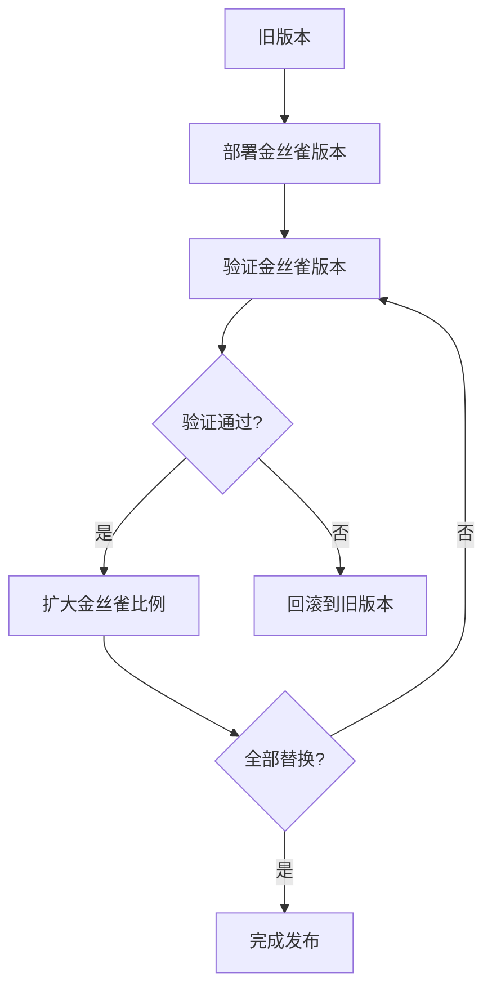
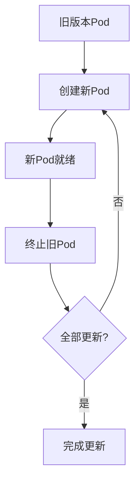
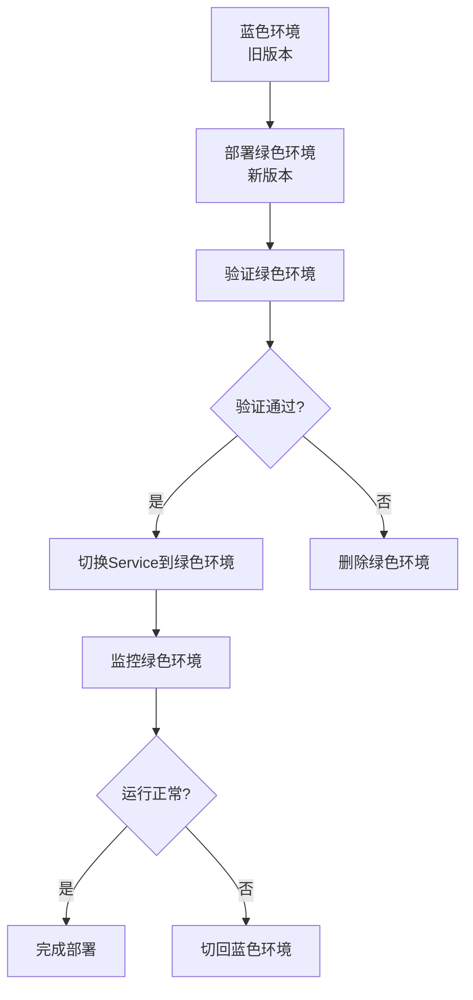
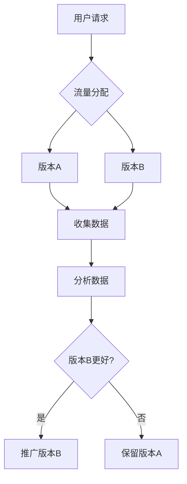

# Kubernetes发布策略详解：从金丝雀到蓝绿部署

## 情境(Situation)

在现代DevOps实践中，应用发布是一个关键环节。Kubernetes作为容器编排平台，提供了多种发布策略，如金丝雀发布、滚动更新、蓝绿部署和A/B测试等。选择合适的发布策略可以确保服务的平滑升级，减少发布风险，提高系统的可用性。

作为SRE工程师，我们需要深入理解Kubernetes的各种发布策略，掌握它们的工作原理、实现方法和最佳实践，以便在实际应用中根据业务需求选择合适的发布策略。

## 冲突(Conflict)

在实际应用中，SRE工程师经常面临以下挑战：

- **发布风险**：新版本可能引入bug，导致服务中断
- **服务可用性**：发布过程中需要保持服务的持续可用
- **回滚困难**：发布失败时需要快速回滚到稳定版本
- **测试验证**：需要在发布过程中验证新版本的稳定性
- **流量控制**：需要精细控制流量分配，确保平稳过渡

## 问题(Question)

如何在Kubernetes中实现常见的发布策略，确保服务的平滑升级和高可用性？

## 答案(Answer)

本文将从SRE视角出发，详细介绍Kubernetes的各种发布策略，包括金丝雀发布、滚动更新、蓝绿部署和A/B测试，分析它们的工作原理、实现方法、适用场景以及最佳实践，提供一套完整的发布策略管理体系。核心方法论基于 [SRE面试题解析：k8s中如何实现常见的发布策略？](#71-k8s中如何实现常见的发布策略)。

---

## 一、发布策略概述

### 1.1 策略对比

**发布策略对比**：

| 策略 | 核心概念 | 特点 | 适用场景 |
|:------|:------|:------|:------|
| **金丝雀发布** | 逐步替换，先少量验证 | 风险可控、渐进式 | 重要生产环境更新 |
| **滚动更新** | 逐步替换，持续可用 | 自动化、平滑 | 无状态服务 |
| **蓝绿部署** | 双环境切换 | 快速回滚、完整测试 | 高可用要求场景 |
| **A/B测试** | 基于用户特征分配流量 | 数据驱动、精细化 | 功能验证场景 |

### 1.2 选择指南

**策略选择指南**：

| 场景 | 推荐策略 | 理由 |
|:------|:------|:------|
| 重要生产更新 | 金丝雀发布 | 风险可控，逐步验证 |
| 无状态服务 | 滚动更新 | 自动化，资源利用率高 |
| 高可用要求 | 蓝绿部署 | 快速回滚，完整测试 |
| 功能验证 | A/B测试 | 数据驱动决策 |
| 小规模更新 | 滚动更新 | 简单高效 |
| 大规模重构 | 蓝绿部署 | 完整测试，快速回滚 |

---

## 二、金丝雀发布

### 2.1 工作原理

**金丝雀发布原理**：
- 逐步将流量从旧版本切换到新版本
- 先发布少量实例进行验证
- 验证通过后逐步扩大发布范围
- 出现问题时可以快速回滚

**流程图**：



### 2.2 实现方法

**基于rollout pause的实现**：

```bash
# 1. 更新镜像并记录
kubectl set image deployment/myapp myapp=myapp:v2 --record=true

# 2. 暂停更新
kubectl rollout pause deployment/myapp

# 3. 验证金丝雀Pod
kubectl get pods

# 4. 查看更新状态
kubectl rollout status deployment/myapp

# 5. 确认无问题后继续
kubectl rollout resume deployment/myapp
```

**基于比例的实现**：

```yaml
# 1. 创建新版本Deployment
apiVersion: apps/v1
kind: Deployment
metadata:
  name: myapp-canary
spec:
  replicas: 1  # 少量实例
  selector:
    matchLabels:
      app: myapp
      version: v2
  template:
    metadata:
      labels:
        app: myapp
        version: v2
    spec:
      containers:
      - name: myapp
        image: myapp:v2

# 2. 配置Service权重
apiVersion: v1
kind: Service
metadata:
  name: myapp
spec:
  selector:
    app: myapp
  ports:
  - port: 80
    targetPort: 8080
```

### 2.3 最佳实践

**金丝雀发布最佳实践**：
- 从1%流量开始，逐步增加
- 设置监控告警，及时发现问题
- 制定明确的验证标准
- 准备回滚预案
- 记录发布过程，便于分析

**验证步骤**：
1. 监控系统指标（CPU、内存、响应时间）
2. 检查应用日志，寻找错误信息
3. 进行功能测试，验证核心功能
4. 观察用户反馈，收集错误报告

---

## 三、滚动更新

### 3.1 工作原理

**滚动更新原理**：
- 逐步替换旧Pod为新Pod
- 保持服务的持续可用
- 自动处理更新过程
- 支持回滚操作

**流程图**：



### 3.2 配置示例

**基本配置**：

```yaml
apiVersion: apps/v1
kind: Deployment
metadata:
  name: myapp
spec:
  replicas: 4
  strategy:
    type: RollingUpdate
    rollingUpdate:
      maxSurge: 1        # 最多额外1个Pod
      maxUnavailable: 0   # 不允许Pod不可用
  template:
    spec:
      containers:
      - name: myapp
        image: myapp:v2
        readinessProbe:
          httpGet:
            path: /ready
            port: 8080
          initialDelaySeconds: 5
          periodSeconds: 10
```

**参数说明**：
- **maxSurge**：更新过程中可以创建的最大额外Pod数
- **maxUnavailable**：更新过程中允许的最大不可用Pod数

### 3.3 最佳实践

**滚动更新最佳实践**：
- 设置maxUnavailable=0确保零中断
- 配置健康检查探针，确保Pod就绪后再接收流量
- 根据服务重要性调整maxSurge值
- 监控更新过程，及时发现问题
- 保留足够的历史版本，便于回滚

**推荐配置**：
- 关键服务：maxSurge=1, maxUnavailable=0
- 一般服务：maxSurge=25%, maxUnavailable=25%
- 资源有限环境：maxSurge=0, maxUnavailable=25%

---

## 四、蓝绿部署

### 4.1 工作原理

**蓝绿部署原理**：
- 维护两个环境：蓝色（旧版本）和绿色（新版本）
- 两个环境同时运行，但只有一个接收流量
- 验证新版本后，通过切换Service实现流量切换
- 出现问题时可以快速切回旧版本

**流程图**：



### 4.2 实现方法

**蓝绿部署配置**：

```yaml
# 蓝色环境（旧版本）
apiVersion: apps/v1
kind: Deployment
metadata:
  name: myapp-blue
spec:
  replicas: 3
  selector:
    matchLabels:
      app: myapp
      color: blue
  template:
    metadata:
      labels:
        app: myapp
        color: blue
    spec:
      containers:
      - name: myapp
        image: myapp:v1

---

# 绿色环境（新版本）
apiVersion: apps/v1
kind: Deployment
metadata:
  name: myapp-green
spec:
  replicas: 3
  selector:
    matchLabels:
      app: myapp
      color: green
  template:
    metadata:
      labels:
        app: myapp
        color: green
    spec:
      containers:
      - name: myapp
        image: myapp:v2

---

# Service配置
apiVersion: v1
kind: Service
metadata:
  name: myapp
spec:
  selector:
    app: myapp
    color: blue  # 切换为green实现更新
  ports:
  - port: 80
    targetPort: 8080
```

**切换步骤**：

```bash
# 1. 部署绿色环境
kubectl apply -f green-deployment.yaml

# 2. 验证绿色环境
kubectl get pods -l color=green

# 3. 切换Service到绿色环境
kubectl patch service myapp -p '{"spec":{"selector":{"app":"myapp","color":"green"}}}'

# 4. 验证服务
curl http://myapp.example.com

# 5. 出现问题时切回蓝色环境
kubectl patch service myapp -p '{"spec":{"selector":{"app":"myapp","color":"blue"}}}'
```

### 4.3 最佳实践

**蓝绿部署最佳实践**：
- 确保两个环境的配置一致
- 完整测试新版本后再切换
- 预留足够的资源，避免资源竞争
- 切换后监控系统指标
- 切换完成后清理旧环境

**注意事项**：
- 蓝绿部署需要双倍资源
- 数据迁移可能影响部署过程
- 长连接可能导致切换延迟

---

## 五、A/B测试

### 5.1 工作原理

**A/B测试原理**：
- 同时运行多个版本的应用
- 基于用户特征或其他条件分配流量
- 收集用户数据，评估版本性能
- 根据数据决策是否全面推广

**流程图**：



### 5.2 实现方法

**基于Ingress的实现**：

```yaml
apiVersion: networking.k8s.io/v1
kind: Ingress
metadata:
  name: myapp-ab-test
  annotations:
    nginx.ingress.kubernetes.io/canary: "true"
    nginx.ingress.kubernetes.io/canary-weight: "10"  # 10%流量到新版本
spec:
  rules:
  - host: myapp.example.com
    http:
      paths:
      - path: /
        pathType: Prefix
        backend:
          service:
            name: myapp-v1
            port:
              number: 80
```

**基于Service的实现**：

```yaml
# 版本A Service
apiVersion: v1
kind: Service
metadata:
  name: myapp-v1
spec:
  selector:
    app: myapp
    version: v1
  ports:
  - port: 80
    targetPort: 8080

# 版本B Service
apiVersion: v1
kind: Service
metadata:
  name: myapp-v2
spec:
  selector:
    app: myapp
    version: v2
  ports:
  - port: 80
    targetPort: 8080

# Ingress配置
apiVersion: networking.k8s.io/v1
kind: Ingress
metadata:
  name: myapp-ab-test
spec:
  rules:
  - host: myapp.example.com
    http:
      paths:
      - path: /
        pathType: Prefix
        backend:
          service:
            name: myapp-v1
            port:
              number: 80
      - path: /v2
        pathType: Prefix
        backend:
          service:
            name: myapp-v2
            port:
              number: 80
```

### 5.3 最佳实践

**A/B测试最佳实践**：
- 明确测试目标和指标
- 确保样本量足够大
- 控制变量，确保测试结果可靠
- 收集全面的用户数据
- 制定明确的决策标准

**测试指标**：
- 用户转化率
- 页面加载时间
- 错误率
- 用户停留时间
- 功能使用频率

---

## 六、发布策略实践指南

### 6.1 准备工作

**发布前准备**：
- 制定发布计划，明确目标和步骤
- 准备回滚预案，确保出现问题时能快速回滚
- 进行充分的测试，包括单元测试、集成测试和端到端测试
- 检查监控系统，确保能及时发现问题
- 通知相关团队，协调发布时间

**检查清单**：
- [ ] 代码已通过所有测试
- [ ] 镜像已构建并推送到仓库
- [ ] 配置文件已更新
- [ ] 监控告警已配置
- [ ] 回滚方案已准备
- [ ] 相关团队已通知

### 6.2 执行发布

**发布执行步骤**：
1. **预发布**：在测试环境验证新版本
2. **发布**：根据选择的策略执行发布
3. **验证**：监控系统指标，验证服务正常
4. **完成**：确认发布成功，清理旧资源

**监控重点**：
- 系统指标：CPU、内存、网络、磁盘
- 应用指标：响应时间、错误率、吞吐量
- 业务指标：用户数、转化率、订单量

### 6.3 回滚操作

**回滚触发条件**：
- 系统指标异常
- 应用错误率上升
- 业务指标下降
- 用户反馈异常

**回滚步骤**：
1. **停止发布**：暂停正在进行的发布
2. **执行回滚**：根据发布策略选择合适的回滚方法
3. **验证**：确认回滚成功，服务恢复正常
4. **分析**：分析失败原因，制定改进方案

**回滚方法**：
- **滚动更新**：使用`kubectl rollout undo`
- **蓝绿部署**：切换Service回旧环境
- **金丝雀发布**：暂停更新，删除金丝雀实例

---

## 七、常见问题排查

### 7.1 金丝雀发布异常

**异常原因**：
- 新版本存在bug
- 配置不一致
- 依赖服务不可用
- 资源不足

**排查方法**：
1. **查看Pod日志**：
   ```bash
   kubectl logs <canary-pod-name>
   ```

2. **检查Pod状态**：
   ```bash
   kubectl describe pod <canary-pod-name>
   ```

3. **查看事件**：
   ```bash
   kubectl get events
   ```

4. **执行回滚**：
   ```bash
   kubectl rollout undo deployment/myapp
   ```

### 7.2 滚动更新中断

**中断原因**：
- maxUnavailable设置过大
- 健康检查失败
- 资源不足
- 网络问题

**排查方法**：
1. **查看更新状态**：
   ```bash
   kubectl rollout status deployment/myapp
   ```

2. **查看Pod状态**：
   ```bash
   kubectl get pods
   ```

3. **调整参数**：
   ```bash
   kubectl patch deployment myapp -p '{"spec":{"strategy":{"rollingUpdate":{"maxUnavailable":0}}}}'
   ```

4. **执行回滚**：
   ```bash
   kubectl rollout undo deployment/myapp
   ```

### 7.3 蓝绿部署失败

**失败原因**：
- 环境配置不一致
- 数据迁移失败
- 资源不足
- Service切换失败

**排查方法**：
1. **检查环境配置**：
   ```bash
   kubectl diff -f blue-deployment.yaml -f green-deployment.yaml
   ```

2. **验证绿色环境**：
   ```bash
   kubectl get pods -l color=green
   kubectl logs <green-pod-name>
   ```

3. **切回蓝色环境**：
   ```bash
   kubectl patch service myapp -p '{"spec":{"selector":{"app":"myapp","color":"blue"}}}'
   ```

4. **清理绿色环境**：
   ```bash
   kubectl delete deployment myapp-green
   ```

### 7.4 A/B测试数据异常

**异常原因**：
- 流量分配不均匀
- 测试样本不足
- 指标收集错误
- 外部因素干扰

**排查方法**：
1. **检查流量分配**：
   ```bash
   kubectl get ingress myapp-ab-test -o yaml
   ```

2. **分析数据**：
   - 检查监控数据
   - 分析用户行为日志
   - 验证数据收集脚本

3. **调整测试参数**：
   - 修改流量分配比例
   - 延长测试时间
   - 增加样本量

---

## 八、监控与告警

### 8.1 发布监控

**监控指标**：
- **发布状态**：更新进度、完成时间
- **系统指标**：CPU、内存、网络、磁盘
- **应用指标**：响应时间、错误率、吞吐量
- **业务指标**：用户数、转化率、订单量

**Prometheus监控**：

```yaml
# 发布状态监控
apiVersion: monitoring.coreos.com/v1
kind: ServiceMonitor
metadata:
  name: kubernetes-deployments
  namespace: monitoring
spec:
  selector:
    matchLabels:
      app: kubernetes
  endpoints:
  - port: https
    path: /metrics
    scheme: https
    tlsConfig:
      insecureSkipVerify: true
    metricRelabelings:
    - sourceLabels: [__name__]
      regex: kube_deployment_.*
      action: keep
```

### 8.2 告警规则

**告警规则**：

```yaml
apiVersion: monitoring.coreos.com/v1
kind: PrometheusRule
metadata:
  name: kubernetes-release-alerts
  namespace: monitoring
spec:
  groups:
  - name: kubernetes-release
    rules:
    - alert: DeploymentRolloutStuck
      expr: kube_deployment_status_observed_generation{job="kube-state-metrics"} < kube_deployment_metadata_generation{job="kube-state-metrics"}
      for: 10m
      labels:
        severity: critical
      annotations:
        summary: "Deployment {{ "{{" }} $labels.deployment }} rollout stuck"
        description: "Deployment {{ "{{" }} $labels.deployment }} in namespace {{ "{{" }} $labels.namespace }} has been stuck in rollout for more than 10 minutes."

    - alert: DeploymentReplicasMismatch
      expr: kube_deployment_status_replicas_available{job="kube-state-metrics"} != kube_deployment_spec_replicas{job="kube-state-metrics"}
      for: 5m
      labels:
        severity: warning
      annotations:
        summary: "Deployment {{ "{{" }} $labels.deployment }} replicas mismatch"
        description: "Deployment {{ "{{" }} $labels.deployment }} in namespace {{ "{{" }} $labels.namespace }} has {{ "{{" }} $value }} available replicas, expected {{ "{{" }} $labels.replicas }}."

    - alert: PodCrashLooping
      expr: rate(kube_pod_container_status_restarts_total{job="kube-state-metrics"}[5m]) > 0
      for: 5m
      labels:
        severity: critical
      annotations:
        summary: "Pod {{ "{{" }} $labels.pod }} crash looping"
        description: "Pod {{ "{{" }} $labels.pod }} in namespace {{ "{{" }} $labels.namespace }} is crash looping."
```

### 8.3 发布Dashboard

**Grafana Dashboard**：
- 发布状态面板：显示当前发布进度和状态
- 系统指标面板：显示CPU、内存、网络等指标
- 应用指标面板：显示响应时间、错误率、吞吐量
- 业务指标面板：显示用户数、转化率、订单量
- 告警面板：显示当前告警和历史告警

**Dashboard配置**：
- 数据源：Prometheus
- 时间范围：发布前后4小时
- 自动刷新：30秒
- 告警通知：Slack、Email

---

## 九、案例分析

### 9.1 案例一：金丝雀发布重要服务

**需求**：更新一个关键的支付服务，确保服务不中断，风险可控。

**解决方案**：
- 使用金丝雀发布策略
- 从1%流量开始，逐步增加
- 配置详细的监控和告警
- 准备回滚预案

**执行步骤**：
1. **部署金丝雀版本**：
   ```bash
   kubectl set image deployment/payment-service payment-service=payment-service:v2 --record=true
   kubectl rollout pause deployment/payment-service
   ```

2. **验证金丝雀版本**：
   - 监控系统指标
   - 检查应用日志
   - 进行功能测试

3. **逐步扩大发布范围**：
   ```bash
   # 验证10分钟后继续
   kubectl rollout resume deployment/payment-service
   ```

4. **完成发布**：
   - 确认所有Pod更新成功
   - 验证服务正常运行
   - 清理旧版本资源

**效果**：
- 服务持续可用
- 风险可控，及时发现并解决问题
- 平滑完成更新

### 9.2 案例二：蓝绿部署大规模应用

**需求**：更新一个大规模的电商应用，需要完整测试，快速回滚。

**解决方案**：
- 使用蓝绿部署策略
- 维护两个环境：蓝色（旧版本）和绿色（新版本）
- 完整测试绿色环境后切换流量
- 准备快速回滚方案

**执行步骤**：
1. **部署绿色环境**：
   ```bash
   kubectl apply -f green-deployment.yaml
   ```

2. **验证绿色环境**：
   - 运行端到端测试
   - 验证数据库连接
   - 检查第三方服务集成

3. **切换流量**：
   ```bash
   kubectl patch service ecommerce-app -p '{"spec":{"selector":{"app":"ecommerce-app","color":"green"}}}'
   ```

4. **监控运行状态**：
   - 监控系统指标
   - 观察用户行为
   - 收集错误报告

5. **完成部署**：
   - 确认服务正常运行
   - 清理蓝色环境

**效果**：
- 完整测试，确保新版本质量
- 快速切换，减少发布时间
- 快速回滚，降低风险

### 9.3 案例三：A/B测试新功能

**需求**：测试一个新的用户界面功能，收集用户反馈。

**解决方案**：
- 使用A/B测试策略
- 分配10%流量到新版本
- 收集用户行为数据
- 根据数据决策是否全面推广

**执行步骤**：
1. **部署两个版本**：
   ```bash
   kubectl apply -f v1-deployment.yaml
   kubectl apply -f v2-deployment.yaml
   ```

2. **配置流量分配**：
   ```bash
   kubectl apply -f ab-test-ingress.yaml
   ```

3. **收集数据**：
   - 监控用户行为
   - 分析转化率
   - 收集用户反馈

4. **分析结果**：
   - 比较两个版本的性能
   - 评估用户满意度
   - 做出决策

5. **推广新版本**：
   - 逐步增加流量分配
   - 最终完全切换到新版本

**效果**：
- 数据驱动决策
- 减少发布风险
- 提高用户满意度

---

## 十、最佳实践总结

### 10.1 策略选择

**策略选择总结**：

| 场景 | 推荐策略 | 关键配置 |
|:------|:------|:------|
| 重要生产更新 | 金丝雀发布 | rollout pause + 逐步验证 |
| 无状态服务 | 滚动更新 | maxSurge=1, maxUnavailable=0 |
| 高可用要求 | 蓝绿部署 | 双环境 + Service切换 |
| 功能验证 | A/B测试 | Ingress流量分配 + 数据收集 |
| 小规模更新 | 滚动更新 | 简单配置，快速执行 |
| 大规模重构 | 蓝绿部署 | 完整测试，快速回滚 |

### 10.2 执行流程

**发布执行流程**：

1. **准备**：
   - 制定发布计划
   - 准备回滚预案
   - 进行充分测试
   - 配置监控告警

2. **执行**：
   - 选择合适的发布策略
   - 按照计划执行发布
   - 监控发布过程
   - 验证服务状态

3. **完成**：
   - 确认发布成功
   - 清理旧资源
   - 记录发布过程
   - 分析发布结果

4. **回滚**（如果需要）：
   - 停止发布
   - 执行回滚操作
   - 验证服务恢复
   - 分析失败原因

### 10.3 监控与告警

**监控与告警最佳实践**：

- [ ] **监控指标**：
  - 系统指标：CPU、内存、网络、磁盘
  - 应用指标：响应时间、错误率、吞吐量
  - 业务指标：用户数、转化率、订单量
  - 发布状态：更新进度、完成时间

- [ ] **告警规则**：
  - 发布卡住告警
  - 副本数不一致告警
  - Pod崩溃告警
  - 服务不可用告警

- [ ] **Dashboard**：
  - 发布状态面板
  - 系统指标面板
  - 应用指标面板
  - 业务指标面板
  - 告警面板

### 10.4 常见问题处理

**常见问题处理**：

| 问题 | 原因 | 解决方案 |
|:------|:------|:------|
| 发布卡住 | 健康检查失败、资源不足 | 调整健康检查参数、增加资源 |
| 服务中断 | maxUnavailable设置过大 | 设置为0或较小值 |
| 回滚失败 | 历史版本不存在、资源不足 | 保留足够的历史版本、确保资源充足 |
| 数据异常 | 流量分配不均匀、样本不足 | 调整流量分配、增加样本量 |
| 资源浪费 | 蓝绿部署双倍资源 | 使用弹性伸缩，及时清理旧环境 |

---

## 总结

Kubernetes提供了多种发布策略，每种策略都有其适用场景和优缺点。通过本文的详细介绍，我们可以深入理解金丝雀发布、滚动更新、蓝绿部署和A/B测试的工作原理、实现方法和最佳实践，建立一套完整的发布策略管理体系。

**核心要点**：

1. **金丝雀发布**：逐步验证，风险可控，适合重要生产更新
2. **滚动更新**：自动化，平滑过渡，适合无状态服务
3. **蓝绿部署**：完整测试，快速回滚，适合高可用要求场景
4. **A/B测试**：数据驱动，精细化验证，适合功能验证场景
5. **策略选择**：根据业务需求和风险承受能力选择合适的策略
6. **执行流程**：制定计划，充分测试，监控过程，准备回滚
7. **监控告警**：建立完善的监控和告警机制，及时发现问题
8. **问题处理**：快速定位问题，及时执行回滚，分析失败原因

通过遵循这些最佳实践，我们可以确保应用的平滑升级，减少发布风险，提高系统的可用性和稳定性。

> **延伸学习**：更多面试相关的发布策略知识，请参考 [SRE面试题解析：k8s中如何实现常见的发布策略？](#71-k8s中如何实现常见的发布策略)。

---

## 参考资料

- [Kubernetes Deployment文档](https://kubernetes.io/docs/concepts/workloads/controllers/deployment/)
- [Kubernetes滚动更新](https://kubernetes.io/docs/concepts/workloads/controllers/deployment/#updating-a-deployment)
- [Kubernetes金丝雀发布](https://kubernetes.io/docs/concepts/workloads/controllers/deployment/#canary-deployments)
- [Kubernetes蓝绿部署](https://kubernetes.io/docs/concepts/workloads/controllers/deployment/#blue-green-deployments)
- [Kubernetes A/B测试](https://kubernetes.io/docs/concepts/services-networking/ingress/#canary)
- [Kubernetes Service文档](https://kubernetes.io/docs/concepts/services-networking/service/)
- [Kubernetes Ingress文档](https://kubernetes.io/docs/concepts/services-networking/ingress/)
- [Prometheus监控](https://prometheus.io/docs/introduction/overview/)
- [Grafana监控](https://grafana.com/docs/grafana/latest/)
- [DevOps最佳实践](https://aws.amazon.com/devops/best-practices/)
- [CI/CD最佳实践](https://www.jenkins.io/doc/book/pipeline/)
- [发布策略最佳实践](https://martinfowler.com/articles/continuousDelivery.html)
- [金丝雀发布详解](https://martinfowler.com/bliki/CanaryRelease.html)
- [蓝绿部署详解](https://martinfowler.com/bliki/BlueGreenDeployment.html)
- [A/B测试详解](https://en.wikipedia.org/wiki/A/B_testing)
- [Kubernetes最佳实践](https://kubernetes.io/docs/concepts/configuration/overview/)
- [Kubernetes性能调优](https://kubernetes.io/docs/concepts/configuration/manage-resources-containers/)
- [Kubernetes安全最佳实践](https://kubernetes.io/docs/concepts/security/)
- [Kubernetes网络最佳实践](https://kubernetes.io/docs/concepts/services-networking/network-policies/)
- [Kubernetes存储最佳实践](https://kubernetes.io/docs/concepts/storage/)
- [Kubernetes故障排查](https://kubernetes.io/docs/tasks/debug-application-cluster/)