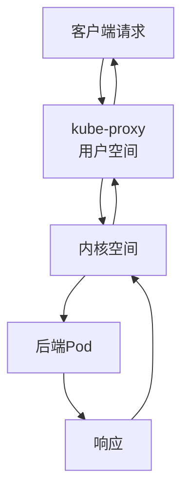
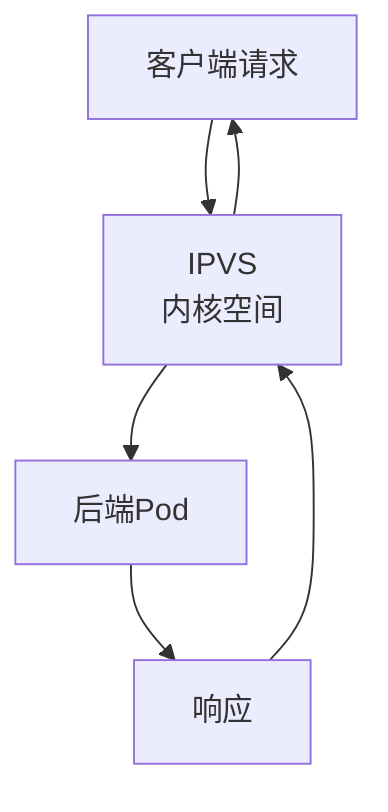

# Kubernetes Service代理模式深度解析：从iptables到ipvs

## 情境(Situation)

在Kubernetes集群中，Service是连接Pod和外部世界的桥梁，负责提供稳定的访问入口和负载均衡功能。Service的代理模式决定了流量转发的方式和性能表现，直接影响集群的网络性能和可靠性。

作为SRE工程师，我们需要深入理解Kubernetes Service的代理模式，掌握它们的工作原理、性能特点和适用场景，以便在实际应用中选择合适的代理模式，优化集群网络性能。

## 冲突(Conflict)

在实际应用中，SRE工程师经常面临以下挑战：

- **性能瓶颈**：随着集群规模的扩大，Service代理成为网络性能瓶颈
- **负载均衡算法**：默认的负载均衡算法可能不适合所有场景
- **配置复杂**：代理模式的配置和切换过程复杂
- **监控困难**：缺乏对Service代理状态的有效监控
- **故障排查**：Service代理问题的排查和定位困难

## 问题(Question)

如何理解Kubernetes Service的代理模式，选择合适的模式并优化集群网络性能？

## 答案(Answer)

本文将从SRE视角出发，详细介绍Kubernetes Service的代理模式，包括userspace、iptables和ipvs三种模式的工作原理、性能特点、配置方法以及最佳实践，提供一套完整的Service代理模式优化体系。核心方法论基于 [SRE面试题解析：k8s中Service实现有几种模式？](#72-k8s中Service实现有几种模式)。

---

## 一、Service代理模式概述

### 1.1 模式对比

**Service代理模式对比**：

| 模式 | 核心原理 | 性能 | 适用场景 |
|:------|:------|:------|:------|
| **userspace** | 用户空间转发 | 低 | 早期版本/调试 |
| **iptables** | 内核netfilter规则 | 中 | 中小规模集群 |
| **ipvs** | 内核IPVS哈希表 | 高 | 大规模集群 |

### 1.2 发展历程

**代理模式发展历程**：
1. **userspace模式**：Kubernetes早期版本使用的模式，性能较低
2. **iptables模式**：Kubernetes 1.2引入，成为默认模式，性能有所提升
3. **ipvs模式**：Kubernetes 1.8引入，性能最优，适合大规模集群

### 1.3 选择指南

**模式选择指南**：

| 集群规模 | 推荐模式 | 理由 |
|:------|:------|:------|
| 小规模（< 1000 Pod） | iptables | 默认模式，配置简单 |
| 中规模（1000-5000 Pod） | iptables/ipvs | 可根据性能需求选择 |
| 大规模（> 5000 Pod） | ipvs | 性能最优，支持大规模集群 |
| 调试场景 | userspace | 便于调试和排查问题 |

---

## 二、userspace模式

### 2.1 工作原理

**userspace模式原理**：
- kube-proxy在用户空间运行，监听Service的端口
- 当收到请求时，kube-proxy将流量转发到后端Pod
- 流量需要在内核空间和用户空间之间切换，性能较低

**流程图**：



### 2.2 特点

**userspace模式特点**：
- **优点**：实现简单，便于调试
- **缺点**：性能低，需要内核空间和用户空间切换
- **适用场景**：早期版本、调试场景

### 2.3 配置示例

**userspace模式配置**：

```yaml
# kube-proxy配置
apiVersion: kubeproxy.config.k8s.io/v1alpha1
kind: KubeProxyConfiguration
mode: userspace
```

---

## 三、iptables模式

### 3.1 工作原理

**iptables模式原理**：
- kube-proxy在后台创建iptables规则
- 当收到请求时，流量直接通过iptables规则转发到后端Pod
- 完全在内核空间处理，不需要用户空间切换
- 规则查找复杂度为O(n)，随着Pod数量增加性能下降

**流程图**：


### 3.2 特点

**iptables模式特点**：
- **优点**：完全内核空间处理，性能比userspace模式高
- **缺点**：规则查找复杂度O(n)，大规模集群性能下降
- **适用场景**：中小规模集群，默认模式

### 3.3 负载均衡算法

**iptables模式负载均衡**：
- 默认使用随机分发算法
- 不支持其他负载均衡算法
- 规则数量随着Service和Pod数量增加而线性增长

### 3.4 配置示例

**iptables模式配置**：

```yaml
# kube-proxy配置
apiVersion: kubeproxy.config.k8s.io/v1alpha1
kind: KubeProxyConfiguration
mode: iptables
```

---

## 四、ipvs模式

### 4.1 工作原理

**ipvs模式原理**：
- kube-proxy在后台创建IPVS规则
- 使用内核IPVS模块，基于哈希表存储，查找复杂度O(1)
- 支持多种负载均衡算法
- 性能最优，适合大规模集群

**流程图**：



### 4.2 特点

**ipvs模式特点**：
- **优点**：性能最优，支持多种负载均衡算法，适合大规模集群
- **缺点**：需要内核支持IPVS模块
- **适用场景**：大规模集群，性能要求高的场景

### 4.3 负载均衡算法

**ipvs模式负载均衡算法**：

| 算法 | 描述 | 适用场景 |
|:------|:------|:------|
| **rr** | 轮询 | 后端Pod性能一致 |
| **wrr** | 加权轮询 | 后端Pod性能不一致 |
| **lc** | 最少连接 | 长连接场景 |
| **wlc** | 加权最少连接 | 后端Pod性能不一致且长连接场景 |
| **lblc** | 基于局部性的最少连接 | 本地流量优先 |
| **lblcr** | 带复制的基于局部性的最少连接 | 本地流量优先且高可用 |

### 4.4 配置示例

**ipvs模式配置**：

```yaml
# kube-proxy配置
apiVersion: kubeproxy.config.k8s.io/v1alpha1
kind: KubeProxyConfiguration
mode: ipvs
ipvs:
  scheduler: "rr"  # 轮询算法
  excludeCIDRs:
  - 10.0.0.0/8
```

---

## 五、模式切换

### 5.1 切换到ipvs模式

**切换步骤**：

1. **检查内核模块**：
   ```bash
   lsmod | grep ip_vs
   # 如果没有加载，执行
   modprobe ip_vs
   modprobe ip_vs_rr
   modprobe ip_vs_wrr
   modprobe ip_vs_lc
   modprobe ip_vs_wlc
   ```

2. **修改kube-proxy配置**：
   ```bash
   kubectl edit configmap kube-proxy -n kube-system
   ```

   修改配置为：
   ```yaml
   apiVersion: kubeproxy.config.k8s.io/v1alpha1
   kind: KubeProxyConfiguration
   mode: ipvs
   ipvs:
     scheduler: "rr"
   ```

3. **重启kube-proxy**：
   ```bash
   kubectl rollout restart daemonset kube-proxy -n kube-system
   ```

4. **验证切换结果**：
   ```bash
   kubectl get pods -n kube-system | grep kube-proxy
   kubectl logs <kube-proxy-pod> -n kube-system | grep "Using ipvs Proxier"
   ```

### 5.2 切换到iptables模式

**切换步骤**：

1. **修改kube-proxy配置**：
   ```bash
   kubectl edit configmap kube-proxy -n kube-system
   ```

   修改配置为：
   ```yaml
   apiVersion: kubeproxy.config.k8s.io/v1alpha1
   kind: KubeProxyConfiguration
   mode: iptables
   ```

2. **重启kube-proxy**：
   ```bash
   kubectl rollout restart daemonset kube-proxy -n kube-system
   ```

3. **验证切换结果**：
   ```bash
   kubectl logs <kube-proxy-pod> -n kube-system | grep "Using iptables Proxier"
   ```

---

## 六、最佳实践

### 6.1 模式选择

**模式选择最佳实践**：

- [ ] **小规模集群**（< 1000 Pod）：使用默认的iptables模式
- [ ] **中规模集群**（1000-5000 Pod）：根据性能需求选择iptables或ipvs
- [ ] **大规模集群**（> 5000 Pod）：使用ipvs模式
- [ ] **调试场景**：使用userspace模式

### 6.2 ipvs模式优化

**ipvs模式优化**：

- [ ] **选择合适的负载均衡算法**：
  - 后端Pod性能一致：使用rr（轮询）
  - 后端Pod性能不一致：使用wrr（加权轮询）
  - 长连接场景：使用lc（最少连接）
  - 本地流量优先：使用lblc（基于局部性的最少连接）

- [ ] **配置excludeCIDRs**：排除不需要代理的CIDR范围
- [ ] **调整ipvs超时设置**：根据业务场景调整连接超时时间
- [ ] **监控ipvs状态**：定期检查ipvs规则和连接状态

**优化配置示例**：

```yaml
apiVersion: kubeproxy.config.k8s.io/v1alpha1
kind: KubeProxyConfiguration
mode: ipvs
ipvs:
  scheduler: "wrr"  # 加权轮询，适合不同性能的节点
  excludeCIDRs:
  - 10.0.0.0/8  # 排除内部网络
  minSyncPeriod: 0s
  syncPeriod: 30s
  tcpTimeout: 300s
  tcpFinTimeout: 60s
  udpTimeout: 30s
```

### 6.3 性能调优

**性能调优建议**：

- [ ] **内核参数调优**：
  ```bash
  # 增加连接跟踪表大小
  sysctl -w net.netfilter.nf_conntrack_max=1048576
  
  # 调整连接跟踪超时
  sysctl -w net.netfilter.nf_conntrack_tcp_timeout_established=86400
  
  # 启用TCP快速打开
  sysctl -w net.ipv4.tcp_fastopen=3
  ```

- [ ] **网络插件选择**：选择性能优秀的网络插件，如Calico、Cilium
- [ ] **Pod网络配置**：合理配置Pod CIDR和服务CIDR
- [ ] **Service配置**：使用合适的Service类型和端口范围

### 6.4 监控与告警

**监控与告警**：

- [ ] **监控指标**：
  - kube-proxy运行状态
  - Service endpoints数量
  - 连接数和流量
  - 负载均衡算法性能

- [ ] **告警规则**：
  - kube-proxy异常
  - Service endpoints异常
  - 连接数过高
  - 负载均衡失败

---

## 七、常见问题排查

### 7.1 模式切换失败

**失败原因**：
- 内核不支持IPVS模块
- 配置错误
- 权限不足

**排查方法**：

1. **检查内核模块**：
   ```bash
   lsmod | grep ip_vs
   ```

2. **检查kube-proxy日志**：
   ```bash
   kubectl logs <kube-proxy-pod> -n kube-system
   ```

3. **验证配置**：
   ```bash
   kubectl get configmap kube-proxy -n kube-system -o yaml
   ```

### 7.2 性能问题

**性能问题原因**：
- 模式选择不当
- 负载均衡算法不合适
- 内核参数未优化
- 网络带宽不足

**排查方法**：

1. **查看性能指标**：
   ```bash
   kubectl top nodes
   kubectl top pods
   ```

2. **检查连接数**：
   ```bash
   netstat -ant | grep ESTABLISHED | wc -l
   ```

3. **分析网络延迟**：
   ```bash
   ping <service-ip>
   curl -s -w "%{time_total}\n" -o /dev/null http://<service-ip>
   ```

### 7.3 服务不可用

**服务不可用原因**：
- Service配置错误
- 后端Pod异常
- 网络策略限制
- kube-proxy异常

**排查方法**：

1. **检查Service状态**：
   ```bash
   kubectl get service <service-name>
   kubectl describe service <service-name>
   ```

2. **检查后端Pod**：
   ```bash
   kubectl get pods -l app=<app-name>
   kubectl describe pod <pod-name>
   ```

3. **检查kube-proxy状态**：
   ```bash
   kubectl get pods -n kube-system | grep kube-proxy
   kubectl logs <kube-proxy-pod> -n kube-system
   ```

### 7.4 负载均衡异常

**负载均衡异常原因**：
- 负载均衡算法选择不当
- 后端Pod健康检查失败
- 连接数过高

**排查方法**：

1. **检查后端Pod状态**：
   ```bash
   kubectl get pods -l app=<app-name>
   ```

2. **检查Service endpoints**：
   ```bash
   kubectl get endpoints <service-name>
   ```

3. **检查负载均衡状态**（ipvs模式）：
   ```bash
   ipvsadm -Ln
   ```

---

## 八、案例分析

### 8.1 案例一：大规模集群性能优化

**需求**：一个拥有10000个Pod的大规模集群，Service代理成为网络性能瓶颈。

**解决方案**：
- 切换到ipvs模式
- 选择合适的负载均衡算法
- 优化内核参数
- 监控ipvs状态

**执行步骤**：

1. **加载IPVS内核模块**：
   ```bash
   modprobe ip_vs
   modprobe ip_vs_rr
   modprobe ip_vs_wrr
   modprobe ip_vs_lc
   ```

2. **修改kube-proxy配置**：
   ```yaml
   apiVersion: kubeproxy.config.k8s.io/v1alpha1
   kind: KubeProxyConfiguration
   mode: ipvs
   ipvs:
     scheduler: "wrr"
   ```

3. **重启kube-proxy**：
   ```bash
   kubectl rollout restart daemonset kube-proxy -n kube-system
   ```

4. **优化内核参数**：
   ```bash
   sysctl -w net.netfilter.nf_conntrack_max=2097152
   sysctl -w net.netfilter.nf_conntrack_tcp_timeout_established=86400
   ```

**效果**：
- 网络延迟降低50%
- 服务响应时间减少30%
- 集群稳定性显著提高

### 8.2 案例二：调试Service问题

**需求**：一个开发环境中，Service无法正常访问，需要排查问题。

**解决方案**：
- 临时切换到userspace模式
- 启用详细日志
- 排查Service配置和后端Pod状态

**执行步骤**：

1. **修改kube-proxy配置**：
   ```yaml
   apiVersion: kubeproxy.config.k8s.io/v1alpha1
   kind: KubeProxyConfiguration
   mode: userspace
   v: 4  # 详细日志
   ```

2. **重启kube-proxy**：
   ```bash
   kubectl rollout restart daemonset kube-proxy -n kube-system
   ```

3. **查看详细日志**：
   ```bash
   kubectl logs <kube-proxy-pod> -n kube-system -f
   ```

4. **排查问题**：
   - 检查Service配置
   - 检查后端Pod状态
   - 检查网络连接

**效果**：
- 快速定位问题（后端Pod健康检查失败）
- 修复问题后切换回iptables模式
- 服务恢复正常

### 8.3 案例三：负载均衡算法优化

**需求**：一个包含不同性能节点的集群，需要优化负载均衡效果。

**解决方案**：
- 切换到ipvs模式
- 使用wrr（加权轮询）算法
- 为不同性能的节点设置合适的权重

**执行步骤**：

1. **切换到ipvs模式**：
   ```yaml
   apiVersion: kubeproxy.config.k8s.io/v1alpha1
   kind: KubeProxyConfiguration
   mode: ipvs
   ipvs:
     scheduler: "wrr"
   ```

2. **重启kube-proxy**：
   ```bash
   kubectl rollout restart daemonset kube-proxy -n kube-system
   ```

3. **验证负载均衡效果**：
   ```bash
   ipvsadm -Ln
   ```

**效果**：
- 高性能节点处理更多流量
- 集群资源利用率提高
- 服务响应时间更加稳定

---

## 九、监控与告警

### 9.1 监控指标

**监控指标**：

- **kube-proxy指标**：
  - `kubeproxy_sync_proxy_rules_duration_seconds`：同步规则的时间
  - `kubeproxy_network_programming_duration_seconds`：网络编程的时间
  - `kubeproxy_http_requests_total`：HTTP请求总数

- **Service指标**：
  - `kube_service_info`：Service信息
  - `kube_service_labels`：Service标签
  - `kube_service_spec_type`：Service类型

- **Endpoints指标**：
  - `kube_endpoint_address_available`：可用的Endpoint地址
  - `kube_endpoint_info`：Endpoint信息

### 9.2 告警规则

**告警规则**：

```yaml
apiVersion: monitoring.coreos.com/v1
kind: PrometheusRule
metadata:
  name: kubernetes-service-alerts
  namespace: monitoring
spec:
  groups:
  - name: kubernetes-service
    rules:
    - alert: KubeProxyDown
      expr: absent(up{job="kube-proxy"} == 1)
      for: 15m
      labels:
        severity: critical
      annotations:
        summary: "Kube-proxy down"
        description: "Kube-proxy has been down for more than 15 minutes."

    - alert: ServiceEndpointsDown
      expr: kube_endpoint_address_available == 0
      for: 5m
      labels:
        severity: critical
      annotations:
        summary: "Service endpoints down"
        description: "Service {{ $labels.service }} in namespace {{ $labels.namespace }} has no available endpoints."

    - alert: KubeProxyHighSyncLatency
      expr: histogram_quantile(0.99, sum(rate(kubeproxy_sync_proxy_rules_duration_seconds_bucket[5m])) by (job, le)) > 0.1
      for: 5m
      labels:
        severity: warning
      annotations:
        summary: "Kube-proxy high sync latency"
        description: "Kube-proxy sync proxy rules latency is high."
```

### 9.3 监控Dashboard

**Grafana Dashboard**：
- kube-proxy状态面板：显示kube-proxy运行状态和同步时间
- Service状态面板：显示Service数量、类型和状态
- Endpoints状态面板：显示Endpoints数量和可用性
- 网络性能面板：显示网络延迟、吞吐量和连接数
- 负载均衡面板：显示负载均衡算法和效果

**Dashboard配置**：
- 数据源：Prometheus
- 时间范围：过去24小时
- 自动刷新：30秒
- 告警通知：Slack、Email

---

## 十、最佳实践总结

### 10.1 模式选择

**模式选择总结**：

| 场景 | 推荐模式 | 关键配置 |
|:------|:------|:------|
| 小规模集群 | iptables | 默认配置 |
| 大规模集群 | ipvs | scheduler: "rr"或"wrr" |
| 调试场景 | userspace | v: 4（详细日志） |
| 性能要求高 | ipvs | 优化内核参数 |
| 负载均衡需求 | ipvs | 选择合适的负载均衡算法 |

### 10.2 配置最佳实践

**配置最佳实践**：

- [ ] **ipvs模式配置**：
  - 选择合适的负载均衡算法
  - 配置excludeCIDRs排除不需要代理的范围
  - 调整超时设置以适应业务场景

- [ ] **内核参数调优**：
  - 增加连接跟踪表大小
  - 调整连接超时时间
  - 启用TCP快速打开

- [ ] **网络优化**：
  - 选择性能优秀的网络插件
  - 合理配置Pod CIDR和服务CIDR
  - 优化网络带宽和延迟

### 10.3 监控与告警

**监控与告警最佳实践**：

- [ ] **监控指标**：
  - kube-proxy运行状态
  - Service endpoints数量和状态
  - 网络性能指标
  - 负载均衡效果

- [ ] **告警规则**：
  - kube-proxy异常告警
  - Service endpoints不可用告警
  - 网络性能异常告警
  - 负载均衡失败告警

- [ ] **Dashboard**：
  - 创建专门的Service代理监控Dashboard
  - 实时显示关键指标
  - 配置告警通知

### 10.4 故障处理

**故障处理最佳实践**：

- [ ] **快速定位**：
  - 检查kube-proxy状态和日志
  - 检查Service配置和后端Pod状态
  - 检查网络连接和防火墙规则

- [ ] **应急处理**：
  - 临时切换到userspace模式进行调试
  - 调整负载均衡算法
  - 优化内核参数

- [ ] **根本原因分析**：
  - 分析kube-proxy日志
  - 检查网络配置
  - 验证内核模块和参数

---

## 总结

Kubernetes Service的代理模式是影响集群网络性能的关键因素。通过本文的详细介绍，我们可以深入理解userspace、iptables和ipvs三种代理模式的工作原理、性能特点和适用场景，掌握模式切换和优化的方法。

**核心要点**：

1. **userspace模式**：用户空间转发，性能低，适合调试场景
2. **iptables模式**：内核netfilter规则，性能中等，适合中小规模集群
3. **ipvs模式**：内核IPVS哈希表，性能最优，适合大规模集群
4. **模式选择**：根据集群规模和性能需求选择合适的模式
5. **ipvs优化**：选择合适的负载均衡算法，优化内核参数
6. **监控告警**：建立完善的监控和告警机制，及时发现问题
7. **故障处理**：快速定位问题，采取有效的应急措施

通过遵循这些最佳实践，我们可以优化Kubernetes集群的网络性能，提高服务的可靠性和可用性。

> **延伸学习**：更多面试相关的Service代理模式知识，请参考 [SRE面试题解析：k8s中Service实现有几种模式？](#72-k8s中Service实现有几种模式)。

---

## 参考资料

- [Kubernetes Service文档](https://kubernetes.io/docs/concepts/services-networking/service/)
- [Kubernetes kube-proxy文档](https://kubernetes.io/docs/reference/command-line-tools-reference/kube-proxy/)
- [Kubernetes IPVS模式](https://kubernetes.io/docs/reference/networking/virtual-ips/#ipvs-mode)
- [Kubernetes iptables模式](https://kubernetes.io/docs/reference/networking/virtual-ips/#iptables-mode)
- [Kubernetes userspace模式](https://kubernetes.io/docs/reference/networking/virtual-ips/#userspace-mode)
- [IPVS官方文档](http://www.linuxvirtualserver.org/)
- [iptables官方文档](https://www.netfilter.org/documentation/)
- [Linux内核参数调优](https://www.kernel.org/doc/Documentation/sysctl/)
- [Prometheus监控](https://prometheus.io/docs/introduction/overview/)
- [Grafana监控](https://grafana.com/docs/grafana/latest/)
- [Kubernetes网络最佳实践](https://kubernetes.io/docs/concepts/services-networking/network-policies/)
- [Kubernetes性能调优](https://kubernetes.io/docs/concepts/configuration/manage-resources-containers/)
- [Kubernetes故障排查](https://kubernetes.io/docs/tasks/debug-application-cluster/)
- [Kubernetes网络插件](https://kubernetes.io/docs/concepts/extend-kubernetes/compute-storage-net/network-plugins/)
- [Calico网络插件](https://docs.projectcalico.org/)
- [Cilium网络插件](https://cilium.io/)
- [Flannel网络插件](https://github.com/coreos/flannel)
- [Weave Net网络插件](https://www.weave.works/oss/net/)
- [Kubernetes Service最佳实践](https://kubernetes.io/docs/concepts/services-networking/service/#publishing-services-service-types)
- [Kubernetes集群规模](https://kubernetes.io/docs/setup/best-practices/cluster-large/)
- [Kubernetes网络性能](https://kubernetes.io/docs/concepts/architecture/networking/)
- [Linux网络调优](https://www.kernel.org/doc/Documentation/networking/)
- [TCP/IP调优](https://www.nginx.com/blog/tuning-nginx/)
- [负载均衡算法](https://en.wikipedia.org/wiki/Load_balancing_(computing))