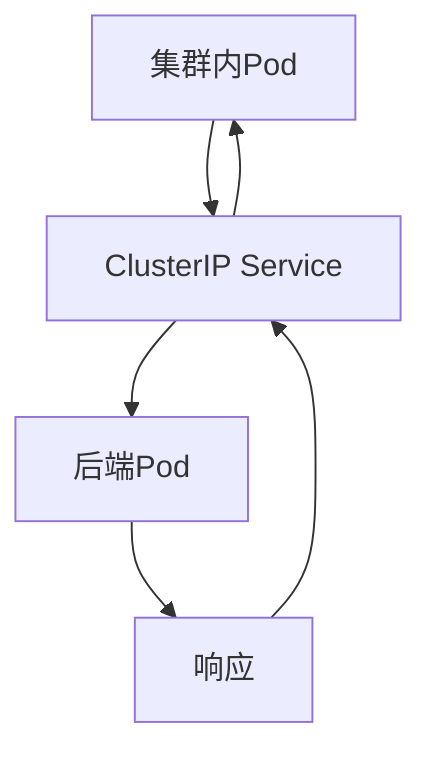
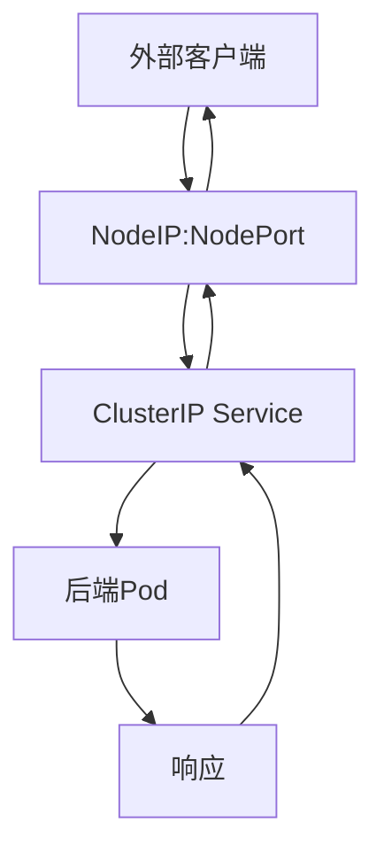
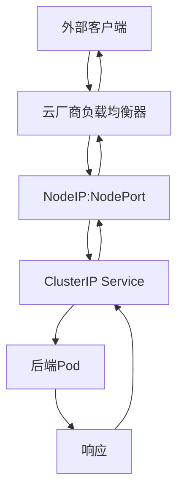
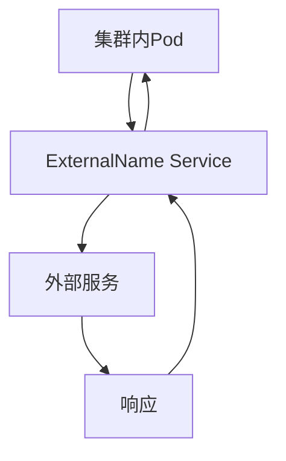
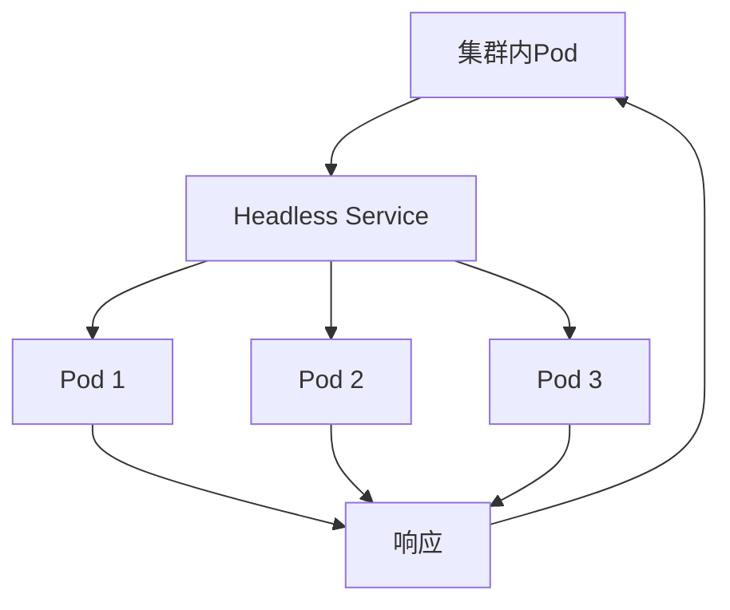

# Kubernetes Service类型详解：从ClusterIP到LoadBalancer

## 情境(Situation)

在Kubernetes集群中，Service是连接Pod和外部世界的桥梁，负责提供稳定的访问入口和负载均衡功能。Kubernetes提供了多种Service类型，每种类型都有其特定的用途和适用场景。选择合适的Service类型对于确保服务的安全性、可用性和性能至关重要。

作为SRE工程师，我们需要深入理解Kubernetes的各种Service类型，掌握它们的工作原理、配置方法和最佳实践，以便在实际应用中根据业务需求选择合适的服务暴露方式。

## 冲突(Conflict)

在实际应用中，SRE工程师经常面临以下挑战：

- **服务暴露方式选择**：不同的业务场景需要不同的服务暴露方式，选择不当会影响服务的安全性和可用性
- **网络配置复杂**：不同Service类型的网络配置和依赖不同，配置不当会导致服务不可用
- **安全性考虑**：如何确保服务的安全访问，避免不必要的暴露
- **性能优化**：如何优化Service的性能，减少网络延迟
- **故障排查**：当Service出现问题时，如何快速定位和解决

## 问题(Question)

如何理解Kubernetes的各种Service类型，选择合适的服务暴露方式，并确保服务的安全、可用和高性能？

## 答案(Answer)

本文将从SRE视角出发，详细介绍Kubernetes的各种Service类型，包括ClusterIP、NodePort、LoadBalancer、ExternalName和Headless Service，分析它们的工作原理、配置方法、适用场景以及最佳实践，提供一套完整的Service类型选择和配置体系。核心方法论基于 [SRE面试题解析：k8s中Service的四种类型是啥？](#73-k8s中Service的四种类型是啥)。

---

## 一、Service类型概述

### 1.1 类型对比

**Service类型对比**：

| 类型 | 核心原理 | 访问范围 | 适用场景 |
|:------|:------|:------|:------|
| **ClusterIP** | 集群内部虚拟IP | 仅集群内部 | 服务间通信 |
| **NodePort** | 节点端口映射 | 集群内外 | 开发测试 |
| **LoadBalancer** | 云厂商负载均衡 | 外部访问 | 生产环境 |
| **ExternalName** | 外部DNS映射 | 集群内部 | 访问外部服务 |
| **Headless Service** | 无集群IP，直接返回Pod IP | 集群内部 | 有状态应用 |

### 1.2 选择指南

**Service类型选择指南**：

| 场景 | 推荐类型 | 理由 |
|:------|:------|:------|
| 微服务内部通信 | ClusterIP | 安全，仅集群内访问 |
| 开发测试 | NodePort | 简单，无需额外配置 |
| 生产环境公网访问 | LoadBalancer | 专业，支持SSL |
| 访问外部服务 | ExternalName | 集成外部服务到集群DNS |
| 有状态应用 | Headless Service | 直接访问Pod，支持状态管理 |

---

## 二、ClusterIP类型

### 2.1 工作原理

**ClusterIP原理**：
- 分配一个集群内部的虚拟IP地址
- 仅在集群内部可访问
- 通过kube-proxy实现负载均衡
- 默认的Service类型

**流程图**：



### 2.2 配置示例

**基本配置**：

```yaml
apiVersion: v1
kind: Service
metadata:
  name: my-service
spec:
  selector:
    app: my-app
  ports:
  - port: 80
    targetPort: 8080
```

**多端口配置**：

```yaml
apiVersion: v1
kind: Service
metadata:
  name: my-service
spec:
  selector:
    app: my-app
  ports:
  - name: http
    port: 80
    targetPort: 8080
  - name: https
    port: 443
    targetPort: 8443
```

### 2.3 最佳实践

**ClusterIP最佳实践**：
- 使用有意义的端口名称，便于管理
- 为不同的服务使用不同的端口，避免冲突
- 结合命名空间使用，实现服务隔离
- 配合网络策略使用，增强安全性

**适用场景**：
- 微服务内部通信
- 集群内部服务访问
- 需要安全隔离的服务

---

## 三、NodePort类型

### 3.1 工作原理

**NodePort原理**：
- 在每个节点上开放一个30000-32767范围内的端口
- 通过节点IP:端口访问服务
- 底层使用ClusterIP，再映射到节点端口
- 适合开发测试和简单暴露服务

**流程图**：



### 3.2 配置示例

**基本配置**：

```yaml
apiVersion: v1
kind: Service
metadata:
  name: my-service
spec:
  type: NodePort
  selector:
    app: my-app
  ports:
  - port: 80
    targetPort: 8080
    nodePort: 30080  # 可选，指定节点端口
```

**随机节点端口**：

```yaml
apiVersion: v1
kind: Service
metadata:
  name: my-service
spec:
  type: NodePort
  selector:
    app: my-app
  ports:
  - port: 80
    targetPort: 8080
    # 不指定nodePort，系统自动分配
```

### 3.3 最佳实践

**NodePort最佳实践**：
- 仅在开发测试环境使用
- 避免使用固定的nodePort，使用系统自动分配
- 结合防火墙使用，限制访问范围
- 注意端口冲突问题

**适用场景**：
- 开发测试环境
- 临时暴露服务
- 简单的内部服务访问

---

## 四、LoadBalancer类型

### 4.1 工作原理

**LoadBalancer原理**：
- 调用云厂商的负载均衡器
- 自动创建负载均衡器并配置
- 提供外部IP地址
- 适合生产环境的公网访问

**流程图**：



### 4.2 配置示例

**基本配置**：

```yaml
apiVersion: v1
kind: Service
metadata:
  name: my-service
spec:
  type: LoadBalancer
  selector:
    app: my-app
  ports:
  - port: 80
    targetPort: 8080
```

**指定外部IP**：

```yaml
apiVersion: v1
kind: Service
metadata:
  name: my-service
spec:
  type: LoadBalancer
  loadBalancerIP: 203.0.113.10  # 指定外部IP
  selector:
    app: my-app
  ports:
  - port: 80
    targetPort: 8080
```

### 4.3 最佳实践

**LoadBalancer最佳实践**：
- 在生产环境使用
- 结合云厂商的负载均衡器功能
- 配置合适的健康检查
- 考虑使用Ingress替代，更灵活

**适用场景**：
- 生产环境公网访问
- 需要高可用的服务
- 外部用户访问的应用

---

## 五、ExternalName类型

### 5.1 工作原理

**ExternalName原理**：
- 映射到外部DNS名称
- 返回CNAME记录，不创建Endpoints
- 适合访问外部服务
- 无需后端Pod

**流程图**：



### 5.2 配置示例

**基本配置**：

```yaml
apiVersion: v1
kind: Service
metadata:
  name: my-external-service
spec:
  type: ExternalName
  externalName: api.example.com
```

**使用场景**：

```yaml
# 访问外部数据库
apiVersion: v1
kind: Service
metadata:
  name: external-db
spec:
  type: ExternalName
  externalName: db.example.com

# 访问外部API
apiVersion: v1
kind: Service
metadata:
  name: external-api
spec:
  type: ExternalName
  externalName: api.example.com
```

### 5.3 最佳实践

**ExternalName最佳实践**：
- 用于访问外部服务，如数据库、API
- 避免硬编码外部服务地址
- 结合Secret使用，管理外部服务的认证信息
- 注意DNS解析问题

**适用场景**：
- 访问外部数据库
- 访问外部API服务
- 集成外部系统

---

## 六、Headless Service

### 6.1 工作原理

**Headless Service原理**：
- 设置`clusterIP: None`，不分配集群IP
- DNS返回所有后端Pod的IP地址
- 不做负载均衡，客户端直接访问Pod
- 适合有状态应用

**流程图**：



### 6.2 配置示例

**基本配置**：

```yaml
apiVersion: v1
kind: Service
metadata:
  name: my-headless-service
spec:
  clusterIP: None  # 关键配置
  selector:
    app: my-app
  ports:
  - port: 80
    targetPort: 8080
```

**StatefulSet使用**：

```yaml
apiVersion: apps/v1
kind: StatefulSet
metadata:
  name: my-statefulset
spec:
  serviceName: my-headless-service
  replicas: 3
  selector:
    matchLabels:
      app: my-app
  template:
    metadata:
      labels:
        app: my-app
    spec:
      containers:
      - name: app
        image: my-app:v1
```

### 6.3 最佳实践

**Headless Service最佳实践**：
- 与StatefulSet配合使用，支持有状态应用
- 用于需要直接访问Pod的场景
- 适合需要稳定网络标识的应用
- 注意DNS解析和Pod网络配置

**适用场景**：
- 有状态应用（如数据库集群）
- 需要稳定网络标识的应用
- 服务发现场景

---

## 七、Service配置最佳实践

### 7.1 通用最佳实践

**通用最佳实践**：

- [ ] **命名规范**：使用清晰、一致的命名，如`{app-name}-service`
- [ ] **标签管理**：使用有意义的标签，便于管理和监控
- [ ] **端口管理**：使用标准端口，避免冲突
- [ ] **健康检查**：配置适当的健康检查，确保服务可用性
- [ ] **监控告警**：设置监控和告警，及时发现问题
- [ ] **网络策略**：配置网络策略，增强安全性

### 7.2 性能优化

**性能优化**：

- [ ] **选择合适的Service类型**：根据场景选择合适的类型
- [ ] **使用IPVS模式**：大规模集群使用ipvs模式提高性能
- [ ] **合理配置会话保持**：根据业务需求配置会话保持
- [ ] **优化负载均衡算法**：选择合适的负载均衡算法
- [ ] **减少Service数量**：合理规划Service，避免过多Service

### 7.3 安全性

**安全性最佳实践**：

- [ ] **最小权限原则**：仅暴露必要的服务
- [ ] **网络策略**：配置网络策略，限制访问
- [ ] **TLS加密**：生产环境使用TLS加密
- [ ] **认证授权**：实现适当的认证授权机制
- [ ] **Secret管理**：安全管理敏感信息

---

## 八、常见问题排查

### 8.1 Service无法访问

**无法访问原因**：
- Selector不匹配
- 后端Pod未就绪
- 网络策略限制
- 防火墙规则
- 服务端口配置错误

**排查方法**：

1. **检查Service配置**：
   ```bash
   kubectl get service <service-name> -o yaml
   ```

2. **检查Endpoints**：
   ```bash
   kubectl get endpoints <service-name>
   ```

3. **检查后端Pod**：
   ```bash
   kubectl get pods -l <selector>
   kubectl describe pod <pod-name>
   ```

4. **检查网络策略**：
   ```bash
   kubectl get networkpolicy
   ```

5. **测试网络连接**：
   ```bash
   kubectl exec -it <test-pod> -- curl <service-ip>:<port>
   ```

### 8.2 NodePort访问问题

**访问问题原因**：
- 节点端口未开放
- 防火墙规则限制
- 节点IP不可达
- 服务未就绪

**排查方法**：

1. **检查NodePort配置**：
   ```bash
   kubectl get service <service-name>
   ```

2. **检查节点端口**：
   ```bash
   netstat -tuln | grep <node-port>
   ```

3. **检查防火墙**：
   ```bash
   iptables -L
   ```

4. **测试访问**：
   ```bash
   curl <node-ip>:<node-port>
   ```

### 8.3 LoadBalancer外部IP问题

**外部IP问题原因**：
- 云厂商负载均衡器创建失败
- 外部IP未分配
- 负载均衡器配置错误
- 网络权限问题

**排查方法**：

1. **检查LoadBalancer状态**：
   ```bash
   kubectl get service <service-name>
   ```

2. **检查云厂商负载均衡器**：
   - 登录云厂商控制台查看负载均衡器状态
   - 检查负载均衡器配置

3. **测试外部访问**：
   ```bash
   curl <external-ip>
   ```

### 8.4 ExternalName解析问题

**解析问题原因**：
- DNS配置错误
- 外部服务不可达
- 网络连接问题

**排查方法**：

1. **检查ExternalName配置**：
   ```bash
   kubectl get service <service-name> -o yaml
   ```

2. **测试DNS解析**：
   ```bash
   kubectl exec -it <test-pod> -- nslookup <external-name>
   ```

3. **测试外部服务访问**：
   ```bash
   kubectl exec -it <test-pod> -- curl <external-name>
   ```

---

## 九、监控与告警

### 9.1 监控指标

**监控指标**：

- **Service指标**：
  - `kube_service_info`：Service信息
  - `kube_service_labels`：Service标签
  - `kube_service_spec_type`：Service类型

- **Endpoints指标**：
  - `kube_endpoint_address_available`：可用的Endpoint地址
  - `kube_endpoint_info`：Endpoint信息

- **网络指标**：
  - 网络延迟
  - 吞吐量
  - 连接数
  - 错误率

### 9.2 告警规则

**告警规则**：

```yaml
apiVersion: monitoring.coreos.com/v1
kind: PrometheusRule
metadata:
  name: kubernetes-service-alerts
  namespace: monitoring
spec:
  groups:
  - name: kubernetes-service
    rules:
    - alert: ServiceEndpointsDown
      expr: kube_endpoint_address_available == 0
      for: 5m
      labels:
        severity: critical
      annotations:
        summary: "Service endpoints down"
        description: "Service {{ "{{" }} $labels.service }} in namespace {{ "{{" }} $labels.namespace }} has no available endpoints."

    - alert: ServiceUnavailable
      expr: probe_success{job="service-monitor"} == 0
      for: 5m
      labels:
        severity: critical
      annotations:
        summary: "Service unavailable"
        description: "Service {{ "{{" }} $labels.service }} is unavailable."

    - alert: ServiceHighLatency
      expr: histogram_quantile(0.99, sum(rate(http_request_duration_seconds_bucket[5m])) by (service, le)) > 1
      for: 5m
      labels:
        severity: warning
      annotations:
        summary: "Service high latency"
        description: "Service {{ "{{" }} $labels.service }} has high latency."
```

### 9.3 监控Dashboard

**Grafana Dashboard**：
- Service状态面板：显示Service数量、类型和状态
- Endpoints状态面板：显示Endpoints数量和可用性
- 网络性能面板：显示网络延迟、吞吐量和连接数
- 告警面板：显示当前告警和历史告警

**Dashboard配置**：
- 数据源：Prometheus
- 时间范围：过去24小时
- 自动刷新：30秒
- 告警通知：Slack、Email

---

## 十、案例分析

### 10.1 案例一：微服务内部通信

**需求**：在集群内部，多个微服务之间需要安全、高效地通信。

**解决方案**：
- 使用ClusterIP类型的Service
- 配合命名空间实现服务隔离
- 配置网络策略增强安全性

**配置示例**：

```yaml
# 微服务A
apiVersion: v1
kind: Service
metadata:
  name: service-a
  namespace: app

spec:
  selector:
    app: service-a
  ports:
  - port: 8080
    targetPort: 8080

# 微服务B
apiVersion: v1
kind: Service
metadata:
  name: service-b
  namespace: app

spec:
  selector:
    app: service-b
  ports:
  - port: 8080
    targetPort: 8080

# 网络策略
apiVersion: networking.k8s.io/v1
kind: NetworkPolicy
metadata:
  name: service-a-policy
  namespace: app

spec:
  podSelector:
    matchLabels:
      app: service-a
  ingress:
  - from:
    - podSelector:
        matchLabels:
          app: service-b
    ports:
    - port: 8080
```

**效果**：
- 服务间通信安全隔离
- 网络策略控制访问
- 高效的内部通信

### 10.2 案例二：开发测试环境服务暴露

**需求**：在开发测试环境中，需要快速暴露服务供外部访问。

**解决方案**：
- 使用NodePort类型的Service
- 配置适当的端口范围
- 结合防火墙限制访问

**配置示例**：

```yaml
apiVersion: v1
kind: Service
metadata:
  name: dev-service
  namespace: development

spec:
  type: NodePort
  selector:
    app: dev-app
  ports:
  - port: 80
    targetPort: 8080
    nodePort: 30080
```

**效果**：
- 快速暴露服务
- 无需额外配置
- 方便开发测试

### 10.3 案例三：生产环境公网访问

**需求**：在生产环境中，需要公网访问应用，确保高可用性。

**解决方案**：
- 使用LoadBalancer类型的Service
- 配置云厂商负载均衡器
- 启用TLS加密

**配置示例**：

```yaml
apiVersion: v1
kind: Service
metadata:
  name: prod-service
  namespace: production

spec:
  type: LoadBalancer
  selector:
    app: prod-app
  ports:
  - port: 80
    targetPort: 8080
  - port: 443
    targetPort: 8443
```

**效果**：
- 高可用的公网访问
- 云厂商负载均衡器提供专业服务
- 支持TLS加密

### 10.4 案例四：访问外部数据库

**需求**：在集群内部访问外部数据库服务。

**解决方案**：
- 使用ExternalName类型的Service
- 结合Secret管理数据库认证信息

**配置示例**：

```yaml
# ExternalName Service
apiVersion: v1
kind: Service
metadata:
  name: external-db
  namespace: app

spec:
  type: ExternalName
  externalName: db.example.com

# Secret
apiVersion: v1
kind: Secret
metadata:
  name: db-secret
  namespace: app

type: Opaque
data:
  username: <base64-encoded-username>
  password: <base64-encoded-password>

# Pod使用
apiVersion: v1
kind: Pod
metadata:
  name: app-pod
  namespace: app

spec:
  containers:
  - name: app
    image: app:v1
    env:
    - name: DB_HOST
      value: external-db
    - name: DB_USERNAME
      valueFrom:
        secretKeyRef:
          name: db-secret
          key: username
    - name: DB_PASSWORD
      valueFrom:
        secretKeyRef:
          name: db-secret
          key: password
```

**效果**：
- 统一的服务访问方式
- 避免硬编码外部服务地址
- 安全管理认证信息

### 10.5 案例五：有状态应用部署

**需求**：部署一个有状态的数据库集群，需要稳定的网络标识。

**解决方案**：
- 使用Headless Service
- 与StatefulSet配合使用
- 配置持久存储

**配置示例**：

```yaml
# Headless Service
apiVersion: v1
kind: Service
metadata:
  name: mysql-headless
  namespace: database

spec:
  clusterIP: None
  selector:
    app: mysql
  ports:
  - port: 3306
    targetPort: 3306

# StatefulSet
apiVersion: apps/v1
kind: StatefulSet
metadata:
  name: mysql
  namespace: database

spec:
  serviceName: mysql-headless
  replicas: 3
  selector:
    matchLabels:
      app: mysql
  template:
    metadata:
      labels:
        app: mysql
    spec:
      containers:
      - name: mysql
        image: mysql:8.0
        env:
        - name: MYSQL_ROOT_PASSWORD
          valueFrom:
            secretKeyRef:
              name: mysql-secret
              key: root-password
        volumeMounts:
        - name: mysql-data
          mountPath: /var/lib/mysql
  volumeClaimTemplates:
  - metadata:
      name: mysql-data
    spec:
      accessModes: ["ReadWriteOnce"]
      storageClassName: "standard"
      resources:
        requests:
          storage: 10Gi
```

**效果**：
- 稳定的网络标识
- 有序的Pod部署和伸缩
- 持久存储支持

---

## 十一、最佳实践总结

### 11.1 Service类型选择

**Service类型选择总结**：

| 场景 | 推荐类型 | 关键配置 |
|:------|:------|:------|
| 微服务内部通信 | ClusterIP | 配合网络策略 |
| 开发测试 | NodePort | 自动分配端口 |
| 生产环境公网访问 | LoadBalancer | 启用TLS |
| 访问外部服务 | ExternalName | 结合Secret |
| 有状态应用 | Headless Service | 与StatefulSet配合 |

### 11.2 配置最佳实践

**配置最佳实践**：

- [ ] **命名规范**：使用清晰、一致的命名
- [ ] **标签管理**：使用有意义的标签
- [ ] **端口管理**：使用标准端口，避免冲突
- [ ] **健康检查**：配置适当的健康检查
- [ ] **监控告警**：设置监控和告警
- [ ] **网络策略**：配置网络策略，增强安全性
- [ ] **性能优化**：选择合适的代理模式和负载均衡算法
- [ ] **安全性**：实现TLS加密和认证授权

### 11.3 故障处理

**故障处理最佳实践**：

- [ ] **快速定位**：
  - 检查Service配置
  - 检查Endpoints状态
  - 检查后端Pod状态
  - 测试网络连接

- [ ] **应急处理**：
  - 临时调整Service配置
  - 重启相关组件
  - 切换到备用服务

- [ ] **根本原因分析**：
  - 分析日志和事件
  - 检查网络配置
  - 验证权限和资源

---

## 总结

Kubernetes提供了多种Service类型，每种类型都有其特定的用途和适用场景。通过本文的详细介绍，我们可以深入理解ClusterIP、NodePort、LoadBalancer、ExternalName和Headless Service的工作原理、配置方法和最佳实践，建立一套完整的Service类型选择和配置体系。

**核心要点**：

1. **ClusterIP**：默认类型，适合集群内部服务通信
2. **NodePort**：简单暴露服务，适合开发测试
3. **LoadBalancer**：专业的外部访问方案，适合生产环境
4. **ExternalName**：访问外部服务，集成外部系统
5. **Headless Service**：直接访问Pod，适合有状态应用
6. **选择原则**：根据业务需求和场景选择合适的Service类型
7. **配置最佳实践**：遵循命名规范、标签管理、端口管理等最佳实践
8. **监控告警**：建立完善的监控和告警机制
9. **故障处理**：快速定位和解决Service相关问题

通过遵循这些最佳实践，我们可以确保服务的安全、可用和高性能，满足不同业务场景的需求。

> **延伸学习**：更多面试相关的Service类型知识，请参考 [SRE面试题解析：k8s中Service的四种类型是啥？](#73-k8s中Service的四种类型是啥)。

---

## 参考资料

- [Kubernetes Service文档](https://kubernetes.io/docs/concepts/services-networking/service/)
- [Kubernetes Service类型](https://kubernetes.io/docs/concepts/services-networking/service/#publishing-services-service-types)
- [Kubernetes Headless Service](https://kubernetes.io/docs/concepts/services-networking/service/#headless-services)
- [Kubernetes ExternalName Service](https://kubernetes.io/docs/concepts/services-networking/service/#externalname)
- [Kubernetes网络策略](https://kubernetes.io/docs/concepts/services-networking/network-policies/)
- [Kubernetes StatefulSet](https://kubernetes.io/docs/concepts/workloads/controllers/statefulset/)
- [Kubernetes负载均衡](https://kubernetes.io/docs/concepts/services-networking/service/#loadbalancer)
- [Kubernetes NodePort](https://kubernetes.io/docs/concepts/services-networking/service/#nodeport)
- [Kubernetes ClusterIP](https://kubernetes.io/docs/concepts/services-networking/service/#clusterip)
- [Prometheus监控](https://prometheus.io/docs/introduction/overview/)
- [Grafana监控](https://grafana.com/docs/grafana/latest/)
- [Kubernetes最佳实践](https://kubernetes.io/docs/concepts/configuration/overview/)
- [Kubernetes网络最佳实践](https://kubernetes.io/docs/concepts/services-networking/network-policies/)
- [Kubernetes安全最佳实践](https://kubernetes.io/docs/concepts/security/)
- [Kubernetes故障排查](https://kubernetes.io/docs/tasks/debug-application-cluster/)
- [Kubernetes服务发现](https://kubernetes.io/docs/concepts/services-networking/service/#service-discovery)
- [Kubernetes DNS](https://kubernetes.io/docs/concepts/services-networking/dns-pod-service/)
- [Kubernetes ingress](https://kubernetes.io/docs/concepts/services-networking/ingress/)
- [Kubernetes CNI插件](https://kubernetes.io/docs/concepts/extend-kubernetes/compute-storage-net/network-plugins/)
- [Calico网络插件](https://docs.projectcalico.org/)
- [Cilium网络插件](https://cilium.io/)
- [Flannel网络插件](https://github.com/coreos/flannel)
- [Weave Net网络插件](https://www.weave.works/oss/net/)
- [Kubernetes集群网络](https://kubernetes.io/docs/concepts/cluster-administration/networking/)
- [Kubernetes服务质量](https://kubernetes.io/docs/concepts/configuration/manage-resources-containers/)
- [Kubernetes资源管理](https://kubernetes.io/docs/concepts/configuration/manage-resources-containers/)
- [Kubernetes自动扩缩容](https://kubernetes.io/docs/tasks/run-application/horizontal-pod-autoscale/)
- [Kubernetes滚动更新](https://kubernetes.io/docs/concepts/workloads/controllers/deployment/#updating-a-deployment)
- [Kubernetes健康检查](https://kubernetes.io/docs/tasks/configure-pod-container/configure-liveness-readiness-startup-probes/)
- [Kubernetes存储](https://kubernetes.io/docs/concepts/storage/)
- [Kubernetes配置管理](https://kubernetes.io/docs/concepts/configuration/)
- [Kubernetes安全](https://kubernetes.io/docs/concepts/security/)