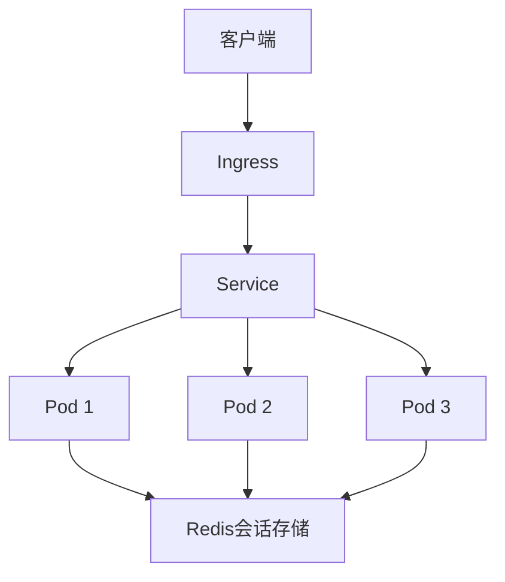
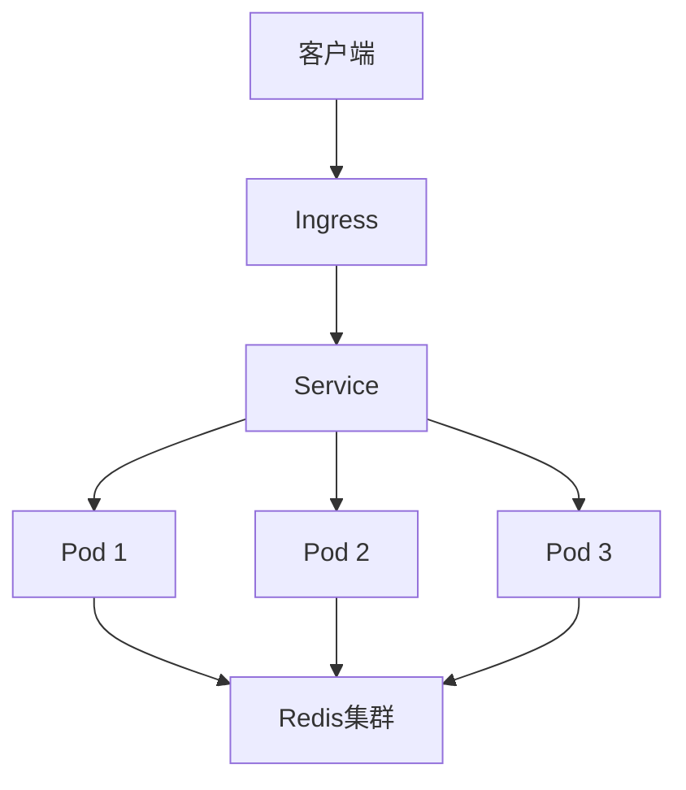

# Kubernetes会话保持深度解析：从原理到实现

## 情境(Situation)

在Kubernetes集群中，由于Pod的动态扩缩容特性，客户端请求可能会被分发到不同的Pod上，导致会话状态丢失。对于需要保持会话的应用（如购物车、用户登录状态等），这是一个严重的问题。会话保持（Session Affinity）是解决这一问题的关键技术。

作为SRE工程师，我们需要深入理解Kubernetes中会话保持的原理和实现方法，掌握不同场景下的最佳实践，确保有状态应用的稳定性和可靠性。

## 冲突(Conflict)

在实际应用中，SRE工程师经常面临以下挑战：

- **会话状态丢失**：Pod重启或扩缩容导致会话状态丢失
- **负载不均衡**：会话亲和性可能导致部分Pod负载过高
- **网络环境复杂**：NAT或代理环境下ClientIP可能不稳定
- **性能影响**：会话保持机制可能影响服务性能
- **扩展性问题**：会话保持可能限制应用的可扩展性

## 问题(Question)

如何在Kubernetes中实现有效的会话保持，确保有状态应用的稳定性，同时兼顾性能和可扩展性？

## 答案(Answer)

本文将从SRE视角出发，详细分析Kubernetes中会话保持的原理和实现方法，包括Service的ClientIP会话亲和性、Ingress的Cookie亲和性和外部会话存储，提供不同场景下的最佳实践和性能优化策略。核心方法论基于 [SRE面试题解析：k8s中session怎么保持？](#75-k8s中session怎么保持)。

---

## 一、会话保持概述

### 1.1 什么是会话保持

**会话保持**：
- 确保同一客户端的请求始终被路由到同一Pod
- 避免因Pod切换导致的会话状态丢失
- 提高有状态应用的用户体验

### 1.2 会话保持的挑战

**Kubernetes中的会话保持挑战**：
- Pod的动态扩缩容
- Pod的重启和重建
- 网络环境的复杂性
- 负载均衡的要求
- 应用的可扩展性

---

## 二、会话保持方式

### 2.1 Service Session Affinity

**原理**：
- 基于ClientIP的会话亲和性
- 将同一客户端IP的请求路由到同一Pod
- 适用于TCP/UDP服务

**配置示例**：

```yaml
apiVersion: v1
kind: Service
metadata:
  name: my-service
spec:
  selector:
    app: my-app
  ports:
  - port: 80
    targetPort: 8080
  sessionAffinity: ClientIP
  sessionAffinityConfig:
    clientIP:
      timeoutSeconds: 10800
```

**适用场景**：
- 简单的TCP/UDP服务
- 客户端IP相对稳定的环境
- 不需要精确控制会话的场景

**优缺点**：

| 优点 | 缺点 |
|:------|:------|
| 配置简单 | 依赖客户端IP |
| 适用于TCP/UDP服务 | NAT环境下可能失效 |
| 性能开销小 | 可能导致负载不均衡 |

### 2.2 Ingress Cookie Affinity

**原理**：
- 基于Cookie的会话亲和性
- 为每个客户端分配唯一Cookie
- 根据Cookie值路由请求到同一Pod
- 适用于HTTP应用

**配置示例**：

```yaml
apiVersion: networking.k8s.io/v1
kind: Ingress
metadata:
  name: my-ingress
  annotations:
    nginx.ingress.kubernetes.io/affinity: "cookie"
    nginx.ingress.kubernetes.io/session-cookie-name: "route"
    nginx.ingress.kubernetes.io/session-cookie-expires: "172800"
    nginx.ingress.kubernetes.io/session-cookie-max-age: "172800"
spec:
  rules:
  - host: example.com
    http:
      paths:
      - path: /
        pathType: Prefix
        backend:
          service:
            name: my-service
            port:
              number: 80
```

**适用场景**：
- HTTP应用
- 需要精确控制会话的场景
- 客户端IP不稳定的环境（如NAT、代理）

**优缺点**：

| 优点 | 缺点 |
|:------|:------|
| 不受客户端IP变化影响 | 仅适用于HTTP应用 |
| 精确控制会话 | 配置相对复杂 |
| 支持会话超时设置 | 性能开销较大 |

### 2.3 外部会话存储

**原理**：
- 使用Redis、Memcached等外部存储保存会话数据
- 应用从外部存储读取会话状态
- 无状态设计，Pod可以任意扩缩容

**架构示例**：



**适用场景**：
- 无状态设计的应用
- 高可用性要求
- 大规模集群
- 频繁扩缩容的场景

**优缺点**：

| 优点 | 缺点 |
|:------|:------|
| 完全无状态，可扩展性强 | 需要额外的存储服务 |
| 不受Pod变化影响 | 增加系统复杂性 |
| 支持跨集群会话 | 网络延迟可能影响性能 |

---

## 三、会话保持原理

### 3.1 Service Session Affinity原理

**工作流程**：
1. 客户端发送请求到Service
2. kube-proxy根据ClientIP进行哈希计算
3. 将请求路由到对应的Pod
4. 后续来自同一ClientIP的请求会被路由到同一Pod
5. 会话超时后，重新计算哈希

**会话超时**：
- 默认10800秒（3小时）
- 可通过`timeoutSeconds`配置
- 超时后会重新分配Pod

### 3.2 Ingress Cookie Affinity原理

**工作流程**：
1. 客户端首次请求
2. Ingress控制器生成唯一Cookie
3. 将请求路由到某个Pod
4. 响应中包含Cookie
5. 客户端后续请求携带Cookie
6. Ingress控制器根据Cookie值路由到同一Pod

**Cookie配置**：
- `session-cookie-name`：Cookie名称
- `session-cookie-expires`：Cookie过期时间
- `session-cookie-max-age`：Cookie最大存活时间

### 3.3 外部会话存储原理

**工作流程**：
1. 客户端发送请求
2. 应用从外部存储读取会话数据
3. 处理请求并更新会话数据
4. 将会话数据写回外部存储
5. 响应客户端
6. 后续请求重复上述过程

**存储选择**：
- **Redis**：支持持久化，性能高
- **Memcached**：内存存储，速度快
- **数据库**：持久化强，性能较低

---

## 四、最佳实践

### 4.1 无状态设计优先

**无状态设计最佳实践**：

- [ ] **使用外部会话存储**：
  - Redis：适合需要持久化的场景
  - Memcached：适合高性能场景
  - 配置高可用集群

- [ ] **会话数据结构化**：
  - 序列化会话数据
  - 合理设计会话键
  - 定期清理过期会话

- [ ] **应用改造**：
  - 避免使用本地会话
  - 实现会话数据的序列化和反序列化
  - 处理会话存储不可用的情况

### 4.2 Service Session Affinity最佳实践

**Service会话亲和性最佳实践**：

- [ ] **合理配置超时时间**：
  - 根据应用特性设置timeoutSeconds
  - 一般为1800-10800秒
  - 过长的超时可能导致负载不均衡

- [ ] **监控负载分布**：
  - 定期检查Pod负载
  - 发现负载不均衡时调整
  - 结合HPA使用

- [ ] **网络环境考虑**：
  - NAT环境：多个客户端可能共享同一IP
  - 代理环境：ClientIP可能被隐藏
  - 解决方案：使用Ingress层的Cookie亲和性

### 4.3 Ingress Cookie Affinity最佳实践

**Ingress会话亲和性最佳实践**：

- [ ] **Cookie配置**：
  - 选择有意义的Cookie名称
  - 设置合理的过期时间
  - 考虑Cookie安全性（HttpOnly、Secure）

- [ ] **Ingress控制器选择**：
  - Nginx Ingress：成熟稳定
  - Traefik：性能好，配置简单
  - Istio：功能丰富，适合复杂场景

- [ ] **测试验证**：
  - 验证Pod故障时的会话保持
  - 验证扩缩容时的会话保持
  - 验证Cookie过期后的行为

### 4.4 性能优化

**性能优化策略**：

- [ ] **会话存储优化**：
  - 使用Redis集群提高性能
  - 配置合理的内存策略
  - 使用连接池减少连接开销

- [ ] **网络优化**：
  - 会话存储与应用部署在同一区域
  - 使用高性能网络
  - 配置合理的网络超时

- [ ] **负载均衡优化**：
  - 结合HPA动态调整Pod数量
  - 使用合适的负载均衡算法
  - 配置健康检查

---

## 五、常见问题与解决方案

### 5.1 会话丢失

**原因**：
- Pod重启或重建
- 会话超时
- 外部存储故障
- Cookie被清除

**解决方案**：
- 使用外部会话存储
- 合理配置会话超时
- 实现会话备份和恢复
- 提醒用户保存重要信息

### 5.2 负载不均衡

**原因**：
- 会话亲和性导致部分Pod负载过高
- 客户端分布不均匀
- Pod资源配置不合理

**解决方案**：
- 结合HPA动态调整Pod数量
- 定期重新分配会话
- 使用更细粒度的负载均衡策略
- 优化Pod资源配置

### 5.3 性能问题

**原因**：
- 会话存储访问延迟
- Cookie处理开销
- 会话数据过大

**解决方案**：
- 使用高性能会话存储
- 优化会话数据大小
- 实现会话数据压缩
- 配置合理的缓存策略

### 5.4 安全性问题

**原因**：
- Cookie被窃取
- 会话劫持
- 会话固定攻击

**解决方案**：
- 使用HTTPS保护Cookie
- 实现Cookie HttpOnly和Secure标志
- 定期更新会话ID
- 实现会话验证机制

---

## 六、监控与告警

### 6.1 监控指标

**监控指标**：

- **会话相关指标**：
  - 会话数量
  - 会话创建率
  - 会话过期率
  - 会话存储使用率

- **Pod相关指标**：
  - Pod负载分布
  - Pod重启次数
  - Pod响应时间

- **服务相关指标**：
  - 服务响应时间
  - 请求成功率
  - 会话保持成功率

### 6.2 告警规则

**告警规则**：

```yaml
apiVersion: monitoring.coreos.com/v1
kind: PrometheusRule
metadata:
  name: session-affinity-alerts
  namespace: monitoring
spec:
  groups:
  - name: session-affinity
    rules:
    - alert: SessionStoreHighUsage
      expr: redis_memory_used_bytes / redis_memory_max_bytes > 0.8
      for: 5m
      labels:
        severity: warning
      annotations:
        summary: "Session store high usage"
        description: "Session store memory usage is above 80%."

    - alert: PodLoadImbalance
      expr: max(kube_pod_container_resource_requests_cpu_cores) / avg(kube_pod_container_resource_requests_cpu_cores) > 2
      for: 5m
      labels:
        severity: warning
      annotations:
        summary: "Pod load imbalance"
        description: "Pod load is imbalanced, maximum load is more than twice the average."

    - alert: SessionAffinityFailure
      expr: rate(session_affinity_failures_total[5m]) > 0
      for: 5m
      labels:
        severity: critical
      annotations:
        summary: "Session affinity failure"
        description: "Session affinity failures detected."
```

### 6.3 监控Dashboard

**Grafana Dashboard**：
- 会话状态面板：显示会话数量、创建率、过期率
- Pod负载面板：显示Pod负载分布、CPU和内存使用
- 服务性能面板：显示响应时间、请求成功率
- 告警面板：显示当前告警和历史告警

**Dashboard配置**：
- 数据源：Prometheus
- 时间范围：过去24小时
- 自动刷新：30秒
- 告警通知：Slack、Email

---

## 七、案例分析

### 7.1 案例一：电子商务网站

**需求**：
- 购物车需要保持会话状态
- 支持用户登录状态
- 高可用性要求
- 频繁的扩缩容

**解决方案**：
- 使用Redis作为外部会话存储
- 配置Redis高可用集群
- 实现会话数据的序列化和反序列化
- 配置监控和告警

**架构**：



**效果**：
- 会话状态持久化，不受Pod变化影响
- 支持水平扩展
- 高可用性
- 性能良好

### 7.2 案例二：企业内部应用

**需求**：
- 内部员工访问
- 客户端IP相对稳定
- 简单的会话保持需求
- 低维护成本

**解决方案**：
- 使用Service的ClientIP会话亲和性
- 配置合理的超时时间
- 结合HPA使用

**配置**：

```yaml
apiVersion: v1
kind: Service
metadata:
  name: internal-app
spec:
  selector:
    app: internal-app
  ports:
  - port: 80
    targetPort: 8080
  sessionAffinity: ClientIP
  sessionAffinityConfig:
    clientIP:
      timeoutSeconds: 3600
```

**效果**：
- 配置简单
- 维护成本低
- 满足基本会话保持需求

### 7.3 案例三：公共Web应用

**需求**：
- 大量外部用户访问
- 客户端IP不稳定（NAT环境）
- 需要精确的会话控制
- 支持HTTPS

**解决方案**：
- 使用Ingress的Cookie亲和性
- 配置HTTPS
- 设置合理的Cookie参数
- 实现会话验证

**配置**：

```yaml
apiVersion: networking.k8s.io/v1
kind: Ingress
metadata:
  name: public-app
  annotations:
    nginx.ingress.kubernetes.io/affinity: "cookie"
    nginx.ingress.kubernetes.io/session-cookie-name: "app-session"
    nginx.ingress.kubernetes.io/session-cookie-expires: "86400"
    nginx.ingress.kubernetes.io/session-cookie-max-age: "86400"
    nginx.ingress.kubernetes.io/session-cookie-secure: "true"
    nginx.ingress.kubernetes.io/session-cookie-httponly: "true"
spec:
  tls:
  - hosts:
    - app.example.com
    secretName: app-tls
  rules:
  - host: app.example.com
    http:
      paths:
      - path: /
        pathType: Prefix
        backend:
          service:
            name: public-app
            port:
              number: 80
```

**效果**：
- 不受客户端IP变化影响
- 会话控制精确
- 安全性高
- 适合公共Web应用

---

## 八、最佳实践总结

### 8.1 会话保持方式选择

**会话保持方式选择指南**：

| 场景 | 推荐方式 | 理由 |
|:------|:------|:------|
| 无状态设计 | 外部会话存储 | 可扩展性强，高可用性 |
| TCP/UDP服务 | Service Session Affinity | 配置简单，性能好 |
| HTTP应用 | Ingress Cookie Affinity | 精确控制，不受IP变化影响 |
| 内部应用 | Service Session Affinity | 维护成本低，适合稳定环境 |
| 公共应用 | Ingress Cookie Affinity | 安全性高，适合复杂网络环境 |

### 8.2 配置最佳实践

**配置最佳实践**：

- [ ] **外部会话存储**：
  - 选择合适的存储类型（Redis/Memcached）
  - 配置高可用集群
  - 实现会话数据的序列化和反序列化

- [ ] **Service会话亲和性**：
  - 合理配置timeoutSeconds
  - 监控负载分布
  - 结合HPA使用

- [ ] **Ingress会话亲和性**：
  - 配置合适的Cookie参数
  - 启用HTTPS
  - 实现Cookie安全性

### 8.3 性能优化

**性能优化策略**：

- [ ] **会话存储优化**：
  - 使用高性能存储
  - 配置合理的内存策略
  - 实现连接池

- [ ] **网络优化**：
  - 会话存储与应用部署在同一区域
  - 使用高性能网络
  - 配置合理的网络超时

- [ ] **负载均衡优化**：
  - 结合HPA动态调整
  - 使用合适的负载均衡算法
  - 配置健康检查

### 8.4 监控与告警

**监控与告警最佳实践**：

- [ ] **设置关键指标监控**：
  - 会话数量和创建率
  - Pod负载分布
  - 服务响应时间

- [ ] **配置告警规则**：
  - 会话存储使用率
  - 负载不均衡
  - 会话保持失败

- [ ] **实现可视化监控**：
  - Grafana Dashboard
  - 实时监控会话状态
  - 历史数据趋势分析

---

## 总结

Kubernetes中的会话保持是确保有状态应用稳定性的关键技术。通过本文的详细介绍，我们可以掌握不同的会话保持方式，包括Service的ClientIP会话亲和性、Ingress的Cookie亲和性和外部会话存储，以及它们的原理、配置方法和最佳实践。

**核心要点**：

1. **无状态设计优先**：使用外部会话存储，提高应用的可扩展性和容错性
2. **Service会话亲和性**：适合简单的TCP/UDP服务，配置简单但依赖客户端IP
3. **Ingress会话亲和性**：适合HTTP应用，不受客户端IP变化影响，配置相对复杂
4. **性能优化**：合理配置会话存储、网络和负载均衡
5. **监控与告警**：设置关键指标监控，及时发现和解决问题

通过遵循这些最佳实践，我们可以在Kubernetes集群中实现有效的会话保持，确保有状态应用的稳定性和可靠性，同时兼顾性能和可扩展性。

> **延伸学习**：更多面试相关的会话保持知识，请参考 [SRE面试题解析：k8s中session怎么保持？](#75-k8s中session怎么保持)。

---

## 参考资料

- [Kubernetes Service文档](https://kubernetes.io/docs/concepts/services-networking/service/)
- [Kubernetes Ingress文档](https://kubernetes.io/docs/concepts/services-networking/ingress/)
- [Nginx Ingress会话亲和性](https://kubernetes.github.io/ingress-nginx/examples/affinity/cookie/)
- [Redis官方文档](https://redis.io/documentation)
- [Memcached官方文档](https://memcached.org/)
- [Kubernetes负载均衡](https://kubernetes.io/docs/concepts/services-networking/service/#loadbalancer)
- [Kubernetes网络策略](https://kubernetes.io/docs/concepts/services-networking/network-policies/)
- [Kubernetes自动扩缩容](https://kubernetes.io/docs/tasks/run-application/horizontal-pod-autoscale/)
- [Prometheus监控](https://prometheus.io/docs/introduction/overview/)
- [Grafana监控](https://grafana.com/docs/grafana/latest/)
- [Kubernetes最佳实践](https://kubernetes.io/docs/concepts/configuration/overview/)
- [Kubernetes安全最佳实践](https://kubernetes.io/docs/concepts/security/)
- [Kubernetes性能调优](https://kubernetes.io/docs/concepts/configuration/manage-resources-containers/)
- [会话管理最佳实践](https://owasp.org/www-community/attacks/Session_Management_Cheat_Sheet/)
- [Cookie安全最佳实践](https://owasp.org/www-community/HttpOnly)
- [HTTPS配置最佳实践](https://letsencrypt.org/docs/best-practices/)
- [Redis高可用集群](https://redis.io/docs/manual/scaling/)
- [Memcached集群](https://memcached.org/about/clients)
- [Kubernetes ServiceAccount](https://kubernetes.io/docs/tasks/configure-pod-container/configure-service-account/)
- [Kubernetes ConfigMap](https://kubernetes.io/docs/concepts/configuration/configmap/)
- [Kubernetes Secret](https://kubernetes.io/docs/concepts/configuration/secret/)
- [Kubernetes Deployment](https://kubernetes.io/docs/concepts/workloads/controllers/deployment/)
- [Kubernetes StatefulSet](https://kubernetes.io/docs/concepts/workloads/controllers/statefulset/)
- [Kubernetes DaemonSet](https://kubernetes.io/docs/concepts/workloads/controllers/daemonset/)
- [Kubernetes Job](https://kubernetes.io/docs/concepts/workloads/controllers/job/)
- [Kubernetes CronJob](https://kubernetes.io/docs/concepts/workloads/controllers/cron-jobs/)
- [Kubernetes命名空间](https://kubernetes.io/docs/concepts/overview/working-with-objects/namespaces/)
- [Kubernetes标签和选择器](https://kubernetes.io/docs/concepts/overview/working-with-objects/labels/)
- [Kubernetes事件](https://kubernetes.io/docs/concepts/overview/working-with-objects/events/)
- [Kubernetes集群管理](https://kubernetes.io/docs/concepts/cluster-administration/)
- [Kubernetes网络插件](https://kubernetes.io/docs/concepts/extend-kubernetes/compute-storage-net/network-plugins/)
- [Calico网络插件](https://docs.projectcalico.org/)
- [Cilium网络插件](https://cilium.io/)
- [Flannel网络插件](https://github.com/coreos/flannel)
- [Weave Net网络插件](https://www.weave.works/oss/net/)
- [Kubernetes集群网络](https://kubernetes.io/docs/concepts/cluster-administration/networking/)
- [Kubernetes服务质量](https://kubernetes.io/docs/concepts/configuration/manage-resources-containers/)
- [Kubernetes资源管理](https://kubernetes.io/docs/concepts/configuration/manage-resources-containers/)
- [Kubernetes滚动更新](https://kubernetes.io/docs/concepts/workloads/controllers/deployment/#updating-a-deployment)
- [Kubernetes健康检查](https://kubernetes.io/docs/tasks/configure-pod-container/configure-liveness-readiness-startup-probes/)
- [Kubernetes存储](https://kubernetes.io/docs/concepts/storage/)
- [Kubernetes配置管理](https://kubernetes.io/docs/concepts/configuration/)
- [Kubernetes安全](https://kubernetes.io/docs/concepts/security/)