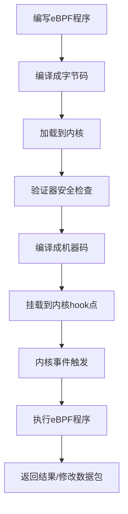

# eBPF与Cilium深度解析：下一代云原生网络基础设施

## 情境(Situation)

在云原生时代，传统的容器网络方案面临着前所未有的挑战。随着微服务架构的普及，应用变得高度动态化，容器生命周期缩短至秒级，IP地址频繁变化。传统的基于iptables的kube-proxy方案，在大规模集群中暴露出了性能瓶颈、可观测性不足、安全策略粒度粗等问题。

eBPF（extended Berkeley Packet Filter）技术的成熟，为这些问题提供了革命性的解决方案。基于eBPF的Cilium等新一代网络插件，正在重新定义云原生网络、安全和可观测性的边界。

作为SRE工程师，我们需要深入理解eBPF技术原理，掌握Cilium等新一代网络插件的部署和配置，为云原生集群提供更高效、更安全、更可观测的网络基础设施。

## 冲突(Conflict)

在实际生产环境中，SRE工程师面临以下核心挑战：

- **性能瓶颈**：iptables规则数量随服务数量呈O(n²)增长，更新延迟达到秒级
- **可见性不足**：传统方案缺乏L7层可见性，故障排查依赖经验和猜测
- **安全模型落后**：基于IP地址的策略无法适应Pod动态变化
- **运维复杂**：网络问题排查路径长，缺乏有效工具
- **升级困难**：传统CNI插件升级可能影响业务

## 问题(Question)

如何理解eBPF技术原理，掌握基于eBPF的Cilium网络插件，为云原生集群提供高性能、高安全、高可观测的网络基础设施？

## 答案(Answer)

本文将从SRE视角出发，详细分析eBPF技术原理、Cilium架构与功能、生产环境最佳实践和故障排查方法，帮助SRE工程师掌握下一代云原生网络技术。核心方法论基于 [SRE面试题解析：啥叫eBPF？新的k8s网络插件？](#84-啥叫ebpf新的k8s网络插件)。

---

## 一、eBPF技术原理

### 1.1 什么是eBPF

**eBPF定义**：
eBPF（extended Berkeley Packet Filter）是Linux内核中的革命性技术，允许在运行时将安全、网络和可观测性逻辑动态插入到内核中，无需修改内核源码或加载内核模块。

**核心特性**：
- **内核级执行**：程序直接在内核中运行，性能损耗极低
- **沙箱安全**：所有eBPF程序必须通过内核验证器检查，确保安全
- **热插拔**：无需重启服务或内核，即可动态加载和更新程序
- **可编程**：支持在网络路径的关键点插入自定义逻辑

### 1.2 eBPF工作原理

**eBPF工作流程**：



**内核hook点**：
- **XDP**：网络驱动层，最早处理数据包
- **TC（Traffic Classifier）**：网络接口层
- **Socket**：套接字层
- **Tracepoint**：内核跟踪点
- **Kprobe/Uprobe**：动态跟踪点

### 1.3 eBPF vs 传统方案

**性能对比**：

| 指标 | iptables/kube-proxy | eBPF/Cilium |
|:------|:------|:------|
| **规则查找复杂度** | O(n²) | O(1) |
| **更新延迟** | 秒级 | 毫秒级 |
| **CPU开销** | 高 | 低 |
| **内存占用** | 随规则线性增长 | 常量 |
| **L7可见性** | 无 | 完整解析 |
| **热更新** | 需要重启 | 无需重启 |

---

## 二、Cilium架构深度解析

### 2.1 Cilium概述

**Cilium定义**：
Cilium是开源的云原生网络、安全和可观测性插件，基于eBPF技术，为Kubernetes提供高性能的容器网络连接、安全策略执行和深度流量可视化。

**核心定位**：
- **CNI插件**：替代传统CNI，提供容器网络连接
- **kube-proxy替代**：基于eBPF实现Service负载均衡
- **网络策略执行**：L3/L4/L7细粒度安全策略
- **可观测性平台**：内置Hubble组件提供深度可视化

### 2.2 核心组件

**Cilium Agent**：
每个节点上运行的核心组件，负责：
- 加载和管理eBPF程序
- 执行网络策略
- 处理服务发现和负载均衡
- 与Kubernetes API交互

**eBPF程序类型**：
- **datapath**：实现网络转发
- **policy**：执行安全策略
- **observability**：采集网络指标

### 2.3 技术优势

**身份感知安全模型**：
Cilium最大的创新是引入基于身份的安全模型，而不是传统的基于IP地址的模型。

**L7应用层策略**：
支持丰富的L7协议感知策略：
- HTTP/HTTPS：方法、路径、头信息、主机名
- gRPC：服务名、方法名
- Kafka：主题、客户端ID
- DNS：域名解析策略

**高性能负载均衡**：
完全分布式的负载均衡，替代kube-proxy：
- 完全在内核空间执行
- 支持Maglev哈希一致性路由
- 规则更新无需重启

---

## 三、生产环境部署

### 3.1 环境要求

**环境要求**：

| 组件 | 最低要求 | 推荐配置 |
|:------|:------|:------|
| **Kubernetes** | 1.16+ | 1.23+ |
| **Linux内核** | 4.19+ | 5.10+ |
| **eBPF支持** | 必需 | 完整eBPF特性 |
| **CPU架构** | x86_64, arm64 | x86_64, arm64 |

### 3.2 安装部署

**使用Cilium CLI安装**：

```bash
# 下载Cilium CLI
curl -L --remote-name-all https://github.com/cilium/cilium-cli/releases/latest/download/cilium-linux-amd64.tar.gz
sudo tar xzvf cilium-linux-amd64.tar.gz /usr/local/bin

# 安装Cilium
cilium install --version 1.14.0

# 验证安装
cilium status
```

**使用Helm安装**：

```bash
# 添加Helm仓库
helm repo add cilium https://helm.cilium.io/
helm repo update

# 安装Cilium
helm install cilium cilium/cilium \
  --namespace kube-system \
  --set ipam.mode=kubernetes \
  --set kubeProxyReplacement=strict \
  --set hubble.enabled=true \
  --set hubble.relay.enabled=true \
  --set hubble.ui.enabled=true
```

### 3.3 配置示例

**基础CiliumNetworkPolicy**：

```yaml
apiVersion: cilium.io/v2
kind: CiliumNetworkPolicy
metadata:
  name: web-api-access
spec:
  endpointSelector:
    matchLabels:
      app: web-frontend
  egress:
  - toEndpoints:
    - matchLabels:
        app: api-backend
    toPorts:
    - ports:
      - port: "8080"
        protocol: TCP
      rules:
        http:
        - method: "GET"
          path: "/api/v1/.*"
```

**L7 HTTP策略**：

```yaml
apiVersion: cilium.io/v2
kind: CiliumNetworkPolicy
metadata:
  name: rate-limiting
spec:
  endpointSelector:
    matchLabels:
      app: payment-service
  ingress:
  - toPorts:
    - ports:
      - port: "8080"
        protocol: TCP
      rules:
        http:
        - method: "POST"
          path: "/api/v1/transaction"
          headers:
          - 'X-Rate-Limit: [0-9]+'
```

---

## 四、性能优化

### 4.1 XDP优化

**XDP（Express Data Path）**：
在网络驱动层直接处理数据包，绕过TCP/IP协议栈，大幅降低CPU指令数。

**启用XDP**：

```bash
# 检查XDP状态
cilium config view | grep XDP

# 启用XDP
cilium config set XDPAcceleration Enabled
```

**性能数据**：
- 转发能力：940万包/秒
- TCP时延：从56μs降至8μs
- CPU指令数：降低90%

### 4.2 kube-proxy替代

**kubeProxyReplacement配置**：

```yaml
# Helm values
kubeProxyReplacement: strict  # 启用完整kube-proxy替代
```

**性能对比**：
| 指标 | kube-proxy | Cilium eBPF |
|:------|:------|:------|
| **规则数量** | O(n²) 增长 | O(1) 常量 |
| **更新延迟** | 秒级 | 毫秒级 |
| **CPU开销** | 高 | 低 |

### 4.3 宿主机路由

**HostRouting配置**：

```yaml
# Helm values
hostRouting: true  # 启用宿主机路由
```

---

## 五、安全最佳实践

### 5.1 身份感知安全

**基于标签的安全策略**：

```yaml
apiVersion: cilium.io/v2
kind: CiliumNetworkPolicy
metadata:
  name: identity-based-security
spec:
  endpointSelector:
    matchLabels:
      tier: backend
  ingress:
  - fromEndpoints:
    - matchLabels:
        tier: frontend
    toPorts:
    - ports:
      - port: "8080"
        protocol: TCP
```

### 5.2 透明加密

**WireGuard加密配置**：

```yaml
# Helm values
encryption:
  enabled: true
  type: WireGuard
```

### 5.3 Tetragon集成

**运行时安全检测**：

```bash
# 安装Tetragon
helm install tetragon cilium/tetragon -n kube-system

# 检测bash执行
kubectl apply -f - <<EOF
apiVersion: cilium.io/v1alpha1
kind: TracingPolicy
metadata:
  name: detect-bash
spec:
  kprobes:
  - call: execve
    args:
    - index: 0
      type: string
    selectors:
    - matchArgs:
      - index: 0
        operator: Equal
        values:
        - /bin/bash
EOF
```

---

## 六、可观测性建设

### 6.1 Hubble组件

**Hubble概述**：
Hubble是Cilium的组件，提供深度流量可视化和可观测性。

**启用Hubble**：

```bash
# 启用Hubble UI
cilium hubble enable --ui

# 端口转发访问UI
kubectl port-forward -n kube-system svc/hubble-ui 12000:80
```

### 6.2 流量监控

**查看实时流量**：

```bash
# 监控所有流量
cilium monitor

# 筛选特定流量
cilium monitor --type=l7

# 查看服务依赖图
hubble observe --from-label app=web
```

### 6.3 Prometheus集成

**指标导出配置**：

```yaml
# Helm values
prometheus:
  enabled: true
  port: 9090
```

**关键指标**：
- `cilium_forwarding_total`：转发数据包计数
- `cilium_drop_total`：丢弃数据包计数
- `cilium_policy_l7_total`：L7策略统计
- `hubble_flows_total`：流量计数

---

## 七、故障排查

### 7.1 常见问题

**eBPF不支持**：
```bash
# 检查内核版本
uname -r

# 检查eBPF支持
cilium status
```

**Cilium安装失败**：
```bash
# 查看日志
kubectl logs -n kube-system -l k8s-app=cilium

# 详细诊断
cilium status --verbose
```

**网络不通**：
```bash
# 检查eBPF程序状态
cilium bpf endpoint list

# 检查策略
cilium policy get

# 查看hubble日志
kubectl logs -n kube-system -l k8s-app=hubble-relay
```

### 7.2 诊断命令

**常用诊断命令**：

```bash
# 节点状态
cilium node list

# 端点列表
cilium endpoint list

# 策略验证
cilium policy validate --all

# BFP Map内容
cilium bpf mp list

# 连接追踪
hubble observe
```

---

## 八、迁移策略

### 8.1 迁移步骤

**渐进式迁移**：

1. **评估阶段**
   - 确认内核版本满足要求
   - 审计现有网络策略
   - 评估依赖项

2. **测试环境验证**
   - 部署Cilium到测试集群
   - 验证网络连通性
   - 测试安全策略

3. **预生产验证**
   - 复制生产配置
   - 压测性能
   - 验证监控告警

4. **生产迁移**
   - 制定回滚方案
   - 安排变更窗口
   - 分批次迁移节点

### 8.2 回滚方案

**回滚准备**：
```bash
# 备份当前CNI配置
kubectl get cm -n kube-system kubelet-config -o yaml > kubelet-config-backup.yaml

# 记录当前CNI
kubectl get nodes -o jsonpath='{.items[*].spec.podCIDR}'
```

---

## 九、最佳实践总结

### 9.1 部署最佳实践

- [ ] **内核版本升级**：生产环境推荐内核 ≥ 5.10
- [ ] **完整特性启用**：启用kubeProxyReplacement=strict
- [ ] **高可用部署**：确保Agent高可用，避免单点故障
- [ ] **监控告警**：配置完整的监控和告警体系
- [ ] **定期升级**：跟进Cilium最新稳定版本

### 9.2 安全最佳实践

- [ ] **身份驱动安全**：使用CiliumNetworkPolicy替代NetworkPolicy
- [ ] **L7策略细化**：配置细粒度的应用层策略
- [ ] **透明加密**：启用WireGuard加密Pod通信
- [ ] **运行时检测**：集成Tetragon实现入侵检测
- [ ] **定期审计**：定期审计安全策略有效性

### 9.3 性能最佳实践

- [ ] **启用XDP**：启用XDP加速网络转发
- [ ] **宿主机路由**：启用hostRouting提升性能
- [ ] **eBPF Map调优**：合理配置Map大小
- [ ] **CPU亲和性**：优化CPU调度减少延迟
- [ ] **监控性能指标**：持续监控系统性能

### 9.4 可观测性最佳实践

- [ ] **启用Hubble**：启用完整的流量可视化
- [ ] **Prometheus集成**：配置指标采集和存储
- [ ] **日志集中**：集成日志系统进行分析
- [ ] **告警配置**：配置关键指标告警
- [ ] **定期巡检**：定期检查系统健康状态

---

## 十、未来展望

### 10.1 技术演进趋势

**服务网格革命**：
无Sidecar架构通过eBPF实现L7代理，资源开销从20%降至3%。

**硬件协同加速**：
DPU芯片卸载eBPF程序，加解密性能提升10倍。

**安全能力深化**：
基于eBPF的零信任模型，实时阻断APT攻击。

### 10.2 建议

**技术跟进**：
- 关注Cilium版本更新
- 跟进Gateway API标准
- 探索服务网格集成

**能力建设**：
- eBPF内核知识储备
- 网络性能调优能力
- 安全策略设计能力

---

## 总结

eBPF与Cilium正在重塑云原生网络的未来。通过内核态数据处理、动态策略加载、全栈可观测三大支柱，它们解决了云原生时代的高性能、高密度、高弹性需求。

**核心要点总结**：

1. **eBPF技术**：Linux内核革命性技术，内核级执行，热插拔无需重启
2. **Cilium架构**：CNCF毕业项目，替代kube-proxy，提供L3/L4/L7网络策略
3. **性能优势**：规则O(1)查找，毫秒级更新，940万包/秒转发能力
4. **安全模型**：身份驱动安全，基于标签而非IP
5. **可观测性**：Hubble组件提供深度L7流量可视化
6. **生产部署**：内核要求5.10+，渐进式迁移策略
7. **最佳实践**：启用XDP、身份策略、透明加密、Hubble监控

建议企业从内核版本升级、渐进式迁移、混合流量治理三阶段推进实践，迎接下一代网络架构的曙光。

> **延伸学习**：更多面试相关的eBPF和Cilium知识，请参考 [SRE面试题解析：啥叫eBPF？新的k8s网络插件？](#84-啥叫ebpf新的k8s网络插件)。

---

## 参考资料

- [Cilium官方文档](https://cilium.readthedocs.io/)
- [eBPF官方文档](https://ebpf.io/)
- [Hubble文档](https://docs.cilium.io/en/stable/hubble/)
- [Tetragon文档](https://docs.cilium.io/en/stable/tetragon/)
- [CNCF Cilium博客](https://www.cncf.io/blog/2025/01/02/unlocking-cloud-native-security-with-cilium-and-ebpf/)
- [Kubernetes网络文档](https://kubernetes.io/docs/concepts/cluster-administration/networking/)
- [Linux内核文档](https://www.kernel.org/doc/html/latest/networking/filter.html)
- [Prometheus监控](https://prometheus.io/docs/introduction/overview/)
- [Grafana监控](https://grafana.com/docs/grafana/latest/)
- [Kubernetes安全最佳实践](https://kubernetes.io/docs/concepts/security/)
