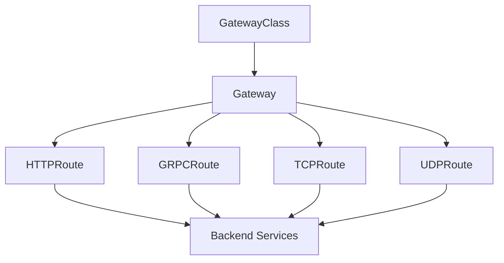

# Gateway API深度解析：Kubernetes下一代流量管理标准

## 情境(Situation)

在Kubernetes生态系统中，Ingress API自2015年诞生以来，一直是集群外部流量管理的默认选择。然而，经过近十年的演进，Ingress的设计缺陷日益凸显，尤其是在多租户、复杂路由和跨团队协作等现代云原生场景下显得力不从心。

2026年3月，Kubernetes社区正式停止维护ingress-nginx控制器，进入EOL阶段，这一事件标志着Kubernetes网络入口管理进入了一个全新的时代。Gateway API作为官方推荐的下一代流量管理标准，正在成为云原生网络的新范式。

作为SRE工程师，我们需要深入理解Gateway API的设计理念、核心架构和最佳实践，为即将到来的技术迁移做好准备。

## 冲突(Conflict)

在实际生产环境中，SRE工程师面临以下核心挑战：

- **Ingress局限性**：仅支持HTTP/HTTPS协议，无法满足TCP、UDP、gRPC等多协议需求
- **注解泛滥**：不同Ingress控制器的注解语法差异巨大，导致厂商锁定和迁移困难
- **角色边界模糊**：基础设施配置与应用路由职责混合，多团队协作冲突频发
- **表达能力不足**：缺乏细粒度的流量控制能力，如金丝雀发布、A/B测试等
- **迁移复杂性**：大量现有Ingress配置需要平滑迁移到新标准

## 问题(Question)

如何理解Gateway API的核心概念和优势，掌握其相比Ingress的升级点，为云原生集群选择合适的流量管理方案？

## 答案(Answer)

本文将从SRE视角出发，详细分析Gateway API的设计理念、核心架构、资源模型、配置示例和迁移策略，帮助SRE工程师掌握这一Kubernetes网络的下一代标准。核心方法论基于 [SRE面试题解析：啥叫Gateway API？替代Ingress的新产品？](#85-啥叫gateway-api替代ingress的新产品)。

---

## 一、Ingress的困境与Gateway API的诞生

### 1.1 Ingress的历史定位

**Ingress设计背景**：
Ingress API于2015年进入Kubernetes，最初的设计目标只是为HTTP提供一个基础的"反向代理"抽象。在当时的集群规模和单租户场景下，Ingress的设计是合理的。

**Ingress的核心问题**：

| 问题类型 | 具体表现 |
|:------|:------|
| **表达能力有限** | 仅支持HTTP路由，高级功能依赖注解 |
| **协议支持单一** | 仅支持HTTP/HTTPS，L4协议需要变通方案 |
| **可移植性差** | 注解因厂商而异，迁移成本高 |
| **角色边界模糊** | 基础设施与业务路由职责混合 |

### 1.2 注解泛滥危机

**注解问题的根源**：
为了解决Ingress功能不足的问题，各大厂商纷纷通过注解扩展功能。这导致了：

- **NGINX Ingress注解示例**：
  ```yaml
  nginx.ingress.kubernetes.io/rewrite-target: /
  nginx.ingress.kubernetes.io/proxy-body-size: "50m"
  nginx.ingress.kubernetes.io/ssl-redirect: "true"
  ```

- **Traefik注解示例**：
  ```yaml
  traefik.ingress.kubernetes.io/router.entrypoints: web
  traefik.ingress.kubernetes.io/router.tls: "true"
  ```

这些注解完全不兼容，导致：
- 厂商锁定，无法平滑迁移
- 配置可读性差
- 维护成本高

### 1.3 Ingress-NGINX退役影响

**2026年3月里程碑**：
Kubernetes官方宣布ingress-nginx控制器进入EOL阶段，不再提供安全补丁、错误修复或新版本发布。

**影响范围**：
据估计，约有半数云原生环境依赖NGINX Ingress控制器。这意味着大量Kubernetes用户面临紧迫的架构转型。

---

## 二、Gateway API核心概念

### 2.1 四大核心资源

**Gateway API的四大资源**：

| 资源类型 | 说明 | 管理者 |
|:------|:------|:------|
| **GatewayClass** | 网关模板/蓝图，定义网关类型 | 基础设施提供商 |
| **Gateway** | 实际处理流量的入口点 | 集群运维 |
| **HTTPRoute** | HTTP流量路由规则 | 应用开发 |
| **GRPCRoute** | gRPC流量路由规则 | 应用开发 |

### 2.2 资源关系图



### 2.3 角色分离模型

**Gateway API的三层角色模型**：

**1. 基础设施提供商（Infrastructure Provider）**：
- 管理GatewayClass资源
- 定义可用网关类型
- 权限：创建/更新/删除GatewayClass

**2. 集群运维（Cluster Operator）**：
- 管理Gateway资源
- 配置监听端口、TLS证书
- 权限：创建/更新/绑定Gateway

**3. 应用开发（Application Developer）**：
- 管理HTTPRoute等路由资源
- 定义业务路由规则
- 权限：创建/更新/绑定Route到Gateway

---

## 三、Ingress vs Gateway API对比

### 3.1 功能对比矩阵

| 功能维度 | Ingress | Gateway API |
|:------|:------|:------|
| **协议支持** | HTTP/HTTPS | HTTP/gRPC/TCP/UDP全支持 |
| **流量拆分** | 需要注解 | 原生权重支持 |
| **金丝雀发布** | 复杂配置 | 简单权重配置 |
| **Header路由** | 注解扩展 | 原生支持 |
| **A/B测试** | 注解扩展 | 原生支持 |
| **跨命名空间** | 受限 | 完全支持 |
| **角色分离** | 无 | 三层分离 |
| **可移植性** | 差 | 强 |

### 3.2 配置复杂度对比

**金丝雀发布配置对比**：

**Ingress配置**（需要多个Ingress或复杂注解）：
```yaml
apiVersion: networking.k8s.io/v1
kind: Ingress
metadata:
  name: canary-ingress
  annotations:
    nginx.ingress.kubernetes.io/canary: "true"
    nginx.ingress.kubernetes.io/canary-weight: "10"
spec:
  rules:
  - host: app.example.com
    http:
      paths:
      - backend:
          service:
            name: app-v2
            port:
              number: 80
```

**Gateway API配置**：
```yaml
apiVersion: gateway.networking.k8s.io/v1
kind: HTTPRoute
metadata:
  name: app-canary
spec:
  rules:
  - backendRefs:
    - name: app-v1
      weight: 90
    - name: app-v2
      weight: 10
```

### 3.3 供应商锁定对比

**迁移成本对比**：

| 场景 | Ingress | Gateway API |
|:------|:------|:------|
| **NGINX→Envoy迁移** | 需重写所有注解 | 仅改GatewayClass |
| **配置可读性** | 大量注解难以理解 | 结构清晰 |
| **厂商支持** | 各自为政 | 标准化实现 |

---

## 四、生产环境部署

### 4.1 环境要求

**Gateway API环境要求**：

| 组件 | 最低版本 | 推荐版本 |
|:------|:------|:------|
| **Kubernetes** | 1.19+ | 1.24+ |
| **Gateway API CRD** | v1 | v1 |
| **kubectl** | 1.19+ | 最新版 |

### 4.2 安装Gateway API CRD

**安装CRD**：

```bash
# 安装Gateway API CRD
kubectl apply -f https://github.com/kubernetes-sigs/gateway-api/releases/download/v1.0.0/standard-install.yaml

# 验证安装
kubectl get crd | grep gateway
```

### 4.3 选择Gateway实现

**主流Gateway实现**：

| 实现 | 特点 | 适用场景 |
|:------|:------|:------|
| **Envoy Gateway** | CNCF项目，功能丰富 | 通用场景 |
| **Istio Ingress Gateway** | 服务网格集成 | 微服务架构 |
| **AWS Load Balancer Controller** | 云厂商深度集成 | AWS环境 |
| **Cilium Gateway** | eBPF驱动 | 高性能需求 |

### 4.4 配置示例

**完整Gateway API配置**：

**1. 创建GatewayClass**：
```yaml
apiVersion: gateway.networking.k8s.io/v1
kind: GatewayClass
metadata:
  name: envoy
spec:
  controllerName: gateway.envoy.io
```

**2. 创建Gateway**：
```yaml
apiVersion: gateway.networking.k8s.io/v1
kind: Gateway
metadata:
  name: production-gateway
  namespace: gateway-system
spec:
  gatewayClassName: envoy
  listeners:
  - name: http
    port: 80
    protocol: HTTP
    allowedRoutes:
      namespaces:
        from: Same
  - name: https
    port: 443
    protocol: HTTPS
    tls:
      mode: Terminate
      certificateRefs:
      - name: app-cert
        group: ""
        kind: Secret
    allowedRoutes:
      namespaces:
        from: Same
```

**3. 创建HTTPRoute**：
```yaml
apiVersion: gateway.networking.k8s.io/v1
kind: HTTPRoute
metadata:
  name: app-route
  namespace: default
spec:
  parentRefs:
  - name: production-gateway
    namespace: gateway-system
    sectionName: https
  hostnames:
  - "app.example.com"
  rules:
  - matches:
    - path:
        type: PathPrefix
        value: /api
    - headers:
        values:
          X-App-Version: v2
    backendRefs:
    - name: api-service-v2
      port: 8080
      weight: 100
  - matches:
    - path:
        type: PathPrefix
        value: /v1
    backendRefs:
    - name: api-service
      port: 8080
      weight: 100
```

**4. TLS证书配置**：
```yaml
apiVersion: cert-manager.io/v1
kind: ClusterIssuer
metadata:
  name: letsencrypt-prod
spec:
  acme:
    server: https://acme-v02.api.letsencrypt.org/directory
    email: admin@example.com
    privateKeySecretRef:
      name: letsencrypt-prod
    solvers:
    - http01:
        ingress:
          class: envoy
---
apiVersion: gateway.networking.k8s.io/v1
kind: Gateway
metadata:
  name: tls-gateway
spec:
  gatewayClassName: envoy
  listeners:
  - name: https
    port: 443
    protocol: HTTPS
    tls:
      mode: Terminate
      certificateRefs:
      - name: app-cert
---
apiVersion: v1
kind: Secret
metadata:
  name: app-cert
  namespace: gateway-system
type: kubernetes.io/tls
data:
  tls.crt: <base64-cert>
  tls.key: <base64-key>
```

---

## 五、高级特性配置

### 5.1 金丝雀发布

**金丝雀发布配置**：

```yaml
apiVersion: gateway.networking.k8s.io/v1
kind: HTTPRoute
metadata:
  name: app-canary
spec:
  parentRefs:
  - name: production-gateway
  hostnames:
  - "app.example.com"
  rules:
  - matches:
    - path:
        type: PathPrefix
        value: /
    backendRefs:
    - name: app-v1
      port: 8080
      weight: 90
    - name: app-v2
      port: 8080
      weight: 10
```

**动态调整权重**：
```bash
# 修改权重
kubectl patch httproute app-canary --type=json -p='[{"op": "replace", "path": "/spec/rules/0/backendRefs/1/weight", "value": 50}]'

# 验证切换
kubectl get httproute app-canary -o yaml
```

### 5.2 A/B测试

**基于Header的A/B测试**：

```yaml
apiVersion: gateway.networking.k8s.io/v1
kind: HTTPRoute
metadata:
  name: app-ab-test
spec:
  rules:
  - matches:
    - headers:
        values:
          X-User-Type: premium
    backendRefs:
    - name: app-premium
      port: 8080
  - backendRefs:
    - name: app-standard
      port: 8080
```

### 5.3 多协议支持

**TCPRoute配置**：

```yaml
apiVersion: gateway.networking.k8s.io/v1
kind: TCPRoute
metadata:
  name: mysql-route
spec:
  parentRefs:
  - name: production-gateway
    sectionName: mysql
  rules:
  - backendRefs:
    - name: mysql-service
      port: 3306
```

**GRPCRoute配置**：

```yaml
apiVersion: gateway.networking.k8s.io/v1
kind: GRPCRoute
metadata:
  name: grpc-api
spec:
  parentRefs:
  - name: production-gateway
    sectionName: grpc
  hostnames:
  - "api.example.com"
  rules:
  - matches:
    - method: /v1.UserService/*
    backendRefs:
    - name: grpc-service
      port: 50051
```

---

## 六、RBAC权限配置

### 6.1 角色分离配置示例

**基础设施提供商角色**：
```yaml
apiVersion: rbac.authorization.k8s.io/v1
kind: ClusterRole
metadata:
  name: infrastructure-provider
rules:
- apiGroups: ["gateway.networking.k8s.io"]
  resources: ["gatewayclasses"]
  verbs: ["*"]
```

**集群运维角色**：
```yaml
apiVersion: rbac.authorization.k8s.io/v1
kind: Role
metadata:
  name: cluster-operator
  namespace: gateway-system
rules:
- apiGroups: ["gateway.networking.k8s.io"]
  resources: ["gateways", "httproutes"]
  verbs: ["*"]
```

**应用开发角色**：
```yaml
apiVersion: rbac.authorization.k8s.io/v1
kind: Role
metadata:
  name: app-developer
rules:
- apiGroups: ["gateway.networking.k8s.io"]
  resources: ["httproutes"]
  verbs: ["*"]
```

### 6.2 跨命名空间路由

**跨命名空间配置**：

```yaml
apiVersion: gateway.networking.k8s.io/v1
kind: Gateway
metadata:
  name: shared-gateway
spec:
  listeners:
  - name: http
    port: 80
    protocol: HTTP
    allowedRoutes:
      namespaces:
        from: Selector
        selector:
          matchLabels:
            allowed-routes: "true"
---
apiVersion: gateway.networking.k8s.io/v1
kind: HTTPRoute
metadata:
  name: cross-ns-route
  namespace: app-namespace
spec:
  parentRefs:
  - name: shared-gateway
    namespace: gateway-system
```

---

## 七、迁移策略

### 7.1 迁移路径

**从Ingress迁移到Gateway API的七个步骤**：

1. **评估现有配置**
   ```bash
   # 导出所有Ingress配置
   kubectl get ingress -A -o yaml > ingress-backup.yaml
   ```

2. **安装Gateway API CRD**
   ```bash
   kubectl apply -f https://github.com/kubernetes-sigs/gateway-api/releases/download/v1.0.0/standard-install.yaml
   ```

3. **安装Gateway实现**
   ```bash
   # 以Envoy Gateway为例
   helm install gateway envoy-gateway/envoy-gateway -n gateway-system --create-namespace
   ```

4. **安装ingress2gateway工具**
   ```bash
   # 下载并安装ingress2gateway
   curl -sL https://github.com/kubernetes-sigs/ingress2gateway/releases/download/v1.0.0/ingress2gateway-linux-amd64.tar.gz | tar -xz
   mv ingress2gateway /usr/local/bin/
   ```

5. **转换现有Ingress配置**
   ```bash
   # 转换单个Ingress
   ingress2gateway convert --input ingress.yaml --output gateway-route.yaml
   
   # 批量转换
   for ingress in $(kubectl get ingress -A -o jsonpath='{.items[*].metadata.name}'); do
     kubectl get ingress $ingress -n $(kubectl get ingress $ingress -o jsonpath='{.metadata.namespace}') -o yaml > ${ingress}.yaml
     ingress2gateway convert --input ${ingress}.yaml --output gateway-${ingress}.yaml
   done
   ```

6. **验证Gateway API资源**
   ```bash
   kubectl apply -f gateway-route.yaml
   kubectl get gateway gateway-route -n gateway-system
   kubectl describe httproute app-route
   ```

7. **逐步切换流量**
   - 测试环境验证
   - 金丝雀切换10%流量
   - 全量切换
   - 清理旧Ingress

### 7.2 并行运行策略

**双轨运行配置**：

```yaml
# 保持原有Ingress运行
apiVersion: networking.k8s.io/v1
kind: Ingress
metadata:
  name: app-ingress
  annotations:
    nginx.ingress.kubernetes.io/canary: "true"
    nginx.ingress.kubernetes.io/canary-weight: "0"
spec:
  # ...

---
# 新建Gateway API路由
apiVersion: gateway.networking.k8s.io/v1
kind: HTTPRoute
metadata:
  name: app-route
spec:
  # ...
```

### 7.3 回滚方案

**回滚步骤**：
```bash
# 1. 删除Gateway API路由
kubectl delete httproute app-route

# 2. 恢复Ingress权重到100%
kubectl patch ingress app-ingress -p '{"metadata":{"annotations":{"nginx.ingress.kubernetes.io/canary-weight":"100"}}}'

# 3. 验证流量恢复
curl -I https://app.example.com
```

---

## 八、最佳实践总结

### 8.1 部署最佳实践

- [ ] **版本选择**：生产环境使用Gateway API v1稳定版本
- [ ] **Gateway实现选择**：根据团队能力选择Envoy/Istio/Cilium等
- [ ] **高可用部署**：部署多个Gateway副本，确保高可用
- [ ] **监控配置**：启用Gateway指标暴露，集成Prometheus
- [ ] **日志集中**：配置Gateway日志采集到ELK/Loki

### 8.2 安全最佳实践

- [ ] **TLS终结**：所有Gateway监听器启用TLS 1.3
- [ ] **证书管理**：配合cert-manager自动管理证书
- [ ] **mTLS通信**：Pod间启用mTLS加密
- [ ] **WAF集成**：在Gateway前部署WAF防护
- [ ] **网络策略**：配置NetworkPolicy限制Gateway访问

### 8.3 运维最佳实践

- [ ] **RBAC分离**：严格执行三角色权限分离
- [ ] **资源配额**：为Gateway和Route配置资源配额
- [ ] **健康检查**：配置Gateway健康检查和就绪探针
- [ ] **告警配置**：配置关键指标告警（5xx率、延迟等）
- [ ] **定期审计**：定期审计Gateway和Route配置

### 8.4 性能最佳实践

- [ ] **连接复用**：启用HTTP/2和Keep-Alive
- [ ] **缓存配置**：合理配置响应缓存
- [ ] **压缩启用**：启用Gzip/Brotli压缩
- [ ] **资源限制**：为Gateway设置合理的CPU/内存限制
- [ ] **金丝雀验证**：新版本上线前进行金丝雀验证

---

## 九、未来展望

### 9.1 技术演进趋势

**Gateway API未来方向**：

- **服务网格集成**：与Istio、Linkerd等服务网格深度集成
- **网格化流量管理**：统一东西向和南北向流量管理
- **eBPF加速**：结合eBPF实现更高性能的流量处理
- **政策即代码**：与OPA等策略引擎集成

### 9.2 建议

**技术跟进建议**：

- 关注Gateway API版本更新
- 评估各Gateway实现的功能差异
- 制定Ingress迁移计划
- 建立Gateway运维知识库
- 参与社区贡献

---

## 总结

Gateway API作为Kubernetes官方推荐的下一代流量管理标准，通过其角色分离、多协议支持、丰富路由能力和标准可移植等核心优势，解决了Ingress的诸多痛点。

**核心要点总结**：

1. **四大核心资源**：GatewayClass定义模板，Gateway处理流量，HTTPRoute/GRPCRoute定义路由
2. **角色分离模型**：基础设施提供商/集群运维/应用开发三层分离
3. **相比Ingress优势**：多协议支持、丰富路由能力、标准可移植、跨命名空间支持
4. **配置示例**：Gateway配置、HTTPRoute配置、金丝雀发布、A/B测试
5. **迁移策略**：使用ingress2gateway工具转换，七步平滑迁移
6. **最佳实践**：安全TLS、RBAC权限、监控告警、性能优化

Gateway API不仅是Ingress的升级版，更是Kubernetes流量管理的范式革命。建议SRE工程师尽早了解并实践Gateway API，为未来的技术平滑迁移做好准备。

> **延伸学习**：更多面试相关的Gateway API知识，请参考 [SRE面试题解析：啥叫Gateway API？替代Ingress的新产品？](#85-啥叫gateway-api替代ingress的新产品)。

---

## 参考资料

- [Gateway API官方文档](https://gateway-api.sigs.k8s.io/)
- [Ingress迁移指南](https://gateway-api.kubernetes.ac.cn/guides/migrating-from-ingress/)
- [Envoy Gateway文档](https://gateway.envoy.io/)
- [AWS Load Balancer Controller文档](https://docs.aws.amazon.com/eks/latest/userguide/aws-load-balancer-controller.html)
- [ingress2gateway工具](https://github.com/kubernetes-sigs/ingress2gateway)
- [cert-manager文档](https://cert-manager.io/)
- [Kubernetes RBAC文档](https://kubernetes.io/docs/reference/access-authn-authz/rbac/)
- [Prometheus监控](https://prometheus.io/docs/introduction/overview/)
- [Grafana监控](https://grafana.com/docs/grafana/latest/)
- [Kubernetes安全最佳实践](https://kubernetes.io/docs/concepts/security/)
